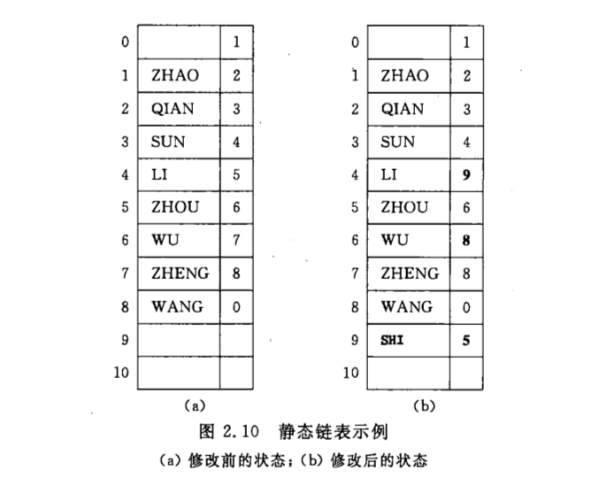

# 线性表

线性结构的特点：在数据元素的非空有限集中，

1. 存在唯一的一个被称为“第一个”的数据元素；
2. 存在唯一的一个被称为“最后一个”的数据元素；
3. 除了第一个以外，集合中的每个数据元素均只有一个前驱；
4. 除最后一个之外，集合中的每个数据元素均只有一个后继；

<br/>

### 线性表的顺序表示和实现

<div align="center">
	    
</div>

​	线性表的顺序表示：指的是用一组地址连续的存储单元依次存储线性表的数据元素。

​	假设线性表每个元素需要占用 l 个存储单元,并以所占的第一个单元的存储地址作为数据元素的存储位置。则线性表中第i+1个数据元素的存储位置LOC（a<sub>i+1</sub>）和地i个元素的存储位置LOC（a<sub>i</sub>）之间满足以下关系：

<center>LOC（a<sub>i+1</sub>）= LOC（a<sub>i</sub>）+ l</center>

一般来说，线性表的地i个数据元素a<sub>i</sub>的存储位置为：

<center>LOC（a<sub>i</sub>）= LOC（a<sub>1</sub>）+ （i - 1） × l</center>

式中LOC（a<sub>1</sub>）是线性表的一个数据元素a<sub>1</sub>的位置，通常称做线性表的起始位置或者基地址。

<br/>

​	**线性表的这种内表示称作线性表的顺序存储结构或顺序映像（sequential mapping）。通常，称这种存储结构的线性表为顺序表。**

​	特点是，表中相邻的元素 a<sub>i </sub>和元素 a<sub>i +1</sub>以相邻的存储位置**LOC**（a<sub>i </sub>）和**LOC**（a<sub>i +1</sub>）。换句话说，以元素在计算机内“物理位置相邻”来表示线性表中数据元素之间的逻辑关系。每一个数据元素的存储位置都和线性表的起始位置相差一个数据元素在线性表中的位序成正比的常数。**由此，只要确定了存储线性表的起始位置，线性表中任一数据元素都可随机存取，所以线性表的顺序存储结构是一种随机的存储结构，因此，顺序表的查找时间复杂度为O（1）**。

​	**由于高级语言中的数组类型也有随机存取的特性，因此，通常都用数组来描述数据结构中的顺序存储结构。**<br/>

<br/>

### 线性表的插入与删除

​	线性表的插入操作指的是在线性表的第i-1个数据元素和第i个数据元素之间插入一个新的数据元素，就是要是长度为n的线性表变成长度为n+1的线性表。

​	数据元素a<sub>i-1</sub>和 a<sub>i</sub> 之间的逻辑关系也发生了变化。在线性表的顺序存储结构中，由于逻辑上相邻的数据元素在物理位置上也是相邻的，因此，除非i=n+1，**否则必须移动元素才能反映这个逻辑关系的变化**。 

​	刷出数据元素和插入数据元素原理一致。插入与删除数据元素的示意图如下：

<div align="center">
	
</div>

​	一般情况下，在地i个位置（1 <= i <= n）个元素之前插入一个元素时需要将第n至第i（共n-i+1）个元素向后移动一个位置。反之，删除第i个位置的数据元素，需要将后面的数据元素全都往前面移动位置。

<br/>

​	**总结：当顺序存储结构的线性表中某个位置上插入或者删除一个数据元素时，其时间主要耗费在移动元素上（换句话说，移动元素的操作为预估算法时间复杂度的基本操作），而移动元素的个数取决于插入或者删除的元素的位置。其时间复杂度为O（n）,这也是顺序存储结构的弱点。**

​	**Hint：若以线性表表示集合并进行集合的各种运算，应先对表中元素进行排序**。

<br/>

<br/>

<br/>

### 线性表的链式表示和实现

​	链式存储结构，不要求逻辑上相邻的元素在物理位置上也相邻，因此它没有顺序存储结构所具有的弱点，但同时也失去了顺序结构可随机存取的优点。**（优缺点）**

​	线性表的链式存储结构的**特点是用一组任意的存储单元存储线性表的数据元素**（这组存储单元可以是连续的，也可以是不连续的）。因此，为了表示每个数据元素a<sub>i</sub>与其直接后继数据元素a<sub>i+1</sub>之间的逻辑关系，对数据元素a<sub>i</sub>来说，除了存储其本身的信息之外，还需要存储一个指示其直接后继点的信息（即后继点的存储位置）。这两部分信息组成数据元素a<sub>i</sub>的存储映像，称为**结点（node）**。它包括两个域：其中存储数据元素信息的域称为**数据域**；存储直接后继存储位置的域称为**指针域**。指针域中存储的信息称做**指针或链**。n个节点（a<sub>i</sub>（1<= i <= n）的存储映像）链结成一个链表，即为线性表的存储结构。又由于此链表的每个节点中包含一个指针域，故又**称线性链表**或**单链表**。	

<div align="center">
    
</div>

​	用线性链表表示线性表的时，数据元素之间的逻辑关系是由结点中的指针指示的。换句话说，指针为数据元素之间的逻辑关系的映像，则**逻辑上相邻的两个数据元素其存储的物理位置不要求相邻**，由此，这种存储结构为非顺序映像或链式映像。

<br/>

<br/>

​	在单链表中，任何两个元素的存储位置之间没有固定的联系。然而，每个元素的存储位置都包含在其直接前驱结点的信息之中。假设p是指向线性表中第 i 个数据元素（结点a<sub>i</sub>）的指针，则p->next 是指向第i+1个数据元素（结点a<sub>i+1</sub>）的指针。换句话说，若p->data=a<sub>i</sub>，则p->next ->data=a<sub>i+1</sub> 。由此，在单链表中，取得第i个数据元素必须从头指针出发寻找，因此，**单链表是非随机存取的存储结构**。

<br/>

​	**Hint：在单链表中，如果要取得数据，基本操作是后移指针。若数据元素在表中的位置为 1<= i <= n ，在移动指针语句的执行频度是 i -1 ，否则频度为n。因此，在单链表中查找数据的时间复杂度为O（n）**

<br/>

<br/>

### 链表的插入和删除

​	假设我们要在线性表的两个数据元素a和b之间插入一个数据元素x，已知p为其单链表存储结构中指向结点a的指针。如下图：

<div align="center">
	    
</div>

​	为了插入数据元素，首先要生成一个数据域为x的结点，然后插入在单链表中。根据插入操作的逻辑定义，还需要修改结点a的指针域，令其指向结点 x，而结点 x 中的指针域应指向结点 b ，从而实现 3 个元素 a、b、x 之间的逻辑关系的变化。

​	反之，在线性链表中删除一个数据元素b时，为在单链表中实现元素a、b和c之间的逻辑关系变化，仅需要修改结点a之中的指针域即可。假设p指向结点a的指针，则修改指针语句为：P - > next = P - > next - > next即可。如下图：

<div align="center">
	    
</div>	    	    

​	**Hint：可见，在已知链表中元素插入或删除的确切位置的情况下，在单链表中插入或删除一个结点时，仅需要修改指针的位置而不需要移动元素。时间复杂度为O（1），但是在不知到数据元素的位置时候，要插入或者删除一个数据元素的时间复杂度为O（n），因为，在第i个结点处插入或者删除，我们首先得找到第 i 个结点。**

<br/>

​	**总结：（链表的优点）单链表和顺序存储结构不同，它是一种动态结构。整个可用存储空间可为多个链表共同享用，每个链表占用的空间不需要预先分配划定，而是可以由系统应需求及时生成。因此，建立线性表的链式存储结构的过程就是一个动态生成链表的过程。即从“空表”的初始状态起，依次建立各元素结点，并逐个插入链表。**

<br/>

<br/>

### 静态链表

​	有的时候，我们可以通过一维数组来描述线性链表，其类型说明如下所示：

```c
#define MAXSIZE 100 //链表的最大维度
typedef struct{
	ElemType data；
	int Current；
}component，SLinkList[MAXSIZE]
```

​	这种描述方法便于在不设“指针”类型的高级程序设计语言中使用链表结构。在如上描述的链表中，数组的一个分量表示一个结点，同时用游标（指示器cur）代替指针指示结点在数组中的相对位置。数组的第零分量可看做头结点，其指针域指示链表的第一个结点。这中存储结构仍需要预先分配一个较大的空间，但在作线性表的插入和删除操作时不需要移动元素，仅需要修改指针，故仍具有链式存储结构的主要优点。为了和指针型描述的线性链表相区别，我们给这种用数组描述的链表起名叫**静态链表**。如下图：

<div align="center">
	    
</div>	   

​	例如，在静态链表中实现定位函数LocateElem如下：

```c
int LocateElem_SL（SLinkList s,ElemType e）{
	//在静态线性链表L中查找第一个元素值为e的元素
	//若找到，则返回它在L中的位置，否则返回0
	i=S[0].cur;
	while(i && S[i].data != e) i=S[i].cur;
	return i;
}//LocateElem_SL
```

​	类似的，我们也可以在静态链表中实现插入和删除操作的算法。

​	**HINT：为了辨明数组中哪些分量未被使用，解决的办法是将所有未被使用过的以及被删除的分量用游标链成一个备用的链表，每当进行插入时便可以从备用链表上取得第一个结点作为呆插入的新结点；反之，在删除时将从链表中删除下来的结点链接到备用链表上。**

<br/>

<br/>

### 循环链表

​	**循环链表**是另一种形式的链式存储结构。它的特点是表中最后一个结点的指针域指向头结点，整个链表形成一个环。由此，从表中任一结点出发均可以找到表中其他结点。如下图：

<div align="center">
    
</div>

​	循环链表的操作和线性表基本一致，差别仅在于算法中的循环条件不是 p 或者 p->next 为空，而是他们是否等于头指针。	但是有的时候，若在循环链表中设立尾指针而不是设头指针（如下图a所示），可以简化某些操作。例如将两个线性表合并成一个线性表的时候，仅需要将一个表的表尾和另一个表的表头相连接。当线性表以下图 a 的循环链表作为存储结构时，这个操作仅需要改变两个指针值即可。运算时间为O（1）。合并后的表如下图 b 所示。

<div align="center">
    
</div>

<br/>

<br/>

### 双向链表

​	在上面的单链表的结点中，只有一个指示直接后继的指针域，由此，从某个结点出发只能顺指针往后查询其他结点。若要寻查结点的直接前趋，则需要从表头指针出发。换句话说，在单链表中，NextElem的执行时间是O（1），而PriorElem的执行时间为O（n）。为了克服单链表的这种单向性缺点，可利用**双向链表**。

​	顾名思义，在双向链表的结点中有两个指针域，其一指向直接后继，另一指向直接前趋。

```c
//线性表的双向链表存储结构
typedef struct DuLNode{
	ElemType data;
	struct DuLNode *prior;
	struct DuLNode *next;
}DuLNode,*DuLinkList;
```

​	和单链表的循环类似，双向链表也可以有循环列表，如下图所示 c ，链表中存有两个环，下图 b 所示为只有一个表头的结点的空表。在双向链表中，若d为指向表中某个结点的指针（即d为DuLinkList型变量），则显然有：

<center>d -> next -> prior = d -> prior -> next = d</center>

这个表达式恰当地反映了这种结构特性。

<div align="center">
    
</div>

​	在双向链表中，有些操作例如：ListLength、GetElem和LocateElem等仅需涉及一个方向的指针，则他们的算法描述和线性表的操作相同，但在插入、删除时有很大的不同，在双向链表中需要同时修改两个方向上的指针，图2.15和图2.16分别显示了删除和插入结点时指针修改情况，其算法时间复杂度均为O（n）。

<div align="center">
    
</div>

<br/>

<br/>


