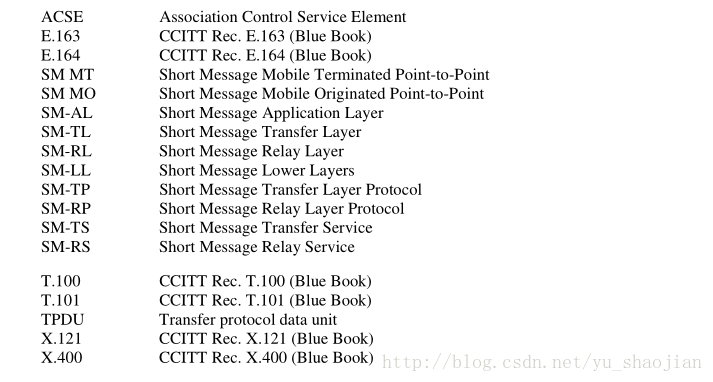

### SMS协议中使用到的一些常用术语

​	**More-Messages-To-Send (MMS)**：SC用来向UE端表明当前还有SMS需要发送到UE端。

​	**UE**：User Equipment，常指手机，同MS、DUT等都是同一个意思。

​	**short message**：短消息。

​	**Short Message Entity (SME)**：短消息实体，可以接收和发送sms。

​	**active MS**：可以理解为有SIM卡且正常驻网的手机设备。

​	**Service Centre (SC)**：短消息服务中心。

​	**alert-SC**：PLMN网络中的服务元素（可以简单理解为一种标志），用来通知上次发送短信到UE端失败

的SC，其目标UE已经重新正常接入网络。

​	**status report**：状态报告，SC用来通知UE端其短信已经发送成功。

​	**Gateway MSC For Short Message Service (SMS-GMSC)**：功能实体，主要负责接收SC发来的

SMS，然后根据HLR/HSS中的信息将SMS发送到指定的MSC或者SGSN。

​	**Interworking MSC For Short Message Service (SMS-IWMSC)**：功能实体，负责接收SGSN或者

MSC发送来的SMS，然后将SMS发送给SC。

​	**Messages-Waiting (MW)**：服务元素，用来当SC发送SMS失败后，使PLMN保存MWI信息。

​	**Messages-Waiting-Indication (MWI)**：存储在HLR和VLR中的用户相关的数据，用来表明当前有一

个或者多个SC发送SMS给UE失败了。

​	**Messages-Waiting-Data (MWD)**：MWI的一部分，其内包含失败的SC地址信息。

​	**Mobile-services Switching Centre (MSC)**：移动交换中心。

​	**Mobile-Station-Memory-Capacity-Exceeded-Flag (MCEF)**：MWI的一部分，布尔值，用来表明

当前SC发送SMS失败是由于UE端存储不足导致的。

​	**Mobile-Station-Not-Reachable-Flag (MNRF)**：MWI的一部分，布尔值，用来表明当前SC发送

SMS失败是由于网络找不到UE导致的。

​	**Mobile-station-Not-Reachable-for-GPRS (MNRG)**：存储在SGSN中的MWI的一部分，布尔值，作用同MNRF相同。

​	**Mobile-Station-Not-Reachable-Reason (MNRR)**：MWI的一部分，用来表明由于网络找不到UE导

致的SMS发送失败的原因值。

​	**priority**：用来使SME或者SC尝试发送SMS到UE端，不论当前UE是否被标记为temporarily absent，可以理解为优先发送。

​	**protocol-identifier**：协议描述符。

​	**reply path procedure**：一种机制，可以使SME请求SC将SMS的回复消息发送到另一SME，即使SC对于该SME是未知的。

​	**report**：用来向发送端表明当前SMS的结果，如果发送失败，则需要表明失败原因。

​	**replace short message type**：protocol identifier中一定范围内的值，用来标记携带indication的特

殊类型sms，SC或者UE可以用该sms替代已有的相同类型的sms，对于MT SMS，则需要有相同的SC地址和

发送地址，对于MO，则需要有相同的发送地址。

​	**Serving GPRS Support Node (SGSN)**：GPRS网络中的服务节点。

​	**SMS-STATUS-REPORT**：状态报告，TL层用到的协议术语。

​	**SMS-COMMAND**：UE端请求SC执行某一操作，TL层用到的协议术语。

​	**SMS-DELIVER**：TL层用到的协议术语，用来表明当前SMS是从SC发到UE端的。

​	**SMS-SUBMIT**：TL层用到的协议术语，用来表明当前SMS是从UE端发到SC端的。

​	**Service-Centre-Time-Stamp (SCTS)**：服务中心时间戳，用来表明SMS到达SC的时间点。

​	**Validity-Period (VP)**：SMS在SC中的最大有效期。

​	**TP-Message-Type-Indicator (TP-MTI)**：TPDU类型标识，表明该TPDU是下述六种的哪一种，占2bit, 位于所有的TPU的第一字节的bit0,bit1;

 

 

