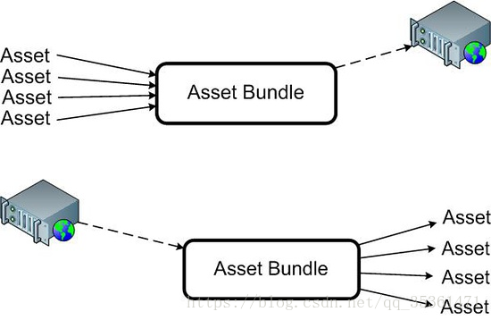
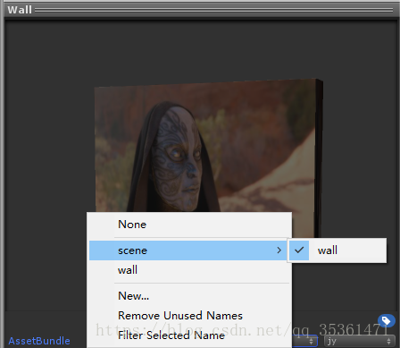
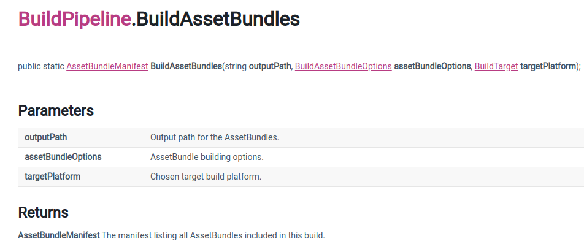
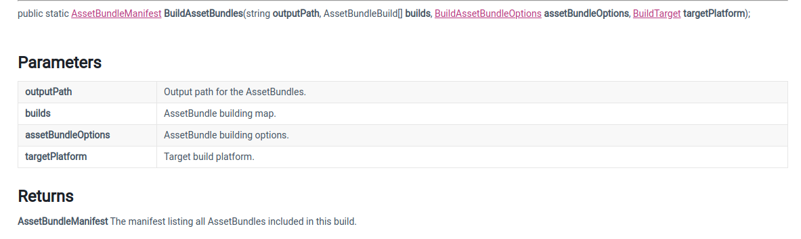
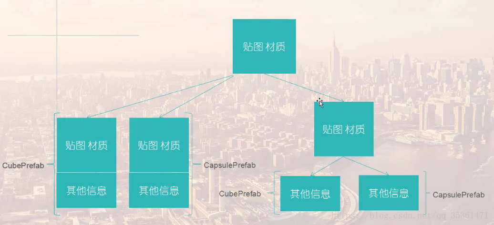
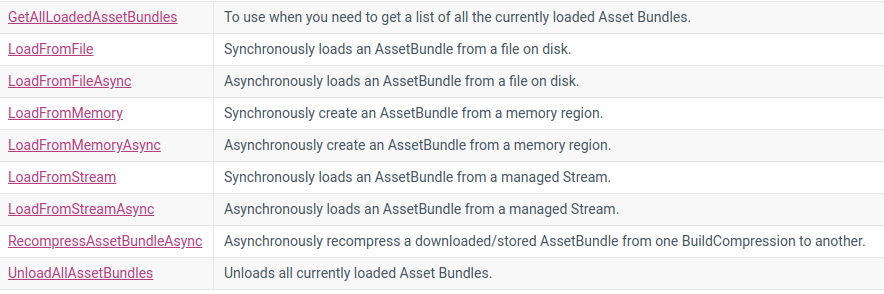

## AssetBundle的定义和作用

1. AssetBundle（简称AB包）是一个资源压缩包，包含模型、贴图、预制件、声音、甚至是整个场景，可以在游戏运行的时候被加载。
2. AssetBundle自身保存着相互依赖关系。
3. AssetBundle压缩包可以使用**LZMA**和**LZ4**压缩算法，减少包的大小，更快地进行网络传输。
4. 把一些下载内容放在AssetBundle里面，可以减少安装包的大小。


## 什么是AssetBundle

1. AssetBundle是一个存在于硬盘上的文件，可以称之为压缩包。这个压缩包可以认为是一个文件夹，里面包含了多个文件。这些文件可以分为两类：serialized file和resource file。（序列化文件和资源文件）

   serialized file：资源被打碎放在一个对象中，最后同一写进一个单独的文件（只有一个）

   resource files：某些二进制文件（图片、声音）被单独保存，方便快速加载，可以Editor上读取，方便查看

2. 它是一个AssetBundle对象，我们可以通过代码从一个特定的压缩包加载出来的对象。这个对象包含了所有我们当初添加到这个压缩包里面的内容，我们可以通过这个对象加载资源出来使用。


## AssetBundle的使用




1. 指定资源的AssetBundle属性

   （xxxx/aa）这里xxxx会生成目录，名字为aa。‘/’可以用于目录划分，Remove UnUsed name 可以移除没有使用的属性名

   

2. 构建AssetBundle包

3. 上传AssetBundle包

4. 加载AssetBundle包和包里面的资源


## 打包AssetBundle

使用编辑器扩展方法，将打包按钮Build AssetBundle放于Asset菜单下:

**官方实例：查看BuildPipeline类API。**

```c#
using UnityEditor;
using System.IO;

public class CreateAssetBundles
{
    [MenuItem("Assets/Build AssetBundles")]
    static void BuildAllAssetBundles()
    {
        string dir = "AssetBundles";
        if (Directory.Exists(dir) == false)
        {
            Directory.CreateDirectory(dir);
        }
        //BuildTarget 选择build出来的AB包要使用的平台
        BuildPipeline.BuildAssetBundles(dir, BuildAssetBundleOptions.None, BuildTarget.StandaloneWindows64);
    }
}
```

#### 






#### 参数：

- builds：AssetBundle building map.类型为**AssetBundleBuild**

- outputPath：打包的路径，随意只要是在硬盘上即可。

- assetBundleOptions：压缩算法选项

  - AssetBundleOptions.None：默认构建AssetBundle的方式。使用LZMA算法压缩，此算法压缩包小，但是加载时间长，而且使用之前必须要整体解压。解压以后，这个包又会使用LZ4算法重新压缩，这样这种包就不要对其整体解压了。（也就是第一次解压很慢，之后就变快了。
  - BuildAssetBundleOptions.UncompressedAssetBundle：不压缩数据，包大，但是加载很快。
  - BuildAssetBundleOptions.ChunkBaseCompression：使用LZ4算法压缩，压缩率没有LZMA高，但是加载资源不必整体解压。这种方法中规中矩，我认为比较常用。

  **注意:使用LZ4压缩，可以获得可以跟不压缩想媲美的加载速度，而且比不压缩文件要小。**

- targetPlatform：选择目标构建平台。


以上是常用的三种，接下来会对你其余的几种做简单的介绍

- BuildAssetBundleOptions.DisableWriteTypeTree：不会在AssetBundle中包含类型信息。
- BuildAssetBundleOptions.DeterministicAssetBundle：使用存储在Asset Bundle中的对象的id的哈希构建Asset Bundle。
- BuildAssetBundleOptions.ForceRebuildAssetBundle：强制重建Asset Bundles。
- BuildAssetBundleOptions.IgnoreTypeTreeChanges：执行增量构建检查时忽略类型树更改。
- BuildAssetBundleOptions.AppendHashToAssetBundleName：将哈希附加到assetBundle名称。
- BuildAssetBundleOptions.StrictMode：如果在其中报告任何错误，则不允许构建成功。
- BuildAssetBundleOptions.DryRunBuild：不实际构建它们。
- BuildAssetBundleOptions.DisableLoadAssetByFileName：通过文件名禁用Asset Bundle的加载。
- BuildAssetBundleOptions.DisableLoadAssetByFileNameWithExtension：通过带扩展名的文件名禁用Asset Bundle 的加载。


#### 依赖打包：

将需要同时加载的资源放在一个包中，各个包之间会保存相互依赖的信息。




## AssetBundle的加载和卸载



**Hints：在开发阶段一般将AB包放在本地，开发完成后再上传服务器。**


#### 加载的方式：

1. AssetBundle.LoadFromFile 从本地加载
2. AssetBundle.LoadFromMemory 从内存加载
3. WWW.LoadFromCacheOrDownload 下载后放在缓存中备用(该方法逐渐被弃用)
4. UnityWebRequest 从服务器下载

从AB中加载资源：

AssetBundle.LoadAsset(assetName)
AssetBundle.LoadAllAssets() 加载AB包中所有的对象，不包含依赖的包
AssetBundle.LoadAssetAsync() 异步加载，加载较大资源的时候
AssetBundle.LoadAllAssetsAsync() 异步加载全部资源
AssetBundle.LoadAssetWithSubAssets 加载资源及其子资源


#### AB的卸载：

减少内存的使用
有可能导致丢失
在切换场景，或者确定不使用的时候卸载
AssetBundle.Unload(true) 卸载所有资源，包含其中正被使用的资源
AssetBundle.Unload(false) 卸载所有没被使用的资源
Resources.UnloadUnusedAssets 卸载个别未使用的资源


## AssetBundle分组策略

#### 逻辑实体分组：

- 一个UI界面或者所有UI界面一个包（这个界面里面的贴图和布局信息一个包）
- 一个角色或者所有角色一个包（这个角色里面的模型和动画一个包）
- 所有的场景所共享的部分一个包（包括贴图和模型）

#### 按照类型分组：

​	所有声音资源打成一个包，所有shader打成一个包，所有模型打成一个包，所有材质打成一个包

#### 按照使用分组：

​	把在某一时间内使用的所有资源打成一个包。可以按照关卡分，一个关卡所需要的所有资源包括角色、贴图、声音等打成一个包。也可以按照场景分，一个场景所需要的资源一个包


#### 注意：

1. 经常更新的资源放在一个单独的包里，跟不经常更新的分开。
2. 把需要同时加载的资源放在一个包中。
3. 可以把其他共享的资源放在一个单独的包里面。
4. 把一些需要同时加载的小资源打成一个包。
5. 如果对于一个同一个资源有两个版本，可以考虑通过后缀来区分，如v1、v2


## Manifest文件


