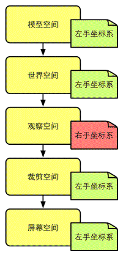
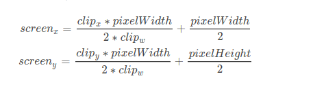

## 顶点着色器

顶点着色器的主要工作是  **坐标变换和逐顶点光照**。


## 矩阵变换的顺序

​	矩阵变换一般是约定使用列矩阵，即对一个向量进行变换了，将这个向量当做一个列矩阵。

​	在绝大多数情况下，我们约定的顺序是**先缩放，在旋转，最后平移**。


给定一个旋转顺序（例如这里的zxy），以及它们对应的旋转角度(θx,θy,θz)，有两种坐标系可以选择。

- 绕坐标系E下的z轴旋转θz，绕坐标系E下的y轴旋转θy，绕坐标系E下的x轴旋转θx，即进行一次旋转时不一起旋转当前坐标系。
- 绕坐标系E下的z轴旋转θz，在坐标系E下绕z轴旋转θz后的新坐标系E'下的y轴旋转θy，在坐标系E'下绕y轴旋转θy后的新坐标系E''下的x轴旋转θx，即在旋转时，把坐标系一起转动。


很容易知道，这两种选择的结果是不一样的。但如果把它们的旋转顺序颠倒一下，它们得到的结果就会是一样的！说得明白点，在第一种情况下，按zxy顺序旋转和在第二种情况下，按yxz顺序旋转是一样的。而Unity文档中说明的旋转顺序指的是在第一种情况下的顺序。


## 顶点的坐标空间变换过程

​	我们知道，在渲染流水线中，一个顶点要经过多个坐标空间的变换才能最终被画在屏幕上。一个顶点最开始是在模型空间中定义的，最后它将会变换到屏幕空间中，得到真正的屏幕像素坐标。	

​	过程如下：


在各个空间中使用的坐标系：




​	**顶点着色器的最基本的任务就是把顶点坐标从模型空间转换到裁剪空间中。而在片元着色器中，我们通常也可以得到该片元在屏幕空间的像素位置。**


## 模型空间

​	**模型空间（model space）**，如它的名字所暗示的那样，是和某个模型或者说是对象有关的。有时模型空间也被称为对象空间（object space）或局部空间（local space）。每个模型都有自己独立的坐标空间，当它移动或旋转的时候，模型空间也会跟着它移动和旋转。把我们自己当成游戏中的模型的话，当我们在办公室里移动时，我们的模型空间也在跟着移动，当我们转身时，我们本身的前后左右方向也在跟着改变。

​	在模型空间中，我们经常使用一些方向概念，例如“前（forward）”“后（back）”“左（left）”、“右（right）”、“上（up）”、“下（down）”。在本书中，我们把这些方向称为自然方向。模型空间中的坐标轴通常会使用这些自然方向。Unity在模型空间中使用的是左手坐标系，因此在模型空间中，+x轴、+y轴、+z轴分别对应的是模型的右、上和前向。需要注意的是，模型坐标空间中的x轴、y轴、z轴和自然方向的对应不一定是上述这种关系，但由于Unity使用的是这样的约定，因此本书将使用这种方式。我们可以在Hierarchy视图中单击任意对象就可以看见它们对应的模型空间的3个坐标轴。

​	模型空间的原点和坐标轴通常是由美术人员在建模软件里确定好的。当导入到Unity中后，我们可以在顶点着色器中访问到模型的顶点信息，其中包含了每个顶点的坐标。这些坐标都是相对于模型空间中的原点（通常位于模型的重心）定义的。


## 世界空间

​	**世界空间（world space）**是一个特殊的坐标系，因为它建立了我们所关心的最大的空间。一些读者可能会指出，空间可以是无限大的，怎么会有“最大”这一说呢？这里说的最大指的是一个宏观的概念，也就是说它是我们所关心的最外层的坐标空间。以我们的农场游戏为例，在这个游戏里世界空间指的就是农场，我们不关心这个农场是在什么地方，在这个虚拟的游戏世界里，农场就是最大的空间概念。

​	世界空间可以被用于描述绝对位置（较真的读者可能会再一次提醒我，没有绝对的位置。没错，但我相信读者可以明白这里绝对的意思）。在本书中，绝对位置指的就是在世界坐标系中的位置。通常，我们会把世界空间的原点放置在游戏空间的中心。

​	在Unity中，世界空间同样使用了左手坐标系。但它的x轴、y轴、z轴是固定不变的。在Unity中，我们可以通过调整Transform组件中的Position属性来改变模型的位置，这里的位置指的是相对于这个Transform的父节点（parent）的模型坐标空间中的原点定义的。如果一个Transform没有任何父节点，那么这个位置就是在世界坐标系中的位置。我们可以想象成还有一个虚拟的根模型，这个根模型的模型空间就是世界空间，所有的游戏对象都附属于这个根模型。同样，Transform中的Rotation和Scale也是同样的道理。

​	顶点变换的第一步，就是将顶点坐标从模型空间变换到世界空间中。这个变换通常叫做模型变换（model transform）。


## 观察空间

​	**观察空间（view space）**也被称为**摄像机空间（camera space）**。观察空间可以认为是模型空间的一个特例——在所有的模型中有一个非常特殊的模型，即摄像机（虽然通常来说摄像机本身是不可见的），它的模型空间值得我们单独拿出来讨论，也就是观察空间。

​	摄像机决定了我们渲染游戏所使用的视角。在观察空间中，摄像机位于原点，同样，其坐标轴的选择可以是任意的，但由于本书讨论的是以Unity为主，而Unity中观察空间的坐标轴选择是：+x轴指向右方，+y轴指向上方，而+z轴指向的是摄像机的后方。读者在这里可能觉得很奇怪，我们之前讨论的模型空间和世界空间中+z轴指的都是物体的前方，为什么这里不一样了呢？这是因为，Unity在模型空间和世界空间中选用的都是左手坐标系，而在观察空间中使用的是右手坐标系。这是符合OpenGL传统的，在这样的观察空间中，摄像机的正前方指向的是-z轴方向。

​	这种左右手坐标系之间的改变很少会对我们在Unity中的编程产生影响，因为Unity为我们做了很多渲染的底层工作，包括很多坐标空间的转换。但是，如果读者需要调用类似Camera.cameraToWorldMatrix、Camera.worldToCameraMatrix等接口自行计算某模型在观察空间中的位置，就要小心这样的差异。

​	最后要提醒读者的一点是，观察空间和屏幕空间是不同的。观察空间是一个三维空间，而屏幕空间是一个二维空间。从观察空间到屏幕空间的转换需要经过一个操作，那就是投影（projection）。我们后面就会讲到。

​	顶点变换的第二步，就是将顶点坐标从世界空间变换到观察空间中。这个变换通常叫做观察变换（view transform）。


## 裁剪空间

​	顶点接下来要从观察空间转换到**裁剪空间（clip space，也被称为齐次裁剪空间）**中，这个用于变换的矩阵叫做**裁剪矩阵（clip matrix）**，也被称为**投影矩阵（projection matrix）。**

​	裁剪空间的目标是能够方便地对渲染图元进行裁剪：完全位于这块空间内部的图元将会被保留，完全位于这块空间外部的图元将会被剔除，而与这块空间边界相交的图元就会被裁剪。那么，这块空间是如何决定的呢？答案是由视锥体（view frustum）来决定。

​	视锥体指的是空间中的一块区域，这块区域决定了摄像机可以看到的空间。视锥体由六个平面包围而成，这些平面也被称为裁剪平面（clip planes）。视锥体有两种类型，这涉及两种投影类型：一种是**正交投影（orthographic projection）**，一种是**透视投影（perspective projection）**。

​	透视投影模拟了人眼看世界的方式，而正交投影则完全保留了物体的距离和角度。因此，在追求真实感的3D游戏中我们往往会使用透视投影，而在一些2D游戏或渲染小地图等其他HUD元素时，我们会使用正交投影。

​	在视锥体的6块裁剪平面中，有两块裁剪平面比较特殊，它们分别被称为**近剪裁平面（near clip plane）**和**远剪裁平面（far clip plane）**。它们决定了摄像机可以看到的深度范围。

​	透视投影的视锥体是一个金字塔形，侧面的4个裁剪平面将会在摄像机处相交。它更符合视锥体这个词语。正交投影的视锥体是一个长方体。前面讲到，我们希望根据视锥体围成的区域对图元进行裁剪，但是，如果直接使用视锥体定义的空间来进行裁剪，那么不同的视锥体就需要不同的处理过程，而且对于透视投影的视锥体来说，想要判断一个顶点是否处于一个金字塔内部是比较麻烦的。因此，我们想用一种更加通用、方便和整洁的方式来进行裁剪的工作，这种方式就是通过一个投影矩阵把顶点转换到一个裁剪空间中。

投影矩阵有两个目的：

- 首先是为投影做准备。这是个迷惑点，虽然投影矩阵的名称包含了投影二字，但是它并没有进行真正的投影工作，而是在为投影做准备。真正的投影发生在后面的齐次除法（homogeneous division）过程中。而经过投影矩阵的变换后，顶点的w分量将会具有特殊的意义。

  读者：投影到底是什么意思呢？

  我们：可以理解成是一个空间的降维，例如从四维空间投影到三维空间中。而投影矩阵实际上并不会真的进行这个步骤，它会为真正的投影做准备工作。真正的投影会在屏幕映射时发生，通过齐次除法来得到二维坐标。

- 其次是对x、y、z分量进行缩放。我们上面讲过直接使用视锥体的6个裁剪平面来进行裁剪会比较麻烦。而经过投影矩阵的缩放后，我们可以直接使用w分量作为一个范围值，如果x、y、z分量都位于这个范围内，就说明该顶点位于裁剪空间内。


​	在裁剪空间之前，虽然我们使用了齐次坐标来表示点和矢量，但它们的第四个分量都是固定的：点的w分量是1，方向矢量的w分量是0。经过投影矩阵的变换后，我们就会赋予齐次坐标的第4个坐标更加丰富的含义。

​	通过使用投影矩阵来将顶点从观察空间变换到裁剪空间，得到的（x,y,z,w）。w分量用于判断这个顶点是否在裁剪空间内。如果满足：

- −w≤x≤w

- −w≤y≤w

- −w≤z≤w

  那么这个点是在裁剪空间内部的。


## 屏幕空间

​	经过投影矩阵的变换后，我们可以进行裁剪操作。当完成了所有的裁剪工作后，就需要进行真正的投影了，也就是说，我们需要把视锥体投影到**屏幕空间（screen space）**中。经过这一步变换，我们会得到真正的像素位置，而不是虚拟的三维坐标。

​	屏幕空间是一个二维空间，因此，我们必须把顶点从裁剪空间投影到屏幕空间中，来生成对应的2D坐标。这个过程可以理解成有两个步骤。

​	首先，我们需要进行**标准齐次除法（homogeneous division）**，也被称为**透视除法（perspective division）**。虽然这个步骤听起来很陌生，但是它实际上非常简单，就是**用齐次坐标系的w分量去除x、y、z分量**。在OpenGL中，我们把这一步得到的坐标叫做归一化的设备坐标（Normalized Device Coordinates，NDC）。经过这一步，我们可以把坐标从齐次裁剪坐标空间转换到NDC中。经过透视投影变换后的裁剪空间，经过齐次除法后会变换到一个立方体内。按照OpenGL的传统，这个立方体的x、y、z分量的范围都是[−1, 1]。但在DirectX这样的API中，z分量的范围会是[0, 1]。而Unity选择了OpenGL这样的齐次裁剪空间。而对于正交投影来说，它的裁剪空间实际已经是一个立方体了，而且由于经过正交投影矩阵变换后的顶点的w分量是1，因此齐次除法并不会对顶点的x、y、z坐标产生影响。

​	经过齐次除法后，透视投影和正交投影的视锥体都变换到一个相同的立方体内。现在，我们可以根据变换后的x和y坐标来映射输出窗口的对应像素坐标。

​	在Unity中，屏幕空间左下角的像素坐标是（0, 0），右上角的像素坐标是(pixelWidth, pixelHeight)。由于当前x和y坐标都是[−1, 1]，因此这个映射的过程就是一个缩放的过程。

​	**齐次除法和屏幕映射可以总结为下面的公式：**（也可以理解为先齐次除法，然后进行屏幕坐标转换）

	

​		clipx:表示裁剪空间中x的值。

​		clipx=y:表示裁剪空间中y的值。

​		pixeWidth：表示屏幕的像素宽度（即分辨率的宽）

​		pixeHeight：表示屏幕的像素高度（即分辨率的高）

​	

​	在Unity中，从裁剪空间到屏幕空间的转换是由底层帮我们完成的。我们的顶点着色器只需要把顶点转换到裁剪空间即可。


## 答疑解惑


### 使用3×3还是4×4的变换矩阵

​	对于线性变换（例如旋转和缩放）来说，仅使用3×3的矩阵就足够表示所有的变换了。但如果存在平移变换，我们就需要使用4×4的矩阵。因此，在对顶点的变换中，我们通常使用4×4的变换矩阵。当然，在变换前我们需要把点坐标转换成齐次坐标的表示，即把顶点的w分量设为1。而在对方向矢量的变换中，我们通常使用3×3的矩阵就足够了，这是因为平移变换对方向矢量是没有影响的。


### Cg中的矢量和矩阵类型(参数的位置不同的影响)

​	我们通常在Unity Shader中使用Cg作为着色器编程语言。在Cg中变量类型有很多种，但在本节我们是想解释如何使用这些类型进行数学运算。因此，我们只以float家族的变量来做说明。

​	在Cg中，矩阵类型是由float3x3、float4x4等关键词进行声明和定义的。而对于float3、float4等类型的变量，我们既可以把它当成一个矢量，也可以把它当成是一个1×n的行矩阵或者一个n×1的列矩阵。这取决于运算的种类和它们在运算中的位置。例如，当我们进行点积操作时，两个操作数就被当成矢量类型，如下：

float4 a = float4(1.0, 2.0, 3.0, 4.0);
float4 b = float4(1.0, 2.0, 3.0, 4.0);
// 对两个矢量进行点积操作
float result = dot(a, b);
但在进行矩阵乘法时，参数的位置将决定是按列矩阵还是行矩阵进行乘法。在Cg中，矩阵乘法是通过mul函数实现的。例如：

float4 v = float4(1.0, 2.0, 3.0, 4.0);
float4x4 M = float4x4(1.0, 0.0, 0.0, 0.0,
                      0.0, 2.0, 0.0, 0.0,
                      0.0, 0.0, 3.0, 0.0,
                      0.0, 0.0, 0.0, 4.0);
// 把v当成列矩阵和矩阵M进行右乘
float4 column_mul_result = mul(M, v);
// 把v当成行矩阵和矩阵M进行左乘
float4 row_mul_result = mul(v, M);
// 注意：column_mul_result不等于row_mul_result，而是：
// mul(M,v) == mul(v, tranpose(M))
// mul(v,M) == mul(tranpose(M), v)
因此，参数的位置会直接影响结果值。


**通常在变换顶点时，我们都是使用右乘的方式来按列矩阵进行乘法。这是因为，Unity提供的内置矩阵（如UNITY_MATRIX_MVP等）都是按列存储的。但有时，我们也会使用左乘的方式，这是因为可以省去对矩阵转置的操作。**


需要注意的一点是，Cg对矩阵类型中元素的初始化和访问顺序。在Cg中，对float4x4等类型的变量是按行优先的方式进行填充的。什么意思呢？我们知道，想要填充一个矩阵需要给定一串数字，例如，如果需要声明一个3×4的矩阵，我们需要提供12个数字。那么，这串数字是一行一行地填充矩阵还是一列一列地填充矩阵呢？这两种方式得到的矩阵是不同的。例如，我们使用(1, 2, 3, 4, 5, 6, 7, 8, 9)去填充一个3×3的矩阵，如果是按照行优先的方式，得到的矩阵是：

​	1	|	2	|	3

​	4	|	5	|	6

​	7	|	8	|	9

如果是按照列优先的方式，得到的矩阵是：

​	1	|	4	|	7

​	2	|	5	|	8

​	3	|	6	|	9

Cg使用的是行优先的方法，即是一行一行地填充矩阵的。因此，如果读者需要自己定义一个矩阵时（例如，自己构建用于空间变换的矩阵），就要注意这里的初始化方式。

类似地，当我们在Cg中访问一个矩阵中的元素时，也是按行来索引的。例如：

// 按行优先的方式初始化矩阵M
float3x3 M = float3x3(1.0, 2.0, 3.0,
                      4.0, 5.0, 6.0,
                      7.0, 8.0, 9.0);
// 得到M的第一行，即(1.0, 2.0, 3.0)
float3 row = M[0]; 

// 得到M的第2行第1列的元素，即4.0
float ele = M[1][0];
之所以Unity Shader中的矩阵类型满足上述规则，是因为使用的是Cg语言。换句话说，上面的特性都是Cg的规定。

如果读者熟悉Unity的API，可能知道Unity在脚本中提供了一种矩阵类型——Matrix4x4。脚本中的这个矩阵类型则是采用列优先的方式。这与Unity Shader中的规定不一样，


### Unity中的屏幕坐标：ComputeScreenPos/VPOS/WPOS

在写Shader的过程中，我们有时候希望能够获得片元在屏幕上的像素位置。

在顶点/片元着色器中，有两种方式来获得片元的屏幕坐标。

一种是在片元着色器的输入中声明VPOS或WPOS语义（关于什么是语义，可参见5.4节）。VPOS是HLSL中对屏幕坐标的语义，而WPOS是Cg中对屏幕坐标的语义。两者在Unity Shader中是等价的。我们可以在HLSL/Cg中通过语义的方式来定义顶点/片元着色器的默认输入，而不需要自己定义输入输出的数据结构。这里的内容有一些超前，因为我们还没有具体讲解顶点/片元着色器的写法，读者在这里可以只关注VPOS和WPOS的语义。使用这种方法，可以在片元着色器中这样写：

```c
fixed4 frag(float4 sp : VPOS) : SV_Target {
    // 用屏幕坐标除以屏幕分辨率_ScreenParams.xy，得到视口空间中的坐标
    return fixed4(sp.xy/_ScreenParams.xy,0.0,1.0);
}
```

得到的效果如图:


​	VPOS/WPOS语义定义的输入是一个float4类型的变量。我们已经知道它的xy值代表了在屏幕空间中的像素坐标。如果屏幕分辨率为400 x 300，那么x的范围就是[0.5,400.5]，y的范围是[0.5,300.5]。注意，这里的像素坐标并不是整数值，这是因为OpenGL和DirectX 10以后的版本认为像素中心对应的是浮点值中的0.5。那么，它的zw分量是什么呢？在Unity中，VPOS/WPOS的z分量范围是[0,1]，在摄像机的近裁剪平面处，z值为0，在远裁剪平面处，z值为1。对于w分量，我们需要考虑摄像机的投影类型。如果使用的是透视投影，那么w分量的范围是

[1/Near,1/Far]

，Near和Far对应了在Camera组件中设置的近裁剪平面和远裁剪平面距离摄像机的远近；如果使用的是正交投影，那么w分量的值恒为1。这些值是通过对经过投影矩阵变换后的w分量取倒数后得到的。在代码的最后，我们把屏幕空间除以屏幕分辨率来得到视口空间（viewport space）中的坐标。视口坐标很简单，就是把屏幕坐标归一化，这样屏幕左下角就是(0, 0)，右上角就是(1, 1)。如果已知屏幕坐标的话，我们只需要把xy值除以屏幕分辨率即可。

另一种方式是通过Unity提供的ComputeScreenPos函数。这个函数在UnityCG.cginc里被定义。通常的用法需要两个步骤，首先在顶点着色器中将ComputeScreenPos的结果保存在输出结构体中，然后在片元着色器中进行一个齐次除法运算后得到视口空间下的坐标。例如：

```c
struct vertOut {
    float4 pos:SV_POSITION;
    float4 scrPos : TEXCOORD0;
};

vertOut vert(appdata_base v) {
    vertOut o;
    o.pos = mul (UNITY_MATRIX_MVP, v.vertex);
    // 第一步：把ComputeScreenPos的结果保存到scrPos中
    o.scrPos = ComputeScreenPos(o.pos);
    return o;
}

fixed4 frag(vertOut i) : SV_Target {
    // 第二步：用scrPos.xy除以scrPos.w得到视口空间中的坐标
    float2 wcoord = (i.scrPos.xy/i.scrPos.w);
    return fixed4(wcoord,0.0,1.0);
}
```

上面代码的实现效果和图4.49中的一样。我们现在来看一下这种方式的实现细节。这种方法实际上是手动实现了屏幕映射的过程，而且它得到的坐标直接就是视口空间中的坐标。我们在4.6.8节中已经看到了如何将裁剪坐标空间中的点映射到屏幕坐标中。据此，我们可以得到视口空间中的坐标，公式如下：


上面公式的思想就是，首先对裁剪空间下的坐标进行齐次除法，得到范围在[−1, 1]的NDC，然后再将其映射到范围在[0, 1]的视口空间下的坐标。那么ComputeScreenPos究竟是如何做到的呢？我们可以在UnityCG.cginc文件中找到ComputeScreenPos函数的定义。如下：

```c
inline float4 ComputeScreenPos (float4 pos) {
    float4 o = pos * 0.5f;
    #if defined(UNITY_HALF_TEXEL_OFFSET)
    o.xy = float2(o.x, o.y*_ProjectionParams.x) + o.w * _ScreenParams.zw;
    #else
    o.xy = float2(o.x, o.y*_ProjectionParams.x) + o.w;
    #endif
	o.zw = pos.zw;
	return o;
}
```

ComputeScreenPos的输入参数pos是经过MVP矩阵变换后在裁剪空间中的顶点坐标。UNITY_HALF_TEXEL_OFFSET是Unity在某些DirectX平台上使用的宏，在这里我们可以忽略它。这样，我们可以只关注#else的部分。_ProjectionParams.x在默认情况下是1（如果我们使用了一个翻转的投影矩阵的话就是−1，但这种情况很少见）。那么上述代码的过程实际是输出了：

**Output** z=**Clip **z

**Output** w=**Clip **w

可以看出，这里的xy并不是真正的视口空间下的坐标。因此，我们在片元着色器中再进行一步处理，即除以裁剪坐标的w分量。至此，完成整个映射的过程。因此，虽然ComputeScreenPos的函数名字似乎意味着会直接得到屏幕空间中的位置，但并不是这样的，我们仍需在片元着色器中除以它的w分量来得到真正的视口空间中的位置。那么，为什么Unity不直接在ComputeScreenPos中为我们进行除以w分量的这个步骤呢？为什么还需要我们来进行这个除法？这是因为，如果Unity在顶点着色器中这么做的话，就会破坏插值的结果。我们知道，从顶点着色器到片元着色器的过程实际会有一个插值的过程（如果你忘了的话，可以回顾2.3.6小节）。如果不在顶点着色器中进行这个除法，保留x、y和w分量，那么它们在插值后再进行这个除法，得到的$\frac{x}{w}$和$\frac{y}{w}$就是正确的（我们可以认为是除法抵消了插值的影响）。但如果我们直接在顶点着色器中进行这个除法，那么就需要对$\frac{x}{w}$和$\frac{y}{w}$直接进行插值，这样得到的插值结果就会不准确。原因是，我们不可以在投影空间中进行插值，因为这并不是一个线性空间，而插值往往是线性的。

经过除法操作后，我们就可以得到该片元在视口空间中的坐标了，也就是一个xy范围都在[0, 1]之间的值。那么它的zw值是什么呢？可以看出，我们在顶点着色器中直接把裁剪空间的zw值存进了输出结构体中，因此片元着色器输入的就是这些插值后的裁剪空间中的zw值。这意味着，如果使用的是透视投影，那么z值的范围是[-Near, Far]，w值的范围是[Near, Far]；如果使用的是正交投影，那么z值范围是[−1, 1]，而w值恒为1。