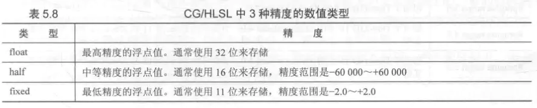

​	使用Unity写Shader的一个好处在于，它提供了很多内置的参数，这使得我们不再需要自己手动计算一些值。本节将给出Unity内置的用于空间变换和摄像机以及屏幕参数的内置变量。这些内置变量可以在UnityShaderVariables.cginc文件中找到定义和说明。

## 内置变量

|      名称       |  类型  |                             描述                             |
| :-------------: | :----: | :----------------------------------------------------------: |
|      _Time      | float4 | t是自该场景加载开始所经过的时间，4个分量的值分别是(t/20, t, 2t, 3t)。 |
|    _SinTime     | float4 |     t是时间的正弦值，4个分量的值分别是(t/8, t/4, t/2, t)     |
|    _CosTime     | float4 |     t是时间的余弦值，4个分量的值分别是(t/8, t/4, t/2, t)     |
| unity_DeltaTime | float4 | dt是时间增量，4个分量的值分别是(dt, 1/dt, smoothDt, 1/smoothDt) |


## 内置宏

|                       名称                        |                             描述                             |
| :-----------------------------------------------: | :----------------------------------------------------------: |
|              UNITY_LIGHT_ATTENUATION              | unity中的内置宏，统一管理unity中的光照衰减和阴影。（即光照衰减atten 乘以 阴影系数） |
| TANGENT_SPACE_ROTATION（在UnityCG.cginc中被定义） | 使用这个宏可以获得一个 将变量从模型空间变换到切线空间的矩阵rotation； |
|                                                   |                                                              |
|                 SHADOW_COORDS（）                 | 阴影接收三剑客其一，声明一个用于对阴影纹理采样的坐标。需要注意的是，这个宏的参数需要是下一个可用的插值寄存器的索引值，此宏的参数中的寄存器索引值由前面的索引值加一，(定义在AutoLight.cginc中) |
|                TRANSFER_SHADOW（）                | 阴影接受三剑客其二，用于在顶点着色器中计算上一步中声明的阴影纹理坐标。(定义在AutoLight.cginc中) |
|              SHADOW_ ATTENUATION（）              |  阴影接受三剑客其三，计算阴影值。(定义在AutoLight.cginc中)   |
|                                                   |                                                              |
|         TRANSFORM_TEX(v.vertex,_MainTex)          | TRANSFORM_TEX是在UnityCG.cginc中定义的,用于计算<br>o.uv = v.texcoord.xy * _MainTex_ST.xy + _MainTex_ST.zw; |


## 变换矩阵

​	首先是用于坐标空间变换的矩阵。下表给出了Unity 5.2版本提供的所有内置变换矩阵。下面所有的矩阵都是float4x4类型的。

|       变量名       |                             描述                             |
| :----------------: | :----------------------------------------------------------: |
|  UNITY_MATRIX_MVP  | 当前的模型观察投影矩阵，用于将顶点/方向矢量从模型空间变换到裁剪空间 |
|  UNITY_MATRIX_MV   | 当前的模型观察矩阵，用于将顶点/方向矢量从模型空间变换到观察空间 |
|   UNITY_MATRIX_V   | 当前的观察矩阵，用于将顶点/方向矢量从世界空间变换到观察空间  |
|   UNITY_MATRIX_P   | 当前的投影矩阵，用于将顶点/方向矢量从观察空间变换到裁剪空间  |
|  UNITY_MATRIX_VP   | 当前的观察投影矩阵，用于将顶点/方向矢量从世界空间变换到裁剪空间 |
| UNITY_MATRIX_T_MV  |                  UNITY_MATRIX_MV的转置矩阵                   |
| UNITY_MATRIX_IT_MV | UNITY_MATRIX_MV的逆转置矩阵，用于将法线从模型空间变换到观察空间，也可用于得到UNITY_MATRIX_MV的逆矩阵 |
|   _Object2World    | 当前的模型矩阵，用于将顶点/方向矢量从模型空间变换到世界空间  |
|   _World2Object    | _Object2World的逆矩阵，用于将顶点/方向矢量从世界空间变换到模型空间 |


​	其中有一个矩阵比较特殊，即UNITY_MATRIX_T_MV矩阵。很多对数学不了解的读者不理解这个矩阵有什么用处。如果读者认真看过矩阵一节的知识，应该还会记得一种非常吸引人的矩阵类型——正交矩阵。对于正交矩阵来说，它的逆矩阵就是转置矩阵。因此，如果UNITY_MATRIX_MV是一个正交矩阵的话，那么UNITY_MATRIX_T_MV就是它的逆矩阵，也就是说，我们可以使用UNITY_MATRIX_T_MV把顶点和方向矢量从观察空间变换到模型空间。那么问题是，UNITY_MATRIX_MV什么时候是一个正交矩阵呢？读者可以从4.5节找到答案。总结一下，如果我们只考虑旋转、平移和缩放这3种变换的话，如果一个模型的变换只包括旋转，那么UNITY_MATRIX_MV就是一个正交矩阵。这个条件似乎有些苛刻，我们可以把条件再放宽一些，如果只包括旋转和统一缩放（假设缩放系数是k），那么UNITY_MATRIX_MV就几乎是一个正交矩阵了。为什么是几乎呢？因为统一缩放可能会导致每一行（或每一列）的矢量长度不为1，而是k，这不符合正交矩阵的特性，但我们可以通过除以这个统一缩放系数，来把它变成正交矩阵。在这种情况下，UNITY_MATRIX_MV的逆矩阵就是\frac{1}{k}UNITY_MATRIX_T_MV。而且，如果我们只是对方向矢量进行变换的话，条件可以放得更宽，即不用考虑有没有平移变换，因为平移对方向矢量没有影响。因此，我们可以截取UNITY_MATRIX_T_MV的前3行前3列来把方向矢量从观察空间变换到模型空间（前提是只存在旋转变换和统一缩放）。对于方向矢量，我们可以在使用前对它们进行归一化处理，来消除统一缩放的影响。

​	还有一个矩阵需要说明一下，那就是UNITY_MATRIX_IT_MV矩阵。我们在4.7节已经知道，法线的变换需要使用原变换矩阵的逆转置矩阵。因此UNITY_MATRIX_IT_MV可以把法线从模型空间变换到观察空间。但只要我们做一点手脚，它也可以用于直接得到UNITY_MATRIX_MV的逆矩阵——我们只需要对它进行转置就可以了。因此，为了把顶点或方向矢量从观察空间变换到模型空间，我们可以使用类似下面的代码：

```c
// 方法一：使用transpose函数对UNITY_MATRIX_IT_MV进行转置，
// 得到UNITY_MATRIX_MV的逆矩阵，然后进行列矩阵乘法，
// 把观察空间中的点或方向矢量变换到模型空间中
float4 modelPos = mul(transpose(UNITY_MATRIX_IT_MV), viewPos);

// 方法二：不直接使用转置函数transpose，而是交换mul参数的位置，使用行矩阵乘法
// 本质和方法一是完全一样的
float4 modelPos = mul(viewPos, UNITY_MATRIX_IT_MV);
```


**注意：在进行矩阵变换的时候，不仅仅可以通过使用mul方法来进行矩阵和向量的乘法对向量进行变换，还可以使用矩阵的每一行和向量的点积来作为变换后的向量的分量，如：第一行点积向量作为变换后的向量的x分量，以此类推。**


## unity内置函数

​	在计算光照模型的时候，我们往往需要得到光源方向、视角方向这两个基本信息。在上面的例子中，我们都是自行在代码里计算的，例如使用normalize(_WorldSpace LightPos0.xyz)来得到光源方向（这种方法实际只适用于平行光），使用normalize(_WorldSpace CameraPos.xyz - i.worldPosition.xyz)来得到视角方向。但如果需要处理更复杂的光照类型，如点光源和聚光灯，我们计算光源方向的方法就是错误的。这需要我们在代码中先判断光源类型，再计算它的光源信息。

​	手动计算这些光源信息的过程相对比较麻烦（但并不意味着你不需要了解它们的原理）。幸运的是，Unity提供了一些内置函数来帮助我们计算这些信息。如下表所示：

|                    函数名                     |                             描述                             |
| :-------------------------------------------: | :----------------------------------------------------------: |
|      float3 WorldSpaceViewDir (float4 v)      | 输入一个模型空间中的顶点位置，返回世界空间中从该点到摄像机的观察方向。内部实现使用了UnityWorldSpaceViewDir函数 |
|   float3 UnityWorldSpaceViewDir (float4 v)    | 输入一个世界空间中的顶点位置，返回世界空间中从该点到摄像机的观察方向 |
|       float3 ObjSpaceViewDir (float4 v)       | 输入一个模型空间中的顶点位置，返回模型空间中从该点到摄像机的观察方向 |
|     float3 WorldSpaceLightDir (float4 v)      | 仅可用于前向渲染中 。输入一个模型空间中的顶点位置，返回世界空间中从该点到光源的光照方向。内部实现使用了UnityWorldSpaceLightDir函数。没有被归一化 |
|   float3 UnityWorldSpaceLightDir (float4 v)   | 仅可用于前向渲染中 。输入一个世界空间中的顶点位置，返回世界空间中从该点到光源的光照方向。没有被归一化 |
|      float3 ObjSpaceLightDir (float4 v)       | 仅可用于前向渲染中 。输入一个模型空间中的顶点位置，返回模型空间中从该点到光源的光照方向。没有被归一化 |
| float3 UnityObjectToWorldNormal (float3 norm) |             把法线方向从模型空间转换到世界空间中             |
|   float3 UnityObjectToWorldDir (float3 dir)   |             把方向矢量从模型空间变换到世界空间中             |
|   float3 UnityWorldToObjectDir(float3 dir)    |             把方向矢量从世界空间变换到模型空间中             |
|         ComputeScreenPos(float3 pos)          | 输入参数pos是经过MVP矩阵变换后在裁剪空间中的顶点坐标,将裁剪空间中的点变换到屏幕空间中的点。使用xy分量再除以w分量才能得到视口空间中的坐标。 |


视口坐标;

```c#
struct vertOut {
    float4 pos:SV_POSITION;
    float4 scrPos : TEXCOORD0;
};

vertOut vert(appdata_base v) {
    vertOut o;
    o.pos = mul (UNITY_MATRIX_MVP, v.vertex);
    // 第一步：把ComputeScreenPos的结果保存到scrPos中
    o.scrPos = ComputeScreenPos(o.pos);
    return o;
}

fixed4 frag(vertOut i) : SV_Target {
    // 第二步：用scrPos.xy除以scrPos.w得到视口空间中的坐标
    float2 wcoord = (i.scrPos.xy/i.scrPos.w);
    return fixed4(wcoord,0.0,1.0);
}
```


注意，类似UnityXXX的几个函数是Unity 5中新添加的内置函数。这些帮助函数使得我们不需要跟各种变换矩阵、内置变量打交道，也不需要考虑各种不同的情况（例如使用了哪种光源），而仅仅调用一个函数就可以得到需要的信息。上面的9个帮助函数中，有5个我们已经掌握了其内部实现，例如WorldSpaceViewDir函数实现如下：

```c
// Computes world space view direction, from object space position
inline float3 UnityWorldSpaceViewDir( in float3 worldPos )
{
    return _WorldSpaceCameraPos.xyz - worldPos;
}
```

可以看出，这与之前计算视角方向的方法一致。需要注意的是，这些函数都没有保证得到的方向矢量是单位矢量，因此，我们需要在使用前把它们归一化。

而计算光源方向的3个函数：WorldSpaceLightDir、UnityWorldSpaceLightDir和ObjSpace
LightDir，稍微复杂一些，这是因为，Unity帮我们处理了不同种类光源的情况。需要注意的是，这3个函数仅可用于前向渲染。这是因为只有在前向渲染时，这3个函数里使用的内置变量_WorldSpaceLightPos0等才会被正确赋值。

```c
v2f vert(a2v v) {
    v2f o;
    ...
    // Use the build-in function to compute the normal in world space
    o.worldNormal = UnityObjectToWorldNormal(v.normal);
    ...
    return o;
}
```

（2）在片元着色器中，我们使用内置的UnityWorldSpaceLightDir函数和UnityWorldSpaceView
Dir函数来分别计算世界空间的光照方向和视角方向：

```c
fixed4 frag(v2f i) : SV_Target {
    ...

    fixed3 worldNormal = normalize(i.worldNormal);
    //  Use the build-in function to compute the light direction in world space
    // Remember to normalize the result
    fixed3 worldLightDir = normalize(UnityWorldSpaceLightDir(i.worldPos));

    ...

    // Use the build-in function to compute the view direction in world space
    // Remember to normalize the result
    fixed3 viewDir = normalize(UnityWorldSpaceViewDir(i.worldPos));
    ...
}
```

​	需要注意的是，由内置函数得到的方向是没有归一化的，因此我们需要使用normalize函数来对结果进行归一化，再进行光照模型的计算。


## 摄像机和屏幕参数

|             变量名             |   类型   |                             描述                             |
| :----------------------------: | :------: | :----------------------------------------------------------: |
|      _WorldSpaceCameraPos      |  float3  |                  该摄像机在世界空间中的位置                  |
|       _ProjectionParams        |  float4  | x = 1.0（或−1.0，如果正在使用一个翻转的投影矩阵进行渲染），y = Near，z = Far，w = 1.0 + 1.0/Far，其中Near和Far分别是近裁剪平面和远裁剪平面和摄像机的距离 |
|         _ScreenParams          |  float4  | x = width，y = height，z = 1.0 + 1.0/width，w = 1.0 + 1.0/height，其中width和height分别是该摄像机的渲染目标（render target）的像素宽度和高度 |
|         _ZBufferParams         |  float4  | x = 1− Far/Near，y = Far/Near，z = x/Far，w = y/Far，该变量用于线性化Z缓存中的深度值 |
|       unity_OrthoParams        |  float4  | x = width，y = heigth，z没有定义，w = 1.0（该摄像机是正交摄像机）或w = 0.0（该摄像机是透视摄像机），其中width和height是正交投影摄像机的宽度和高度 |
|     unity_CameraProjection     | float4x4 |                      该摄像机的投影矩阵                      |
|    unity_CameraInvProjectio    | float4x4 |                  该摄像机的投影矩阵的逆矩阵                  |
| unity_CameraWorldClipPlanes[6] | float4x4 | 该摄像机的6个裁剪平面在世界空间下的等式，按如下顺序：左、右、下、上、近、远裁剪平面 |


## Unity支持的语义

​	**语义实际上就是一个赋给Shader输入和输出的字符串，这个字符串表达了这个参数的含义。通俗地讲，这些语义可以让Shader知道从哪里读取数据，并把数据输出到哪里，它们在Cg/HLSL的Shader流水线中是不可或缺的。需要注意的是，Unity并没有支持所有的语义。**

​	**通常情况下，这些输入输出变量并不需要有特别的意义，也就是说，我们可以自行决定这些变量的用途。例如在上面的代码中，顶点着色器的输出结构体中我们用COLOR0语义去描述color变量。color变量本身存储了什么，Shader流水线并不关心。**

​	**而Unity为了方便对模型数据的传输，对一些语义进行了特别的含义规定。例如，在顶点着色器的输入结构体a2v用TEXCOORD0来描述texcoord，Unity会识别TEXCOORD0语义，以把模型的第一组纹理坐标填充到texcoord中。需要注意的是，即便语义的名称一样，如果出现的位置不同，含义也不同。例如，TEXCOORD0既可以用于描述顶点着色器的输入结构体a2v，也可用于描述输出结构体v2f。但在输入结构体a2v中，TEXCOORD0有特别的含义，即把模型的第一组纹理坐标存储在该变量中，而在输出结构体v2f中，TEXCOORD0修饰的变量含义就可以由我们来决定。**


|             语　　义              |                           描　　述                           |
| :-------------------------------: | :----------------------------------------------------------: |
|             POSITION              |            模型空间中的顶点位置，通常是float4类型            |
|              NORMAL               |                  顶点法线，通常是float3类型                  |
|              TANGENT              |                  顶点切线，通常是float4类型                  |
| TEXCOORDn，如TEXCOORD0、TEXCOORD1 | 该顶点的纹理坐标，TEXCOORD0表示第一组纹理坐标，依此类推。通常是float2或float4类型 |
|               COLOR               |              顶点颜色，通常是fixed4或float4类型              |

​	其中TEXCOORDn中n的数目是和Shader Model有关的，例如一般在Shader Model 2（即Unity默认编译到的Shader Model版本）和Shader Model 3中，n等于8，而在Shader Model 4和Shader Model 5中，n等于16。通常情况下，一个模型的纹理坐标组数一般不超过2，即我们往往只使用TEXCOORD0和TEXCOORD1。在Unity内置的数据结构体appdata_full中，它最多使用了6个坐标纹理组。


表5.6总结了从顶点着色器阶段到片元着色器阶段Unity支持的常用语义。

表5.6　　从顶点着色器传递数据给片元着色器时Unity使用的常用语义

|       语　　义       |                           描　　述                           |
| :------------------: | :----------------------------------------------------------: |
|     SV_POSITION      | 裁剪空间中的顶点坐标，结构体中必须包含一个用该语义修饰的变量。等同于DirectX 9中的POSITION，但最好使用SV_POSITION |
|        COLOR0        |           通常用于输出第一组顶点颜色，但不是必需的           |
|        COLOR1        |           通常用于输出第二组顶点颜色，但不是必需的           |
| TEXCOORD0～TEXCOORD7 |              通常用于输出纹理坐标，但不是必需的              |

​	上面的语义中，除了SV_POSITION是有特别含义外，其他语义对变量的含义没有明确要求，也就是说，我们可以存储任意值到这些语义描述变量中。通常，如果我们需要把一些自定义的数据从顶点着色器传递给片元着色器，一般选用TEXCOORD0等。


表5.7给出了Unity中支持的片元着色器的输出语义。

表5.7　　片元着色器输出时Unity支持的常用语义

| 语　　义  |                           描　　述                           |
| :-------: | :----------------------------------------------------------: |
| SV_Target | 输出值将会存储到渲染目标（render target）中。等同于DirectX 9中的COLOR语义，但最好使用SV_Target |


**注意：尽可能使用低精度的浮点值进行运算。最高精度的float/highp适用于存储诸如顶点坐标等变量，但它的计算速度是最慢的，我们应该尽量避免在片元着色器中使用这种精度进行计算。而half/mediump适用于一些标量、纹理坐标等变量，它的计算速度大约是float的两倍。而fixed/lowp适用于绝大多数颜色变量和归一化后的方向矢量，在进行一些对精度要求不高的计算时，我们应该尽量使用这种精度的变量。它的计算速度大约是float的4倍，但要避免对这些低精度变量进行频繁的swizzle操作（如color.xwxw）。还需要注意的是，我们应当尽量避免在不同精度之间的转换，这有可能会造成一定的性能下降。**


### CG语音中三种数据类型的数值范围




