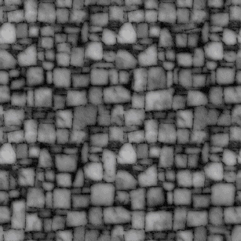

## 纹理（UV）

​	纹理最初的目的就是使用一张图片来控制模型的外观。使用纹理映 射（texture mapping）技术，我们可以把一张图“黏”在模型表面，逐纹 素（texel）（纹素的名字是为了和像素进行区分）地控制模型的颜色。

​	在美术人员建模的时候，**通常会在建模软件中利用纹理展开技术把 纹理映射坐标（texture-mapping coordinates）存储在每个顶点上**。**纹理映射坐标定义了该顶点在纹理中对应的2D坐标**。通常，这些坐标使 用一个二维变量(u, v)来表示，其中u是横向坐标，而v是纵向坐标。因 此，纹理映射坐标也被称为UV坐标。

​	**尽管纹理的大小可以是多种多样的，例如可以是256×256或者 1024×1024，但顶点UV坐标的范围通常都被归一化到[0, 1]范围内。需要 注意的是，纹理采样时使用的纹理坐标不一定是在[0, 1]范围内。实际 上，这种不在[0, 1]范围内的纹理坐标有时会非常有用。与之关系紧密的 是纹理的平铺模式，它将决定渲染引擎在遇到不在[0, 1]范围内的纹理坐 标时如何进行纹理采样。**

​	在OpenGL里，纹理空间的原点位于左下角，而在DirectX 中，原点位于左上角。幸运的是，Unity在绝大多数情况下（特例情况除外）为我们处理好了这个差异问题，也就是说，即便游戏的目标平台可能既有OpenGL风格的，也有DirectX风格的，但我们在 Unity中使用的通常只有一种坐标系。Unity使用的纹理空间是符合 OpenGL的传统的，也就是说，原点位于纹理左下角。


## 单张纹理

​	我们通常会使用一张纹理来代替物体的漫反射颜色。一般是使用一张纹理取得每个uv映射坐标的纹素值（即颜色值）和自定义的一个颜色做乘积得到的颜色作为漫反射的颜色。如下：

```c
	//使用纹理采样来和合并成漫反射颜色
	fixed3 albedo=tex2D(_MainTex,i.uv).rgb*_Color.rgb;
```


## 纹理属性

在我们向Unity中导入一张纹理资源后，可以在它的材质面板上调整其属性。如下图：


​	**1、**纹理面板中的第一个属性是纹理类型。在本节中，我们使用的是Texture类型，在下面的法线纹理一节中，我们会使用Normal map类型。而在后面的章节中，我们还会看到Cubemap等高级纹理类型。我们之所以要为导入的纹理选择合适的类型，是因为只有这样才能让Unity知道我们的意图，为Unity Shader传递正确的纹理，并在一些情况下可以让Unity对该纹理进行优化。

​	当把纹理类型设置成Texture后，下面会有一个Alpha from Grayscale复选框，如果勾选了它，那么透明通道的值将会由每个像素的灰度值生成。关于透明效果，我们会在第8章中讲到。在这里我们不需要勾选它。

​	**2、**下面一个属性非常重要——Wrap Mode。它决定了当纹理坐标超过[0, 1]范围后将会如何被平铺。Wrap Mode有两种模式：一种是Repeat，在这种模式下，如果纹理坐标超过了1，那么它的整数部分将会被舍弃，而直接使用小数部分进行采样，这样的结果是纹理将会不断重复；另一种是Clamp，在这种模式下，如果纹理坐标大于1，那么将会截取到1，如果小于0，那么将会截取到0。不同的设置，效果也不相同，如下：


此图展示了在纹理的平铺（Tiling）属性为(3, 3)时分别使用两种Wrap Mode的结果。左图使用了Repeat模式，在这种模式下纹理将会不断重复；右图使用了Clamp模式，在这种模式下超过范围的部分将会截取到边界值，形成一个条形结构。

​	**3、**纹理导入面板中的下一个属性是Filter Mode属性，它决定了当纹理由于变换而产生拉伸时将会采用哪种滤波模式。Filter Mode支持3种模式：Point，Bilinear以及Trilinear。它们得到的图片滤波效果依次提升，但需要耗费的性能也依次增大。纹理滤波会影响放大或缩小纹理时得到的图片质量。例如，当我们把一张64×64大小的纹理贴在一个512×512大小的平面上时，就需要放大纹理。

​	纹理缩小的过程比放大更加复杂一些,此时原纹理中的多个像素将会对应一个目标像素。纹理缩小更加复杂的原因在于我们往往需要处理抗锯齿问题,一个最常使用的方法就是使用多级渐远纹理(mipmapping)技术。其中“mip”是拉丁文“multum in parvo”的缩写,它的意思是“在一个小空间中有许多东西”。如同它的名字,多级渐远纹理技术将原纹理提前用滤波处理来得到很多更小的图像,形成了一个图像金字塔,每一层都是对上一层图像降采样的结果。这样在实时运行时,就可以快速得到结果像素,例如当物体远离摄像机时,可以直接使用较小的纹理。但缺点是需要使用一定的空间用于存储这些多级渐远纹理,通常会多占用33%的内存空间。这是一种典型的用空间换取时间的方法。在Unity中,我们可以在纹理导入面板中,首先将纹理类型(Texture Type)选择成Advanced,再勾选Generate Mip Maps即可开启多级渐远纹理技术。同时,我们还可以选择生成多级渐远纹理时是否使用线性空间(用于伽玛校正)以及采用的滤波器等。


## 纹理的凹凸映射

​	纹理的另一种常见的应用就是凹凸映射（bump mapping）。凹凸映射的目的是使用一张纹理来修改模型表面的法线，以便为模型提供更多的细节。这种方法不会真的改变模型的顶点位置，只是让模型看起来好像是“凹凸不平”的，但可以从模型的轮廓处看出“破绽”。

​	有两种主要的方法可以用来进行凹凸映射：一种方法是使用一张**高度纹理（height map）**来模拟表面位移（displacement），然后得到一个修改后的法线值，这种方法也被称为**高度映射（height mapping）**；另一种方法则是使用一张**法线纹理（normal map）**来直接存储表面法线，这种方法又被称为**法线映射（normal mapping）**。尽管我们常常将凹凸映射和法线映射当成是相同的技。

​	

**HINT: 在shader中，只有在没有对法线纹理进行采样的时候，才会对normal进行归一化。而shader中有对法线纹理进行采样的时候不需要归一化。**


### 高度纹理

​	我们首先来看第一种技术，即使用一张高度图来实现凹凸映射。高度图中存储的是强度值（intensity），它用于表示模型表面局部的海拔高度。因此，颜色越浅表明该位置的表面越向外凸起，而颜色越深表明该位置越向里凹。这种方法的好处是非常直观，我们可以从高度图中明确地知道一个模型表面的凹凸情况，但缺点是计算更加复杂，在实时计算时不能直接得到表面法线，而是需要由像素的灰度值计算而得，因此需要消耗更多的性能。



​	高度图通常会和法线映射一起使用，用于给出表面凹凸的额外信息。也就是说，我们通常会使用法线映射来修改光照。


### 法线纹理

​	而法线纹理中存储的就是表面的法线方向。由于法线方向的分量范围在[−1, 1]，而像素的分量范围为[0, 1]，因此我们需要做一个映射，通常使用的映射就是：

​																		pixel=（normal+1）/2

​	这就要求，我们在Shader中对法线纹理进行纹理采样后，还需要对结果进行一次反映射的过程，以得到原先的法线方向。反映射的过程实际就是使用上面映射函数的逆函数：

​																		normal = pixel × 2 − 1

​	**关于法线贴图的原理，在切线空间下的法线，其Z轴分量永远是正方向，所以在法线贴图中，我们只需要保存该模拟法线方向的XY方向的分量。然后通过相应的解压缩算法获得Z方向分量。在Unity中，解压方式为：**

​																		**z=sqrt(1- (X1 乘 X2+Y1 乘 Y2))**

​																**X1 和 Y1是切线向量，X1 和 Y1是副切线向量**

​	然而，由于方向是相对于坐标空间来说的，那么法线纹理中存储的法线方向在哪个坐标空间中呢？对于模型顶点自带的法线，它们是定义在模型空间中的，因此一种直接的想法就是将修改后的模型空间中的表面法线存储在一张纹理中，这种纹理被称为是模型空间的法线纹理（object-space normal map）。然而，在实际制作中，我们往往会采用另一种坐标空间，即模型顶点的切线空间（tangent space）来存储法线。对于模型的每个顶点，它都有一个属于自己的切线空间，这个切线空间的原点就是该顶点本身，而z轴是顶点的法线方向（n），x轴是顶点的切线方向（t），而y轴可由法线和切线叉积而得，也被称为是副切线（bitangent，b）或副法线，


使用切线空间存储法线向量的好处：

- 自由度很高。模型空间下的法线纹理记录的是绝对法线信息，仅可用于创建它时的那个模型，而应用到其他模型上效果就完全错误了。而切线空间下的法线纹理记录的是相对法线信息，这意味着，即便把该纹理应用到一个完全不同的网格上，也可以得到一个合理的结果。
- 可进行UV动画。比如，我们可以移动一个纹理的UV坐标来实现一个凹凸移动的效果，但使用模型空间下的法线纹理会得到完全错误的结果。原因同上。这种UV动画在水或者火山熔岩这种类型的物体上会经常用到。
- 可以重用法线纹理。比如，一个砖块，我们仅使用一张法线纹理就可以用到所有的6个面上。原因同上。
- 可压缩。由于切线空间下的法线纹理中法线的Z方向总是正方向，因此我们可以仅存储XY方向，而推导得到Z方向。而模型空间下的法线纹理由于每个方向都是可能的，因此必须存储3个方向的值，不可压缩。

```c#
Shader "Custom/WorldSpaceNormal"{
	Properties{
		_Color("Color",Color)=(1,1,1,1)
		_MainTex("MainTex",2D)="white"{}
		_Bump("Bump",2D)="white"{}
		_BumpScale("BumpScale",Float)=1.0
		_Specular("Specular",Color)=(1,1,1,1)
		_Gloss("Gloss",Range(8.0,256))=20		
	}
	
	SubShader{
	
		Pass{
			Tags{"LightMode"="ForwardBase"}
		
			CGPROGRAM
				
			#include "UnityCG.cginc"
			#include "Lighting.cginc"
			
			#pragma vertex vert
			#pragma fragment frag
			
			fixed4 _Color;
			sampler2D _MainTex;
			float4 _MainTex_ST;
			sampler2D _Bump;
			float4 _Bump_ST;
			float _BumpScale;
			fixed4 _Specular;
			float _Gloss;
			
			struct a2v{
				float4 vertex:POSITION;
				float3 normal:NORMAL;
				float4 tangent:TANGENT;
				float4 texcoord:TEXCOORD0;
			};
			
			struct v2f{
				float4 pos:SV_POSITION;
				float4 uv:TEXCOORD0;
				float4 TtoW0:TEXCOORD1;
				float4 TtoW1:TEXCOORD2;
				float4 TtoW2:TEXCOORD3;
			};
			
			
			v2f vert(a2v v){
				v2f o;
				o.pos=mul(UNITY_MARTIX_MVP,v.vertex);
				o.uv.xy=v.texcoord.xy * _MainTex_ST.xy + _MainTex_ST.zw;
				o.uv.zw=v.texcoord.xy * _Bump_ST.xy + _Bump_ST.zw;
				
				fixed3 worldNormal=UnityObjectToWorldNormal(v.normal);
				fixed3 worlTangent=UnityObjectToWorldDir(v.tangent).xyz;
				fixed3 worldBionormal=cross(worldNormal,worldTangent)*v.tangent.w;
				
				float3 worldPos=mul(_Object2World,v.vertex);
				
				o.TtoW0=float4(worldTangent.x,worldBionormal.x,worldNormal.x,worldPos.x);
				o.TtoW1=float4(worldTangent.y,worldBionormal.y,worldNormal.y,worldPos.y);
				o.TtoW2=float4(worldTangent.z,worldBionormal.z,worldNormal.zworldPos.z);
				
				return o;
			}
			
			fixed4 frag(v2f i):SV_Target{
				float3 worldPosition=float3(i.TtoW0.w,i.TtoW1.w,i.TtoW2.w);				
				//计算光照方向
				fixed3 worldLightDir=normalize(UnityWorldSpaceLightDir(worldPosition));
				//计算视角方向
				fixed3 worldViewDir=normalize(UnityWorldSpaceViewDir(worldPosition));
				fixed3 albedo=tex2D(_MainTex,i.uv.xy).rgb * _Color.rgb;	
				//环境光
				fixed3 ambient = UNITY_LIGHTMODEL_AMBIENT.rgb * albedo;			
				fixed3 packedNormal=tex2D(_Bump,i.uv.zw);
				fixed3 worldNormal=UnpackNormal(packedNormal);
				worldNormal.xy *= _BumpScale;
				worldNormal.z=sqrt(1-dot(worldNormal.xy,worldNormal.xy));				worldNormal=normalize(half3(dot(worldNormal,i.TtoW0.xyz),dot(worldNormal,i.TtoW3.xyz),dot(worldNormal,i.TtoW2.xyz)));				
				fixed3 diffuse = _LightColor0.rgb * albedo.rgb * saturate(dot(worldNormal,worldLihtDir));				
				fixed halfDir=normalize(worlViewDir,worldLightDir);
				fixed3 specular = _LightColor0.rgb * _Specular.rgb * pow(saturate(dot(worldNormal,halfDir)),Gloss);		
				float rim=1- saturate(dot(worldViewDir,worldLightDir));				
				fixed3 emission =_Specular.rgb * pow(rim,_Gloss);
				fixed3 color = ambient + diffuse + specular + emission;
				return fixed4(color,1);
			}	
			ENDCG
		}
	}
	Fallback "Specular"
}
```


## 渐变纹理

​	尽管在一开始，我们在渲染中使用纹理是为了定义一个物体的颜色，但后来人们发现，纹理其实可以用于存储任何表面属性。一种常见的用法就是使用渐变纹理来控制漫反射光照的结果。在之前计算漫反射光照时，我们都是使用表面法线和光照方向的点积结果与材质的反射率相乘来得到表面的漫反射光照。但有时，我们需要更加灵活地控制光照结果。这种技术在游戏《军团要塞2》（英文名：《Team Fortress 2》）中流行起来，它也是由Valve公司（提出半兰伯特光照技术的公司）提出来的，他们使用这种技术来渲染游戏中具有插画风格的角色。Valve发表了一篇著名的论文来专门讲述在制作《军团要塞2》时使用的技术。

​	这种技术最初由Gooch等人在1998年他们发表的一篇著名的论文《A Non-Photorealistic Lighting Model For Automatic Technical Illustration》中被提出，在这篇论文中，作者提出了一种基于冷到暖色调（cool-to-warm tones）的着色技术，用来得到一种插画风格的渲染效果。使用这种技术，可以保证物体的轮廓线相比于之前使用的传统漫反射光照更加明显，而且能够提供多种色调变化。而现在，很多卡通风格的渲染中都使用了这种技术。


​	可以看出，使用这种方式可以自由地控制物体的漫反射光照。不同的渐变纹理有不同的特性。例如，在左边的图中，我们使用一张从紫色调到浅黄色调的渐变纹理；而中间的图使用的渐变纹理则和《军团要塞2》中渲染人物使用的渐变纹理是类似的，它们都是从黑色逐渐向浅灰色靠拢，而且中间的分界线部分微微发红，这是因为画家在插画中往往会在阴影处使用这样的色调；右侧的渐变纹理则通常被用于卡通风格的渲染，这种渐变纹理中的色调通常是突变的，即没有平滑过渡，以此来模拟卡通中的阴影色块。

```c#
Shader "Custom/RamTextureShader"{
	Properties{
		_Color("Color",Color)=(1,1,1,1)
		_RampTex("RampTex",2D)="white"{}
		_Specular("Specular",Color)=(1,1,1,1)
		_Gloss("Gloss",Range(8.0,256))==20
	}
	
	SubShader{
	
		Pass{
			Tags{"LightMode"="ForwardBase"}
			CGPROGRAM
			#include "Lighting.cginc"
			#include "UnityCG.cginc"
			#pragma vertex vert
			#pragma fragment frag
			
			fixed4 _Color;
			sampler2D _RamTex;
			float4 _RamTex_ST;
			fixed4 _Specular;
			float _Gloss;
			
			struct a2v{
				float4 vertex:POSITION;
				float3 normal:NORMAL;
				float2 texcoord:TEXCOORD0;
			};
			
			struct v2f{
				float4 pos:SV_POSITION;
				float3 worldNomal:TEXCOORD0;
				float3 worldPos:TEXCOORD1;
				float2 uv:TEXCOORD2;	
			};
			
			v2f vert(a2v v){
				v2f o;
				o.pos=mul(UNITY_MARTIX_MVP,v.vertex);
				o.worldNormal=UnityObjectToWorldNormal(v.normal);
				o.worldPos=mul(_Object2World,v.vertex);
				o.uv=TRANSFORM_TEX(v.texcoord,_RampTex);
				
				return o;
			}
			
			fixed4 frag(v2f i):SV_Target{
				fixed3 worldLightDir=UnityWorldSpaceLightDir(i.worldPos);
				fixed3 worldViewDir=UnityWorldSpaceViewDir(i.worldPos);
				
				fixed3 worldNormal=normalize(i.worldNormal);
				
				float halflLambert=0.5 + dot(worldNormal,worldLightDir) +0.5;
				
				fixed3 diffuseColor= tex2D(_RampTex,float2(halflLambert,halfLambert)).rgb;
				
				fixed3 diffuse=diffuseColor * _Color.rgb; 
				
				//环境光
				fixed3 ambient = UNITY_LIGHTMODEL_AMBIENT.xyz;
				
				fixed3 halfDir = normalize(worldViewDir,worldLightDir);
				
				fixed3 specular = _Secular.rgb * _LightColor.rgb * pow(saturate(dot(worldNormal,halfDir)));
			
				fixed3 color = ambient + diffuse + specular;
				
				return fixed4(color,1);
			}
			
			ENDCG
			
		}
	
	}

	Fallback "Specular"
}
```

我们使用halfLambert来构建一个纹理坐标，并用这个纹理坐标对渐变纹理_RampTex进行采样。

需要注意的是，我们需要把渐变纹理的Wrap Mode设为Clamp模式，以防止对纹理进行采样时由于浮点数精度而造成的问题。


## 遮罩纹理

​	遮罩纹理（mask texture）在很多商业游戏中都可以见到它的身影。那么什么是遮罩呢？简单来讲，遮罩允许我们可以保护某些区域，使它们免于某些修改。例如，在之前的实现中，我们都是把高光反射应用到模型表面的所有地方，即所有的像素都使用同样大小的高光强度和高光指数。但有时，我们希望模型表面某些区域的反光强烈一些，而某些区域弱一些。为了得到更加细腻的效果，我们就可以使用一张遮罩纹理来控制光照。另一种常见的应用是在制作地形材质时需要混合多张图片，例如表现草地的纹理、表现石子的纹理、表现裸露土地的纹理等，使用遮罩纹理可以控制如何混合这些纹理。

​	使用遮罩纹理的流程一般是：通过采样得到遮罩纹理的纹素值，然后使用其中某个（或某几个）通道的值（例如texel.r）来与某种表面属性进行相乘，这样，当该通道的值为0时，可以保护表面不受该属性的影响。总而言之，使用遮罩纹理可以让美术人员更加精准（像素级别）地控制模型表面的各种性质。下图是一张遮罩纹理。


​	需要说明的是，我们使用的这张遮罩纹理其实有很多空间被浪费了——它的rgb分量存储的都是同一个值。在实际的游戏制作中，我们往往会充分利用遮罩纹理中的每一个颜色通道来存储不同的表面属性。

```c#
Shader "Custom/MaskTexture"{

	Properties{
		_Color("Color",Color)=(1,1,1,1)
		_MainTex("MainTex",2D)="white"{}
		_Bump("Bump",2D)="white"{}
		_BumpScale("BumpScale",Float)=1.0
		_SpecularMaskTex("SpecularMaskTex",2D)="white"{}
		_SpecularScale("SpecularScale",Float)=1.0    //高光遮罩系数
		_SpecularColor("SpecularColor",Color)=(1,1,1,1)
		_Gloss("Gloss",Rnage(8.0,256))
	}
	
	SubShader{
		Pass{
			Tags{"LightMode"="ForwarBase"}
			CGPROGRAM
			#include "UnityCG.cginc"
			#include "Lighting.cginc"
			
			#pragma vertex vert
			#pragma fragment frag
			
			fixed4 _Color;
			
			sampler2D _MainTex;
			float4 _MainTex_ST;
			sampler2D _Bump;
			sampler2D _SpecularMaskTex;
			
			float _SpecularScale;
			fixed4 _SpecularColor;
			float _Gloss;
			
			struct a2v{
				float4 vertex:POSITION;
				float3 normal:NORMAL;
				float4 tangent:TANGENT;
				float4 texcoord:TEXCOORD0;
			};
			
			struct v2f{
				float4 pos:SV_POSITION;
				float2 uv:TEXCOORD0;
				float3 tangentLightDir:TEXCOORD1;
				float3 tangentViewDir:TEXCOORD2;
			};
			
			v2f vert(a2v v){
				v2f o;
				o.pos=mul(UNITY_MARTIX_MVP,v.vertex);
				o.uv=TRANSFORM_TEX(v.texcoor,_MainTex);
				
				TANGENT_SPACE_ROTATION;
				
				o.tangentLightDir=mul(rotation,ObjectSpaceLightDir(v.vertex));
				o.tangentViewDir=mul(rotaion,ObjectSpaceViewDir(v.vertex));
				
				return o;
			}
			
			fixed4 frag(v2f i):SV_Target{
				i.tangentLightDir=normalize(i.tangentLightDir);
				i.tangentViewDir=normalize(i.tangentViewDir);
				
				//采样normal法线
				
				fixed3 tangentNormal=UnpackNormal(tex2D(_Bump,i.uv));
				tangentNormal.xy*=_BumpScale;
				tangentNormal.z=sqrt(1- dot(tangentNormal.xy,tangentNormal.xy));
				
				fixed3 albedo = tex2D(_MainTex,i.uv).rgb * _Color.rgb;
				fixed3 ambient = UNITY_LIGHTMODEL_AMBIENT.rgb * albedo;
				
				fixed3 diffuse = _LightColor0.rgb * albedo * (0.5 * dot(tangentNormal,tangentLightDir) +0.5 );
				
				fixed3 halfDir=normalize(tangentViewDir,tangentLightDir);
				
				fixed specularMask = tex2D(_SpecularMaskTex,i.uv).r * _SpecularScale ; 
				
				fixed specular = _LigthColor0.rgb * _SpecularColor.rgb * pow(saturate(dot(tangentNormal,halfDir)),_Gloss) * specularMask;
				
				fixed3 color = ambient + diffuse + specular;
				
				return fixed4(color,1);
				
			}
			
			ENDCG
		}
	
	}
	
	Fallback "Specular"
}
```


​	在真实的游戏制作过程中，遮罩纹理已经不止限于保护某些区域使它们免于某些修改，而是可以存储任何我们希望逐像素控制的表面属性。通常，我们会充分利用一张纹理的RGBA四个通道，用于存储不同的属性。例如，我们可以把高光反射的强度存储在R通道，把边缘光照的强度存储在G通道，把高光反射的指数部分存储在B通道，最后把自发光强度存储在A通道。

​	在游戏《DOTA 2》的开发中，开发人员为每个模型使用了4张纹理：一张用于定义模型颜色，一张用于定义表面法线，另外两张则都是遮罩纹理。这样，两张遮罩纹理提供了共8种额外的表面属性，这使得游戏中的人物材质自由度很强，可以支持很多高级的模型属性。读者可以在他们的官网上找到关于《DOTA 2》的更加详细的制作资料，包括游戏中的人物模型、纹理以及制作手册等。这是非常好的学习资料。


