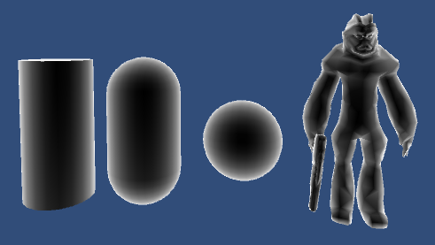

## RIM边缘光

​	


​	Rim边缘光：计算眼睛和模型顶点法线的点积，结果作为强度，和材质输出；顶点和法线平行时，强度最大，垂直时，强度最小。因此将他取反，即同一方向时，强度最小，垂直时，强度最大。公式如下：

```c
float rim= 1-dot(normalize(viewDirection),normalDirection);
```


具体源代码如下：

```c#
Shader "Unlit/RimLight"
{
	Properties{
		_SpecularGlass("SpecularGlassStrength", Range(0,64)) = 32
		_ObjColor("ObjColor", color) = (1,1,1,1)
		_RimColor("RimColor", color) = (1,1,1,1)
		_RimStrength("RimStrength", Range(0.0001,3.0))=0.1
	}
		SubShader
	{
		Tags{ "RenderType" = "Opaque" }
		LOD 100

		Pass
	{
		CGPROGRAM
		#pragma vertex vert
		#pragma fragment frag
		
		#include "UnityCG.cginc"
		#include "Lighting.cginc"

		struct appdata
	{
		float4 vertex : POSITION;
		float3 normal : NORMAL;
	};

	struct v2f
	{
		float3 worldNormal:NORMAL;
		float4 vertex : SV_POSITION;
		float3 worldPos : TEXCOORD1;
	};

	v2f vert(appdata_base v)
	{
		v2f o;
		o.vertex = UnityObjectToClipPos(v.vertex);
		o.worldNormal = mul(v.normal, (float3x3)unity_WorldToObject);
		o.worldPos = mul(unity_ObjectToWorld, v.vertex).xyz;
		return o;
	}

	float _SpecularGlass;
	fixed4 _ObjColor;

	fixed4 _RimColor;
	float _RimStrength;

	fixed4 frag(v2f i) : SV_Target
	{
		fixed3 worldNormal = normalize(i.worldNormal);

		fixed3 worldLightDir = normalize(_WorldSpaceLightPos0.xyz);

		fixed3 diffuse = max(0.0, dot(worldNormal, -worldLightDir));

		fixed3 diffuseColor = diffuse  * _LightColor0.xyz;

		//计算reflect方向
		fixed3 reflectDir = normalize(reflect(worldLightDir, worldNormal));
		//计算视角方向
		fixed3 viewDir = normalize(_WorldSpaceCameraPos.xyz - i.worldPos);
		//specular分量
		fixed3 specular = pow(max(0.0, dot(reflectDir, viewDir)), _SpecularGlass);

		fixed3 specularColor = specular * _LightColor0.xyz;

		//环境光
		fixed3 ambient = UNITY_LIGHTMODEL_AMBIENT.xyz * _ObjColor;

		//视角方向
		fixed3 worldViewDir = normalize(viewDir);
		//计算边缘光的强度
		float rim = 1 - max(0, dot(worldViewDir, worldNormal));
		//增强边缘光
		fixed3 rimColor = _RimColor * pow(rim, 1 / _RimStrength);

		//最后相加
		return fixed4(diffuseColor + specularColor + ambient + rimColor, 0);
	}

		ENDCG
	}
	}
}
```


​	可以看出边缘光是在普通的漫反射和高光反射的shader中添加了计算边缘光的代码，最后将边缘光加上其他的光照便得到效果。

​	**和菲涅尔效应原理一样**，菲涅尔效应公式如下：

```c
Fresnel Effect：
Out = pow((1.0 - saturate(dot(normalize(Normal), normalize(ViewDir)))), Power)
```


