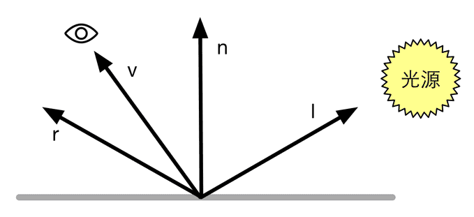

​	

## 关于shader中光照相加和相乘的理解

​	首先计算机图形学的一条原则是，如果它看上去是对的，那它就是对的。所以，对于一些计算模型来说，最重要的是最后拟合的效果。它不一定符合物理，但通常计算都以物理上的考虑为基础。

像素颜色和相关运算的理解：

​	我们常说某件物体是某种颜色的，仿佛颜色是物体的自有属性。其实这样的理解并不正确。颜色是物体反射的光进入眼睛以后给我们的一种感觉。也就是说，除了物体本身的属性，光照条件也是最终看到颜色的决定因素之一。我们说一张纸是白色的，其实是在说这张纸能反射所有的可见光。如果我们以单色光，比如红光照射它，我们看到这样纸就呈现出红色。因为输入的光只有红色，因此纸张也就只能反射红光。所以，如果单论颜色这一概念，应该是光的自有属性（取决于波长），而不是物体的属性。物体所谓的颜色，其实是它在反射过程中所表现出的特点。

​	由于人眼感光的特点，我们把红绿蓝作为颜色空间的三个分量，不同比例的红绿蓝光混合可以得到人眼对其它颜色的感觉。同时，在约定范围的前提下，分量的数值大小可以表示光的强度。基于这种颜色模型，如果有不同的几束光进入眼睛，我们可以认为等于三个分量叠加以后的光进入眼睛。实际上这也符合这样的直觉：越多的可见光照射物体，物体也就显得越亮。

​	所以，上面的讨论解释了颜色向量相加的含义。在许多光照模型中，某个点反射的光由好几部分组成：例如自发光，漫反射光，镜面高光，环境光。那么最后反射光给我们的颜色感觉，就是各组成部分光颜色相加以后的结果。总结起来，这样模拟的出发点是：

​	1.认为有三种基本颜色的光。人眼形成的颜色感觉来自于三种基本光不同比例不同强度的混合。

​	2.不同颜色的光互不干扰，各自线性叠加。

​	其实这样考虑很显然有很多与物理现实不符的地方。例如光的波长应当是连续取值的。一些混合光进入眼睛，在计算它们叠加以后的视觉效果上的贡献时，对波长积分，不同波长的光本身的贡献是不同的，应该有个经验系数。显然简化成三种波长的单色光然后线性叠加是简单的处理。

​	在光照模型中计算反射部分的时候，有所谓反射颜色的属性。比如计算漫反射部分，我们会定义一个材质的漫反射颜色属性。计算反射光颜色的时候，将漫反射颜色属性的分量和入射光对应分量相乘得到最后的结果。这个运算应当怎么理解？

​	首先我们注意到，反射部分是体现材质自有属性的环节。假设我们都用标准的白光照射，那么材质反射出来的光的颜色就可以作为它自身属性的表示。光经过材质反射，强度必然不会增加，因为部分光将被材质吸收。例如一个白光下呈现红色的材质，就吸收了红色以外的光。所以，材质的漫反射颜色不应该理解为与光的颜色等同的概念，它其实是各个分量的反射百分比。因此它的分量被规定在[0,1]范围内。例如我们定义一个材质的漫反射颜色是（0.8,0,0）意味着它反射80%的红色光，吸收了全部的绿光和蓝光。

**总结：光照相加，也就是说几种光之间没有必然的联系（例如环境光，反射光，自发光，高光反射等之间使用加法将这几种光结合起来），只是单纯的线性相加，增加光的rgb 每个分量的强度。**

**光的相乘，用于表示物体的属性，表示光照射到物体上进行反射或着其他的的行为，由于物体的自身属性不同，所以对光可能有吸收、削弱等等，所以光的相乘就是模拟这个种属性，光的相乘会导致光的强度变低。例如在计算环境光的时候会使用光来乘以albedo（物体漫反射的颜色），在计算高光和漫反射的时候，是使用入射光线来乘以高光颜色或者漫反射颜色的。**

# 光照模型

​	当已知光源位置和方向、视角方向时,我们就需要知道一个表面是如何和光照进行交互的。例如,当光线从某个方向照射到一个表面时,有多少光线被反射?反射的方向有哪些?而BRDF(Bidirectional Reflectance Distribution Function)就是用来回答这些问题的。当给定模型表面上的一个点时,BRDF包含了对该点外观的完整的描述。在图形学中,BRDF大多使用一个数学公式来表示,并且提供了一些参数来调整材质属性。通俗来讲,当给定入射光线的方向和辐照度后,BRDF可以给出在某个出射方向上的光照能量分布。本章涉及的BRDF都是对真实场景进行理想化和简化后的模型,也就是说,它们并不能真实地反映物体和光线之间的交互,这些光照模型被称为是经验模型。尽管如此,这些经验模型仍然在实时渲染领域被应用了多年。

## 兰伯特定律（漫反射）

​	漫反射光照符合兰伯特定律(Lambert’s law):反射光线的强度与表面法线和光源方向之间夹角的余弦值成正比。公式如下：

C表示入射光线，m表示漫反射颜色。

## 半兰伯特定律（漫反射）

​	我们使用的漫反射光照模型也被称为兰伯特光照模型，因为它符合兰伯特定律——在平面某点漫反射光的光强与该反射点的法向量和入射光角度的余弦值成正比。

​	兰伯特模型在光照无法到达的区域，模型的外观通常是全黑的，没有任何明暗变化，这会使模型的背光区域看起来就像一个平面一样，失去了模型细节表现。实际上我们可以通过添加环境光来得到非全黑的效果，但即便这样仍然无法解决背光面明暗一样的缺点。为此，有一种改善技术被提出来，这就是半兰伯特（Half Lambert）光照模型。Valve公司在开发游戏《半条命》时提出了一种技术，由于该技术是在原兰伯特光照模型的基础上进行了一个简单的修改，因此被称为半兰伯特光照模型。

广义的半兰伯特光照模型的公式如下：

可以看出，与原兰伯特模型相比，半兰伯特光照模型没有使用max操作来防止 **n 向量和 L 向量**的点积为负值，而是对其结果进行了一个α倍的缩放再加上一个β大小的偏移。绝大多数情况下，α和β的值均为0.5，即公式为：

​	通过这样的方式，我们可以把 **n向量 和 L 向量**的结果范围从[−1, 1]映射到[0, 1]范围内。也就是说，对于模型的背光面，在原兰伯特光照模型中点积结果将映射到同一个值，即0值处；而在半兰伯特模型中，背光面也可以有明暗变化，不同的点积结果会映射到不同的值上。

需要注意的是，半兰伯特是没有任何物理依据的，它仅仅是一个视觉加强技术。

## Phong模型（高光反射）

​	

​	这里的高光反射是一种经验模型,也就是说,它并不完全符合真实世界中的高光反射现象。它可用于计算那些沿着完全镜面反射方向被反射的光线,这可以让物体看起来是有光泽的,例如金属材质。公式如下：

mgloss是材质的光泽度（gloss），也被称为反光度（shininess）。它用于控制高光区域的“亮点”有多宽，mgloss越大，亮点就越小。mspecular是材质的高光反射颜色，它用于控制该材质对于高光反射的强度和颜色。clight则是光源的颜色和强度。

## Blinn-Phong光照模型（高光反射）

​			

​	虽然标准光照模型仅仅是一个经验模型，也就是说，它并不完全符合真实世界中的光照现象。但由于它的易用性、计算速度和得到的效果都比较好，因此仍然被广泛使用。而也是由于它的广泛使用性，这种标准光照模型有很多不同的叫法。例如，一些资料中称它为Phong光照模型，因为裴祥风（Bui Tuong Phong）首先提出了使用漫反射和高光反射的和来对反射光照进行建模的基本思想，并且提出了基于经验的计算高光反射的方法（用于计算漫反射光照的兰伯特模型在那时已经被提出了）。而后，由于Blinn的方法简化了计算而且在某些情况下计算更快，我们把这种模型称为Blinn-Phong光照模型。

​	但这种模型有很多局限性。首先，有很多重要的物理现象无法用Blinn-Phong模型表现出来，例如菲涅耳反射（Fresnel reflection）。其次，Blinn-Phong模型是各项同性（isotropic）的，也就是说，当我们固定视角和光源方向旋转这个表面时，反射不会发生任何改变。但有些表面是具有各向异性（anisotropic）反射性质的，例如拉丝金属、毛发。

​	Blinn-Phong模型是对Phong光照模型进行改进得到的光照模型，改变是定义一个新的向量h。并且让向量h=如下：

​	

其公式如下：

## 基于物理的渲染（PBS）