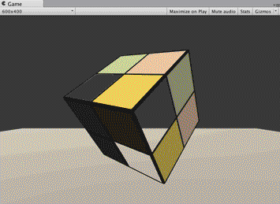
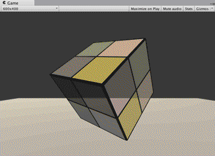

​	

## 简介

​	在实时渲染中要实现透明效果，通常会在渲染模型时控制它的透明通道（Alpha Channel）。当开启透明混合后，当一个物体被渲染到屏幕上时，每个片元除了颜色值和深度值之外，它还有另一个属性——透明度。当透明度为1时，表示该像素是完全不透明的，而当其为0时，则表示该像素完全不会显示。

​	在Unity中，我们通常使用两种方法来实现透明效果：第一种是使用透明度测试（Alpha Test），这种方法其实无法得到真正的半透明效果；另一种是透明度混合（Alpha Blending）。

​	在之前的学习中，我们从没有强调过渲染顺序的问题。也就是说，当场景中包含很多模型时，我们并没有考虑是先渲染A，再渲染B，最后再渲染C，还是按照其他的顺序来渲染。事实上，对于不透明（opaque）物体，不考虑它们的渲染顺序也能得到正确的排序效果，这是由于强大的深度缓冲（depth buffer，也被称为z-buffer）的存在。在实时渲染中，深度缓冲是用于解决可见性（visibility）问题的，它可以决定哪个物体的哪些部分会被渲染在前面，而哪些部分会被其他物体遮挡。它的基本思想是：根据深度缓存中的值来判断该片元距离摄像机的距离，当渲染一个片元时，需要把它的深度值和已经存在于深度缓冲中的值进行比较（如果开启了深度测试），如果它的值距离摄像机更远，那么说明这个片元不应该被渲染到屏幕上（有物体挡住了它）；否则，这个片元应该覆盖掉此时颜色缓冲中的像素值，并把它的深度值更新到深度缓冲中（如果开启了深度写入）。

​	使用深度缓冲，可以让我们不用关心不透明物体的渲染顺序，例如A挡住B，即便我们先渲染A再渲染B也不用担心B会遮盖掉A，因为在进行深度测试时会判断出B距离摄像机更远，也就不会写入到颜色缓冲中。但如果想要实现透明效果，事情就不那么简单了，这是因为，当使用透明度混合时，我们关闭了深度写入（ZWrite）。

​	简单来说，透明度测试和透明度混合的基本原理如下。

​	透明度测试：它采用一种“霸道极端”的机制，只要一个片元的透明度不满足条件（通常是小于某个阈值），那么它对应的片元就会被舍弃。被舍弃的片元将不会再进行任何处理，也不会对颜色缓冲产生任何影响；否则，就会按照普通的不透明物体的处理方式来处理它，即进行深度测试、深度写入等。也就是说，透明度测试是不需要关闭深度写入的，它和其他不透明物体最大的不同就是它会根据透明度来舍弃一些片元。虽然简单，但是它产生的效果也很极端，要么完全透明，即看不到，要么完全不透明，就像不透明物体那样。
​	透明度混合：这种方法可以得到真正的半透明效果。它会使用当前片元的透明度作为混合因子，与已经存储在颜色缓冲中的颜色值进行混合，得到新的颜色。但是，透明度混合需要关闭深度写入（我们下面会讲为什么需要关闭），这使得我们要非常小心物体的渲染顺序。需要注意的是，透明度混合只关闭了深度写入，但没有关闭深度测试。这意味着，当使用透明度混合渲染一个片元时，还是会比较它的深度值与当前深度缓冲中的深度值，如果它的深度值距离摄像机更远，那么就不会再进行混合操作。这一点决定了，当一个不透明物体出现在一个透明物体的前面，而我们先渲染了不透明物体，它仍然可以正常地遮挡住透明物体。也就是说，对于透明度混合来说，深度缓冲是只读的。


## Unity shader的渲染顺序

​	Unity为了解决渲染顺序的问题提供了**渲染队列（render queue）**这一解决方案。我们可以使用SubShader的Queue标签来决定我们的模型将归于哪个渲染队列。Unity在内部使用一系列整数索引来表示每个渲染队列，且索引号越小表示越早被渲染。在Unity 5中，Unity提前定义了5个渲染队列（与Unity 5之前的版本相比多了一个AlphaTest渲染队列），当然在每个队列中间我们可以使用其他队列。

|    名称     | 队列索引 |                             描述                             |
| :---------: | :------: | :----------------------------------------------------------: |
| Background  |   1000   | 这个渲染队列会在任何其他队列之前被渲染，我们通常使用该队列来渲染那些需要绘制在背景上的物体 |
|  Geometry   |   2000   | 默认的渲染队列，大多数物体都使用这个队列。不透明物体使用这个队列 |
|  AlphaTest  |   2450   | 需要透明度测试的物体使用这个队列。在Unity 5中它从Geometry队列中被单独分出来，这是因为在所有不透明物体渲染之后再渲染它们会更加高效 |
| Transparent |   3000   | 这个队列中的物体会在所有Geometry和AlphaTest物体渲染后，再按从后往前的顺序进行渲染。任何使用了透明度混合（例如关闭了深度写入的Shader）的物体都应该使用该队列 |
|   Overlay   |   4000   | 该队列用于实现一些叠加效果。任何需要在最后渲染的物体都应该使用该队列 |

​	其中，**ZWrite Off**用于关闭深度写入，在这里我们选择把它写在Pass中。我们也可以把它写在SubShader中，这意味着该SubShader下的所有Pass都会关闭深度写入。


## 透明度测试

​												

​	透明度测试：只要一个片元的透明度不满足条件（通常是小于某个阈值），那么它对应的片元就会被舍弃。被舍弃的片元将不会再进行任何处理，也不会对颜色缓冲产生任何影响；否则，就会按照普通的不透明物体的处理方式来处理它。

通常，我们会在片元着色器中使用clip函数来进行透明度测试。clip是Cg中的一个函数，它的定义如下。

函数：void clip(float4 x); void clip(float3 x); void clip(float2 x); void clip(float1 x); void clip(float x);

参数：裁剪时使用的标量或矢量条件。

描述：如果给定参数的任何一个分量是负数，就会舍弃当前像素的输出颜色。它等同于下面的代码：

```c#
void clip(float4 x)
{
    if (any(x < 0))
        discard;
}
```


示例代码：

```c#
Shader "Custom/AlphaTestShader"{

	Properties{
	
		_Color("Color",Color)=(1,1,1,1)
		_MainTex("MainTex",2D)="white"{}
		_Cutoff("Cutoff",Rnage(0,1))=0.5
	}
	
	SubShader{
		Tags{"Queue"="AlphaTest" "IgnoreProjector"="true" "RenderType"="TransparentCutout"}
		Pass{
			Tags{"LightModel"="ForwardBase"}
			
			CGPROGRAM
			
			#include "Lighting.cginc"
			
			#pragma vertex vert
			#pragma fragment frag
			
			fixed4 _Color;
			smapler2D _MainTex;
			float4 _MainTex_ST;
			fixed _Cutoff;
			
			struct a2v{
				float4 vertex:POSITION;
				float3 normal:NORMAL;
				float2 texcoord:TEXCOORD0;
			};
			
			struct v2f{
				float4 pos:SV_POSITION;
				float3 worldNormal:TEXCOORD0;
				float4 worldPps:TEXCOORD1;
				float2 uv:TEXCOORD2;
			};
			
			v2f vert(a2v v){
				v2f o;
				o.pos=mul(UNITY_MARTIX_MVP,v.vertex);
				o.worldNormal=UnityObjectToWorldNormal(v.normal);
				o.worldPos=mul(_Object2World,v.vertex);
				o.uv=TRANSFORM_TEX(v.texcoord,_MainTex);
				return o;
			}
			
			fixed4 frag(v2f i) : SV_Target{
				fixed3 worldNormalDir=nomalize(i.worldNomal);
				fixed3 worldLightDir=UnityWorldSpaceLightDir(i.worldPos);
				
				fixed4 texColor=tex2D(_MainTex,i.uv);
				clip(texColor.a - _Cutoff);
				
				fixed3 albedo = texColor.rgb * _Color.rgb;
				
				fixed3 ambient = UNITY_LIGHTMODEL_AMBIENT.xyz * albedo;
				
				fixed3 diffuse = _LightColor0 * albedo * (0.5 * dot(worldNormalDir,worldLightDir) + 0.5)
				
				fixed3 color=ambient + diffuse ;
				
				return fixed4(color,1);	
			}		
			ENDCG
		}
	}
	Fallback "Transparent/Cutout/VertexLit"
}
```

​	和之前使用的Diffuse和Specular不同，这次我们使用内置的Transparent/Cutout/VertexLit来作为回调Shader。这不仅能够保证在我们编写的SubShader无法在当前显卡上工作时可以有合适的代替Shader，还可以保证使用透明度测试的物体可以正确地向其他物体投射阴影


## 透明度混合

​																												

​	透明度混合的实现要比透明度测试复杂一些，这是因为我们在处理透明度测试时，实际上跟对待普通的不透明物体几乎是一样的，只是在片元着色器中增加了对透明度判断并裁剪片元的代码。而想要实现透明度混合就没有这么简单了。我们回顾之前提到的透明度混合的原理：

​	透明度混合：这种方法可以得到真正的半透明效果。它会使用当前片元的透明度作为混合因子，与已经存储在颜色缓冲中的颜色值进行混合，得到新的颜色。但是，透明度混合需要关闭深度写入，这使得我们要非常小心物体的渲染顺序。

​	为了进行混合，我们需要使用Unity提供的**混合命令——Blend**。Blend是Unity提供的**设置混合模式**的命令。想要实现半透明的效果就需要把当前自身的颜色和已经存在于颜色缓冲中的颜色值进行混合，混合时使用的函数就是由该指令决定的。

​	**这个命令在设置混合因子的同时也开启了混合模式。这是因为，只有开启了混合之后，设置片元的透明通道才有意义，而Unity在我们使用Blend命令的时候就自动帮我们打开了。**


|                       语义                       |                             描述                             |
| :----------------------------------------------: | :----------------------------------------------------------: |
|                    Blend Off                     |                           关闭混合                           |
|            Blend SrcFactor DstFactor             | 开启混合，并设置混合因子。源颜色（该片元产生的颜色）会乘以SrcFactor，而目标颜色（已经存在于颜色缓存的颜色）会乘以DstFactor，然后把两者相加后再存入颜色缓冲中 |
| Blend SrcFactor DstFactor, SrcFactorA DstFactorA |    和上面几乎一样，只是在混合透明通道的时候使用不同的因子    |
|              BlendOp BlendOperation              | 并非是把源颜色和目标颜色简单相加后混合，而是使用BlendOperation对它们进行其他操作 |


示例代码：


