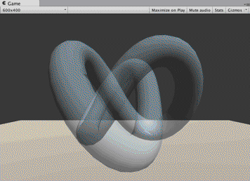
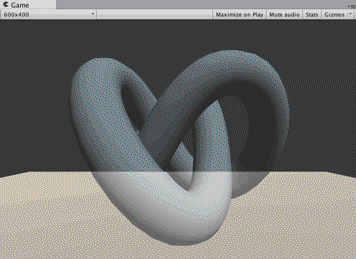
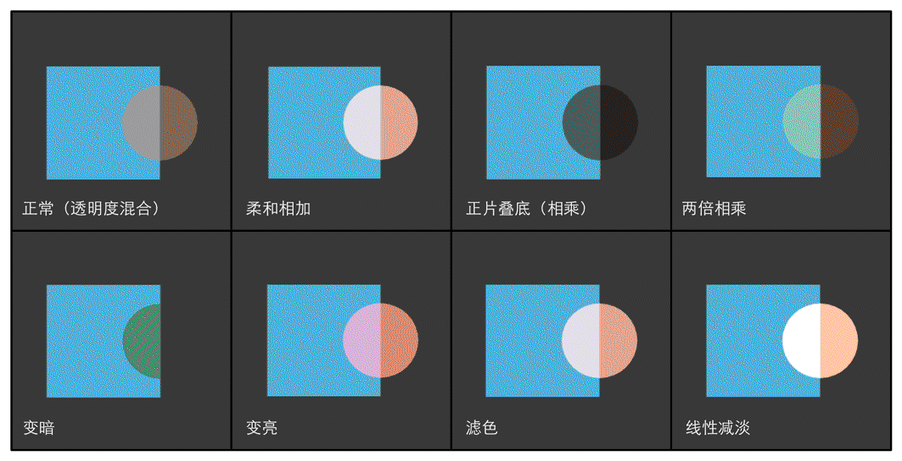

​	

## 简介

​	在实时渲染中要实现透明效果，通常会在渲染模型时控制它的透明通道（Alpha Channel）。当开启透明混合后，当一个物体被渲染到屏幕上时，每个片元除了颜色值和深度值之外，它还有另一个属性——透明度。当透明度为1时，表示该像素是完全不透明的，而当其为0时，则表示该像素完全不会显示。

​	在Unity中，我们通常使用两种方法来实现透明效果：第一种是使用透明度测试（Alpha Test），这种方法其实无法得到真正的半透明效果；另一种是透明度混合（Alpha Blending）。

​	在之前的学习中，我们从没有强调过渲染顺序的问题。也就是说，当场景中包含很多模型时，我们并没有考虑是先渲染A，再渲染B，最后再渲染C，还是按照其他的顺序来渲染。事实上，对于不透明（opaque）物体，不考虑它们的渲染顺序也能得到正确的排序效果，这是由于强大的深度缓冲（depth buffer，也被称为z-buffer）的存在。在实时渲染中，深度缓冲是用于解决可见性（visibility）问题的，它可以决定哪个物体的哪些部分会被渲染在前面，而哪些部分会被其他物体遮挡。它的基本思想是：根据深度缓存中的值来判断该片元距离摄像机的距离，当渲染一个片元时，需要把它的深度值和已经存在于深度缓冲中的值进行比较（如果开启了深度测试），如果它的值距离摄像机更远，那么说明这个片元不应该被渲染到屏幕上（有物体挡住了它）；否则，这个片元应该覆盖掉此时颜色缓冲中的像素值，并把它的深度值更新到深度缓冲中（如果开启了深度写入）。

​	使用深度缓冲，可以让我们不用关心不透明物体的渲染顺序，例如A挡住B，即便我们先渲染A再渲染B也不用担心B会遮盖掉A，因为在进行深度测试时会判断出B距离摄像机更远，也就不会写入到颜色缓冲中。但如果想要实现透明效果，事情就不那么简单了，这是因为，当使用透明度混合时，我们关闭了深度写入（ZWrite）。

​	简单来说，透明度测试和透明度混合的基本原理如下。

​	透明度测试：它采用一种“霸道极端”的机制，只要一个片元的透明度不满足条件（通常是小于某个阈值），那么它对应的片元就会被舍弃。被舍弃的片元将不会再进行任何处理，也不会对颜色缓冲产生任何影响；否则，就会按照普通的不透明物体的处理方式来处理它，即进行深度测试、深度写入等。也就是说，透明度测试是不需要关闭深度写入的，它和其他不透明物体最大的不同就是它会根据透明度来舍弃一些片元。虽然简单，但是它产生的效果也很极端，要么完全透明，即看不到，要么完全不透明，就像不透明物体那样。
​	透明度混合：这种方法可以得到真正的半透明效果。它会使用当前片元的透明度作为混合因子，与已经存储在颜色缓冲中的颜色值进行混合，得到新的颜色。但是，透明度混合需要关闭深度写入（我们下面会讲为什么需要关闭），这使得我们要非常小心物体的渲染顺序。需要注意的是，透明度混合只关闭了深度写入，但没有关闭深度测试。这意味着，当使用透明度混合渲染一个片元时，还是会比较它的深度值与当前深度缓冲中的深度值，如果它的深度值距离摄像机更远，那么就不会再进行混合操作。这一点决定了，当一个不透明物体出现在一个透明物体的前面，而我们先渲染了不透明物体，它仍然可以正常地遮挡住透明物体。也就是说，对于透明度混合来说，深度缓冲是只读的。


## Unity shader的渲染顺序

​	Unity为了解决渲染顺序的问题提供了**渲染队列（render queue）**这一解决方案。我们可以使用SubShader的Queue标签来决定我们的模型将归于哪个渲染队列。Unity在内部使用一系列整数索引来表示每个渲染队列，且索引号越小表示越早被渲染。在Unity 5中，Unity提前定义了5个渲染队列（与Unity 5之前的版本相比多了一个AlphaTest渲染队列），当然在每个队列中间我们可以使用其他队列。

|    名称     | 队列索引 |                             描述                             |
| :---------: | :------: | :----------------------------------------------------------: |
| Background  |   1000   | 这个渲染队列会在任何其他队列之前被渲染，我们通常使用该队列来渲染那些需要绘制在背景上的物体 |
|  Geometry   |   2000   | 默认的渲染队列，大多数物体都使用这个队列。不透明物体使用这个队列 |
|  AlphaTest  |   2450   | 需要透明度测试的物体使用这个队列。在Unity 5中它从Geometry队列中被单独分出来，这是因为在所有不透明物体渲染之后再渲染它们会更加高效 |
| Transparent |   3000   | 这个队列中的物体会在所有Geometry和AlphaTest物体渲染后，再按从后往前的顺序进行渲染。任何使用了透明度混合（例如关闭了深度写入的Shader）的物体都应该使用该队列 |
|   Overlay   |   4000   | 该队列用于实现一些叠加效果。任何需要在最后渲染的物体都应该使用该队列 |

​	其中，**ZWrite Off**用于关闭深度写入，在这里我们选择把它写在Pass中。我们也可以把它写在SubShader中，这意味着该SubShader下的所有Pass都会关闭深度写入。


## 透明度测试

​												

​	透明度测试：只要一个片元的透明度不满足条件（通常是小于某个阈值），那么它对应的片元就会被舍弃。被舍弃的片元将不会再进行任何处理，也不会对颜色缓冲产生任何影响；否则，就会按照普通的不透明物体的处理方式来处理它。

通常，我们会在片元着色器中使用clip函数来进行透明度测试。clip是Cg中的一个函数，它的定义如下。

函数：void clip(float4 x); void clip(float3 x); void clip(float2 x); void clip(float1 x); void clip(float x);

参数：裁剪时使用的标量或矢量条件。

描述：如果给定参数的任何一个分量是负数，就会舍弃当前像素的输出颜色。它等同于下面的代码：

```c#
void clip(float4 x)
{
    if (any(x < 0))
        discard;
}
```


示例代码：

```c#
Shader "Custom/AlphaTestShader"{

	Properties{
	
		_Color("Color",Color)=(1,1,1,1)
		_MainTex("MainTex",2D)="white"{}
		_Cutoff("Cutoff",Rnage(0,1))=0.5
	}
	
	SubShader{
		Tags{"Queue"="AlphaTest" "IgnoreProjector"="true" "RenderType"="TransparentCutout"}
		Pass{
			Tags{"LightModel"="ForwardBase"}
			
			CGPROGRAM
			
			#include "Lighting.cginc"
			
			#pragma vertex vert
			#pragma fragment frag
			
			fixed4 _Color;
			smapler2D _MainTex;
			float4 _MainTex_ST;
			fixed _Cutoff;
			
			struct a2v{
				float4 vertex:POSITION;
				float3 normal:NORMAL;
				float2 texcoord:TEXCOORD0;
			};
			
			struct v2f{
				float4 pos:SV_POSITION;
				float3 worldNormal:TEXCOORD0;
				float4 worldPps:TEXCOORD1;
				float2 uv:TEXCOORD2;
			};
			
			v2f vert(a2v v){
				v2f o;
				o.pos=mul(UNITY_MARTIX_MVP,v.vertex);
				o.worldNormal=UnityObjectToWorldNormal(v.normal);
				o.worldPos=mul(_Object2World,v.vertex);
				o.uv=TRANSFORM_TEX(v.texcoord,_MainTex);
				return o;
			}
			
			fixed4 frag(v2f i) : SV_Target{
				fixed3 worldNormalDir=nomalize(i.worldNomal);
				fixed3 worldLightDir=UnityWorldSpaceLightDir(i.worldPos);
				
				fixed4 texColor=tex2D(_MainTex,i.uv);
				clip(texColor.a - _Cutoff);
				
				fixed3 albedo = texColor.rgb * _Color.rgb;
				
				fixed3 ambient = UNITY_LIGHTMODEL_AMBIENT.xyz * albedo;
				
				fixed3 diffuse = _LightColor0 * albedo * (0.5 * dot(worldNormalDir,worldLightDir) + 0.5)
				
				fixed3 color=ambient + diffuse ;
				
				return fixed4(color,1);	
			}		
			ENDCG
		}
	}
	Fallback "Transparent/Cutout/VertexLit"
}
```

​	和之前使用的Diffuse和Specular不同，这次我们使用内置的Transparent/Cutout/VertexLit来作为回调Shader。这不仅能够保证在我们编写的SubShader无法在当前显卡上工作时可以有合适的代替Shader，还可以保证使用透明度测试的物体可以正确地向其他物体投射阴影


## 透明度混合

​																												

​	透明度混合的实现要比透明度测试复杂一些，这是因为我们在处理透明度测试时，实际上跟对待普通的不透明物体几乎是一样的，只是在片元着色器中增加了对透明度判断并裁剪片元的代码。而想要实现透明度混合就没有这么简单了。我们回顾之前提到的透明度混合的原理：

​	透明度混合：这种方法可以得到真正的半透明效果。它会使用当前片元的透明度作为混合因子，与已经存储在颜色缓冲中的颜色值进行混合，得到新的颜色。但是，透明度混合需要关闭深度写入，这使得我们要非常小心物体的渲染顺序。

​	为了进行混合，我们需要使用Unity提供的**混合命令——Blend**。Blend是Unity提供的**设置混合模式**的命令。想要实现半透明的效果就需要把当前自身的颜色和已经存在于颜色缓冲中的颜色值进行混合，混合时使用的函数就是由该指令决定的。

​	**这个命令在设置混合因子的同时也开启了混合模式。这是因为，只有开启了混合之后，设置片元的透明通道才有意义，而Unity在我们使用Blend命令的时候就自动帮我们打开了。**


|                       语义                       |                             描述                             |
| :----------------------------------------------: | :----------------------------------------------------------: |
|                    Blend Off                     |                           关闭混合                           |
|            Blend SrcFactor DstFactor             | 开启混合，并设置混合因子。源颜色（该片元产生的颜色）会乘以SrcFactor，而目标颜色（已经存在于颜色缓存的颜色）会乘以DstFactor，然后把两者相加后再存入颜色缓冲中 |
| Blend SrcFactor DstFactor, SrcFactorA DstFactorA |    和上面几乎一样，只是在混合透明通道的时候使用不同的因子    |
|              BlendOp BlendOperation              | 并非是把源颜色和目标颜色简单相加后混合，而是使用BlendOperation对它们进行其他操作 |


示例代码：

```c#
Shader "Custom/AlphaBlendShader"{
	Properties{
		_Color("Color",Color)=(1,1,1,1)
		_MainTex("MainTex",2D)="white"{}
		_AlphaScale("AlphaScale",Range(0,1))=1
	}
	
	SubShader{
		Tags{"Queue"="Transparent" "IgnoreProjector"="True" "RenderType"="Transparent"}
		Pass{
			Tags{"LightMode"="ForwardBase"}
			CGPROGRAM
			
			#include "Lighting.cginc"
			#include "UnityCG.cginc"
			#pragma vertexr vert 
			#pragma fragment frag
			
			ZWrite off
			Blend SrcAlpha OneMinusSrcAlpha
			
			fixed4 _Color;
			sampler2D _MainTex;
			float4 _MainTex_ST;
			fixed4 AlphaScale;
			
			struct a2v{
				float4 vertex : POSITION;
				float3 normal:NORMAL;
				float2 texcoord:TEXCOORD0;
			};
			
			struct v2f{
				float4 pos:SV_POSITION;
				float3 worldNormal:TEXCOORD0;
				float3 worldLightDir:TEXCOORD1;
				float2 uv:TEXCOORD2;
			};
			
			v2f vert(a2v v){
				v2f o;
				o.pos=mul(UNITY_MARTIX_MVP,v.vertex);
				o.worldNormal=UnityObjectToWorldNormal(v.normal);
				o.worldLightDir=WorldSpaceLightDir(v.vertex);
				o.uv=TRANSFORM_TEX(v.texcoord,_MainTex);
				return o;
			}		
			fixed4 frag(v2f i):SV_Target{
				i.worldNormal=normalize(i.worldNormal);
				i.worldLightDir=normalize(i.worldLightDir);			
				fixed4 texColor=tex2D(_MainTex,i.uv);			
				fixed3 albedo=texColor.rgb * _Color.rgb;
				fixed3 ambient = UNITY_LIGHTMODEL_AMBIENT.xyz * albedo;
				fixed3 diffuse = _LightColor.rgb * albedo * saturate(dot(worldNormal,worldLightDir));
				fixed3 color = ambient + diffuse;
				return fixed4(color,texColor.a * _AlphaScale);	
			}			
			ENDCG
		}
	}
	Fallback "Transparent/VertexLit"
}
```


在关闭了深度写入之后的透明混合可能会出现一些错误，**当模型网格之间有互相交叉的结构时，往往会得到错误的半透明效果**：




## 开启深度写入的半透明效果

​	由于透明混合关闭了深度写入，从而造成的错误排序的情况。一**种解决方法是使用两个Pass来渲染模型：第一个Pass开启深度写入，但不输出颜色，它的目的仅仅是为了把该模型的深度值写入深度缓冲中；第二个Pass进行正常的透明度混合，由于上一个Pass已经得到了逐像素的正确的深度信息，该Pass就可以按照像素级别的深度排序结果进行透明渲染。**但这种方法的缺点在于，多使用一个Pass会对性能造成一定的影响。可以看出，使用这种方法，我们仍然可以实现模型与它后面的背景混合的效果，但模型内部之间不会有任何真正的半透明效果。



示例代码:

```c#
Shader "Custom/AlphaBlendZWriteOn"{
	Properties{
		_Color("Color",Color)=(1,1,1,1)
		_MainTex("MainTex",2D)="white"{}
		_AlphaScale("Alpha",Range(0,1))=1
	}
	
	SubShader{
		Tags{"Queue"="Transparent" "IgnoreProjector"="True" "RenderType"="Transparent"}
		Pass{
			ZWrite On
			ColorMask 0
		}
		
		Pass{
			Tags{"LightMode"="ForwardBase"}
			CGPROGRAM
			#pragma vertex vert
			#pragma fragment frag
			#include "Lighting.cginc"
			#include "UnityCG.cginc"
			
			fixed4 _Color;
			sampler2D _MainTex;
			float4 _MainTex_ST;
			fixed _AlphaScale;
			
			struct a2v{
				float4 vertex:POSITION;
				float3 normal:NORMAL;
				float2 texcoord:TEXCOORD0;
			};
			
			struct v2f{
				float4 pos:SV_POSITIION;
				float3 worldPos:TEXCOORD0;
				float2 uv:TEXCOORD1;
				float3 worldNormal:TEXCOORD2;
			};
			
			v2f vert(a2v v){
				v2f o;
				o.pos=mul(UNITY_MARTIX_MVP,v.vertex);
				o.worldPos=mul(_Object2World,v.vertex);
				o.uv=TRANSFORM_TEX(v.texcoord,_MainTex);
				o.worldNormal=UnityObjectToWorldNormal(v.normal);
				return o;
			}
			
			fixed4 frag(v2f i):SV_Target{
				fixed3 worldNormal=normalize(i.worldNormal);
				fixed3 worldLightDir=normalize(UnityWorldSpaceLightDir(i.worldPos));
				fixed3 albedo = tex2D(_MainTex,i.uv).rgb * _Color.rgb;				
				fixed3 ambient = UNITY_LIGHTMODEL_AMBIENT.xyz * albedo;			
				fixed3 diffuse = _LightColor.rgb * albedo * (0.5 * dot(worldNormal,worldLightDir) + 0.5);
				return fixed4(ambient + diffuse,texColor.a * AlphaScale);
			}	
			ENDCG
		}		
	}
	Fallback "Transparent/VertexLit"
}
```

​	新添加的Pass的目的仅仅是为了把模型的深度信息写入深度缓冲中，从而剔除模型中被自身遮挡的片元。因此，Pass的第一行开启了深度写入。在第二行，我们使用了一个新的渲染命令——ColorMask。在ShaderLab中，ColorMask用于设置颜色通道的写掩码（write mask）。它的语义如下：

```c#
ColorMask RGB | A | 0 | 其他任何R、G、B、A的组合
```


## ShaderLab的混合命令

​	我们首先来看一下混合是如何实现的。当片元着色器产生一个颜色的时候，可以选择与颜色缓存中的颜色进行混合。这样一来，混合就和两个操作数有关：**源颜色（source color）和目标颜色（destination color）**。源颜色，我们用S表示，指的是由片元着色器产生的颜色值；目标颜色，我们用D表示，指的是从颜色缓冲中读取到的颜色值。对它们进行混合后得到的输出颜色，我们用O表示，它会重新写入到颜色缓冲中。需要注意的是，当我们谈及混合中的源颜色、目标颜色和输出颜色时，它们都包含了RGBA四个通道的值，而并非仅仅是RGB通道。

​	想要使用混合，我们必须首先开启它。在Unity中，当我们使用Blend（Blend Off命令除外）命令时，除了设置混合状态外也开启了混合。但是，在其他图形API中我们是需要手动开启的。例如在OpenGL中，我们需要使用glEnable(GL_BLEND)来开启混合。但在Unity中，它已经在背后为我们做了这些工作。


#### 混合等式和参数

​	混合是一个逐片元的操作，而且它不是可编程的，但却是高度可配置的。也就是说，我们可以设置混合时使用的运算操作、混合因子等来影响混合。那么，这些配置又是如何实现的呢？

​	现在，我们已知两个操作数：源颜色S和目标颜色D，想要得到输出颜色O就必须使用一个等式来计算。我们把这个等式称为混合等式（blend equation）。当进行混合时，我们需要使用两个混合等式：一个用于混合RGB通道，一个用于混合A通道。当设置混合状态时，我们实际上设置的就是混合等式中的操作和因子。**在默认情况下，混合等式使用的操作都是加操作（我们也可以使用其他操作）**，我们只需要再设置一下混合因子即可。由于需要两个等式（分别用于混合RGB通道和A通道），每个等式有两个因子（一个用于和源颜色相乘，一个用于和目标颜色相乘），因此一共需要4个因子。下表给出了ShaderLab中设置混合因子的命令。

|                       命令                       |                             描述                             |
| :----------------------------------------------: | :----------------------------------------------------------: |
|            Blend SrcFactor DstFactor             | 开启混合，并设置混合因子。源颜色（该片元产生的颜色）会乘以SrcFactor，而目标颜色（已经存在于颜色缓存的颜色）会乘以DstFactor，然后把两者相加后再存入颜色缓冲中 |
| Blend SrcFactor DstFactor, SrcFactorA DstFactorA |       和上面几乎一样，只是使用不同的因子来混合透明通道       |

​	可以发现，第一个命令只提供了两个因子，这意味着将使用同样的混合因子来混合RGB通道和A通道，即此时SrcFactorA将等于SrcFactor，DstFactorA将等于DstFactor。下面就是使用这些因子进行加法混合时使用的混合公式：

O.rgb = SrcFactor *  S.rgb + DstFactor * D.rgb;

O.a = SrcFactorA * S.a + DstFactorA * D.a;


#### ShaderLab中的混合因子

 shaderlab 中支持的几种混合因子如下表：

|       参数       |                             描述                             |
| :--------------: | :----------------------------------------------------------: |
|       One        |                           因子为1                            |
|       Zero       |                           因子为0                            |
|     SrcColor     | 因子为源颜色值。当用于混合RGB的混合等式时，使用SrcColor的RGB分量作为混合因子；当用于混合A的混合等式时，使用SrcColor的A分量作为混合因子 |
|     SrcAlpha     |               因子为源颜色的透明度值（A通道）                |
|     DstColor     | 因子为目标颜色值。当用于混合RGB通道的混合等式时，使用DstColor的RGB分量作为混合因子；当用于混合A通道的混合等式时，使用DstColor的A分量作为混合因子。 |
|     DstAlpha     |              因子为目标颜色的透明度值（A通道）               |
| OneMinusSrcColor | 因子为(1-源颜色)。当用于混合RGB的混合等式时，使用结果的RGB分量作为混合因子；当用于混合A的混合等式时，使用结果的A分量作为混合因子 |
| OneMinusSrcAlpha |                  因子为(1-源颜色的透明度值)                  |
| OneMinusDstColor | 因子为(1-目标颜色)。当用于混合RGB的混合等式时，使用结果的RGB分量作为混合因子；当用于混合A的混合等式时，使用结果的A分量作为混合因子 |
| OneMinusDstAlpha |                 因子为(1-目标颜色的透明度值)                 |

​	使用上面的指令进行设置时，RGB通道的混合因子和A通道的混合因子都是一样的，有时我们希望可以使用不同的参数混合A通道，这时就可以利用Blend SrcFactor DstFactor, SrcFactorA DstFactorA指令。例如，如果我们想要在混合后，输出颜色的透明度值就是源颜色的透明度，可以使用下面的命令：

```c#
Blend SrcAlpha OneMinusSrcAlpha, One Zero
```


#### 混合操作

​	在上面涉及的混合等式中，当把源颜色和目标颜色与它们对应的混合因子相乘后，我们都是把它们的结果加起来作为输出颜色的。那么可不可以选择不使用加法，而使用减法呢？答案是肯定的，我们可以使用ShaderLab的**BlendOp BlendOperation**命令，即混合操作命令。下表给出了ShaderLab中支持的混合操作

|     操作     |                             描述                             |
| :----------: | :----------------------------------------------------------: |
|     add      | 将混合后的源颜色和目标颜色相加。默认的混合操作。使用的混合等式是：<br />O.rgb = SrcFactor *  S.rgb + DstFactor * D.rgb<br />O.a = SrcFactorA * S.a + DstFactorA * D.a; |
|     sub      | 用混合后的源颜色减去混合后的目标颜色。使用的混合等式是：<br />O.rgb = SrcFactor *  S.rgb - DstFactor * D.rgb<br />O.a = SrcFactorA * S.a - DstFactorA * D.a; |
|    RevSub    | 用混合后的目标颜色减去混合后的源颜色。使用的混合等式是：<br />O.rgb = DstFactor * D.rgb - SrcFactor *  S.rgb<br />O.a = DstFactorA * D.a - SrcFactorA * S.a; |
|     Min      | 使用源颜色和目标颜色中较小的值，是逐分量比较的。使用的混合等式是：<br />O.rgba= ( min( S.r , D.r ) , min( S.g , D.g ) , min( S.b , D.b ) , min( S.a , D.a)) |
|     Max      | 使用源颜色和目标颜色中较大的值，是逐分量比较的。使用的混合等式是：<br />O.rgba= ( max( S.r , D.r ) , max( S.g , D.g ) , max( S.b , D.b ) , max( S.a , D.a)) |
| 其他逻辑操作 |                    仅在DirectX 11.1中支持                    |

​	混合操作命令通常是与混合因子命令一起工作的。但需要注意的是，当使用Min或Max混合操作时，混合因子实际上是不起任何作用的，它们仅会判断原始的源颜色和目的颜色之间的比较结果。


#### 常见的混合类型

通过混合操作和混合因子命令的组合，我们可以得到一些类似Photoshop混合模式中的混合效果：

```c#
// 正常（Normal），即透明度混合
Blend SrcAlpha OneMinusSrcAlpha

// 柔和相加（Soft Additive）
Blend OneMinusDstColor One

// 正片叠底（Multiply），即相乘
Blend DstColor Zero

// 两倍相乘（2x Multiply）
Blend DstColor SrcColor

// 变暗（Darken）
BlendOp Min
Blend One One

// 变亮（Lighten）
BlendOp Max
Blend One One

// 滤色（Screen）
Blend OneMinusDstColor One
// 等同于
Blend One OneMinusSrcColor

// 线性减淡（Linear Dodge）
Blend One One
```



​	需要注意的是，**虽然上面使用Min和Max混合操作时仍然设置了混合因子，但实际上它们并不会对结果有任何影响，因为Min和Max混合操作会忽略混合因子**。另一点是，虽然上面有些混合模式并没有设置混合操作的种类，但是它们默认就是使用加法操作，相当于设置了BlendOp Add。


## 双面渲染的透明效果

​	在现实生活中，如果一个物体是透明的，意味着我们不仅可以透过它看到其他物体的样子，也可以看到它内部的结构。但在前面实现的透明效果中，无论是透明度测试还是透明度混合，我们都无法观察到正方体内部及其背面的形状，导致物体看起来就好像只有半个一样。这是因为，默认情况下渲染引擎剔除了物体背面（相对于摄像机的方向）的渲染图元，而只渲染了物体的正面。如果我们想要得到双面渲染的效果，可以使用Cull指令来控制需要剔除哪个面的渲染图元。在Unity中，Cull指令的语法如下：

```c#
Cull Back | Front | Off
```

​	如果设置为Back，那么那些背对着摄像机的渲染图元就不会被渲染，这也是默认情况下的剔除状态；如果设置为Front，那么那些朝向摄像机的渲染图元就不会被渲染；如果设置为Off，就会关闭剔除功能，那么所有的渲染图元都会被渲染，但由于这时需要渲染的图元数目会成倍增加，因此除非是用于特殊效果，例如这里的双面渲染的透明效果，通常情况是不会关闭剔除功能的。


#### 透明度测试的双面渲染

​	如何让使用了透明度测试的物体实现双面渲染的效果。这非常简单，只需要在Pass的渲染设置中使用Cull指令来关闭剔除即可。


#### 透明度混合的双面渲染

​	和透明度测试相比，想要让透明度混合实现双面渲染会更复杂一些，这是因为透明度混合需要关闭深度写入，而这是“一切混乱的开端”。我们知道，想要得到正确的透明效果，渲染顺序是非常重要的——我们想要保证图元是从后往前渲染的。对于透明度测试来说，由于我们没有关闭深度写入，因此可以利用深度缓冲按逐像素的粒度进行深度排序，从而保证渲染的正确性。然而一旦关闭了深度写入，我们就需要小心地控制渲染顺序来得到正确的深度关系。如果我们仍然采用直接关闭剔除功能的方法，那么我们就无法保证同一个物体的正面和背面图元的渲染顺序，就有可能得到错误的半透明效果。

​	为此，我们选择把双面渲染的工作分成两个Pass——第一个Pass只渲染背面，第二个Pass只渲染正面，由于Unity会顺序执行SubShader中的各个Pass，因此我们可以保证背面总是在正面被渲染之前渲染，从而可以保证正确的深度渲染关系。

**（1）复制原Pass的代码，得到另一个Pass。**

**（2）在两个Pass中分别使用Cull指令剔除不同朝向的渲染图元：第一个Pass 使用Cull Back，第二个Pass使用Cull Front**

