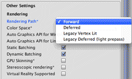
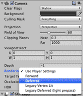
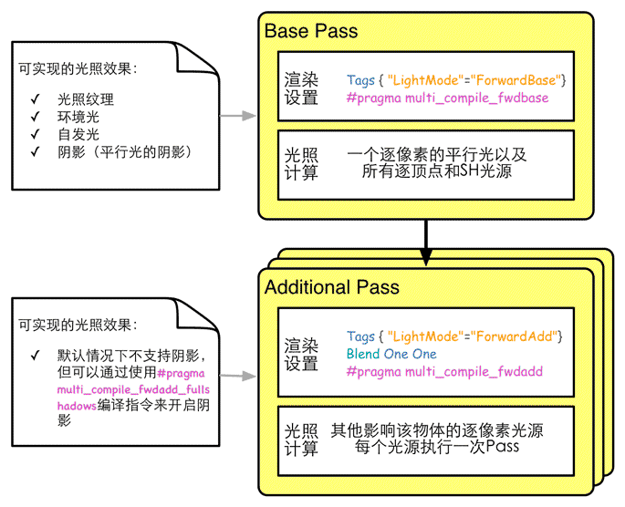

## Unity的渲染路径

​	在Unity里，渲染路径（Rendering Path）决定了光照是如何应用到Unity Shader中的。因此，如果要和光源打交道，我们需要为每个Pass指定它使用的渲染路径，只有这样才能让Unity知道，“哦，原来这个程序员想要这种渲染路径，那么好的，我把光源和处理后的光照信息都放在这些数据里，你可以访问啦！”也就是说，我们只有为Shader正确地选择和设置了需要的渲染路径，该Shader的光照计算才能被正确执行。

Unity支持多种类型的渲染路径。在Unity 5.0版本之前，主要有3种：**前向渲染路径（Forward Rendering Path）、延迟渲染路径（Deferred Rendering Path）和顶点照明渲染路径（Vertex Lit Rendering Path）。**但在Unity 5.0版本以后，Unity做了很多更改，主要有两个变化：首先，顶点照明渲染路径已经被Unity抛弃（但目前仍然可以对之前使用了顶点照明渲染路径的Unity Shader兼容）；其次，新的延迟渲染路径代替了原来的延迟渲染路径（同样，目前也提供了对较旧版本的兼容）。

​	大多数情况下，一个项目只使用一种渲染路径，因此我们可以为整个项目设置渲染时的渲染路径。我们可以通过在Unity的Edit → Project Settings → Player → Other Settings → Rendering Path中选择项目所需的渲染路径。默认情况下，该设置选择的是前向渲染路径，



​	但有时，我们希望可以使用多个渲染路径，例如摄像机A渲染的物体使用前向渲染路径，而摄像机B渲染的物体使用延迟渲染路径。这时，我们可以在每个摄像机的渲染路径设置中设置该摄像机使用的渲染路径，以覆盖Project Settings中的设置，



​	在上面的设置中，如果选择了Use Player Settings，那么这个摄像机会使用Project Settings中的设置；否则就会覆盖掉Project Settings中的设置。需要注意的是，如果当前的显卡并不支持所选择的渲染路径，Unity会自动使用更低一级的渲染路径。例如，如果一个GPU不支持延迟渲染，那么Unity就会使用前向渲染。

​	**完成了上面的设置后，我们就可以在每个Pass中使用标签来指定该Pass使用的渲染路径。这是通过设置Pass的LightMode标签实现的。不同类型的渲染路径可能会包含多种标签设置。例如，我们之前在代码中写的：**

```c#
Pass {
    Tags { "LightMode" = "ForwardBase" }
```

​	上面的代码将告诉Unity，该Pass使用前向渲染路径中的ForwardBase路径。而前向渲染路径还有一种路径叫做ForwardAdd。下表给出了Pass的**LightMode**标签支持的渲染路径设置选项。

​																	LightMode标签支持的渲染路径2020-01-15-unity-rendering-path.md

|             标签名             |                             描述                             |
| :----------------------------: | :----------------------------------------------------------: |
|             Always             | 不管使用哪种渲染路径，该Pass总是会被渲染，但不会计算任何光照 |
|          ForwardBase           | 用于前向渲染。该Pass会计算环境光、最重要的平行光、逐顶点/SH光源和Lightmaps |
|           ForwardAdd           | 用于前向渲染。该Pass会计算额外的逐像素光源，每个Pass对应一个光源 |
|            Deferred            |         用于延迟渲染。该Pass会渲染G缓冲（G-buffer）          |
|          ShadowCaster          | 把物体的深度信息渲染到阴影映射纹理（shadowmap）或一张深度纹理中 |
|          PrepassBase           |   用于遗留的延迟渲染。该Pass会渲染法线和高光反射的指数部分   |
|          PrepassFinal          | 用于遗留的延迟渲染。该Pass通过合并纹理、光照和自发光来渲染得到最后的颜色 |
| Vertex、VertexLMRGBM和VertexLM |                    用于遗留的顶点照明渲染                    |

​	那么指定渲染路径到底有什么用呢？如果一个Pass没有指定任何渲染路径会有什么问题吗？**通俗来讲，指定渲染路径是我们和Unity的底层渲染引擎的一次重要的沟通。**例如，如果我们为一个Pass设置了前向渲染路径的标签，相当于会告诉Unity：“嘿，我准备使用前向渲染了，你把那些光照属性都按前向渲染的流程给我准备好，我一会儿要用！”随后，我们可以通过Unity提供的内置光照变量来访问这些属性。如果我们没有指定任何渲染路径（实际上，在Unity 5.x版本中如果使用了前向渲染又没有为Pass指定任何前向渲染适合的标签，就会被当成一个和顶点照明渲染路径等同的Pass），那么一些光照变量很可能不会被正确赋值，我们计算出的效果也就很有可能是错误的。


## 前向渲染路径（Forward Rendering path）

#### 1、前向渲染路径的原理

​	每进行一次完整的前向渲染，我们需要渲染该对象的渲染图元，并计算两个缓冲区的信息：一个是颜色缓冲区，一个是深度缓冲区。我们利用深度缓冲来决定一个片元是否可见，如果可见就更新颜色缓冲区中的颜色值。我们可以用下面的伪代码来描述前向渲染路径的大致过程：

```c#
Pass {
    for (each primitive in this model) {//primitive(原始的，远古的；简单的，粗糙的)
        for (each fragment covered by this primitive) {
            if (failed in depth test) {
                // 如果没有通过深度测试，说明该片元是不可见的
                discard;
            } else {
                // 如果该片元可见
                // 就进行光照计算
                float4 color = Shading(materialInfo, pos, normal, lightDir, viewDir);
                // 更新帧缓冲
                writeFrameBuffer(fragment, color);
            }
        }
    }
}
```

​	对于每个逐像素光源，我们都需要进行上面一次完整的渲染流程。如果一个物体在多个逐像素光源的影响区域内，那么该物体就需要执行多个Pass，每个Pass计算一个逐像素光源的光照结果，然后在帧缓冲中把这些光照结果混合起来得到最终的颜色值。假设，场景中有N个物体，每个物体受M个光源的影响，那么要渲染整个场景一共需要N*M个Pass。可以看出，如果有大量逐像素光照，那么需要执行的Pass数目也会很大。因此，渲染引擎通常会限制每个物体的逐像素光照的数目。


### unity中的前向渲染

​	事实上，一个Pass不仅仅可以用来计算逐像素光照，它也可以用来计算逐顶点等其他光照。这取决于光照计算所处流水线阶段以及计算时使用的数学模型。当我们渲染一个物体时，Unity会计算哪些光源照亮了它，以及这些光源照亮该物体的方式。

​	在Unity中，前向渲染路径有3种处理光照（即照亮物体）的方式：**逐顶点处理、逐像素处理，球谐函数（Spherical Harmonics，SH）处理**。而决定一个光源使用哪种处理模式取决于它的类型和渲染模式。光源类型指的是该光源是平行光还是其他类型的光源，而光源的渲染模式指的是该光源是否是重要的（Important）。如果我们把一个光照的模式设置为Important，意味着我们告诉Unity，“嘿老兄，这个光源很重要，我希望你可以认真对待它，把它当成一个逐像素光源来处理！”我们可以在光源的Light组件中设置这些属性

- Render Mode 设置为 **Not Important** 的光源始终为逐顶点或 SH 光源。
- 最亮的平行光始终为逐像素光源。
- Render Mode 设置为 **Important** 的光源始终为逐像素光源。
- 如果上述情况导致光源数少于当前的 Pixel Light Count 质量设置，则按照亮度降低的顺序，更多光源采用逐像素渲染方式。


前向渲染中一共有两种pass，一种是ForwardBase（Base Pass），一种是ForwardAdd（Additional Pass）。



根据上图所示，**每个对象的渲染按如下方式进行**：

- **Base Pass应用一个逐像素方向光（最亮的平行光--个人理解）和所有逐顶点/SH 光源。**
- **其他逐像素光源在Additional Pass中渲染（每个光源对应一个通道）。**

**总结：就是在所有影响该物体的光照中，只有一个逐像素的平行光和其他所有的逐顶点/SH光源会调用Base Pass来进行渲染，并且Base Pass只调用一次，一个逐像素的平行光和其他所有的逐顶点/SH光源的光照计算都会在这一次Base Pass调用中计算完成。剩下的光源中的逐像素光照都会调用Additional Pass来进行渲染，每一个光源都调用一次。**


​	针对上图，还有几点需要说明的地方：

- 首先，可以发现在渲染设置中，我们除了设置了Pass的标签外，**还使用了#pragma multi_compile_fwdbase这样的编译指令**。根据官方文档中的相关解释，我们可以知道，这些编译指令会保证Unity可以为相应类型的Pass生成所有需要的Shader变种，这些变种会处理不同条件下的渲染逻辑，例如是否使用光照贴图、当前处理哪种光源类型、是否开启了阴影等，同时Unity也会在背后声明相关的内置变量并传递到Shader中。**通俗来讲，只有分别为Base Pass和Additional Pass使用这两个编译指令，我们才可以在相关的Pass中得到一些正确的光照变量，例如光照衰减值等。**
- Base Pass旁边的注释给出了Base Pass中支持的一些光照特性。例如在Base Pass中，我们可以访问光照纹理（lightmap）、访问环境光、自发光和阴影（平行光的阴影）。
- **Base Pass中渲染的平行光默认是支持阴影的（如果开启了光源的阴影功能）**，**而Additional Pass中渲染的光源在默认情况下是没有阴影效果的，即便我们在它的Light组件中设置了有阴影的Shadow Type**。但我们可以在Additional Pass中使用 #pragma multicompile fwdadd_fullshadows代替#pragma multi_compile_fwdadd编译指令，为点光源和聚光灯开启阴影效果，但这需要Unity在内部使用更多的Shader变种。
- **环境光和自发光也是在Base Pass中计算的**。这是因为，对于一个物体来说，环境光和自发光我们只希望计算一次即可，而如果我们在Additional Pass中计算这两种光照，就会造成叠加多次环境光和自发光，这不是我们想要的。
- **在Additional Pass的渲染设置中，我们还开启和设置了混合模式**。这是因为，我们希望每个Additional Pass可以与上一次的光照结果在帧缓存中进行叠加，从而得到最终的有多个光照的渲染效果。如果我们没有开启和设置混合模式，那么Additional Pass的渲染结果会覆盖掉之前的渲染结果，看起来就好像该物体只受该光源的影响。**通常情况下，我们选择的混合模式是Blend One One。**
- 对于前向渲染来说，**一个Unity Shader通常会定义一个Base Pass（Base Pass也可以定义多次，例如需要双面渲染等情况）以及一个Additional Pass。一个Base Pass仅会执行一次（定义了多个Base Pass的情况除外）**，而一个Additional Pass会根据影响该物体的其他逐像素光源的数目被多次调用，即每个逐像素光源会执行一次Additional Pass。


**注意：上图给出的光照计算是通常情况下我们在每种Pass中进行的计算。实际上，渲染路径的设置用于告诉Unity该Pass在前向渲染路径中的位置，然后底层的渲染引擎会进行相关计算并填充一些内置变量（如_LightColor0等），如何使用这些内置变量进行计算完全取决于开发者的选择。例如，我们完全可以利用Unity提供的内置变量在Base Pass中只进行逐顶点光照；同样，我们也完全可以在Additional Pass中按逐顶点的方式进行光照计算，不进行任何逐像素光照计算。**


## 性能注意事项

球谐函数光源的渲染速度很快。这些光源的 CPU 成本很低，并且使用 GPU 的_成本基本为零_（也就是说，基础通道始终会计算 SH 光照；但由于 SH 光源工作方式的原因，无论 SH 光源有多少，成本都完全相同）。

SH 光源的缺点：

- 按对象的顶点而不是按像素计算。这意味着它们不支持光照剪影和法线贴图。
- SH 光照的频率很低。SH 光源无法实现快速的光照过渡。它们也只影响漫射光照（频率对镜面高光而言太低）。
- SH 光照不是局部光照；SH 点光源或聚光灯在靠近某种表面时“看起是错误的”。

总的来说，SH 光源通常足以达到小型动态对象的光照要求。


## 前向渲染中内置函数和变量

​	根据我们使用的渲染路径（即Pass标签中LightMode的值），Unity会把不同的光照变量传递给Shader。下表给出了前向渲染（LightMode为ForwardBase或者ForwardAdd）中可以使用的内置变量和内置函。

​																前向渲染中可使用的内置变量

|                          名称                           |   类型   |                             描述                             |
| :-----------------------------------------------------: | :------: | :----------------------------------------------------------: |
|                      _LightColor0                       |  float4  | 该Pass处理的逐像素光源的颜色（已经是颜色和强度相乘的结果了） |
|                  _WorldSpaceLightPos0                   |  float4  | _ WorldSpaceLightPos0.xyz是该Pass处理的逐像素光源的位置。如果该光源是平行光，那么_WorldSpaceLightPos0.w是0，其他光源类型w值为1 |
|                      _LightMatrix0                      | float4x4 | 从世界空间到光源空间的变换矩阵。可以用于采样cookie和光强衰减（attenuation）纹理 |
| unity_4LightPosX0, unity_4LightPosY0, unity_4LightPosZ0 |  float4  | 仅用于Base Pass。前4个非重要的(not important)点光源在世界空间中的位置 |
|                   unity_4LightAtten0                    |  float4  |     仅用于Base Pass。存储了前4个非重要的点光源的衰减因子     |
|                    unity_LightColor                     | half4[4] |       仅用于Base Pass。存储了前4个非重要的点光源的颜色       |


​																前向渲染中可使用的内置光照函数

|                  函数名                   |                             描述                             |
| :---------------------------------------: | :----------------------------------------------------------: |
|   float3 WorldSpaceLightDir (float4 v)    | 仅可用于前向渲染中。输入一个模型空间中的顶点位置，返回世界空间中从该点到光源的光照方向。内部实现使用了UnityWorldSpaceLightDir函数。没有被归一化 |
| float3 UnityWorldSpaceLightDir (float4 v) | 仅可用于前向渲染中。输入一个世界空间中的顶点位置，返回世界空间中从该点到光源的光照方向。没有被归一化 |
|    float3 ObjSpaceLightDir (float4 v)     | 仅可用于前向渲染中。输入一个模型空间中的顶点位置，返回模型空间中从该点到光源的光照方向。没有被归一化 |
|      float3 Shade4PointLights (...)       | 仅可用于前向渲染中。计算四个点光源的光照，它的参数是已经打包进矢量的光照数据，通常就是上表的内置变量，如unity_4LightPosX0, unity_4LightPosY0, unity_4LightPosZ0、unity_LightColor和unity_4LightAtten0等。前向渲染通常会使用这个函数来计算逐顶点光照 |


#### 前向渲染shader示例：

```c#
Shader "ShaderPath/ForwardAddShader"//shader的选择路径
{
	Properties//该Shader可控的属性
	{
		_DiffuseColor ("DiffuseColor",Color) = (1,1,1,1)//漫反射的主色调
		_SpecularColor ("SpecularColor",Color) = (1,1,1,1)//高光反射的主色调
		_Gloss ("Gloss",Range(1,100)) = 2 //光泽度（反光度） 控制高光区域的大小
	}
	SubShader//子着色器
	{
		Tags{"Queue"="Transparent" "IgnoreProject"="True" "RenderType"="Transparent"}

		Pass //第一个Pass 光照模型是ForwardBase 渲染那些只需要执行一次的光 比如平行光、环境光
		{
			// ！！！！！特别注意 这里要关闭深度写入
			Tags{"LightMode" = "ForwardBase"}
			//与ENDCG相照应，将CG代码包裹
			CGPROGRAM
			//确保我们在使用光照衰减等光照变量的时候能够获得正确的值
			#pragma multi_compile_fwdbase 
			//顶点函数定义
			#pragma vertex diffusevert  
			//片元函数定义
			#pragma fragment diffusefrag
			//引入必要的Unity库 如下面的UnityObjectToClipPos 就是库中函数
			#include "UnityCG.cginc"
			//引入光照库 _LightColor0需要用
			#include "Lighting.cginc"
			struct appdata
			{
				float4 vertex : POSITION;//每个顶点结构体必须有的
				float3 normal : NORMAL;//定义法线
			};

			struct v2f
			{
				fixed3 worldNormal : TEXCOORD0; 
				float3 worldPos : TEXCOORD1;
				float4 pos : SV_POSITION;//每个片元结构体必须有的
                float3 vertexLight:TEXCOORD2;
			};
			
			fixed4 _DiffuseColor;
			fixed4 _SpecularColor;
			float _Gloss;


			v2f diffusevert (appdata v)
			{
				v2f o;
				o.pos = UnityObjectToClipPos(v.vertex);//把顶点从模型空间转换到剪裁空间
				o.worldNormal = normalize(UnityObjectToWorldNormal(v.normal));//把法线从模型空间转换到世界空间
				o.worldPos = mul(unity_ObjectToWorld,v.vertex).xyz;//模型坐标转到世界坐标
                
            #ifdef LIGHTMAP_OFF   //sh光
				float shLight = ShadeSH9(float4(v.normal,1.0));
				o.vertexLight = shLight;
			
            #ifdef VERTEXLIGHT_ON  //顶点光
				
                float3 vertexLight = Shade4PointLights(unity_4LightPosX0,unity_4LightPosY0,unity_4LightPosZ0,
				unity_LightColor[0].rgb,unity_LightColor[1].rgb,unity_LightColor[2].rgb,unity_LightColor[3].rgb,
				unity_4LightAtten0,o.worldPos,o.worldNormal);
				o.vertexLight += vertexLight;
                
				return o;
			}
			
			fixed4 diffusefrag (v2f i) : SV_Target//返回一个RGBA到模型上
			{
				fixed3 ambient = UNITY_LIGHTMODEL_AMBIENT.xyz; //环境光
				fixed3 lightDir = UnityWorldSpaceLightDir(i.worldPos);//获取光源在世界空间下的方向（光源发射出来的方向）
				fixed3 diffuse = _LightColor0.rgb * _DiffuseColor * (1+dot(lightDir,i.worldNormal))/2;
				fixed3 viewDir = normalize(_WorldSpaceCameraPos.xyz - i.worldPos);//计算眼睛的方向 相机位置-模型的世界坐标 向量
				//Blinn-Phong模型高光 
				fixed3 halfView = normalize(lightDir + viewDir);
				fixed3 specular = _LightColor0.rgb * _SpecularColor * pow(saturate(dot(i.worldNormal,halfView)),_Gloss);
				return fixed4(ambient + diffuse +specular + i.vertexLight,1); //a通道返回原图片纹理的a通道值+_AlphaScale
			}
			ENDCG
		}
		//第二个Pass的光照模型为 ForwardAdd， 该Pass可以被多个光源调用，因此该部分主要渲染的就是点光源和聚光灯
		//大部分代码与第一个Pass相同，比较有区别的主要还是在片元着色#if defined (POINT) //对于点光源
				        float3 lightCoord = mul(unity_WorldToLight, float4(i.worldPos, 1)).xyz;
				        fixed atten = tex2D(_LightTexture0, dot(lightCoord, lightCoord).rr).UNITY_ATTEN_CHANNEL;
				    #elif defined (SPOT) //对于聚光灯
				        float4 lightCoord = mul(unity器中光照方向的计算
		Pass
		{
			Tags{"LightMode" = "ForwardAdd"}
			Blend One One //使计算得到的光照结果和之前的光照结果叠加
			CGPROGRAM
			//确保得到正确的光照变量信息
			#pragma multi_compile_fwdadd
			//顶点函数定义
			#pragma vertex vert  
			//片元函数定义
			#pragma fragment frag
			//引入必要的Unity库 如下面的UnityObjectToClipPos 就是库中函数
			#include "UnityCG.cginc"
			//引入光照库 _LightColor0需要用
			#include "Lighting.cginc"
			//引入自动光照库 unity_WorldToLight要用
			#include "AutoLight.cginc"
			struct appdata
			{
				float4 vertex : POSITION;//每个顶点结构体必须有的
				float3 normal : NORMAL;//定义法线
			};

			struct v2f
			{
				fixed3 worldNormal : TEXCOORD0; 
				float3 worldPos : TEXCOORD1;
				float4 pos : SV_POSITION;//每个片元结构体必须有的
			};
			
			fixed4 _DiffuseColor;
			fixed4 _SpecularColor;
			float _Gloss;


			v2f vert (appdata v)
			{
				v2f o;
				o.pos = UnityObjectToClipPos(v.vertex);//把顶点从模型空间转换到剪裁空间
				o.worldNormal = normalize(UnityObjectToWorldNormal(v.normal));//把法线从模型空间转换到世界空间
				o.worldPos = mul(unity_ObjectToWorld,v.vertex).xyz;//模型坐标转到世界坐标
				return o;
			}
			
			fixed4 frag (v2f i) : SV_Target//返回一个RGBA到模型上
			{
				#ifdef USING_DIRECTIONAL_LIGHT 
					fixed3 lightDir = UnityWorldSpaceLightDir(i.worldPos);//获取光源在世界空间下的方向（光源发射出来的方向）
				#else
					fixed3 lightDir = normalize(_WorldSpaceLightPos0.xyz-i.worldPos);//获取光源在世界空间下的方向（光源发射出来的方向）
				#endif
				fixed3 diffuse = _LightColor0.rgb * _DiffuseColor * (1+dot(lightDir,i.worldNormal))/2;
				fixed3 viewDir = normalize(_WorldSpaceCameraPos.xyz - i.worldPos);//计算眼睛的方向 相机位置-模型的世界坐标 向量
				//Blinn-Phong模型高光 
				fixed3 halfView = normalize(lightDir + viewDir);
				fixed3 specular = _LightColor0.rgb * _SpecularColor * pow(saturate(dot(i.worldNormal,halfView)),_Gloss);
				#ifdef USING_DIRECTIONAL_LIGHT //如果是直射光，光照强度是不会衰减的，因此是1
					fixed atten = 1.0;
				#else
					#if defined (POINT) //对于点光源
				        float3 lightCoord = mul(unity_WorldToLight, float4(i.worldPos, 1)).xyz;
				        fixed atten = tex2D(_LightTexture0, dot(lightCoord, lightCoord).rr).UNITY_ATTEN_CHANNEL;
				    #elif defined (SPOT) //对于聚光灯
				        float4 lightCoord = mul(unity_WorldToLight, float4(i.worldPos, 1));
				        fixed atten = (lightCoord.z > 0) * tex2D(_LightTexture0, lightCoord.xy / lightCoord.w + 0.5).w * tex2D(_LightTextureB0, dot(lightCoord, lightCoord).rr).UNITY_ATTEN_CHANNEL;
				    #else
				        fixed atten = 1.0;
				    #endif
				#endif
				return fixed4((diffuse +specular)*atten,1); //颜色值*光照衰减
			}
			ENDCG
		}
	}
	Fallback "Transparent/VertexLit"
}
```

代码分析：

```c#
	#if defined (POINT) //对于点光源
		float3 lightCoord = mul(unity_WorldToLight, float4(i.worldPos, 1)).xyz;
		fixed atten = tex2D(_LightTexture0, dot(lightCoord, lightCoord).rr).UNITY_ATTEN_CHANNEL;
	#elif defined (SPOT) //对于聚光灯
		float4 lightCoord = mul(unity_WorldToLight, float4(i.worldPos, 1));
		fixed atten = (lightCoord.z > 0) * tex2D(_LightTexture0, lightCoord.xy / lightCoord.w + 0.5).w * tex2D(_LightTextureB0, dot(lightCoord, lightCoord).rr).UNITY_ATTEN_CHANNEL;
	#else
		fixed atten = 1.0;
	#endif
```

**这里是对于不同的光源类型计算不同的光照。**	

**对于不同的光照的衰减和阴影，unity中提供了一个内置的宏UNITY_LIGHT_ATTENUATION来同一管理。**


**对于点光源：**

```c#
float3 lightCoord = mul(unity_WorldToLight, float4(i.worldPos, 1)).xyz;
fixed atten = tex2D(_LightTexture0, dot(lightCoord, lightCoord).rr).UNITY_ATTEN_CHANNEL;
```

**点光源： “_LightTexture0” 是Unity的一张内置光照衰减表，尽管我们可以通过计算得到更为准确的衰减值，但是计算复杂并且较为耗性能。
	首先使用矩阵 “unity_WorldToLight” 把模型的点从世界坐标转到光源空间坐标，接着通过光源空间下点的位置信息从 _LightTexture0 采集到对应的光照衰减值。**


**对于聚光灯：**

```c#
float4 lightCoord = mul(unity_WorldToLight, float4(i.worldPos, 1));
fixed atten = (lightCoord.z > 0) * tex2D(_LightTexture0, lightCoord.xy / lightCoord.w + 0.5).w * tex2D(_LightTextureB0, dot(lightCoord, lightCoord).rr).UNITY_ATTEN_CHANNEL;
```

**聚光灯：“_LightTextureB0” 是Unity的一张内置光照衰减表**


## 延迟渲染路径

​	前向渲染的问题是：当场景中包含大量实时光源时，前向渲染的性能会急速下降。例如，如果我们在场景的某一块区域放置了多个光源，这些光源影响的区域互相重叠，那么为了得到最终的光照效果，我们就需要为该区域内的每个物体执行多个Pass来计算不同光源对该物体的光照结果，然后在颜色缓存中把这些结果混合起来得到最终的光照。然而，每执行一个Pass我们都需要重新渲染一遍物体，但很多计算实际上是重复的。

延迟渲染是一种更古老的渲染方法，但由于上述前向渲染可能造成的瓶颈问题，近几年又流行起来。除了前向渲染中使用的颜色缓冲和深度缓冲外，延迟渲染还会利用额外的缓冲区，这些缓冲区也被统称为G缓冲（G-buffer），其中G是英文Geometry的缩写。G缓冲区存储了我们所关心的表面（通常指的是离摄像机最近的表面）的其他信息，例如该表面的法线、位置、用于光照计算的材质属性等。


### 延迟渲染的原理

​	延迟渲染主要包含了两个Pass。在第一个Pass中，我们不进行任何光照计算，而是仅仅计算哪些片元是可见的，这主要是通过深度缓冲技术来实现，当发现一个片元是可见的，我们就把它的相关信息存储到G缓冲区中。然后，在第二个Pass中，我们利用G缓冲区的各个片元信息，例如表面法线、视角方向、漫反射系数等，进行真正的光照计算。

延迟渲染的过程大致可以用下面的伪代码来描述：

```c#
Pass 1 {
    // 第一个Pass不进行真正的光照计算
    // 仅仅把光照计算需要的信息存储到G缓冲中

    for (each primitive in this model) {
        for (each fragment covered by this primitive) {
            if (failed in depth test) {
                // 如果没有通过深度测试，说明该片元是不可见的
                discard;
            } else {
                // 如果该片元可见
                // 就把需要的信息存储到G缓冲中
                writeGBuffer(materialInfo, pos, normal);
            }
        }
    }
}

Pass 2 {
    // 利用G缓冲中的信息进行真正的光照计算
    for (each pixel in the screen) {
        if (the pixel is valid) {
            // 如果该像素是有效的
            // 读取它对应的G缓冲中的信息
            readGBuffer(pixel, materialInfo, pos, normal);

            // 根据读取到的信息进行光照计算
            float4 color = Shading(materialInfo, pos, normal, lightDir, viewDir);
            // 更新帧缓冲
            writeFrameBuffer(pixel, color);
        }
    }
}
```

​	

​	可以看出，延迟渲染使用的Pass数目通常就是两个，这跟场景中包含的光源数目是没有关系的。换句话说，延迟渲染的效率不依赖于场景的复杂度，而是和我们使用的屏幕空间的大小有关。这是因为，我们需要的信息都存储在缓冲区中，而这些缓冲区可以理解成是一张张2D图像，我们的计算实际上就是在这些图像空间中进行的。


### Unity中的延迟渲染

​	

​	Unity有两种延迟渲染路径，一种是遗留的延迟渲染路径，即Unity 5之前使用的延迟渲染路径，而另一种是Unity5.x中使用的延迟渲染路径。如果游戏中使用了大量的实时光照，那么我们可能希望选择延迟渲染路径，但这种路径需要一定的硬件支持。

​	新旧延迟渲染路径之间的差别很小，只是使用了不同的技术来权衡不同的需求。例如，较旧版本的延迟渲染路径不支持Unity 5的基于物理的Standard Shader。以下我们仅讨论Unity 5后使用的延迟渲染路径。对于遗留的延迟渲染路径，读者可以在官方文档找到更多的资料。

​	对于延迟渲染路径来说，它最适合在场景中光源数目很多、如果使用前向渲染会造成性能瓶颈的情况下使用。而且，延迟渲染路径中的每个光源都可以按逐像素的方式处理。但是，**延迟渲染也有一些缺点**。

**1、不支持真正的抗锯齿（anti-aliasing）功能。**

**2、不能处理半透明物体。**

**3、对显卡有一定要求。如果要使用延迟渲染的话，显卡必须支持MRT（Multiple Render Targets）、Shader Mode 3.0及以上、深度渲染纹理以及双面的模板缓冲。**

​	**延迟渲染要求显卡具有多渲染目标 (MRT)、着色器模型 3.0（或更高版本）并支持深度渲染纹理。从 GeForce 8xxx、Radeon X2400、Intel G45 开始，2006 年以后制造的大多数 PC 显卡都支持延迟着色。**

​	延迟着色的优点是，光照的处理开销与接受光照的像素数成正比。这取决于场景中的光量大小，而不管接受光照的游戏对象有多少。因此，可通过减少光源数量来提高性能。延迟着色还具有高度一致和可预测的行为。每个光源的效果都是按像素计算的，因此不会有在大三角形上分解的光照计算。


**当使用延迟渲染时，Unity要求我们提供两个Pass。**

**（1）第一个Pass用于渲染G缓冲。在这个Pass中，我们会把物体的漫反射颜色、高光反射颜色、平滑度、法线、自发光和深度等信息渲染到屏幕空间的G缓冲区中。对于每个物体来说，这个Pass仅会执行一次。**

**（2）第二个Pass用于计算真正的光照模型。这个Pass会使用上一个Pass中渲染的数据来计算最终的光照颜色，再存储到帧缓冲中。**

下面列出了几何缓冲区（G 缓冲区）中渲染目标 (RT0 - RT4) 的默认布局。数据类型放置在每个渲染目标的各个通道中。使用的通道显示在括号内。

- RT0，ARGB32 格式：漫射颜色 (RGB)，遮挡 (A)。
- RT1，ARGB32 格式：镜面反射颜色 (RGB)，粗糙度 (A)。
- RT2，ARGB2101010 格式：世界空间法线 (RGB)，未使用 (A)。
- RT3，ARGB2101010（非 HDR）或 ARGBHalf (HDR) 格式：发射 + 光照 + 光照贴图 + 反射探针缓冲区。
- 深度+模板缓冲区。

因此，默认的 G 缓冲区布局为 160 位/像素（非 HDR）或 192 位/像素 (HDR)。

如果混合光照模式为 Shadowmask 或 Distance Shadowmask，则使用第五个目标：

*RT4，ARGB32 格式：光照遮挡值 (RGBA)。

因此，G 缓冲区布局为 192 位/像素（非 HDR）或 224 位/像素 (HDR)。

如果硬件不支持五个并发渲染目标，则使用阴影遮罩的对象将回退到前向渲染路径。 当摄像机不使用 HDR 时，发射+光照缓冲区 (RT3) 采用对数编码，因此提供的动态范围高于 ARGB32 纹理通常可能提供的范围。

**请注意，当摄像机使用 HDR 渲染时，不会为发射 + 光照缓冲区 (RT3) 创建单独的渲染目标；而是将摄像机渲染到的渲染目标（即传递给图像效果的渲染目标）用作 RT3。**


### G 缓冲区通道

G 缓冲区通道将每个游戏对象渲染一次。漫射和镜面反射颜色、表面平滑度、世界空间法线和发射+环境+反射+光照贴图都将渲染到 G 缓冲区纹理中。G 缓冲区纹理设置为全局着色器属性供着色器以后访问 (*CameraGBufferTexture0 ..*CameraGBufferTexture3 names)。

### 光照通道

​	光照通道根据 G 缓冲区和深度来计算光照。光照是在屏幕空间内计算的，因此处理所需的时间与场景复杂性无关。光照将添加到发射缓冲区。

​	不与摄像机近平面相交的点光源和聚光灯将渲染为 3D 形状，并会启用 Z 缓冲区对场景的测试。因此，部分或完全遮挡的点光源和聚光灯的渲染成本很低。方向光以及与近平面相交的点光源/聚光灯将渲染为全屏四边形。

​	如果光源启用了阴影，那么也会在此通道中渲染并应用阴影。请注意，阴影并非是“无成本”的；需要渲染阴影投射物，并且必须应用更复杂的光照着色器。

​	唯一可用的光照模型是标准 (Standard) 光照模型。如果需要不同的模型，可修改光照通道着色器，方法是将内置着色器中的 Internal-DeferredShading.shader 文件的修改版本放入“Assets”文件夹中名为“Resources”的文件夹内。然后打开 Graphics 设置（菜单：Edit > Project Settings，然后单击 Graphics 类别）。将“Deferred”下拉选单改为“Custom Shader”。然后，更改当前使用的着色器对应的着色器 (Shader) 选项。


### 可访问的内置变量和函数

|    变量名     |   类型   |                             描述                             |
| :-----------: | :------: | :----------------------------------------------------------: |
|  _LightColor  |  float4  |                           光源颜色                           |
| _LightMatrix0 | float4×4 | 从世界空间到光源空间的变换矩阵。可以用于采样cookie和光强衰减纹理 |


## 顶点照明渲染路径（Vertex Lit Rendering Path）

​	顶点照明渲染路径是对硬件配置要求最少、运算性能最高，但同时也是得到的效果最差的一种类型，它不支持那些逐像素才能得到的效果，例如阴影、法线映射、高精度的高光反射等。实际上，它仅仅是前向渲染路径的一个子集，也就是说，所有可以在顶点照明渲染路径中实现的功能都可以在前向渲染路径中完成。就如它的名字一样，顶点照明渲染路径只是使用了逐顶点的方式来计算光照，并没有什么神奇的地方。实际上，我们在上面的前向渲染路径中也可以计算一些逐顶点的光源。但如果选择使用顶点照明渲染路径，那么Unity会只填充那些逐顶点相关的光源变量，意味着我们不可以使用一些逐像素光照变量。


#### Unity中的顶点照明渲染

​	顶点照明渲染路径通常在一个Pass中就可以完成对物体的渲染。在这个Pass中，我们会计算我们关心的所有光源对该物体的照明，并且这个计算是按逐顶点处理的。这是Unity中最快速的渲染路径，并且具有最广泛的硬件支持（但是游戏机上并不支持这种路径）。

由于顶点照明渲染路径仅仅是前向渲染路径的一个子集，因此在Unity 5发布之前，Unity在论坛上发起了一个投票，让开发者选择是否应该在Unity 5.0中抛弃顶点照明渲染路径。在这个投票中，很多开发人员表示了赞同的意见。结果是，Unity 5中将顶点照明渲染路径作为一个遗留的渲染路径，在未来的版本中，顶点照明渲染路径的相关设定可能会被移除。


#### 可访问的内置变量和函数

​	在Unity中，我们可以在一个顶点照明的Pass中最多访问到8个逐顶点光源。如果我们只需要渲染其中两个光源对物体的照明，可以仅使用表9.4中内置光照数据的前两个。如果影响该物体的光源数目小于8，那么数组中剩下的光源颜色会设置成黑色。

​															顶点照明渲染路径中可以使用的内置变量

|      名　　称       |   类型    |                           描　　述                           |
| :-----------------: | :-------: | :----------------------------------------------------------: |
|  unity_LightColor   | half4[8]  |                           光源颜色                           |
| unity_LightPosition | float4[8] | xyz分量是视角空间中的光源位置。如果光源是平行光，那么z分量值为0，其他光源类型z分量值为1 |
|  unity_LightAtten   | half4[8]  | 光源衰减因子。如果光源是聚光灯，x分量是cos(spotAngle/2)，y分量是1/cos(spotAngle/4)；如果是其他类型的光源，x分量是−1，y分量是1。z分量是衰减的平方，w分量是光源范围开根号的结果 |
| unity_SpotDirection | float4[8] | 如果光源是聚光灯的话，值为视角空间的聚光灯的位置；如果是其他类型的光源，值为(0, 0, 1, 0) |

​	可以看出，一些变量我们同样可以在前向渲染路径中使用，例如unity_LightColor。但这些变量数组的维度和数值在不同渲染路径中的值是不同的。


​															顶点照明渲染路径中可以使用的内置函数

|                          函　数　名                          |                           描　　述                           |
| :----------------------------------------------------------: | :----------------------------------------------------------: |
|   float3 ShadeVertexLights (float4 vertex, float3 normal)    | 输入模型空间中的顶点位置和法线，计算四个逐顶点光源的光照以及环境光。内部实现实际上调用了ShadeVertexLightsFull函数 |
| float3 ShadeVertexLightsFull (float4 vertex, float3 normal, int lightCount, bool spotLight) | 输入模型空间中的顶点位置和法线，计算lightCount个光源的光照以及环境光。如果spotLight值为true，那么这些光源会被当成聚光灯来处理，虽然结果更精确，但计算更加耗时；否则，按点光源处理 |


## Rendering Path 比较

|                                  |                             延迟                             |          前向           |     旧版延迟      |  顶点光照  |
| :------------------------------: | :----------------------------------------------------------: | :---------------------: | :---------------: | :--------: |
|             **功能**             |                                                              |                         |                   |            |
| 每像素光照（法线贴图、光照剪影） |                              是                              |           是            |        是         |     -      |
|        Real-time shadows         |                              是                              |        带有警告         |        是         |     -      |
|             反射探针             |                              是                              |           是            |         -         |     -      |
|      Depth & Normal Buffers      |                              是                              |      其他渲染pass       |        是         |     -      |
|              软粒子              |                              是                              |            -            |        是         |     -      |
|     Semi-transparent objects     |                              -                               |           是            |         -         |     是     |
|              抗锯齿              |                              -                               |           是            |         -         |     是     |
|           光照剔除遮罩           |                             受限                             |           是            |       受限        |     是     |
|            光照保真度            |                          全部每像素                          |       部分每像素        |    全部每像素     | 全部每顶点 |
|             **性能**             |                                                              |                         |                   |            |
|         每像素光照的成本         |                         照射像素数量                         | 像素数量 * 照射对象数量 |   照射像素数量    |     -      |
|        正常渲染对象的次数        |                              1                               |    每像素光照的数量     |         2         |     1      |
|    Overhead for simple Scenes    |                              高                              |           无            |        中         |     无     |
|           **平台支持**           |                                                              |                         |                   |            |
|         PC (Windows/Mac)         |                   Shader Model 3.0+ 和 MRT                   |          所有           | Shader Model 3.0+ |    所有    |
|       移动端 (iOS/Android)       | OpenGL ES 3.0 和 MRT、Metal（在搭载 A8 或更高版本 SoC 的设备上） |          所有           |   OpenGL ES 2.0   |    所有    |
|             游戏主机             |                           XB1、PS4                           |          所有           |   XB1、PS4、360   |     -      |


