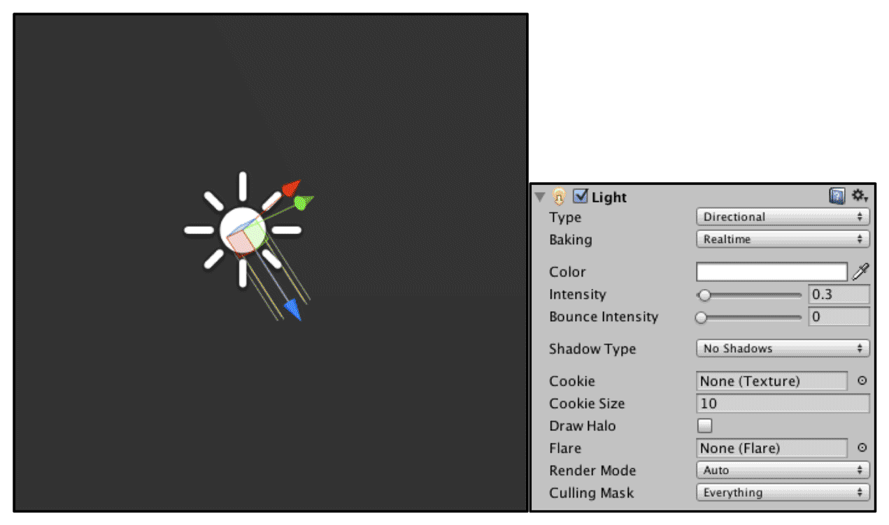
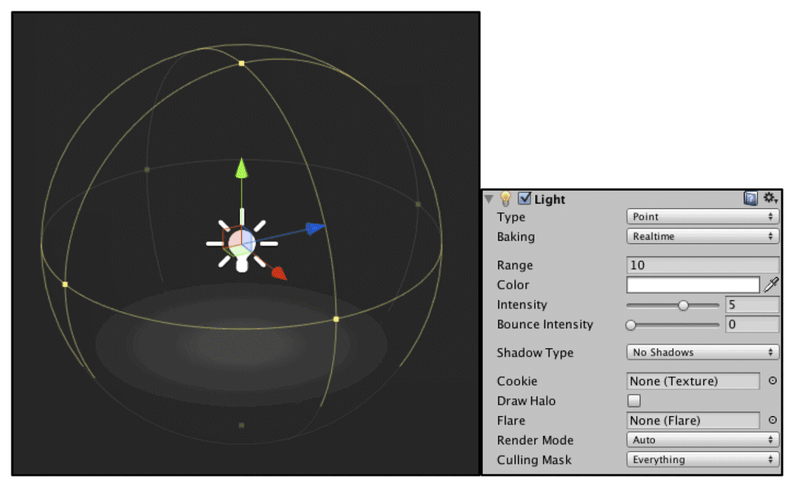
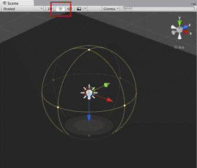

## Unity中的光照

​	在前面的例子中，我们的场景中都仅仅有一个光源且光源类型是平行光（如果你的场景不是这样的话，可能会得到错误的结果）。只有一个平行光的世界很美好，但美梦总有醒的一天，这时，我们就需要在Unity Shader中处理更复杂的光源类型以及数目更多的光源。在本节中，我们将会学习如何在Unity中处理点光源（point light）和聚光灯（spot light）。

​	Unity一共支持4种光源类型：平行光、点光源、聚光灯和面光源（area light）。面光源仅在烘焙时才可发挥作用，因此不在本节讨论范围内。由于每种光源的几何定义不同，因此它们对应的光源属性也就各不相同。这就要求我们要区别对待它们。幸运的是，Unity提供了很多内置函数来帮我们处理这些光源，在本章的最后我们会介绍这些函数，但首先我们需要了解它们背后的原理。


### 光源类型有什么影响

​	我们来看一下光源类型的不同到底会给Shader带来哪些影响。我们可以考虑Shader中使用了光源的哪些属性。**最常使用的光源属性有光源的位置、方向（更具体说就是，到某点的方向）、颜色、强度以及衰减（更具体说就是，到某点的衰减，与该点到光源的距离有关）这5个属性**。而这些属性和它们的几何定义息息相关。


#### 1．平行光

​	对于我们之前使用的平行光来说，它的几何定义是最简单的。平行光可以照亮的范围是没有限制的，它通常是作为太阳这样的角色在场景中出现的。下图给出了Unity中平行光在Scene视图中的表示以及Light组件的面板。	

​	

​	平**行光之所以简单，是因为它没有一个唯一的位置**，也就是说，它可以放在场景中的任意位置（回忆一下，我们小时候是不是总感觉太阳跟着我们一起移动）。它的几何属性只有方向，我们可以调整平行光的Transform组件中的Rotation属性来改变它的光源方向，而且平行光到场景中所有点的方向都是一样的，这也是平行光名字的由来。除此之外，**由于平行光没有一个具体的位置，因此也没有衰减的概念，也就是说，光照强度不会随着距离而发生改变。**	


#### 2、点光源

​	点光源的照亮空间则是有限的，它是由空间中的一个球体定义的。点光源可以表示由一个点发出的、向所有方向延伸的光。下图给出了Unity中点光源在Scene视图中的表示以及Light组件的面板。



​	需要提醒读者的一点是，我们需要在Scene视图中开启光照才能看到预览光源是如何影响场景中的物体的。下图给出了开启Scene视图光照的按钮。



​	球体的半径可以由面板中的Range属性来调整，也可以在Scene视图中直接拖拉点光源的线框（如球体上的黄色控制点）来修改它的属性。点光源是有位置属性的，它是由点光源的Transform组件中的Position属性定义的。对于方向属性，我们需要用点光源的位置减去某点的位置来得到它到该点的方向。而点光源的颜色和强度可以在Light组件面板中调整。同时，点光源也是会衰减的，随着物体逐渐远离点光源，它接收到的光照强度也会逐渐减小。点光源球心处的光照强度最强，球体边界处的最弱，值为0。其中间的衰减值可以由一个函数定义。


#### 3、聚光灯

​	聚光灯是这3种光源类型中最复杂的一种。它的照亮空间同样是有限的，但不再是简单的球体，而是由空间中的一块锥形区域定义的。聚光灯可以用于表示由一个特定位置出发、向特定方向延伸的光。图9.8给出了Unity中聚光灯在Scene视图中的表示以及Light组件的面板。


​	这块锥形区域的半径由面板中的Range属性决定，而锥体的张开角度由Spot Angle属性决定。我们同样也可以在Scene视图中直接拖拉聚光灯的线框（如中间的黄色控制点以及四周的黄色控制点）来修改它的属性。聚光灯的位置同样是由Transform组件中的Position属性定义的。对于方向属性，我们需要用聚光灯的位置减去某点的位置来得到它到该点的方向。聚光灯的衰减也是随着物体逐渐远离点光源而逐渐减小，在锥形的顶点处光照强度最强，在锥形的边界处强度为0。其中间的衰减值可以由一个函数定义，这个函数相对于点光源衰减计算公式要更加复杂，因为我们需要判断一个点是否在锥体的范围内。


## unity中的光照衰减

​	我们提到Unity使用一张纹理作为查找表来在片元着色器中计算逐像素光照的衰减。这样的好处在于，计算衰减不依赖于数学公式的复杂性，我们只要使用一个参数值去纹理中采样即可。例如使用点光源的时候使用：_LightTexture0 等。但使用纹理查找来计算衰减也有一些弊端。


- 需要预处理得到采样纹理，而且纹理的大小也会影响衰减的精度。
- 不直观，同时也不方便，因此一旦把数据存储到查找表中，我们就无法使用其他数学公式来计算衰减。


​	但由于这种方法可以在一定程度上提升性能，而且得到的效果在大部分情况下都是良好的，因此Unity默认就是使用这种纹理查找的方式来计算逐像素的点光源和聚光灯的衰减的。


### 用于光照衰减的纹理

​	Unity在内部使用一张名为**_LightTexture0**的纹理来计算光源衰减。需要注意的是，**如果我们对该光源使用了cookie，那么衰减查找纹理是_LightTextureB0**，但这里不讨论这种情况。**我们通常只关心_LightTexture0对角线上的纹理颜色值，这些值表明了在光源空间中不同位置的点的衰减值。例如，(0, 0)点表明了与光源位置重合的点的衰减值，而(1, 1)点表明了在光源空间中所关心的距离最远的点的衰减。**

​	**为了对LightTexture0纹理采样得到给定点到该光源的衰减值，我们首先需要得到该点在光源空间中的位置，这是通过LightMatrix0变换矩阵得到的。我们已经知道LightMatrix0可以把顶点从世界空间变换到光源空间。因此，我们只需要把LightMatrix0和世界空间中的顶点坐标相乘即可得到光源空间中的相应位置：**

```c#
float3 lightCoord = mul(_LightMatrix0, float4(i.worldPosition, 1)).xyz;
//然后，我们可以使用这个坐标的模的平方对衰减纹理进行采样，得到衰减值：
fixed atten = tex2D(_LightTexture0, dot(lightCoord,  lightCoord).rr).UNITY_ATTEN_CHANNEL;
```

​	可以发现，在上面的代码中，我们使用了光源空间中顶点距离的平方（通过dot函数来得到）来对纹理采样，之所以没有使用距离值来采样是因为这种方法可以避免开方操作。然后，我们使用宏**UNITY_ATTEN_CHANNEL**来得到衰减纹理中衰减值所在的分量，以得到最终的衰减值。


### 使用数学公式计算衰减

​	尽管纹理采样的方法可以减少计算衰减时的复杂度，但有时我们希望可以在代码中利用公式来计算光源的衰减。

```c#
float distance = length(_WorldSpaceLightPos0.xyz - i.worldPosition.xyz);
atten = 1.0 / distance; // linear attenuation
```

​	可惜的是，Unity没有在文档中给出内置衰减计算的相关说明。尽管我们仍然可以在片元着色器中利用一些数学公式来计算衰减，但由于我们无法在Shader中通过内置变量得到光源的范围、聚光灯的朝向、张开角度等信息，因此得到的效果往往在有些时候不尽如人意，尤其在物体离开光源的照明范围时会发生突变（这是因为，如果物体不在该光源的照明范围内，Unity就不会为物体执行一个Additional Pass）。当然，我们可以利用脚本将光源的相关信息传递给Shader，但这样的灵活性很低。我们只能期待未来的版本中Unity可以完善文档并开放更多的参数给开发者使


## Unity中的阴影


