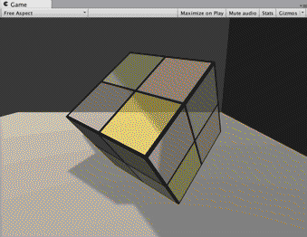

## Unity中的光照

​	在前面的例子中，我们的场景中都仅仅有一个光源且光源类型是平行光（如果你的场景不是这样的话，可能会得到错误的结果）。只有一个平行光的世界很美好，但美梦总有醒的一天，这时，我们就需要在Unity Shader中处理更复杂的光源类型以及数目更多的光源。在本节中，我们将会学习如何在Unity中处理点光源（point light）和聚光灯（spot light）。

​	Unity一共支持4种光源类型：平行光、点光源、聚光灯和面光源（area light）。面光源仅在烘焙时才可发挥作用，因此不在本节讨论范围内。由于每种光源的几何定义不同，因此它们对应的光源属性也就各不相同。这就要求我们要区别对待它们。幸运的是，Unity提供了很多内置函数来帮我们处理这些光源，在本章的最后我们会介绍这些函数，但首先我们需要了解它们背后的原理。


### 光源类型有什么影响

​	我们来看一下光源类型的不同到底会给Shader带来哪些影响。我们可以考虑Shader中使用了光源的哪些属性。**最常使用的光源属性有光源的位置、方向（更具体说就是，到某点的方向）、颜色、强度以及衰减（更具体说就是，到某点的衰减，与该点到光源的距离有关）这5个属性**。而这些属性和它们的几何定义息息相关。


#### 1．平行光

​	对于我们之前使用的平行光来说，它的几何定义是最简单的。平行光可以照亮的范围是没有限制的，它通常是作为太阳这样的角色在场景中出现的。下图给出了Unity中平行光在Scene视图中的表示以及Light组件的面板。	

​	

​	平**行光之所以简单，是因为它没有一个唯一的位置**，也就是说，它可以放在场景中的任意位置（回忆一下，我们小时候是不是总感觉太阳跟着我们一起移动）。它的几何属性只有方向，我们可以调整平行光的Transform组件中的Rotation属性来改变它的光源方向，而且平行光到场景中所有点的方向都是一样的，这也是平行光名字的由来。除此之外，**由于平行光没有一个具体的位置，因此也没有衰减的概念，也就是说，光照强度不会随着距离而发生改变。**	


#### 2、点光源

​	点光源的照亮空间则是有限的，它是由空间中的一个球体定义的。点光源可以表示由一个点发出的、向所有方向延伸的光。下图给出了Unity中点光源在Scene视图中的表示以及Light组件的面板。


​	需要提醒读者的一点是，我们需要在Scene视图中开启光照才能看到预览光源是如何影响场景中的物体的。下图给出了开启Scene视图光照的按钮。


​	球体的半径可以由面板中的Range属性来调整，也可以在Scene视图中直接拖拉点光源的线框（如球体上的黄色控制点）来修改它的属性。点光源是有位置属性的，它是由点光源的Transform组件中的Position属性定义的。对于方向属性，我们需要用点光源的位置减去某点的位置来得到它到该点的方向。而点光源的颜色和强度可以在Light组件面板中调整。同时，点光源也是会衰减的，随着物体逐渐远离点光源，它接收到的光照强度也会逐渐减小。点光源球心处的光照强度最强，球体边界处的最弱，值为0。其中间的衰减值可以由一个函数定义。


#### 3、聚光灯

​	聚光灯是这3种光源类型中最复杂的一种。它的照亮空间同样是有限的，但不再是简单的球体，而是由空间中的一块锥形区域定义的。聚光灯可以用于表示由一个特定位置出发、向特定方向延伸的光。图9.8给出了Unity中聚光灯在Scene视图中的表示以及Light组件的面板。


​	这块锥形区域的半径由面板中的Range属性决定，而锥体的张开角度由Spot Angle属性决定。我们同样也可以在Scene视图中直接拖拉聚光灯的线框（如中间的黄色控制点以及四周的黄色控制点）来修改它的属性。聚光灯的位置同样是由Transform组件中的Position属性定义的。对于方向属性，我们需要用聚光灯的位置减去某点的位置来得到它到该点的方向。聚光灯的衰减也是随着物体逐渐远离点光源而逐渐减小，在锥形的顶点处光照强度最强，在锥形的边界处强度为0。其中间的衰减值可以由一个函数定义，这个函数相对于点光源衰减计算公式要更加复杂，因为我们需要判断一个点是否在锥体的范围内。


## unity中的光照衰减

​	我们提到Unity使用一张纹理作为查找表来在片元着色器中计算逐像素光照的衰减。这样的好处在于，计算衰减不依赖于数学公式的复杂性，我们只要使用一个参数值去纹理中采样即可。例如使用点光源的时候使用：_LightTexture0 等。但使用纹理查找来计算衰减也有一些弊端。


- 需要预处理得到采样纹理，而且纹理的大小也会影响衰减的精度。
- 不直观，同时也不方便，因此一旦把数据存储到查找表中，我们就无法使用其他数学公式来计算衰减。


​	但由于这种方法可以在一定程度上提升性能，而且得到的效果在大部分情况下都是良好的，因此Unity默认就是使用这种纹理查找的方式来计算逐像素的点光源和聚光灯的衰减的。


### 用于光照衰减的纹理

​	Unity在内部使用一张名为**_LightTexture0**的纹理来计算光源衰减。需要注意的是，**如果我们对该光源使用了cookie，那么衰减查找纹理是_LightTextureB0**，但这里不讨论这种情况。**我们通常只关心_LightTexture0对角线上的纹理颜色值，这些值表明了在光源空间中不同位置的点的衰减值。例如，(0, 0)点表明了与光源位置重合的点的衰减值，而(1, 1)点表明了在光源空间中所关心的距离最远的点的衰减。**

​	**为了对LightTexture0纹理采样得到给定点到该光源的衰减值，我们首先需要得到该点在光源空间中的位置，这是通过LightMatrix0变换矩阵得到的。我们已经知道LightMatrix0可以把顶点从世界空间变换到光源空间。因此，我们只需要把LightMatrix0和世界空间中的顶点坐标相乘即可得到光源空间中的相应位置：**

```c#
float3 lightCoord = mul(_LightMatrix0, float4(i.worldPosition, 1)).xyz;
//然后，我们可以使用这个坐标的模的平方对衰减纹理进行采样，得到衰减值：
fixed atten = tex2D(_LightTexture0, dot(lightCoord,  lightCoord).rr).UNITY_ATTEN_CHANNEL;
```

​	可以发现，在上面的代码中，我们使用了光源空间中顶点距离的平方（通过dot函数来得到）来对纹理采样，之所以没有使用距离值来采样是因为这种方法可以避免开方操作。然后，我们使用宏**UNITY_ATTEN_CHANNEL**来得到衰减纹理中衰减值所在的分量，以得到最终的衰减值。


### 使用数学公式计算衰减

​	尽管纹理采样的方法可以减少计算衰减时的复杂度，但有时我们希望可以在代码中利用公式来计算光源的衰减。

```c#
float distance = length(_WorldSpaceLightPos0.xyz - i.worldPosition.xyz);
atten = 1.0 / distance; // linear attenuation
```

​	可惜的是，Unity没有在文档中给出内置衰减计算的相关说明。尽管我们仍然可以在片元着色器中利用一些数学公式来计算衰减，但由于我们无法在Shader中通过内置变量得到光源的范围、聚光灯的朝向、张开角度等信息，因此得到的效果往往在有些时候不尽如人意，尤其在物体离开光源的照明范围时会发生突变（这是因为，如果物体不在该光源的照明范围内，Unity就不会为物体执行一个Additional Pass）。当然，我们可以利用脚本将光源的相关信息传递给Shader，但这样的灵活性很低。我们只能期待未来的版本中Unity可以完善文档并开放更多的参数给开发者使


## Unity中的阴影

​	为了让场景看起来更加真实，具有深度信息，我们通常希望光源可以把一些物体的阴影投射在其他物体上。


### unity阴影原理

​	我们可以先考虑真实生活中阴影是如何产生的。当一个光源发射的一条光线遇到一个不透明物体时，这条光线就不可以再继续照亮其他物体（这里不考虑光线反射）。因此，这个物体就会向它旁边的物体投射阴影，那些阴影区域的产生是因为光线无法到达这些区域。

​	在实时渲染中，我们最常使用的是一种名为**Shadow Map**的技术。这种技术理解起来非常简单，它会首先把摄像机的位置放在与光源重合的位置上，那么场景中该光源的阴影区域就是那些摄像机看不到的地方。而Unity就是使用的这种技术。

​	在前向渲染路径中，如果场景中最重要的平行光开启了阴影，Unity就会为该光源计算它的阴影映射纹理（shadowmap）。这张阴影映射纹理本质上也是一张深度图，它记录了从该光源的位置出发、能看到的场景中距离它最近的表面位置（深度信息）。

​	那么，在计算阴影映射纹理时，我们如何判定距离它最近的表面位置呢？一种方法是，先把摄像机放置到光源的位置上，然后按正常的渲染流程，即调用Base Pass和Additional Pass来更新深度信息，得到阴影映射纹理。但这种方法会对性能造成一定的浪费，因为我们实际上仅仅需要深度信息而已，而Base Pass和Additional Pass中往往涉及很多复杂的光照模型计算。因此，Unity选择使用一个额外的Pass来专门更新光源的阴影映射纹理，这个Pass就是LightMode标签被设置为ShadowCaster的Pass。这个Pass的渲染目标不是帧缓存，而是阴影映射纹理（或深度纹理）。Unity首先把摄像机放置到光源的位置上，然后调用该Pass，通过对顶点变换后得到光源空间下的位置，并据此来输出深度信息到阴影映射纹理中。因此，当开启了光源的阴影效果后，底层渲染引擎首先会在当前渲染物体的Unity Shader中找到LightMode为ShadowCaster的Pass，如果没有，它就会在Fallback指定的Unity Shader中继续寻找，如果仍然没有找到，该物体就无法向其他物体投射阴影（但它仍然可以接收来自其他物体的阴影）。当找到了一个LightMode为ShadowCaster的Pass后，Unity会使用该Pass来更新光源的阴影映射纹理。

​	在传统的阴影映射纹理的实现中，我们会在正常渲染的Pass中把顶点位置变换到光源空间下，以得到它在光源空间中的三维位置信息。然后，我们使用xy分量对阴影映射纹理进行采样，得到阴影映射纹理中该位置的深度信息。如果该深度值小于该顶点的深度值（通常由z分量得到），那么说明该点位于阴影中。但在Unity 5中，Unity使用了不同于这种传统的阴影采样技术，即屏幕空间的阴影映射技术（Screenspace Shadow Map）。屏幕空间的阴影映射原本是延迟渲染中产生阴影的方法。需要注意的是，并不是所有的平台Unity都会使用这种技术。这是因为，屏幕空间的阴影映射需要显卡支持MRT，而有些移动平台不支持这种特性。

​	当使用了屏幕空间的阴影映射技术时，Unity首先会通过调用LightMode为ShadowCaster的Pass来得到可投射阴影的光源的阴影映射纹理以及摄像机的深度纹理。然后，根据光源的阴影映射纹理和摄像机的深度纹理来得到屏幕空间的阴影图。如果摄像机的深度图中记录的表面深度大于转换到阴影映射纹理中的深度值，就说明该表面虽然是可见的，但是却处于该光源的阴影中。通过这样的方式，阴影图就包含了屏幕空间中所有有阴影的区域。如果我们想要一个物体接收来自其他物体的阴影，只需要在Shader中对阴影图进行采样。由于阴影图是屏幕空间下的，因此，我们首先需要把表面坐标从模型空间变换到屏幕空间中，然后使用这个坐标对阴影图进行采样即可。

​	**总结一下，一个物体接收来自其他物体的阴影，以及它向其他物体投射阴影是两个过程**。

- 如果我们想要一个物体接收来自其他物体的阴影，就必须在Shader中对阴影映射纹理（包括屏幕空间的阴影图）进行采样，把采样结果和最后的光照结果相乘来产生阴影效果。
- 如果我们想要一个物体向其他物体投射阴影，就必须把该物体加入到光源的阴影映射纹理的计算中，从而让其他物体在对阴影映射纹理采样时可以得到该物体的相关信息。在**Unity中，这个过程是通过为该物体执行LightMode为ShadowCaster的Pass来实现的**。**如果使用了屏幕空间的投影映射技术，Unity还会使用这个Pass产生一张摄像机的深度纹理。**


### 不透明的物体的阴影

#### 1、让物体投射阴影

​	Unity中，我们可以选择是否让一个物体投射或接收阴影。这是通过设置**Mesh Renderer组件中的Cast Shadows和Receive Shadows**属性来实现的。

​	Cast Shadows可以被设置为开启（On）或关闭（Off）。如果开启了Cast Shadows属性，那么Unity就会把该物体加入到光源的阴影映射纹理的计算中，从而让其他物体在对阴影映射纹理采样时可以得到该物体的相关信息。正如之前所说，**这个过程是通过为该物体执行LightMode为ShadowCaster的Pass来实现的**。Receive Shadows则可以选择是否让物体接收来自其他物体的阴影。如果没有开启Receive Shadows，那么当我们调用Unity的内置宏和变量计算阴影（在后面我们会看到如何实现）时，这些宏通过判断该物体没有开启接收阴影的功能，就不会在内部为我们计算阴影。

​	之前我们知道想要物体能够投射阴影，那么这个物体的shader中得包含一个LightMode为ShadowCaster的Pass才行，但是如果在这个shader中没有包含的话，unity就会从Fallback开始进行寻找，如果能够找到就能投射阴影，如果没有找到就不能投射阴影。

**builtin-shaders-xxx->DefaultResourcesExtra->Normal- VertexLit.shader。默认的阴影ShadowCaster Pass：**

```c#
// Pass to render object as a shadow caster
Pass {
    Name "ShadowCaster"
    Tags { "LightMode" = "ShadowCaster" }

    CGPROGRAM
    #pragma vertex vert
    #pragma fragment frag
    #pragma multi_compile_shadowcaster
    #include "UnityCG.cginc"

    struct v2f {
        V2F_SHADOW_CASTER;   
    };

    v2f vert( appdata_base v )
    {
        v2f o;
        TRANSFER_SHADOW_CASTER_NORMALOFFSET(o)    //
        return o;
    }

    float4 frag( v2f i ) : SV_Target
    {
        SHADOW_CASTER_FRAGMENT(i)  //
    }
    ENDCG

}
```

​	上面的代码非常短，尽管有一些宏和指令是我们之前没有遇到过的，但它们的用处实际上就是为了把深度信息写入渲染目标中。


​	还有一个有意思的现象，尽管一个物体的Cast Shadows已经被开启了，但是还是没有阴影。在默认情况下，我们在计算光源的阴影映射纹理时会剔除掉物体的背面。但对于内置的平面来说，它只有一个面，因此可能在当计算阴影映射纹理时，由于物体在光源空间下没有任何正面（frontface），因此就不会添加到阴影映射纹理中。我们可以将Cast Shadows设置为Two Sided来允许对物体的所有面都计算阴影信息。


#### 让物体接受阴影

​	为了让物体可以接收阴影，得引入“AutoLight.cginc”，我们计算阴影时所用的宏都是在这个文件中声明的。


1、我们在顶点着色器的输出结构体v2f中添加了一个内置宏SHADOW_COORDS：

```c#
struct v2f {
    float4 pos : SV_POSITION;
    float3 worldNormal : TEXCOORD0;
    float3 worldPos : TEXCOORD1;
    SHADOW_COORDS(2)
};
```

这个宏的作用很简单，就是声明一个用于对阴影纹理采样的坐标。需要注意的是，这个宏的参数需要是下一个可用的插值寄存器的索引值，在上面的例子中就是2。


2、然后，我们在顶点着色器返回之前添加另一个内置宏TRANSFER_SHADOW：

```c#
v2f vert(a2v v) {
    v2f o;  
    ...     
    // Pass shadow coordinates to pixel shader
    TRANSFER_SHADOW(o);

    return o;
}
```

这个宏用于在顶点着色器中计算上一步中声明的阴影纹理坐标。


3、接着，我们在片元着色器中计算阴影值，这同样使用了一个内置宏SHADOW_ ATTENUATION：

```c#
// Use shadow coordinates to sample shadow map
fixed shadow = SHADOW_ATTENUATION(i);
```


**SHADOW_COORDS、TRANSFER_SHADOW和SHADOW_ATTENUATION**是计算阴影时的“三剑客”。这些内置宏帮助我们在必要时计算光源的阴影。我们可以在AutoLight.cginc中找到它们的声明：

```c#
     // ----------------
//  Shadow helpers
// ----------------

// ---- Screen space shadows
#if defined (SHADOWS_SCREEN)
    UNITY_DECLARE_SHADOWMAP(_ShadowMapTexture);
    #define SHADOW_COORDS(idx1) unityShadowCoord4 _ShadowCoord : TEXCOORD##idx1;
    #if defined(UNITY_NO_SCREENSPACE_SHADOWS)
        #define TRANSFER_SHADOW(a) a._ShadowCoord = mul( unity_World2Shadow[0],   
        mul( _Object2World, v.vertex ) );
        inline fixed unitySampleShadow (unityShadowCoord4 shadowCoord)
        {
            ...
        }
    #else // UNITY_NO_SCREENSPACE_SHADOWS
        #define TRANSFER_SHADOW(a) a._ShadowCoord = ComputeScreenPos(a.pos);
        inline fixed unitySampleShadow (unityShadowCoord4 shadowCoord)
        {
            fixed shadow = tex2Dproj( _ShadowMapTexture, UNITY_PROJ_COORD(shadowCoord) ).r;
            return shadow;
        }
    #endif
    #define SHADOW_ATTENUATION(a) unitySampleShadow(a._ShadowCoord)
#endif

// ---- Spot light shadows
#if defined (SHADOWS_DEPTH) && defined (SPOT)
        ...
#endif

// ---- Point light shadows
#if defined (SHADOWS_CUBE)
    ...
#endif

// ---- Shadows off
#if !defined (SHADOWS_SCREEN) && !defined (SHADOWS_DEPTH) && !defined (SHADOWS_CUBE)
    #define SHADOW_COORDS(idx1)
    #define TRANSFER_SHADOW(a)
    #define SHADOW_ATTENUATION(a) 1.0
#endif
```

​	上面的代码看起来很多、很复杂，实际上只是Unity为了处理不同光源类型、不同平台而定义了多个版本的宏。在前向渲染中，宏**SHADOWCOORDS**实际上就是声明了一个名为**_ShadowCoord**的阴影纹理坐标变量。而**TRANSFER_SHADOW**的实现会根据平台不同而有所差异。如果当前平台可以使用屏幕空间的阴影映射技术（通过判断是否定义了**UNITY_NO_SCREENSPACE** **SHADOWS**来得到），**TRANSFER_SHADOW**会调用内置的**ComputeScreenPos**函数来计算**_ShadowCoord**；如果该平台不支持屏幕空间的阴影映射技术，就会使用传统的阴影映射技术，**TRANSFER_SHADOW**会把顶点坐标从模型空间变换到光源空间后存储到**_ShadowCoord**中。然后，**SHADOW_ATTENUATION**负责使用**_ShadowCoord**对相关的纹理进行采样，得到阴影信息。

​	注意到，上面内置代码的最后定义了在关闭阴影时的处理代码。可以看出，当关闭了阴影后，**SHADOW_COORDS**和**TRANSFER_SHADOW**实际没有任何作用，而**SHADOW_ATTENUATION**会直接等同于数值1。

​	**需要读者注意的是，由于这些宏中会使用上下文变量来进行相关计算，例如TRANSFER_ SHADOW会使用v.vertex或a.pos来计算坐标，因此为了能够让这些宏正确工作，我们需要保证自定义的变量名和这些宏中使用的变量名相匹配。我们需要保证：a2v结构体的顶点坐标变量名必须是vertex，顶点着色器的输入结构体a2v必须命名为v，且v2f中的顶点位置变量必须命名为pos。**


4、在完成了上面的所有操作后，我们只需要把阴影值shadow和漫反射以及高光反射颜色相乘即可。


### 统一管理光照衰减和阴影

​	我们已经讲过如何在Unity Shader的前向渲染路径中计算光照衰减——在Base Pass中，平行光的衰减因子总是等于1，而在Additional Pass中，我们需要判断该Pass处理的光源类型，再使用内置变量和宏计算衰减因子。实际上，光照衰减和阴影对物体最终的渲染结果的影响本质上是相同的——我们都是把光照衰减因子和阴影值及光照结果相乘得到最终的渲染结果。那么，是不是可以有一个方法可以同时计算两个信息呢？好消息是，Unity在Shader里提供了这样的功能，这主要是通过内置的**UNITY_LIGHT_ATTENUATION**宏来实现的。

（1）首先包含进需要的头文件。

```c#
// Need these files to get built-in macros
#include "Lighting.cginc"
#include "AutoLight.cginc"
```

（2）在v2f结构体中使用内置宏SHADOW_COORDS声明阴影坐标

（3）在顶点着色器中使用内置宏TRANSFER_SHADOW计算并向片元着色器传递阴影坐标

（4）和之前使用内置宏SHADOW_ ATTENUATION不同，**这次我们在片元着色器中使用内置宏UNITYLIGHT ATTENUATION来计算光照衰减和阴影**

```c#
UNITY_LIGHT_ATTENUATION(atten, i, i.worldPos);
```

​	**UNITY_LIGHT_ATTENUATION**是Unity内置的用于计算光照衰减和阴影的宏，我们可以在内置的AutoLight.cginc里找到它的相关声明。它接受3个参数，它会将**光照衰减和阴影值相乘**后的结果存储到**第一个参数**中。注意到，我们并没有在代码中声明第一个参数atten，这是因为UNITY_LIGHT_ATTENUATION会帮我们声明这个变量。它的第二个参数是结构体v2f，这个参数会传递给SHADOW_ATTENUATION，用来计算阴影值。而第三个参数是世界空间的坐标，这个参数会用于计算光源空间下的坐标，再对光照衰减纹理采样来得到光照衰减。我们强烈建议读者查阅AutoLight.cginc中UNITY_LIGHT ATTENUATION的声明，读者可以发现，Unity针对不同光源类型、是否启用cookie等不同情况声明了多个版本的UNITY_LIGHT_ATTENUATION。这些不同版本的声明是保证我们可以通过这样一个简单的代码来得到正确结果的关键。

（5）由于使用了UNITY_LIGHT_ATTENUATION，我们的Base Pass和Additional Pass的代码得以统一——我们不需要在Base Pass里单独处理阴影，也不需要在Additional Pass中判断光源类型来处理光照衰减，一切都只需要通过UNITY_LIGHT_ATTENUATION来完成即可。这正是Unity内置文件的魅力所在。如果我们希望可以在Additional Pass中添加阴影效果，就需要使用**#pragma multi_compile_fwdadd_fullshadows**编译指令来代替Additional Pass中的#pragma multi_compile_fwdadd指令。这样一来，Unity也会为这些额外的逐像素光源计算阴影，并传递给Shader。


### 透明度物体的阴影

#### 	透明度测试

​	我们从一开始就强调，想要在Unity里让物体能够向其他物体投射阴影，一定要在它使用的Unity Shader中提供一个**LightMode为ShadowCaster的Pass**。在前面的例子中，我们使用内置的VertexLit中提供的ShadowCaster来投射阴影。VertexLit中的ShadowCaster实现很简单，它会正常渲染整个物体，然后把深度结果输出到一张深度图或阴影映射纹理中。读者可以在内置文件中找到相关的文件。

​	对于大多数不透明物体来说，把Fallback设为VertexLit就可以得到正确的阴影。但对于透明物体来说，我们就需要小心处理它的阴影。透明物体的实现通常会使用透明度测试或透明度混合，我们需要小心设置这些物体的Fallback。

​	透明度测试的处理比较简单，但如果我们仍然直接使用VertexLit、Diffuse、Specular等作为回调，往往无法得到正确的阴影。这是因为透明度测试需要在片元着色器中舍弃某些片元，而VertexLit中的阴影投射纹理并没有进行这样的操作。

​	这样的结果是镂空区域出现了不正常的阴影，看起来就像这个正方体是一个普通的正方体一样。而这并不是我们想要得到的，我们希望有些光应该是可以通过这些镂空区域透过来的，这些区域不应该有阴影。出现这样的情况是因为，我们使用的是内置的VertexLit中提供的ShadowCaster来投射阴影，而这个Pass中并没有进行任何透明度测试的计算，因此，它会把整个物体的深度信息渲染到深度图和阴影映射纹理中。因此，如果我们想要得到经过透明度测试后的阴影效果，就需要提供一个有透明度测试功能的ShadowCaster Pass。当然，我们可以自行编写一个这样的Pass，但这里我们仍然选择使用内置的Unity Shader来减少代码量。

​	为了让使用透明度测试的物体得到正确的阴影效果，我们只需要在Unity Shader中更改一行代码，**即把Fallback设置为Transparent/Cutout/VertexLit**。读者可以在内置文件中找到该Unity Shader的代码，它的ShadowCaster Pass也计算了透明度测试，因此会把裁剪后的物体深度信息写入深度图和阴影映射纹理中。但需要注意的是，由于Transparent/Cutout/VertexLit中计算透明度测试时，使用了名为**_Cutoff**的属性来进行透明度测试，因此，这要求我们的Shader中也必须提供名为**_Cutoff**的属性。否则，同样无法得到正确的阴影结果。

​	但是，这样的结果仍然有一些问题，例如出现了一些不应该透过光的部分。出现这种情况的原因是，默认情况下把物体渲染到深度图和阴影映射纹理中仅考虑物体的正面。但对于本例的正方体来说，由于一些面完全背对光源，因此这些面的深度信息没有加入到阴影映射纹理的计算中。为了得到正确的结果，我们可以将正方体的Mesh Renderer组件中的Cast Shadows属性设置为Two Sided，强制Unity在计算阴影映射纹理时计算所有面的深度信息。

#### 透明度混合

​	与透明度测试的物体相比，想要为使用透明度混合的物体添加阴影是一件比较复杂的事情。事实上，所有内置的透明度混合的Unity Shader，如Transparent/VertexLit等，都没有包含阴影投射的Pass。这意味着，这些半透明物体不会参与深度图和阴影映射纹理的计算，也就是说，它们不会向其他物体投射阴影，同样它们也不会接收来自其他物体的阴影。我们使用了之前学习的透明度混合 + 阴影的方法来渲染一个正方体，它使用的材质和 Unity Shader 分别是 AlphaBlendWithShadowMat 和 Chapter9-AlphaBlendWithShadow。Chapter9-AlphaBlendWithShadow使用了和8.4节透明度混合中几乎完全相同的代码，只是添加了关于阴影的计算，并且它的Fallback是内置的Transparent/VertexLit。


​	**把使用了透明度混合的Unity Shader的Fallback设置为内置的Transparent/VertexLit。半透明物体不会向下方的平面投射阴影，也不会接收来自右侧平面的阴影，它看起来就像是完全透明一样**


​	Unity会这样处理半透明物体是有它的原因的。由于透明度混合需要关闭深度写入，由此带来的问题也影响了阴影的生成。总体来说，要想为这些半透明物体产生正确的阴影，需要在每个光源空间下仍然严格按照从后往前的顺序进行渲染，这会让阴影处理变得非常复杂，而且也会影响性能。因此，在Unity中，所有内置的半透明Shader是不会产生任何阴影效果的。当然，我们可以使用一些dirty trick来强制为半透明物体生成阴影，这可以通过把它们的Fallback设置为VertexLit、Diffuse这些不透明物体使用的Unity Shader，这样Unity就会在它的Fallback找到一个阴影投射的Pass。然后，我们可以通过物体的Mesh Renderer组件上的Cast Shadows和Receive Shadows选项来控制是否需要向其他物体投射或接收阴影。下图显示了把Fallback设为VertexLit并开启阴影投射和接收阴影后的半透明物体的渲染效果。




