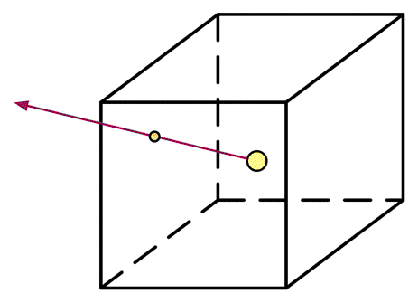
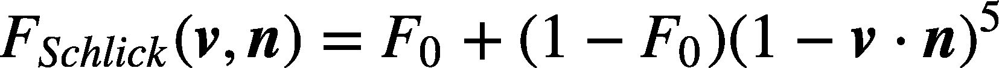
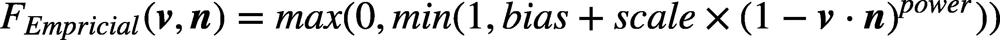

# 									高级纹理


## 立方体纹理

​	在图形学中，**立方体纹理（Cubemap）是环境映射（Environment Mapping）的一种实现方法**。环境映射可以模拟物体周围的环境，而使用了环境映射的物体可以看起来像镀了层金属一样反射出周围的环境。

​	和之前见到的纹理不同，立方体纹理一共包含了6张图像，这些图像对应了一个立方体的6个面，立方体纹理的名称也由此而来。立方体的每个面表示沿着世界空间下的轴向（上、下、左、右、前、后）观察所得的图像。那么，我们如何对这样一种纹理进行采样呢？和之前使用二维纹理坐标不同，对立方体纹理采样我们需要提供一个三维的纹理坐标，这个三维纹理坐标表示了我们在世界空间下的一个3D方向。这个方向矢量从立方体的中心出发，当它向外部延伸时就会和立方体的6个纹理之一发生相交，而采样得到的结果就是由该交点计算而来的。下图给出了使用方向矢量对立方体纹理采样的过程。



​	使用立方体纹理的好处在于，它的实现简单快速，而且得到的效果也比较好。但它也有一些缺点，例如当场景中引入了新的物体、光源，或者物体发生移动时，我们就需要重新生成立方体纹理。除此之外，立方体纹理也仅可以反射环境，但不能反射使用了该立方体纹理的物体本身。这是因为，立方体纹理不能模拟多次反射的结果，例如两个金属球互相反射的情况（事实上，Unity 5引入的全局光照系统允许实现这样的自反射效果）。由于这样的原因，想要得到令人信服的渲染结果，我们应该尽量对凸面体而不要对凹面体使用立方体纹理（因为凹面体会反射自身）。

​	**立方体纹理在实时渲染中有很多应用，最常见的是用于天空盒子（Skybox）以及环境映射**。


### 天空盒子

​	天空盒子（Skybox）是游戏中用于模拟背景的一种方法。天空盒子这个名字包含了两个信息：它是用来模拟天空的（尽管现在我们仍可以用它模拟室内等背景），它是一个盒子。当我们在场景中使用了天空盒子时，整个场景就被包围在一个立方体内。这个立方体的每个面使用的技术就是立方体纹理映射技术。

​	在Unity中，想要使用天空盒子非常简单。我们只需要创建一个Skybox材质，再把它赋给该场景的相关设置即可。为了让天空盒子正常渲染，我们需要把这6张纹理的**Wrap Mode设置为Clamp**，以防止在接缝处出现不匹配的现象

​	Skybox纹理除了6张纹理属性外还有3个属性：**Tint Color，用于控制该材质的整体颜色；Exposure，用于调整天空盒子的亮度；Rotation，用于调整天空盒子沿+y轴方向的旋转角度。**

​	为了让摄像机正常显示天空盒子，我们还需要保证渲染场景的摄像机的Camera组件中的Clear Flags被设置为Skybox。

​	**需要说明的是，在Window → Lighting → Skybox中设置的天空盒子会应用于该场景中的所有摄像机。如果我们希望某些摄像机可以使用不同的天空盒子，可以通过向该摄像机添加Skybox组件来覆盖掉之前的设置。也就是说，我们可以在摄像机上单击Component → Rendering → Skybox来完成对场景默认天空盒子的覆盖。**

​	**在Unity中，天空盒子是在所有不透明物体之后渲染的，而其背后使用的网格是一个立方体或一个细分后的球体。**


### 创建用于环境映射的立方体纹理

​	创建用于环境映射的立方体纹理的方法有三种：

​	**第一种方法是直接由一些特殊布局的纹理创建；第二种方法是手动创建一个Cubemap资源，再把6张图赋给它；第三种方法是由脚本生成。**

​	如果使用第一种方法，我们需要提供一张具有特殊布局的纹理，例如类似立方体展开图的交叉布局、全景布局等。然后，我们只需要把该纹理的Texture Type设置为Cubemap即可，Unity会为我们做好剩下的事情。在基于物理的渲染中，我们通常会使用一张HDR图像来生成高质量的Cubemap。

​	第二种方法是Unity 5之前的版本中使用的方法。我们首先需要在项目资源中创建一个Cubemap，然后把6张纹理拖曳到它的面板中。在Unity 5中，官方推荐使用第一种方法创建立方体纹理，这是因为第一种方法可以对纹理数据进行压缩，而且可以支持边缘修正、光滑反射（glossy reflection）和HDR等功能。

前面两种方法都需要我们提前准备好立方体纹理的图像，它们得到的立方体纹理往往是被场景中的物体所共用的。但在理想情况下，我们希望根据物体在场景中位置的不同，生成它们各自不同的立方体纹理。这时，我们就可以在Unity中使用脚本来创建。这是通过利用Unity提供的Camera.RenderToCubemap函数来实现的。Camera.RenderToCubemap函数可以把从任意位置观察到的场景图像存储到6张图像中，从而创建出该位置上对应的立方体纹理。


### 反射

​	使用了反射效果的物体通常看起来就像镀了层金属。想要模拟反射效果很简单，**我们只需要通过入射光线的方向和表面法线方向来计算反射方向，再利用反射方向对立方体纹理采样即可。**

示例代码如下：

```c#
Shader "Unity Shaders Book/Chapter 10/Reflection" {
	Properties {
		_Color ("Color Tint", Color) = (1, 1, 1, 1)
		_ReflectColor ("Reflection Color", Color) = (1, 1, 1, 1)
		_ReflectAmount ("Reflect Amount", Range(0, 1)) = 1
		_Cubemap ("Reflection Cubemap", Cube) = "_Skybox" {}
	}
	SubShader {
		Tags { "RenderType"="Opaque" "Queue"="Geometry"}
		
		Pass { 
			Tags { "LightMode"="ForwardBase" }
			
			CGPROGRAM
			
			#pragma multi_compile_fwdbase
			
			#pragma vertex vert
			#pragma fragment frag
			
			#include "Lighting.cginc"
			#include "AutoLight.cginc"
			
			fixed4 _Color;
			fixed4 _ReflectColor;
			fixed _ReflectAmount;
			samplerCUBE _Cubemap;
			
			struct a2v {
				float4 vertex : POSITION;
				float3 normal : NORMAL;
			};
			
			struct v2f {
				float4 pos : SV_POSITION;
				float3 worldPos : TEXCOORD0;
				fixed3 worldNormal : TEXCOORD1;
				fixed3 worldViewDir : TEXCOORD2;
				fixed3 worldRefl : TEXCOORD3;
				SHADOW_COORDS(4)
			};
			
			v2f vert(a2v v) {
				v2f o;
				
				o.pos = mul(UNITY_MATRIX_MVP, v.vertex);
				
				o.worldNormal = UnityObjectToWorldNormal(v.normal);
				
				o.worldPos = mul(_Object2World, v.vertex).xyz;
				
				o.worldViewDir = UnityWorldSpaceViewDir(o.worldPos);
				
				// Compute the reflect dir in world space
				o.worldRefl = reflect(-o.worldViewDir, o.worldNormal);
				
				TRANSFER_SHADOW(o);
				
				return o;
			}
			
			fixed4 frag(v2f i) : SV_Target {
				fixed3 worldNormal = normalize(i.worldNormal);
				fixed3 worldLightDir = normalize(UnityWorldSpaceLightDir(i.worldPos));		
				fixed3 worldViewDir = normalize(i.worldViewDir);		
				
				fixed3 ambient = UNITY_LIGHTMODEL_AMBIENT.xyz;
				
				fixed3 diffuse = _LightColor0.rgb * _Color.rgb * max(0, dot(worldNormal, worldLightDir));
				
				// Use the reflect dir in world space to access the cubemap
				fixed3 reflection = texCUBE(_Cubemap, i.worldRefl).rgb * _ReflectColor.rgb;
				
				UNITY_LIGHT_ATTENUATION(atten, i, i.worldPos);
				
				// Mix the diffuse color with the reflected color
				fixed3 color = ambient + lerp(diffuse, reflection, _ReflectAmount) * atten;
				
				return fixed4(color, 1.0);
			}
			
			ENDCG
		}
	}
	FallBack "Reflective/VertexLit"
}
```

​	对立方体纹理的采样需要使用CG的texCUBE函数。注意到，在上面的计算中，我们在采样时并没有对i.worldRefl进行归一化操作。这是因为，用于采样的参数仅仅是作为方向变量传递给texCUBE函数的，因此我们没有必要进行一次归一化的操作。然后，我们使用_ReflectAmount来混合漫反射颜色和反射颜色，并和环境光照相加后返回。

​	在上面的计算中，我们选择在顶点着色器中计算反射方向。当然，我们也可以选择在片元着色器中计算，这样得到的效果更加细腻。但是，对于绝大多数人来说这种差别往往是可以忽略不计的，因此出于性能方面的考虑，我们选择在顶点着色器中计算反射方向。


### 折射

​	折射的物理原理比反射复杂一些。我们在初中物理就已经接触过折射的定义：当光线从一种介质（例如空气）斜射入另一种介质（例如玻璃）时，传播方向一般会发生改变。当给定入射角时，我们可以使用**斯涅尔定律（Snell's Law）**来计算反射角。当光从介质1沿着和表面法线夹角为θ1的方向斜射入介质2时，我们可以使用如下公式计算折射光线与法线的夹角θ2：

​																	**η1sinθ1=η2sinθ2**


​	其中，**η1和η2分别是两个介质的折射率（index of refraction）**。折射率是一项重要的物理常数，例如真空的折射率是1，**而玻璃的折射率一般是1.5**。

​	通常来说，当得到折射方向后我们就会直接使用它来对立方体纹理进行采样，但这是不符合物理规律的。对一个透明物体来说，一种更准确的模拟方法需要计算两次折射—— 一次是当光线进入它的内部时，而另一次则是从它内部射出时。但是，想要在实时渲染中模拟出第二次折射方向是比较复杂的，而且仅仅模拟一次得到的效果从视觉上看起来“也挺像那么回事的”。正如我们之前提到的——图形学第一准则“如果它看起来是对的，那么它就是对的”。因此，在实时渲染中我们通常仅模拟第一次折射。

```c#
示例代码：
Shader "Unity Shaders Book/Chapter 10/Refraction" {
	Properties {
		_Color ("Color Tint", Color) = (1, 1, 1, 1)
		_RefractColor ("Refraction Color", Color) = (1, 1, 1, 1)
		_RefractAmount ("Refraction Amount", Range(0, 1)) = 1
		_RefractRatio ("Refraction Ratio", Range(0.1, 1)) = 0.5
		_Cubemap ("Refraction Cubemap", Cube) = "_Skybox" {}
	}
	SubShader {
		Tags { "RenderType"="Opaque" "Queue"="Geometry"}
		
		Pass { 
			Tags { "LightMode"="ForwardBase" }
		
			CGPROGRAM
			
			#pragma multi_compile_fwdbase	
			
			#pragma vertex vert
			#pragma fragment frag
			
			#include "Lighting.cginc"
			#include "AutoLight.cginc"
			
			fixed4 _Color;
			fixed4 _RefractColor;
			float _RefractAmount;
			fixed _RefractRatio;
			samplerCUBE _Cubemap;
			
			struct a2v {
				float4 vertex : POSITION;
				float3 normal : NORMAL;
			};
			
			struct v2f {
				float4 pos : SV_POSITION;
				float3 worldPos : TEXCOORD0;
				fixed3 worldNormal : TEXCOORD1;
				fixed3 worldViewDir : TEXCOORD2;
				fixed3 worldRefr : TEXCOORD3;
				SHADOW_COORDS(4)
			};
			
			v2f vert(a2v v) {
				v2f o;
				o.pos = mul(UNITY_MATRIX_MVP, v.vertex);
				
				o.worldNormal = UnityObjectToWorldNormal(v.normal);
				
				o.worldPos = mul(_Object2World, v.vertex).xyz;
				
				o.worldViewDir = UnityWorldSpaceViewDir(o.worldPos);
				
				// Compute the refract dir in world space
				o.worldRefr = refract(-normalize(o.worldViewDir), normalize(o.worldNormal), _RefractRatio);
				
				TRANSFER_SHADOW(o);
				
				return o;
			}
			
			fixed4 frag(v2f i) : SV_Target {
				fixed3 worldNormal = normalize(i.worldNormal);
				fixed3 worldLightDir = normalize(UnityWorldSpaceLightDir(i.worldPos));
				fixed3 worldViewDir = normalize(i.worldViewDir);
								
				fixed3 ambient = UNITY_LIGHTMODEL_AMBIENT.xyz;
				
				fixed3 diffuse = _LightColor0.rgb * _Color.rgb * max(0, dot(worldNormal, worldLightDir));
				
				// Use the refract dir in world space to access the cubemap
				fixed3 refraction = texCUBE(_Cubemap, i.worldRefr).rgb * _RefractColor.rgb;
				
				UNITY_LIGHT_ATTENUATION(atten, i, i.worldPos);
				
				// Mix the diffuse color with the refract color
				fixed3 color = ambient + lerp(diffuse, refraction, _RefractAmount) * atten;
				
				return fixed4(color, 1.0);
			}
			
			ENDCG
		}
	} 
	FallBack "Reflective/VertexLit"
}
```

​	_RefractColor 、 _RefractAmount和 _Cubemap意思分别是折射颜色、折射颜色和漫反射颜色之间的插值比重、折射采样贴图。除此之外，我们还使用了一个属性RefractRatio，我们需要使用该属性得到不同介质的透射比，以此来计算折射方向。

​	**我们使用了CG的refract函数来计算折射方向。它的第一个参数即为入射光线的方向，它必须是归一化后的矢量；第二个参数是表面法线，法线方向同样需要是归一化后的；第三个参数是入射光线所在介质的折射率和折射光线所在介质的折射率之间的比值，例如如果光是从空气射到玻璃表面，那么这个参数应该是空气的折射率和玻璃的折射率之间的比值，即1/1.5。它的返回值就是计算而得的折射方向，它的模则等于入射光线的模。**


### 菲涅耳反射

​	菲涅尔反射和菲涅尔效应是不一样的。

​	在实时渲染中，我们经常会使用**菲涅耳反射（Fresnel reflection）**来根据视角方向控制反射程度。通俗地讲，菲涅耳反射描述了一种光学现象，即当光线照射到物体表面上时，一部分发生反射，一部分进入物体内部，发生折射或散射。被反射的光和入射光之间存在一定的比率关系，这个比率关系可以通过菲涅耳等式进行计算。一个经常使用的例子是，当你站在湖边，直接低头看脚边的水面时，你会发现水几乎是透明的，你可以直接看到水底的小鱼和石子；但是，当你抬头看远处的水面时，会发现几乎看不到水下的情景，而只能看到水面反射的环境。这就是所谓的菲涅耳效果。事实上，不仅仅是水、玻璃这样的反光物体具有菲涅耳效果，几乎任何物体都或多或少包含了菲涅耳效果，这是基于物理的渲染中非常重要的一项高光反射计算因子。

​	那么，我们如何计算菲涅耳反射呢？这就需要使用菲涅耳等式。真实世界的菲涅耳等式是非常复杂的，但在实时渲染中，我们通常会使用一些近似公式来计算。**其中一个著名的近似公式就是Schlick菲涅耳近似等式**：



​	其中，F0是一个反射系数，用于控制菲涅耳反射的强度，v是视角方向，n是表面法线。另一个应用比较广泛的等式是**Empricial菲涅耳近似等式**：



​	**其中，bias、scale和power是控制项。**

​	使用上面的菲涅耳近似等式，我们可以在边界处模拟反射光强和折射光强/漫反射光强之间的变化。在许多车漆、水面等材质的渲染中，我们会经常使用菲涅耳反射来模拟更加真实的反射效果。

示例代码：

```c#
Shader "Unity Shaders Book/Chapter 10/Fresnel" {
	Properties {
		_Color ("Color Tint", Color) = (1, 1, 1, 1)
		_FresnelScale ("Fresnel Scale", Range(0, 1)) = 0.5
		_Cubemap ("Reflection Cubemap", Cube) = "_Skybox" {}
	}
	SubShader {
		Tags { "RenderType"="Opaque" "Queue"="Geometry"}
		
		Pass { 
			Tags { "LightMode"="ForwardBase" }
		
			CGPROGRAM
			
			#pragma multi_compile_fwdbase
			
			#pragma vertex vert
			#pragma fragment frag
			
			#include "Lighting.cginc"
			#include "AutoLight.cginc"
			
			fixed4 _Color;
			fixed _FresnelScale;
			samplerCUBE _Cubemap;
			
			struct a2v {
				float4 vertex : POSITION;
				float3 normal : NORMAL;
			};
			
			struct v2f {
				float4 pos : SV_POSITION;
				float3 worldPos : TEXCOORD0;
  				fixed3 worldNormal : TEXCOORD1;
  				fixed3 worldViewDir : TEXCOORD2;
  				fixed3 worldRefl : TEXCOORD3;
 	 			SHADOW_COORDS(4)
			};
			
			v2f vert(a2v v) {
				v2f o;
				o.pos = mul(UNITY_MATRIX_MVP, v.vertex);
				
				o.worldNormal = UnityObjectToWorldNormal(v.normal);
				
				o.worldPos = mul(_Object2World, v.vertex).xyz;
				
				o.worldViewDir = UnityWorldSpaceViewDir(o.worldPos);
				
				o.worldRefl = reflect(-o.worldViewDir, o.worldNormal);
				
				TRANSFER_SHADOW(o);
				
				return o;
			}
			
			fixed4 frag(v2f i) : SV_Target {
				fixed3 worldNormal = normalize(i.worldNormal);
				fixed3 worldLightDir = normalize(UnityWorldSpaceLightDir(i.worldPos));
				fixed3 worldViewDir = normalize(i.worldViewDir);
				
				fixed3 ambient = UNITY_LIGHTMODEL_AMBIENT.xyz;
				
				UNITY_LIGHT_ATTENUATION(atten, i, i.worldPos);
				
				fixed3 reflection = texCUBE(_Cubemap, i.worldRefl).rgb;
				
				fixed fresnel = _FresnelScale + (1 - _FresnelScale) * pow(1 - dot(worldViewDir, worldNormal), 5);
				
				fixed3 diffuse = _LightColor0.rgb * _Color.rgb * max(0, dot(worldNormal, worldLightDir));
				
				fixed3 color = ambient + lerp(diffuse, reflection, saturate(fresnel)) * atten;
				
				return fixed4(color, 1.0);
			}
			
			ENDCG
		}
	} 
	FallBack "Reflective/VertexLit"
}
```


## 渲染纹理

​	一个摄像机的渲染结果会输出到**颜色缓冲**中，并显示到我们的屏幕上。现代的GPU允许我们把整个三维场景渲染到一个中间缓冲中，即**渲染目标纹理（Render Target Texture，RTT）**，而不是传统的帧缓冲或后备缓冲（back buffer）。与之相关的是**多重渲染目标（Multiple Render Target，MRT）**，这种技术指的是GPU允许我们把场景同时渲染到多个渲染目标纹理中，而不再需要为每个渲染目标纹理单独渲染完整的场景。延迟渲染就是使用多重渲染目标的一个应用。

​	Unity为渲染目标纹理定义了一种专门的纹理类型——**渲染纹理（Render Texture）**。在Unity中使用渲染纹理通常有两种方式：**一种方式是在Project目录下创建一个渲染纹理，然后把某个摄像机的渲染目标设置成该渲染纹理，这样一来该摄像机的渲染结果就会实时更新到渲染纹理中，而不会显示在屏幕上。使用这种方法，我们还可以选择渲染纹理的分辨率、滤波模式等纹理属性。另一种方式是在屏幕后处理时使用GrabPass命令或OnRenderImage函数来获取当前屏幕图像，Unity会把这个屏幕图像放到一张和屏幕分辨率等同的渲染纹理中**，下面我们可以在自定义的Pass中把它们当成普通的纹理来处理，从而实现各种屏幕特效。


### 镜子效果

​	镜子实现的原理很简单，首先创建一个新的摄像机将显示的图像渲染到纹理，然后调整此摄像机的位置，使这个摄像机的图像是期望的镜子效果（差不多是将此摄像机的位置改变到主摄像机关于镜子对称的位置），最后将得到的渲染纹理RTT传给shader，而这个shader使用一个渲染纹理作为输入属性，**并把该渲染纹理在水平方向上翻转后直接显示到物体上即可**。	

示例代码：

```c#
Shader "Unity Shaders Book/Chapter 10/Mirror" {
	Properties {
		_MainTex ("Main Tex", 2D) = "white" {}
	}
	SubShader {
		Tags { "RenderType"="Opaque" "Queue"="Geometry"}
		
		Pass {
			CGPROGRAM
			
			#pragma vertex vert
			#pragma fragment frag
			
			sampler2D _MainTex;
			
			struct a2v {
				float4 vertex : POSITION;
				float3 texcoord : TEXCOORD0;
			};
			
			struct v2f {
				float4 pos : SV_POSITION;
				float2 uv : TEXCOORD0;
			};
			
			v2f vert(a2v v) {
				v2f o;
				o.pos = mul(UNITY_MATRIX_MVP, v.vertex);
				
				o.uv = v.texcoord;
				// 翻转uv的x坐标
				o.uv.x = 1 - o.uv.x;
				
				return o;
			}
			
			fixed4 frag(v2f i) : SV_Target {
				return tex2D(_MainTex, i.uv);
			}
			
			ENDCG
		}
	} 
 	FallBack Off
}
```

在上面的代码中，我们翻转了x分量的纹理坐标。这是因为，镜子里显示的图像都是左右相反的。


### 玻璃效果

​	在Unity中，我们还可以在Unity Shader中使用一种特殊的Pass来完成获取屏幕图像的目的，这就是GrabPass。当我们在Shader中定义了一个GrabPass后，Unity会把当前屏幕的图像绘制在一张纹理中，以便我们在后续的Pass中访问它。我们通常会使用GrabPass来实现诸如玻璃等透明材质的模拟，与使用简单的透明混合不同，使用GrabPass可以让我们对该物体后面的图像进行更复杂的处理，例如使用法线来模拟折射效果，而不再是简单的和原屏幕颜色进行混合。

​	需要注意的是，在使用GrabPass的时候，我们需要额外小心物体的渲染队列设置。正如之前所说，**GrabPass通常用于渲染透明物体，尽管代码里并不包含混合指令，但我们往往仍然需要把物体的渲染队列设置成透明队列（即"Queue"="Transparent"）**。这样才可以保证当渲染该物体时，所有的不透明物体都已经被绘制在屏幕上，从而获取正确的屏幕图像。

​	我们将会使用GrabPass来模拟一个玻璃效果。这种效果的实现非常简单，我们首先使用一张法线纹理来修改模型的法线信息，然后通过一个Cubemap来模拟玻璃的反射，而在模拟折射时，则使用了GrabPass获取玻璃后面的屏幕图像，并使用切线空间下的法线对屏幕纹理坐标偏移后，再对屏幕图像进行采样来模拟近似的折射效果。

示例代码：

```c#
Shader "Unity Shaders Book/Chapter 10/Glass Refraction" {
	Properties {
		_MainTex ("Main Tex", 2D) = "white" {}
		_BumpMap ("Normal Map", 2D) = "bump" {}
		_Cubemap ("Environment Cubemap", Cube) = "_Skybox" {}
		_Distortion ("Distortion", Range(0, 100)) = 10
		_RefractAmount ("Refract Amount", Range(0.0, 1.0)) = 1.0
	}
	SubShader {
		// We must be transparent, so other objects are drawn before this one.
		Tags { "Queue"="Transparent" "RenderType"="Opaque" }
		
		// This pass grabs the screen behind the object into a texture.
		// We can access the result in the next pass as _RefractionTex
		GrabPass { "_RefractionTex" }
		
		Pass {		
			CGPROGRAM
			
			#pragma vertex vert
			#pragma fragment frag
			
			#include "UnityCG.cginc"
			
			sampler2D _MainTex;
			float4 _MainTex_ST;
			sampler2D _BumpMap;
			float4 _BumpMap_ST;
			samplerCUBE _Cubemap;
			float _Distortion;
			fixed _RefractAmount;
			sampler2D _RefractionTex;
			float4 _RefractionTex_TexelSize;
			
			struct a2v {
				float4 vertex : POSITION;
				float3 normal : NORMAL;
				float4 tangent : TANGENT; 
				float2 texcoord: TEXCOORD0;
			};
			
			struct v2f {
				float4 pos : SV_POSITION;
				float4 scrPos : TEXCOORD0;
				float4 uv : TEXCOORD1;
				float4 TtoW0 : TEXCOORD2;  
			    float4 TtoW1 : TEXCOORD3;  
			    float4 TtoW2 : TEXCOORD4; 
			};
			
			v2f vert (a2v v) {
				v2f o;
				o.pos = mul(UNITY_MATRIX_MVP, v.vertex);
				
				o.scrPos = ComputeGrabScreenPos(o.pos);
				
				o.uv.xy = TRANSFORM_TEX(v.texcoord, _MainTex);
				o.uv.zw = TRANSFORM_TEX(v.texcoord, _BumpMap);
				
				float3 worldPos = mul(_Object2World, v.vertex).xyz;  
				fixed3 worldNormal = UnityObjectToWorldNormal(v.normal);  
				fixed3 worldTangent = UnityObjectToWorldDir(v.tangent.xyz);  
				fixed3 worldBinormal = cross(worldNormal, worldTangent) * v.tangent.w; 
				
				o.TtoW0 = float4(worldTangent.x, worldBinormal.x, worldNormal.x, worldPos.x);  
				o.TtoW1 = float4(worldTangent.y, worldBinormal.y, worldNormal.y, worldPos.y);  
				o.TtoW2 = float4(worldTangent.z, worldBinormal.z, worldNormal.z, worldPos.z);  
				
				return o;
			}
			
			fixed4 frag (v2f i) : SV_Target {		
				float3 worldPos = float3(i.TtoW0.w, i.TtoW1.w, i.TtoW2.w);
				fixed3 worldViewDir = normalize(UnityWorldSpaceViewDir(worldPos));
				
				// Get the normal in tangent space
				fixed3 bump = UnpackNormal(tex2D(_BumpMap, i.uv.zw));	
				
				// Compute the offset in tangent space
				float2 offset = bump.xy * _Distortion * _RefractionTex_TexelSize.xy;
                //这里乘以i.scrPos.z用于模拟深度越深的地方折射越大。
				i.scrPos.xy = offset * i.scrPos.z + i.scrPos.xy;
				fixed3 refrCol = tex2D(_RefractionTex, i.scrPos.xy/i.scrPos.w).rgb;
				
				// Convert the normal to world space
				bump = normalize(half3(dot(i.TtoW0.xyz, bump), dot(i.TtoW1.xyz, bump), dot(i.TtoW2.xyz, bump)));
				fixed3 reflDir = reflect(-worldViewDir, bump);
				fixed4 texColor = tex2D(_MainTex, i.uv.xy);
				fixed3 reflCol = texCUBE(_Cubemap, reflDir).rgb * texColor.rgb;
				
				fixed3 finalColor = reflCol * (1 - _RefractAmount) + refrCol * _RefractAmount;
				
				return fixed4(finalColor, 1);
			}
			
			ENDCG
		}
	}
	
	FallBack "Diffuse"
}
```

​	其中, MainTex是该玻璃的材质纹理，默认为白色纹理；BumpMap是玻璃的法线纹理；Cubemap是用于模拟反射的环境纹理；_Distortion则用于控制模拟折射时图像的扭曲程度；_RefractAmount用于控制折射程度，当_RefractAmount值为0时，该玻璃只包含反射效果，当_RefractAmount值为1时，该玻璃只包括折射效果。

​	在这当中，为了通过切线空间中的法线来对模拟折射效果，所以需要获得切线空间中的法线在世界空间的值，所以需要获得从切线空间到世界空间中的转换矩阵，然后需要对法线贴图进行采样，并且使用切线空间中的法线坐标对屏幕坐标进行偏移，然后除以w分量，再对抓取到的屏幕Texture进行采样用于模拟折射。而反射需要世界空间中的视角方向和法线方向，所以可以求出反射方向，对环境映射的Cubemap进行采样即可。最终对发射和折射进行平衡。


### GrabPass的使用

​	**直接使用GrabPass { }，然后在后续的Pass中直接使用_GrabTexture来访问屏幕图像。但是，当场景中有多个物体都使用了这样的形式来抓取屏幕时，这种方法的性能消耗比较大，因为对于每一个使用它的物体，Unity都会为它单独进行一次昂贵的屏幕抓取操作。但这种方法可以让每个物体得到不同的屏幕图像，这取决于它们的渲染队列及渲染它们时当前的屏幕缓冲中的颜色。**
　**使用GrabPass { "TextureName" }，正如上面的实现，我们可以在后续的Pass中使用TextureName来访问屏幕图像。使用这种方法同样可以抓取屏幕，但Unity只会在每一帧时为第一个使用名为TextureName的纹理的物体执行一次抓取屏幕的操作，而这个纹理同样可以在其他Pass中被访问。这种方法更高效，因为不管场景中有多少物体使用了该命令，每一帧中Unity都只会执行一次抓取工作，但这也意味着所有物体都会使用同一张屏幕图像。不过，在大多数情况下这已经足够了。**


### 渲染纹理和GrabPass

​	尽管GrabPass和渲染纹理 + 额外摄像机的方式都可以抓取屏幕图像，但它们之间还是有一些不同的。GrabPass的好处在于实现简单，我们只需要在Shader中写几行代码就可以实现抓取屏幕的目的。而要使用渲染纹理的话，我们首先需要创建一个渲染纹理和一个额外的摄像机，再把该摄像机的Render Target设置为新建的渲染纹理对象，最后把该渲染纹理传递给相应的Shader。

​	但从效率上来讲，使用渲染纹理的效率往往要好于GrabPass，尤其在移动设备上。使用渲染纹理我们可以自定义渲染纹理的大小，尽管这种方法需要把部分场景再次渲染一遍，但我们可以通过调整摄像机的渲染层来减少二次渲染时的场景大小，或使用其他方法来控制摄像机是否需要开启。而使用GrabPass获取到的图像分辨率和显示屏幕是一致的，这意味着在一些高分辨率的设备上可能会造成严重的带宽影响。而且在移动设备上，GrabPass虽然不会重新渲染场景，但它往往需要CPU直接读取后备缓冲（back buffer）中的数据，破坏了CPU和GPU之间的并行性，这是比较耗时的，甚至在一些移动设备上这是不支持的。

​	在Unity 5中，Unity引入了命令缓冲（Command Buffers）来允许我们扩展Unity的渲染流水线。使用命令缓冲我们也可以得到类似抓屏的效果，它可以在不透明物体渲染后把当前的图像复制到一个临时的渲染目标纹理中，然后在那里进行一些额外的操作，例如模糊等，最后把图像传递给需要使用它的物体进行处理和显示。除此之外，命令缓冲还允许我们实现很多特殊的效果。


## 程序纹理

​	**程序纹理（Procedural Texture）**指的是那些由计算机生成的图像，我们通常使用一些特定的算法来创建个性化图案或非常真实的自然元素，例如木头、石子等。使用程序纹理的好处在于我们可以使用各种参数来控制纹理的外观，而这些属性不仅仅是那些颜色属性，甚至可以是完全不同类型的图案属性，这使得我们可以得到更加丰富的动画和视觉效果。在本节中，我们首先会尝试用算法来实现一个非常简单的程序材质。然后，我们会介绍Unity里一类专门使用程序纹理的材质——程序材质。

​	在Unity中，有一类专门使用程序纹理的材质，叫做程序材质（Procedural Materials）。这类材质和我们之前使用的那些材质在本质上是一样的，不同的是，它们使用的纹理不是普通的纹理，而是程序纹理。需要注意的是，程序材质和它使用的程序纹理并不是在Unity中创建的，而是使用了一个名为Substance Designer的软件在Unity外部生成的。

​	Substance Designer是一个非常出色的纹理生成工具，很多3A的游戏项目都使用了由它生成的材质。我们可以从Unity的资源商店或网络中获取到很多免费或付费的Substance材质。这些材质都是以.sbsar为后缀的，ss。我们可以直接把这些材质像其他资源一样拖入Unity项目中。

​	当把这些文件导入Unity后，Unity就会生成一个程序纹理资源（Procedural Material Asset）。程序纹理资源可以包含一个或多个程序材质，每个程序纹理使用了不同的纹理参数，因此Unity为它们生成了不同的程序纹理。

​	通过单击程序材质，我们可以在程序纹理的面板上看到该材质使用的Unity Shader及其属性、生成程序纹理使用的纹理属性、材质预览等信息。

​	程序材质的使用和普通材质是一样的，我们把它们拖曳到相应的模型上即可。程序纹理的强大之处很大原因在于它的多变性，我们可以通过调整程序纹理的属性来控制纹理的外观，甚至可以生成看似完全不同的纹理。

​	可以看出，程序材质的自由度很高，而且可以和Shader配合得到非常出色的视觉效果，它是一种非常强大的材质类型。


