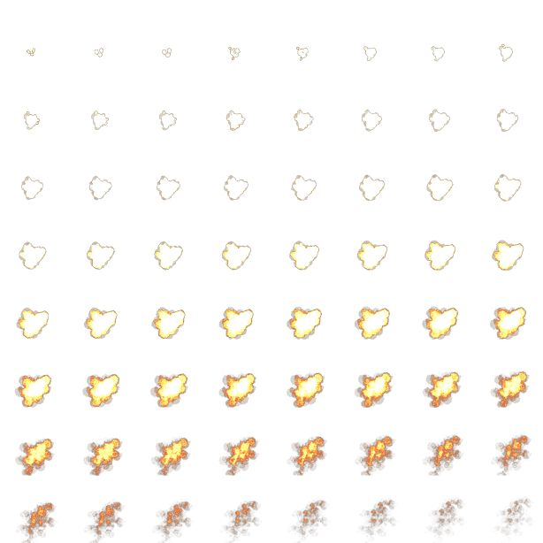
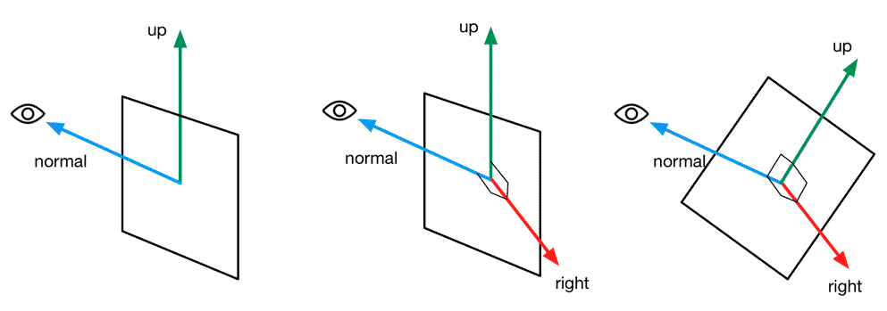

## 纹理动画(UV偏移)

​	纹理动画在游戏中的应用非常广泛。尤其在各种资源都比较局限的移动平台上，我们往往会使用纹理动画来代替复杂的粒子系统等模拟各种动画效果。


### 序列帧动画

​	最常见的纹理动画之一就是序列帧动画。序列帧动画的原理非常简单，它像放电影一样，依次播放一系列关键帧图像，当播放速度达到一定数值时，看起来就是一个连续的动画。它的优点在于灵活性很强，我们不需要进行任何物理计算就可以得到非常细腻的动画效果。而它的缺点也很明显，由于序列帧中每张关键帧图像都不一样，因此，要制作一张出色的序列帧纹理所需要的美术工程量也比较大。

要想实现序列帧动画，我们先要提供一张包含了关键帧图像的图像。在本书资源中，我们提供了这样一张图像,如下图所示。

​									

上述图像包含了8 × 8张关键帧图像，它们的大小相同，而且播放顺序为从左到右、从上到下。

示例代码：

```c#
Shader "Unity Shaders Book/Chapter 11/Image Sequence Animation" {
	Properties {
		_Color ("Color Tint", Color) = (1, 1, 1, 1)
		_MainTex ("Image Sequence", 2D) = "white" {}
    	_HorizontalAmount ("Horizontal Amount", Float) = 4
    	_VerticalAmount ("Vertical Amount", Float) = 4
    	_Speed ("Speed", Range(1, 100)) = 30
	}
	SubShader {
		Tags {"Queue"="Transparent" "IgnoreProjector"="True" "RenderType"="Transparent"}
		
		Pass {
			Tags { "LightMode"="ForwardBase" }
			
			ZWrite Off
			Blend SrcAlpha OneMinusSrcAlpha
			
			CGPROGRAM
			
			#pragma vertex vert  
			#pragma fragment frag
			
			#include "UnityCG.cginc"
			
			fixed4 _Color;
			sampler2D _MainTex;
			float4 _MainTex_ST;
			float _HorizontalAmount;
			float _VerticalAmount;
			float _Speed;
			  
			struct a2v {  
			    float4 vertex : POSITION; 
			    float2 texcoord : TEXCOORD0;
			};  
			
			struct v2f {  
			    float4 pos : SV_POSITION;
			    float2 uv : TEXCOORD0;
			};  
			
			v2f vert (a2v v) {  
				v2f o;  
				o.pos = mul(UNITY_MATRIX_MVP, v.vertex);  
				o.uv = TRANSFORM_TEX(v.texcoord, _MainTex);  
				return o;
			}  
			
			fixed4 frag (v2f i) : SV_Target {
				float time = floor(_Time.y * _Speed);  //floor函数是向下取整 
				//将时间除以行数作为当前的行数
                float row = floor(time / _HorizontalAmount);
				//将时间除以行数的余数作为当前的列数
                float column = time - row * _HorizontalAmount;
				
                //将当前的行和列映射到uv坐标上
				//half2 uv = float2(i.uv.x /_HorizontalAmount, i.uv.y / _VerticalAmount);
				//uv.x += column / _HorizontalAmount;	
				//uv.y -= row / _VerticalAmount;
				
                //相当于上面的计算换了步骤，先相加，然后映射
                half2 uv = i.uv + half2(column, -row);
				uv.x /=  _HorizontalAmount;
				uv.y /= _VerticalAmount;
				//对纹理进行采样
				fixed4 c = tex2D(_MainTex, uv);
				c.rgb *= _Color;	
				return c;
			}
			ENDCG
		}  
	}
	FallBack "Transparent/VertexLit"
}
```

​	要播放帧动画，从本质来说，我们需要计算出每个时刻需要播放的关键帧在纹理中的位置。而由于序列帧纹理都是按行按列排列的，因此这个位置可以认为是该关键帧所在的行列索引数。因此，在上面的代码的前3行中我们计算了行列数，其中使用了Unity的内置时间变量 _ Time。Time.y就是自该场景加载后所经过的时间。我们首先把 _ Time.y和速度属性_ Speed相乘来得到模拟的时间，并使用CG的floor函数对结果值取整来得到整数时间time。然后，**我们使用time除以_HorizontalAmount的结果值的商来作为当前对应的行索引，除法结果的余数则是列索引。**接下来，我们需要使用行列索引值来构建真正的采样坐标。由于序列帧图像包含了许多关键帧图像，这意味着采样坐标需要映射到每个关键帧图像的坐标范围内。**我们可以首先把原纹理坐标i.uv按行数和列数进行等分，得到每个子图像的纹理坐标范围。然后，我们需要使用当前的行列数对上面的结果进行偏移**，得到当前子图像的纹理坐标。**需要注意的是，对竖直方向的坐标偏移需要使用减法，这是因为在Unity中纹理坐标竖直方向的顺序（从下到上逐渐增大）和序列帧纹理中的顺序（播放顺序是从上到下）是相反的。这对应了上面代码中注释掉的代码部分**。我们可以把上述过程中的除法整合到一起，就得到了注释下方的代码。这样，我们就得到了真正的纹理采样坐标。


### 滚动的背景

​	很多2D游戏都使用了不断滚动的背景来模拟游戏角色在场景中的穿梭，这些背景往往包含了多个层（layers）来模拟一种视差效果。而这些背景的实现往往就是利用了纹理动画。

示例代码：

```c#
Shader "Unity Shaders Book/Chapter 11/Scrolling Background" {
	Properties {
		_MainTex ("Base Layer (RGB)", 2D) = "white" {}
		_DetailTex ("2nd Layer (RGB)", 2D) = "white" {}
		_ScrollX ("Base layer Scroll Speed", Float) = 1.0
		_Scroll2X ("2nd layer Scroll Speed", Float) = 1.0
		_Multiplier ("Layer Multiplier", Float) = 1   //此参数用于控制纹理的整体亮度
	}
	SubShader {
		Tags { "RenderType"="Opaque" "Queue"="Geometry"}
		
		Pass { 
			Tags { "LightMode"="ForwardBase" }
			
			CGPROGRAM
			
			#pragma vertex vert
			#pragma fragment frag
			
			#include "UnityCG.cginc"
			
			sampler2D _MainTex;
			sampler2D _DetailTex;
			float4 _MainTex_ST;
			float4 _DetailTex_ST;
			float _ScrollX;
			float _Scroll2X;
			float _Multiplier;
			
			struct a2v {
				float4 vertex : POSITION;
				float4 texcoord : TEXCOORD0;
			};
			
			struct v2f {
				float4 pos : SV_POSITION;
				float4 uv : TEXCOORD0;
			};
			
			v2f vert (a2v v) {
				v2f o;
				o.pos = mul(UNITY_MATRIX_MVP, v.vertex);
				
				o.uv.xy = TRANSFORM_TEX(v.texcoord, _MainTex) + frac(float2(_ScrollX, 0.0) * _Time.y);
				o.uv.zw = TRANSFORM_TEX(v.texcoord, _DetailTex) + frac(float2(_Scroll2X, 0.0) * _Time.y);
				
				return o;
			}
			
			fixed4 frag (v2f i) : SV_Target {
				fixed4 firstLayer = tex2D(_MainTex, i.uv.xy);
				fixed4 secondLayer = tex2D(_DetailTex, i.uv.zw);
				fixed4 c = lerp(firstLayer, secondLayer, secondLayer.a);
				c.rgb *= _Multiplier;
				return c;
			}
			
			ENDCG
		}
	}
	FallBack "VertexLit"
}
```

​	我们首先进行了最基本的顶点变换，把顶点从模型空间变换到裁剪空间中。然后，我们计算了两层背景纹理的纹理坐标。为此，我们首先利用TRANSFORM_TEX来得到初始的纹理坐标。然后，我们利用内置的_Time.y变量在水平方向上对纹理坐标进行偏移，以此达到滚动的效果。我们把两张纹理的纹理坐标存储在同一个变量o.uv中，以减少占用的插值寄存器空间。

​	在片元着色器中我们首先分别利用i.uv.xy和i.uv.zw对两张背景纹理进行采样。然后，使用第二层纹理的透明通道来混合两张纹理，这使用了CG的lerp函数。最后，我们使用_Multiplier参数和输出颜色进行相乘，以调整背景亮度。


## 顶点动画（vertex）

​	如果一个游戏中所有的物体都是静止的，这样枯燥的世界恐怕很难引起玩家的兴趣。顶点动画可以让我们的场景变得更加生动有趣。在游戏中，我们常常使用顶点动画来模拟飘动的旗帜、湍流的小溪等效果。在本节中，我们将学习两种常见的顶点动画的应用——流动的河流以及广告牌技术。


### 流动的河流

​	河流的模拟是顶点动画最常见的应用之一。它的原理通常就是使用正弦函数等来模拟水流的波动效果。

示例代码：

```c#
Shader "Unity Shaders Book/Chapter 11/Water" {
	Properties {
		_MainTex ("Main Tex", 2D) = "white" {}
		_Color ("Color Tint", Color) = (1, 1, 1, 1)
		_Magnitude ("Distortion Magnitude", Float) = 1
 		_Frequency ("Distortion Frequency", Float) = 1
 		_InvWaveLength ("Distortion Inverse Wave Length", Float) = 10 //波长的倒数
 		_Speed ("Speed", Float) = 0.5
	}
	SubShader {
		// Need to disable batching because of the vertex animation
		Tags {"Queue"="Transparent" "IgnoreProjector"="True" "RenderType"="Transparent" "DisableBatching"="True"}
		
		Pass {
			Tags { "LightMode"="ForwardBase" }
			
			ZWrite Off
			Blend SrcAlpha OneMinusSrcAlpha
			Cull Off
			
			CGPROGRAM  
			#pragma vertex vert 
			#pragma fragment frag
			
			#include "UnityCG.cginc" 
			
			sampler2D _MainTex;
			float4 _MainTex_ST;
			fixed4 _Color;
			float _Magnitude;
			float _Frequency;
			float _InvWaveLength;
			float _Speed;
			
			struct a2v {
				float4 vertex : POSITION;
				float4 texcoord : TEXCOORD0;
			};
			
			struct v2f {
				float4 pos : SV_POSITION;
				float2 uv : TEXCOORD0;
			};
			
			v2f vert(a2v v) {
				v2f o;
				
				float4 offset;
				offset.yzw = float3(0.0, 0.0, 0.0);
                //为了让不同位置具有不同的位移，我们对上述结果加上了模型空间下的位置分量，并乘以_InvWaveLength来控制波长。
				offset.x = sin(_Frequency * _Time.y + v.vertex.x * _InvWaveLength + v.vertex.y * _InvWaveLength + v.vertex.z * _InvWaveLength) * _Magnitude;
				o.pos = mul(UNITY_MATRIX_MVP, v.vertex + offset);
				
				o.uv = TRANSFORM_TEX(v.texcoord, _MainTex);
				o.uv +=  float2(0.0, _Time.y * _Speed);
				
				return o;
			}
			
			fixed4 frag(v2f i) : SV_Target {
				fixed4 c = tex2D(_MainTex, i.uv);
				c.rgb *= _Color.rgb;
				
				return c;
			} 
			
			ENDCG
		}
	}
	FallBack "Transparent/VertexLit"
}
```

​	我们首先计算顶点位移量。我们只希望对顶点的x方向进行位移，因此yzw的位移量被设置为0。然后，我们利用_ Frequency属性和内置的_ Time.y变量来控制正弦函数的频率。为了让不同位置具有不同的位移，我们对上述结果加上了模型空间下的位置分量，并乘以_ InvWaveLength来控制波长。最后，我们对结果值乘以_Magnitude属性来控制波动幅度，得到最终的位移。剩下的工作，我们只需要把位移量添加到顶点位置上，再进行正常的顶点变换即可。

​	在上面的代码中，我们还进行了纹理动画，即使用_ Time.y和_Speed来控制在水平方向上的纹理动画


### 广告牌

​	另一种常见的顶点动画就是**广告牌技术　（Billboarding）**。**广告牌技术会根据视角方向来旋转一个被纹理着色的多边形（通常就是简单的四边形，这个多边形就是广告牌），使得多边形看起来好像总是面对着摄像机。广告牌技术被用于很多应用，比如渲染烟雾、云朵、闪光效果等。**

​	**广告牌技术的本质就是构建旋转矩阵，而我们知道一个变换矩阵需要3个基向量。广告牌技术使用的基向量通常就是表面法线　（normal）、指向上的方向　（up）以及指向右的方向　（right）。除此之外，我们还需要指定一个锚点　（anchor location），这个锚点在旋转过程中是固定不变的，以此来确定多边形在空间中的位置。**

​	广告牌技术的难点在于，如何根据需求来构建3个相互正交的基向量。计算过程通常是，我们首先会通过初始计算得到目标的表面法线（例如就是视角方向）和指向上的方向，而两者往往是不垂直的。但是，两者其中之一是固定的，例如当模拟草丛时，我们希望广告牌的指向上的方向永远是(0, 1, 0)，而法线方向应该随视角变化；而当模拟粒子效果时，我们希望广告牌的法线方向是固定的，即总是指向视角方向，指向上的方向则可以发生变化。我们假设法线方向是固定的，首先，我们根据初始的表面法线和指向上的方向来计算出目标方向的指向右的方向（通过叉积操作）：

　　															**right=up×normal**

​	对其归一化后，再由法线方向和指向右的方向计算出正交的指向上的方向即可：

　　															**up'=normal×right**

​	至此，我们就可以得到用于旋转的3个正交基了。下图给出了上述计算过程的图示。如果指向上的方向是固定的，计算过程也是类似的。



示例代码：

```c#
Shader "Unity Shaders Book/Chapter 11/Billboard" {
	Properties {
		_MainTex ("Main Tex", 2D) = "white" {}
		_Color ("Color Tint", Color) = (1, 1, 1, 1)
		_VerticalBillboarding ("Vertical Restraints", Range(0, 1)) = 1 
	}
	SubShader {
		// Need to disable batching because of the vertex animation
		Tags {"Queue"="Transparent" "IgnoreProjector"="True" "RenderType"="Transparent" "DisableBatching"="True"}
		
		Pass { 
			Tags { "LightMode"="ForwardBase" }
			
			ZWrite Off
			Blend SrcAlpha OneMinusSrcAlpha
			Cull Off
		
			CGPROGRAM
			
			#pragma vertex vert
			#pragma fragment frag
			
			#include "Lighting.cginc"
			
			sampler2D _MainTex;
			float4 _MainTex_ST;
			fixed4 _Color;
			fixed _VerticalBillboarding;
			
			struct a2v {
				float4 vertex : POSITION;
				float4 texcoord : TEXCOORD0;
			};
			
			struct v2f {
				float4 pos : SV_POSITION;
				float2 uv : TEXCOORD0;
			};
			
			v2f vert (a2v v) {
				v2f o;
				
				// Suppose the center in object space is fixed
				float3 center = float3(0, 0, 0);
				float3 viewer = mul(_World2Object,float4(_WorldSpaceCameraPos, 1));
				
				float3 normalDir = viewer - center;
		
        //If _VerticalBillboarding equals 1, we use the desired view dir as the normal dir
		// Which means the normal dir is fixed
		// Or if _VerticalBillboarding equals 0, the y of normal is 0
		// Which means the up dir is fixed
               	//如果_VerticalBillboarding为1，表示法线方向一直是视角方向，如果
                //_VerticalBillboarding为0，那么视角方向的y值为0，表示上方向固定
				normalDir.y =normalDir.y * _VerticalBillboarding;
				normalDir = normalize(normalDir);
				// Get the approximate up dir
				// If normal dir is already towards up, then the up dir is towards front
                //判断视角方向是否和上方向重合
                
				float3 upDir = abs(normalDir.y) > 0.999 ? float3(0, 0, 1) : float3(0, 1, 0);
				float3 rightDir = normalize(cross(upDir, normalDir));
				upDir = normalize(cross(normalDir, rightDir));
				
				// Use the three vectors to rotate the quad
                //利用新的坐标轴求的顶点变换后的位置
				float3 centerOffs = v.vertex.xyz - center;
				float3 localPos = center + rightDir * centerOffs.x + upDir * centerOffs.y + normalDir * centerOffs.z;
              
				o.pos = mul(UNITY_MATRIX_MVP, float4(localPos, 1));
				o.uv = TRANSFORM_TEX(v.texcoord,_MainTex);

				return o;
			}
			
			fixed4 frag (v2f i) : SV_Target {
				fixed4 c = tex2D (_MainTex, i.uv);
				c.rgb *= _Color.rgb;
				
				return c;
			}
			
			ENDCG
		}
	} 
	FallBack "Transparent/VertexLit"
}
```

​	当_ VerticalBillboarding为1时，意味着法线方向固定为视角方向；当_VerticalBillboarding为0时，意味着向上方向固定为(0, 1, 0)。最后，我们需要对计算得到的法线方向进行归一化操作来得到单位矢量。

​	接着，我们得到了粗略的向上方向。为了防止法线方向和向上方向平行（如果平行，那么叉积得到的结果将是错误的），我们对法线方向的y分量进行判断，以得到合适的向上方向。然后，根据法线方向和粗略的向上方向得到向右方向，并对结果进行归一化。但由于此时向上的方向还是不准确的，我们又根据准确的法线方向和向右方向得到最后的向上方向。

​	这样，我们得到了所需的3个正交基矢量。我们根据原始的位置相对于锚点的偏移量以及3个正交基矢量，以计算得到新的顶点位置。

​	需要说明的是，在上面的例子中，我们使用的是Unity自带的四边形（Quad）来作为广告牌，而不能使用自带的平面（Plane）。**这是因为，我们的代码是建立在一个竖直摆放的多边形的基础上的，也就是说，这个多边形的顶点结构需要满足在模型空间下是竖直排列的。只有这样，我们才能使用v.vertex来计算得到正确的相对于中心的位置偏移量。**


### 注意事项

​	顶点动画虽然非常灵活有效，但有一些注意事项需要在此提醒读者。	

​	如果我们在模型空间下进行了一些顶点动画，那么批处理往往就会破坏这种动画效果。这时，我们可以通过SubShader的DisableBatching标签来强制取消对该Unity Shader的批处理。然而，取消批处理会带来一定的性能下降，增加了Draw Call，**因此我们应该尽量避免使用模型空间下的一些绝对位置和方向来进行计算。在广告牌的例子中，为了避免显式使用模型空间的中心来作为锚点，我们可以利用顶点颜色来存储每个顶点到锚点的距离值，这种做法在商业游戏中很常见。**

​	其次，如果我们想要对包含了顶点动画的物体添加阴影，那么如果仍然使用内置的Diffuse等包含的阴影Pass来渲染，就得不到正确的阴影效果（这里指的是无法向其他物体正确地投射阴影）。这是因为，我们讲过Unity的阴影绘制需要调用一个ShadowCaster Pass，而如果直接使用这些内置的ShadowCaster Pass，这个Pass中并没有进行相关的顶点动画，因此Unity会仍然按照原来的顶点位置来计算阴影，这并不是我们希望看到的。这时，我们就需要提供一个自定义的ShadowCaster Pass，在这个Pass中，我们将进行同样的顶点变换过程。需要注意的是，在前面的实现中，如果涉及半透明物体我们都把Fallback设置成了Transparent/VertexLit，而Transparent/VertexLit没有定义ShadowCaster Pass，因此也就不会产生阴影。

​	为了让进行了顶点动画的模型任然能够正确的投射阴影，我们可以给shader中新添加一个shadowCaster的pass来进行阴影的计算。如下（**针对本笔记中流动的河流**）：

```c#
Pass {
    Tags { "LightMode" = "ShadowCaster" }

    CGPROGRAM

    #pragma vertex vert
    #pragma fragment frag

    #pragma multi_compile_shadowcaster

    #include "UnityCG.cginc"

    float _Magnitude;
    float _Frequency;
    float _InvWaveLength;
    float _Speed;

    struct a2v {
        float4 vertex : POSITION;
        float4 texcoord : TEXCOORD0;
    };

    struct v2f { 
        V2F_SHADOW_CASTER;
    };

    v2f vert(a2v v) {
        v2f o;

        float4 offset;

        offset.yzw = float3(0.0, 0.0, 0.0);

        offset.x = sin(_Frequency * _Time.y + v.vertex.x * _InvWaveLength + v.vertex.y   
        * _InvWaveLength + v.vertex.z * _InvWaveLength) * _Magnitude;

        v.vertex = v.vertex + offset;

        TRANSFER_SHADOW_CASTER_NORMALOFFSET(o)

        return o;
    }

    fixed4 frag(v2f i) : SV_Target {
        SHADOW_CASTER_FRAGMENT(i)
    }
    ENDCG
}
```

​	阴影投射的重点在于我们需要按正常Pass的处理来剔除片元或进行顶点动画，以便阴影可以和物体正常渲染的结果相匹配。**在自定义的阴影投射的Pass中，我们通常会使用Unity提供的内置宏V2F_SHADOW_CASTER、TRANSFER_SHADOW_CASTER_NORMALOFFSET（旧版本中会使用TRANSFER_SHADOW_CASTER）和SHADOW_CASTER_FRAGMENT来计算阴影投射时需要的各种变量，而我们可以只关注自定义计算的部分**。在上面的代码中，我们首先在v2f结构体中利用V2F_SHADOW_CASTER来定义阴影投射需要定义的变量。随后，在顶点着色器中，我们首先按之前对顶点的处理方法计算顶点的偏移量，不同的是，我们直接把偏移值加到顶点位置变量中，再使用TRANSFER_SHADOW_CASTER_NORMALOFFSET来让Unity为我们完成剩下的事情。在片元着色器中，我们直接使用SHADOW_CASTER_FRAGMENT来让Unity自动完成阴影投射的部分，把结果输出到深度图和阴影映射纹理中。

​	通过Unity提供的这3个内置宏（在UnityCG.cginc文件中被定义），我们可以方便地自定义需要的阴影投射的Pass，但由于这些宏里需要使用一些特定的输入变量，因此我们需要保证为它们提供了这些变量。例如，TRANSFER_SHADOW_CASTER_NORMALOFFSET会使用名称v作为输入结构体，v中需要包含顶点位置v.vertex和顶点法线v.normal的信息，我们可以直接使用内置的appdata_base结构体，它包含了这些必需的顶点变量。如果我们需要进行顶点动画，可以在顶点着色器中直接修改v.vertex，再传递给TRANSFER_SHADOW_CASTER_NORMALOFFSET即可。


