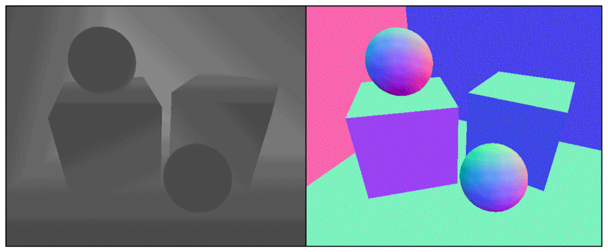

## 						 


## 获取深入和法线纹理

### 原理:

​	深度纹理实际就是一张渲染纹理，只不过它里面存储的像素值不是颜色值，而是一个高精度的深度值。由于被存储在一张纹理中，深度纹理里的深度值范围是[0, 1]，而且通常是非线性分布的。那么，这些深度值是从哪里得到的呢？要回答这个问题，我们需要回顾下顶点变换的过程。总体来说，这些深度值来自于顶点变换后得到的**归一化的设备坐标（Normalized Device Coordinates ，NDC）**。回顾一下，一个模型要想最终被绘制在屏幕上，需要把它的顶点从模型空间变换到齐次裁剪坐标系下，这是通过在顶点着色器中乘以MVP变换矩阵得到的。在变换的最后一步，我们需要使用一个投影矩阵来变换顶点，当我们使用的是透视投影类型的摄像机时，这个投影矩阵就是非线性的。


​																					图1


​																					图2

​	图1显示了Unity中透视投影对顶点的变换过程（从观察空间到裁剪空间）。图1中最左侧的图显示了投影变换前，即观察空间下视锥体的结构及相应的顶点位置，中间的图显示了应用透视裁剪矩阵后的变换结果，即顶点着色器阶段输出的顶点变换结果，最右侧的图则是底层硬件进行了透视除法后得到的归一化的设备坐标。需要注意的是，这里的投影过程是建立在Unity对坐标系的假定上的，也就是说，我们针对的是观察空间为右手坐标系，使用列矩阵在矩阵右侧进行相乘，且变换到NDC后z分量范围将在[−1, 1]之间的情况。而在类似DirectX这样的图形接口中，变换后z分量范围将在[0, 1]之间。如果需要在其他图形接口下实现本章的类似效果，需要对一些计算参数做出相应变化。

​	图2显示了在使用正交摄像机时投影变换的过程。同样，变换后会得到一个范围为[−1, 1]的立方体。正交投影使用的变换矩阵是线性的。

​	在得到NDC后，深度纹理中的像素值就可以很方便地计算得到了，这些深度值就对应了NDC中顶点坐标的z分量的值。由于NDC中z分量的范围在[−1, 1]，为了让这些值能够存储在一张图像中，我们需要使用下面的公式对其进行映射：

​																		**d=0.5·Z（ndc）+0.5**

​	**其中，d对应了深度纹理中的像素值，Zndc对应了NDC坐标中的z分量的值。**

​	那么Unity是怎么得到这样一张深度纹理的呢？在Unity中，深度纹理可以直接来自于真正的深度缓存，也可以是由一个单独的Pass渲染而得，这取决于使用的渲染路径和硬件。通常来讲，当使用延迟渲染路径（包括遗留的延迟渲染路径）时，深度纹理理所当然可以访问到，因为延迟渲染会把这些信息渲染到G-buffer中。而当无法直接获取深度缓存时，深度和法线纹理是通过一个单独的Pass渲染而得的。具体实现是，Unity会使用着色器替换（Shader Replacement）技术选择那些渲染类型（即SubShader的RenderType标签）为Opaque的物体，判断它们使用的渲染队列是否小于等于2 500（内置的Background、Geometry和AlphaTest渲染队列均在此范围内），如果满足条件，就把它渲染到深度和法线纹理中。因此，**要想让物体能够出现在深度和法线纹理中，就必须在Shader中设置正确的RenderType标签。**

​	在Unity中，我们可以选择让一个摄像机生成一张深度纹理或是一张深度+法线纹理。当选择前者，即只需要一张单独的深度纹理时，Unity会直接获取深度缓存或是按之前讲到的着色器替换技术，选取需要的不透明物体，并使用它投射阴影时使用的Pass（即LightMode被设置为ShadowCaster的Pass）来得到深度纹理。如果Shader中不包含这样一个Pass，那么这个物体就不会出现在深度纹理中（当然，它也不能向其他物体投射阴影）。深度纹理的精度通常是24位或16位，这取决于使用的深度缓存的精度。如果选择生成一张深度+法线纹理，Unity会创建一张和屏幕分辨率相同、精度为32位（每个通道为8位）的纹理，**其中观察空间下的法线信息会被编码进纹理的R和G通道，而深度信息会被编码进B和A通道**。法线信息的获取在延迟渲染中是可以非常容易就得到的，Unity只需要合并深度和法线缓存即可。而在前向渲染中，默认情况下是不会创建法线缓存的，因此Unity底层使用了一个单独的Pass把整个场景再次渲染一遍来完成。这个Pass被包含在Unity内置的一个Unity Shader中，我们可以在内置的builtin_shaders-xxx/DefaultResources/Camera-DepthNormalTexture.shader文件中找到这个用于渲染深度和法线信息的Pass。


### 如何获取

​	在Unity中，获取深度纹理是非常简单的，我们只需要告诉Unity：“嘿，把深度纹理给我！”然后再在Shader中直接访问特定的纹理属性即可。这个与Unity沟通的过程是通过在脚本中设置摄像机的depthTextureMode来完成的，例如我们可以通过下面的代码来获取深度纹理：

```c#
camera.depthTextureMode = DepthTextureMode.Depth;
```

​	一旦设置好了上面的摄像机模式后，我们就可以在Shader中通过声明_CameraDepthTexture变量来访问它。这个过程非常简单，但我们需要知道这两行代码的背后，

​	同理，如果想要获取深度+法线纹理，我们只需要在代码中这样设置：

```c#
camera.depthTextureMode = DepthTextureMode.DepthNormals;
```

​	然后在Shader中通过声明_CameraDepthNormalsTexture变量来访问它。

​	我们还可以组合这些模式，让一个摄像机同时产生一张深度和深度+法线纹理：

```c#
**其中，d对应了深度纹理中的像素值，Zndc对应了NDC坐标中的z分量的值。**camera.depthTextureMode |= DepthTextureMode.Depth;
camera.depthTextureMode |= DepthTextureMode.DepthNormals;
```

<br/><br/><br/>

​	在Unity 5中，我们还可以在摄像机的Camera组件上看到当前摄像机是否需要渲染深度或深度+法线纹理。当在Shader中访问到深度纹理_CameraDepthTexture后，我们就可以使用当前像素的纹理坐标对它进行采样。绝大多数情况下，我们直接使用tex2D函数采样即可，但在某些平台（例如PS3和PSP2）上，我们需要一些特殊处理。Unity为我们提供了一个统一的宏SAMPLE_DEPTH_TEXTURE，用来处理这些由于平台差异造成的问题。而我们只需要在Shader中使用SAMPLE_DEPTH_TEXTURE宏对深度纹理进行采样，例如：

```c#
float d = SAMPLE_DEPTH_TEXTURE(_CameraDepthTexture, i.uv);
```

​	**其中，i.uv是一个float2类型的变量，对应了当前像素的纹理坐标**。类似的宏还有SAMPLEDEPTH_TEXTURE_PROJ和SAMPLE_DEPTH_TEXTURE_LOD。SAMPLE_DEPTH TEXTURE_PROJ宏同样接受两个参数—深度纹理和一个float3或float4类型的纹理坐标，它的内部使用了tex2Dproj这样的函数进行投影纹理采样，纹理坐标的前两个分量首先会除以最后一个分量，再进行纹理采样。如果提供了第四个分量，还会进行一次比较，通常用于阴影的实现中。SAMPLE_DEPTH_TEXTURE_PROJ的第二个参数通常是由顶点着色器输出插值而得的屏幕坐标，例如：

```c#
float d = SAMPLE_DEPTH_TEXTURE_PROJ(_CameraDepthTexture, UNITY_PROJ_COORD(i.scrPos));
```

​	其中，i.scrPos是在顶点着色器中通过调用ComputeScreenPos(o.pos)得到的屏幕坐标。上述这些宏的定义，读者可以在Unity内置的HLSLSupport.cginc文件中找到。

​	当通过纹理采样得到深度值后，这些深度值往往是非线性的，这种非线性来自于透视投影使用的裁剪矩阵。然而，在我们的计算过程中通常是需要线性的深度值，也就是说，我们需要把投影后的深度值变换到线性空间下，例如视角空间下的深度值。那么，我们应该如何进行这个转换呢？实际上，我们只需要倒推顶点变换的过程即可。下面我们以透视投影为例，推导如何由深度纹理中的深度信息计算得到视角空间下的深度值。

​	当我们使用透视投影的裁剪矩阵Pclip对视角空间下的一个顶点进行变换后，裁剪空间下顶点的z和w分量为：


​	其中，Far和Near分别是远近裁剪平面的距离。然后，我们通过齐次除法就可以得到NDC下的z分量：


​	而深度纹理中的深度值是通过下面的公式由NDC计算而得的：

​																			**d=0.5·Z（ndc）+0.5**

​	由上面的这些式子，我们可以推导出用d表示而得的**Zview**的表达式：


​	由于在Unity使用的视角空间中，摄像机正向对应的z值均为负值，因此为了得到深度值的正数表示，我们需要对上面的结果取反，最后得到的结果如下：


​	它的取值范围就是视锥体深度范围，即[Near, Far]。如果我们想得到范围在[0, 1]之间的深度值，只需要把上面得到的结果除以Far即可。这样，0就表示该点与摄像机位于同一位置，1表示该点位于视锥体的远裁剪平面上。结果如下：


​	幸运的是，**Unity提供了两个辅助函数来为我们进行上述的计算过程—LinearEyeDepth和 Linear01Depth。LinearEyeDepth负责把深度纹理的采样结果转换到视角空间下的深度值，也就是我们上面得到的Z'view。而Linear01Depth则会返回一个范围在[0，1]的线性深度值，也就是我们上面得到的Z01。这两个函数内部使用了内置的_ZBufferParams变量来得到远近裁剪平面的距离。**

​	如果我们需要获取深度+法线纹理，可以直接使用tex2D函数对_CameraDepthNormalsTexture进行采样，得到里面存储的深度和法线信息。Unity提供了辅助函数来为我们对这个采样结果进行解码，从而得到深度值和法线方向。这个函数是DecodeDepthNormal，它在UnityCG.cginc里被定义：

```c#
inline void DecodeDepthNormal( float4 enc, out float depth, out float3 normal )
{
    depth = DecodeFloatRG (enc.zw);
    normal = DecodeViewNormalStereo (enc);
}
```

​	DecodeDepthNormal的第一个参数是对深度+法线纹理的采样结果，这个采样结果是Unity对深度和法线信息编码后的结果，它的xy分量存储的是视角空间下的法线信息，而深度信息被编码进了zw分量。通过调用DecodeDepthNormal函数对采样结果解码后，我们就可以得到解码后的深度值和法线。这个深度值是范围在[0, 1]的线性深度值（这与单独的深度纹理中存储的深度值不同），而得到的法线则是视角空间下的法线方向。同样，我们也可以通过调用DecodeFloatRG和DecodeViewNormalStereo来解码深度+法线纹理中的深度和法线信息。


### 查看深度和法线纹理

​	很多时候，我们希望可以查看生成的深度和法线纹理，以便对Shader进行调试。Unity 5提供了一个方便的方法来查看摄像机生成的深度和法线纹理，这个方法就是利用帧调试器（Frame Debugger）。下图显示了使用帧调试器查看到的深度纹理和深度+法线纹理。


​	使用Frame Debugger查看深度纹理（左）和深度+法线纹理（右）。如果当前摄像机需要生成深度和法线纹理，帧调试器的面板中就会出现相应的渲染事件。只要单击对应的事件就可以查看得到的深度和法线纹理

<br/>

<br/>

​	使用帧调试器查看到的深度纹理是非线性空间的深度值，而深度+法线纹理都是由Unity编码后的结果。有时，显示出线性空间下的深度信息或解码后的法线方向会更加有用。此时，我们可以自行在片元着色器中输出转换或解码后的深度和法线值，如下图所示。



​	<br/>

输出代码非常简单，我们可以使用类似下面的代码来输出线性深度值：	

```c#
float depth = SAMPLE_DEPTH_TEXTURE(_CameraDepthTexture, i.uv);
float linearDepth = Linear01Depth(depth);
return fixed4(linearDepth, linearDepth, linearDepth, 1.0);
```

或是输出法线方向：

```c#
fixed3 normal = DecodeViewNormalStereo(tex2D(_CameraDepthNormalsTexture, i.uv).xy);
return fixed4(normal * 0.5 + 0.5, 1.0);
```


### 运动模糊

​	产生运动模糊效果，一般来说有两种做法，第一种是将当前帧和下一帧或上一帧等等图像混合起来作为当前的屏幕图像，这样做法可以导致物体运动时会出现多个残影（因为多个帧混合起来了），可以产生运动模糊效果，但效率不高。

​	第二种做法是，在Shader里面利用View-Projection矩阵及其逆矩阵获得当前帧和上一帧的世界坐标，通过这两个坐标得到当前像素的运动速度及其方向，再根据这个速度，向这个像素速度方向的N个纹素进行取样并混合，从而产生模糊效果。

[从NDC坐标转换到世界坐标](https://www.cnblogs.com/sword-magical-blog/p/10483459.html)


### 全局雾效

​	

​	雾效（Fog）是游戏里经常使用的一种效果。Unity内置的雾效可以产生基于距离的线性或指数雾效。然而，要想在自己编写的顶点/片元着色器中实现这些雾效，我们需要在Shader中添加#pragma multi_compile_fog指令，同时还需要使用相关的内置宏，例如UNITY_FOG_COORDS、UNITY_TRANSFER_FOG和UNITY_APPLY_FOG等。这种方法的缺点在于，我们不仅需要为场景中所有物体添加相关的渲染代码，而且能够实现的效果也非常有限。当我们需要对雾效进行一些个性化操作时，例如使用基于高度的雾效等，仅仅使用Unity内置的雾效就变得不再可行。

​	**Unity内置的雾效需要在每个shader中分别编写，造成了极大的不便。这里利用屏幕后处理产生可单独控制且自由度更高的雾效。**

<br/>

​	**HINT：屏幕后雾效的本质在于，通过深度纹理重构出每个像素在世界空间中的位置，根据得到的世界坐标计算出雾效系数，最后利用雾效系数与雾的颜色相乘并与原始颜色进行插值运算得出最终效果。**

<br/>

​	下面我们将会学习一种基于屏幕后处理的全局雾效的实现。使用这种方法，我们不需要更改场景内渲染的物体所使用的Shader代码，而仅仅依靠一次屏幕后处理的步骤即可。这种方法的自由性很高，我们可以方便地模拟各种雾效，例如均匀的雾效、基于距离的线性/指数雾效、基于高度的雾效等\


​													左边：原效果。右边：添加全局雾效后的效果

<br/>

<br/>

### 重建世界坐标

​	通过深度纹理中的深度值来重新构建像素的世界坐标，有两种方法。

​	**1、通过构建出当前像素的NDC坐标，再通过当前摄像机的视角*投影矩阵的逆矩阵来得到世界空间下的像素坐标，但是需要在片元着色器中进行矩阵乘法的操作，而这通常会影响游戏的性能。**

​	虽然在Image Effect中没有实际的顶点信息，但是带有纹理uv坐标信息以及获得深度信息，根据UV信息可以得知NDC下xy坐标，即：			

​																		Xndc=2∗uv.x−1

​																		Yndc=2∗uv.y−1

**最终如下代码：**

```c#
	//对深度纹理进行采样  范围（0,1）
	float d = SAMPLE_DEPTH_TEXTURE(_CameraDepthTexture, i.uv_depth);
    //根据uv和深度采样重构NDC  范围（-1,1）
    float4 H = float4(i.uv.x * 2 - 1, i.uv.y * 2 - 1, d * 2 - 1, 1);
    // 使用视角*投影矩阵的逆矩阵进行变换
    float4 D = mul(_CurrentViewProjectionInverseMatrix, H);
    // 最后再除以w分量得到世界坐标
    float4 worldPos = D / D.w;
```

​	**2、通过向量的基本运算求得，坐标系中的一个顶点坐标可以通过它相对于另一个顶点坐标的偏移量来求得。重建像素的世界坐标也是基于这样的思想。我们只需要知道摄像机在世界空间下的位置，以及世界空间下该像素相对于摄像机的偏移量，把它们相加就可以得到该像素的世界坐标。整个过程可以使用下面的代码来表示：**

```c#
float d = SAMPLE_DEPTH_TEXTURE(_CameraDepthTexture, i.uv_depth);
linearDepth=LinearEyeDepth（d）；
float4 worldPos = _WorldSpaceCameraPos + linearDepth * interpolatedRay;
```

​	其中，_WorldSpaceCameraPos是摄像机在世界空间下的位置，这可以由Unity的内置变量直接访问得到。而linearDepth * interpolatedRay则可以计算得到该像素相对于摄像机的偏移量，linearDepth是由深度纹理得到的线性深度值，**interpolatedRay是由顶点着色器输出并插值后得到的射线，它不仅包含了该像素到摄像机的方向，也包含了距离信息。**

<br/>

<br/>

### interpolatedRay的求解

​	interpolatedRay来源于对近裁剪平面的4个角的某个特定向量的插值，这4个向量包含了它们到摄像机的方向和距离信息，我们可以利用摄像机的近裁剪平面距离、FOV、横纵比计算而得。图1显示了计算时使用的一些辅助向量。为了方便计算，我们可以先计算两个向量—toTop和toRight，它们是起点位于近裁剪平面中心、分别指向摄像机正上方和正右方的向量。它们的计算公式如下：


​																						图1

<br/>


​																						图2

```c#
							halfHeight=Near * tan(FOV/2)
							toTop =camera.up × halfHeight
                            toRight =camera.right×halfHeight·aspect
```

​	其中，halfHeight是近裁剪平面高度的一半,Near是近裁剪平面的距离，FOV是竖直方向的视角范围，camera.up、camera.right分别对应了摄像机的正上方和正右方。

​	当得到这两个辅助向量后，我们就可以计算裁剪平面4个角相对于摄像机的方向了。它们的计算公式如下：

```c#
						TL=camera.forward·Near+toTop-toRight

						TR=camera.forward · Near+toTop+toRight

						BL=camera.forward · Near-toTop-toRight

						BR=camera.forward · Near-toTop+toRight
```

​	注意，上面求得的4个向量不仅包含了方向信息，它们的模对应了4个点(TL、TR、BL、BR)到摄像机的空间距离。由于我们得到的**线性深度值并非是点到摄像机的欧式距离，而是在z方向上的距离**，因此，我们不能直接使用深度值和4个角的单位方向的乘积来计算它们到摄像机的偏移量，如上图2所示。想要把深度值转换成到摄像机的欧式距离也很简单，我们以TL点为例，根据相似三角形原理，TL所在的射线上，像素的深度值和它到摄像机的实际距离的比等于近裁剪平面的距离和TL向量的模的比，即

```c#
									depth/dist=Near/|TL|
```

​	dist表示的是在TL射线上的点到摄像机的实际距离。

​	从而可以推导出下面的公式：

```c#
									dist=(|TL|/Near) * depth
                          定义一个值  scale=|TL|/Near                             
```

​	由于4个点相互对称，因此其他3个向量的模和TL相等，即我们**可以使用同一个因子和单位向量相乘，得到它们对应的向量值：**

```c#
	TL/|TL|表示将这个向量归一化成一个单位向量:
    								Ray_TL=TL/|TL| * scale
									Ray_TR=TR/|TR| * scale
									Ray_BL=BR/|BR| * scale
									Ray_BR=BR/|BR| * scale
```

​	<br/>

​	屏幕后处理的原理是使用特定的材质去渲染一个刚好填充整个屏幕的四边形面片。这个四边形面片的4个顶点就对应了近裁剪平面的4个角。因此，我们可以把上面的计算结果传递给顶点着色器，顶点着色器根据当前的位置选择它所对应的向量，然后再将其输出，经插值后传递给片元着色器得到interpolatedRay，我们就可以直接利用本节一开始提到的公式重建该像素在世界空间下的位置了。

<br/><br/><br/>

### 雾的计算

​	在简单的雾效实现中，我们需要计算一个**雾效系数f，作为混合原始颜色和雾的颜色的混合系数**：

```c#
			float3 afterFog = f * fogColor + (1 - f) * origColor;
```

​	这个雾效系数f有很多计算方法。在Unity内置的雾效实现中，支持三种雾的计算方式—线性（Linear）、指数（Exponential）以及指数的平方（Exponential Squared）。

​	Z：z为距离（一般是点的高度）   

1. #### 线性（Linear）：f=（d<sub>max </sub> - |z|）/(d<sub>max </sub> - d<sub>min</sub>)   d表示受雾影响的距离。

2. #### 指数（Exponential）：f=e<sup>-d * |z|</sup>                                d是控制浓度的参数。

3. #### 指数的平方：f = e<sup>-(d - |z|)<sup>2</sup></sup>                                              d是控制浓度的参数。


​	下面给出了以基于高度的雾效实现：

​	雾效系数以线性系数为准：f=（H<sub>max </sub> - y）/(H<sub>max </sub> - H<sub>min</sub>)   	

首先是C#代码：

```c#
using UnityEngine;
using System.Collections;

public class FogWithDepthTexture : PostEffectsBase {

	public Shader fogShader;
	private Material fogMaterial = null;

	public Material material {  
		get {
			fogMaterial = CheckShaderAndCreateMaterial(fogShader, fogMaterial);
			return fogMaterial;
		}  
	}

	private Camera myCamera;
	public Camera camera {
		get {
			if (myCamera == null) {
				myCamera = GetComponent<Camera>();
			}
			return myCamera;
		}
	}

	private Transform myCameraTransform;
	public Transform cameraTransform {
		get {
			if (myCameraTransform == null) {
				myCameraTransform = camera.transform;
			}

			return myCameraTransform;
		}
	}

	[Range(0.0f, 3.0f)]
	public float fogDensity = 1.0f; //控制雾的浓度,雾效系数

	public Color fogColor = Color.white;   //控制雾的颜色

	public float fogStart = 0.0f;   //控制雾开始的高度
	public float fogEnd = 2.0f;    //控制雾结束的高度

	void OnEnable() {
		camera.depthTextureMode |= DepthTextureMode.Depth;
	}
	
    //在图像的所有渲染操作全部完成后调用，而图像是几乎每帧都渲染
	void OnRenderImage (RenderTexture src, RenderTexture dest) {
		if (material != null) {
			Matrix4x4 frustumCorners = Matrix4x4.identity;

			float fov = camera.fieldOfView;
			float near = camera.nearClipPlane;
			float aspect = camera.aspect;

			float halfHeight = near * Mathf.Tan(fov * 0.5f * Mathf.Deg2Rad);
			Vector3 toRight = cameraTransform.right * halfHeight * aspect;
			Vector3 toTop = cameraTransform.up * halfHeight;

			Vector3 topLeft = cameraTransform.forward * near + toTop - toRight;
			float scale = topLeft.magnitude / near;

			topLeft.Normalize();
			topLeft *= scale;

			Vector3 topRight = cameraTransform.forward * near + toRight + toTop;
			topRight.Normalize();
			topRight *= scale;

			Vector3 bottomLeft = cameraTransform.forward * near - toTop - toRight;
			bottomLeft.Normalize();
			bottomLeft *= scale;

			Vector3 bottomRight = cameraTransform.forward * near + toRight - toTop;
			bottomRight.Normalize();
			bottomRight *= scale;

			frustumCorners.SetRow(0, bottomLeft);
			frustumCorners.SetRow(1, bottomRight);
			frustumCorners.SetRow(2, topRight);
			frustumCorners.SetRow(3, topLeft);

			material.SetMatrix("_FrustumCornersRay", frustumCorners);

			material.SetFloat("_FogDensity", fogDensity);
			material.SetColor("_FogColor", fogColor);
			material.SetFloat("_FogStart", fogStart);
			material.SetFloat("_FogEnd", fogEnd);

			Graphics.Blit (src, dest, material);
		} else {
			Graphics.Blit(src, dest);
		}
	}
}
```

​	OnRenderImage首先计算了近裁剪平面的四个角对应的向量，并把它们存储在一个矩阵类型的变量（frustumCorners）中。我们按一定顺序把这四个方向存储到了frustumCorners不同的行中，这个顺序是非常重要的，因为这决定了我们在顶点着色器中使用哪一行作为该点的待插值向量。随后，我们把结果和其他参数传递给材质shader，并调用Graphics.Blit (src, dest, material)把渲染结果显示在屏幕上。

s<br/><br/>

接下来是shader代码：

```c#
Shader "Unity Shaders Book/Chapter 13/Fog With Depth Texture" {
	Properties {
		_MainTex ("Base (RGB)", 2D) = "white" {}
		_FogDensity ("Fog Density", Float) = 1.0
		_FogColor ("Fog Color", Color) = (1, 1, 1, 1)
		_FogStart ("Fog Start", Float) = 0.0
		_FogEnd ("Fog End", Float) = 1.0
	}
	SubShader {
		CGINCLUDE
		
		#include "UnityCG.cginc"
		
		float4x4 _FrustumCornersRay;
		
		sampler2D _MainTex;
		half4 _MainTex_TexelSize;
		sampler2D _CameraDepthTexture;
		half _FogDensity;
		fixed4 _FogColor;
		float _FogStart;
		float _FogEnd;
		
		struct v2f {
			float4 pos : SV_POSITION;
			half2 uv : TEXCOORD0;
			half2 uv_depth : TEXCOORD1;
			float4 interpolatedRay : TEXCOORD2;
		};
		
		v2f vert(appdata_img v) {
			v2f o;
			o.pos = mul(UNITY_MATRIX_MVP, v.vertex);
			
			o.uv = v.texcoord;
			o.uv_depth = v.texcoord;
			
			#if UNITY_UV_STARTS_AT_TOP
			if (_MainTex_TexelSize.y < 0)
				o.uv_depth.y = 1 - o.uv_depth.y;
			#endif
			
			int index = 0;
			if (v.texcoord.x < 0.5 && v.texcoord.y < 0.5) {
				index = 0;
			} else if (v.texcoord.x > 0.5 && v.texcoord.y < 0.5) {
				index = 1;
			} else if (v.texcoord.x > 0.5 && v.texcoord.y > 0.5) {
				index = 2;
			} else {
				index = 3;
			}

			#if UNITY_UV_STARTS_AT_TOP
			if (_MainTex_TexelSize.y < 0)
				index = 3 - index;
			#endif
			
			o.interpolatedRay = _FrustumCornersRay[index];
				 	 
			return o;
		}
		
		fixed4 frag(v2f i) : SV_Target {
			float linearDepth = LinearEyeDepth(SAMPLE_DEPTH_TEXTURE(_CameraDepthTexture, i.uv_depth));
			float3 worldPos = _WorldSpaceCameraPos + linearDepth * i.interpolatedRay.xyz;
						
			float fogDensity = (_FogEnd - worldPos.y) / (_FogEnd - _FogStart); 
			fogDensity = saturate(fogDensity * _FogDensity);
			
			fixed4 finalColor = tex2D(_MainTex, i.uv);
			finalColor.rgb = lerp(finalColor.rgb, _FogColor.rgb, fogDensity);
			
			return finalColor;
		}
		
		ENDCG
		
		Pass {
			ZTest Always Cull Off ZWrite Off
			     	
			CGPROGRAM  
			
			#pragma vertex vert  
			#pragma fragment frag  
			  
			ENDCG  
		}
	} 
	FallBack Off
}
```

​	首先，我们需要重建该像素在世界空间中的位置。为此，我们首先使用SAMPLE_DEPTH_TEXTURE对深度纹理进行采样，再使用LinearEyeDepth得到视角空间下的线性深度值。之后，与interpolatedRay相乘后再和世界空间下的摄像机位置相加，即可得到世界空间下的位置。

​	得到世界坐标后，模拟雾效就变得非常容易。在本例中，我们选择实现基于高度的雾效模拟。我们根据材质属性_ FogEnd和_ FogStart计算当前的像素高度worldPos.y对应的雾效系数fogDensity，再和参数_FogDensity相乘后，利用saturate函数截取到[0, 1]范围内，作为最后的雾效系数。然后，我们使用该系数将雾的颜色和原始颜色进行混合后返回。读者也可以使用不同的公式来实现其他种类的雾效。


<br/><br/><br/>

### OnRenderImage()函数

​	想要实现屏幕后处理的基础在于得到渲染后的屏幕图像，即抓取屏幕，而Unity为我们提供了这样一个方便的接口——OnRenderImage函数。它的函数声明如下：

```c#
MonoBehaviour.OnRenderImage (RenderTexture src, RenderTexture dest)
```

​	当我们在脚本中声明此函数后，Unity会把当前渲染得到的图像存储在第一个参数对应的源渲染纹理中，通过函数中的一系列操作后，再把目标渲染纹理，即第二个参数对应的渲染纹理显示到屏幕上。**在OnRenderImage函数中，我们通常是利用Graphics.Blit函数来完成对渲染纹理的处理**。它有3种函数声明：

```c#
public static void Blit(Texture src, RenderTexture dest);
public static void Blit(Texture src, RenderTexture dest, Material mat, int pass = -1);
public static void Blit(Texture src, Material mat, int pass = -1);
```

​	其中，参数src对应了源纹理，在屏幕后处理技术中，这个参数通常就是当前屏幕的渲染纹理或是上一步处理后得到的渲染纹理。参数dest是目标渲染纹理，如果它的值为null就会直接将结果显示在屏幕上。参数mat是我们使用的材质，这个材质使用的Unity Shader将会进行各种屏幕后处理操作，**而src纹理将会被传递给Shader中名为_MainTex的纹理属性**。参数pass的默认值为-1，表示将会依次调用Shader内的所有Pass。否则，只会调用给定索引的Pass。

​	在默认情况下，OnRenderImage函数会在所有的不透明和透明的Pass执行完毕后被调用，以便对场景中所有游戏对象都产生影响。但有时，我们希望在不透明的Pass（即渲染队列小于等于2500的Pass，内置的Background、Geometry和AlphaTest渲染队列均在此范围内）执行完毕后立即调用OnRenderImage函数，从而不对透明物体产生任何影响。此时，**我们可以在OnRenderImage函数前添加ImageEffectOpaque属性来实现这样的目的。**例如;

```c#
[ImageEffectOpaque]
void OnRenderImage (RenderTexture src, RenderTexture dest){...}
```

<br/>

<br/>

<br/>

<br/>


### 使用深度+法线纹理进行边缘检测

​	我们曾介绍如何使用Sobel算子对屏幕图像进行边缘检测，实现描边的效果。但是，这种直接利用颜色信息进行边缘检测的方法会产生很多我们不希望得到的边缘线，例如：物体的纹理、阴影等位置也被描上黑边，而这往往不是我们希望看到的。接下来，我们将学习如何在深度和法线纹理上进行边缘检测，这些图像不会受纹理和光照的影响，而仅仅保存了当前渲染物体的模型信息，通过这样的方式检测出来的边缘更加可靠。下图显示了使用深度+法线纹理进行边缘检测的效果：


 			在深度和法线纹理上进行更健壮的边缘检测。左边：在原图上描边的效果。右边：只显示描边的效果

<br/>

<br/>


