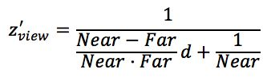

## 						 


## 获取深入和法线纹理

### 原理:

​	深度纹理实际就是一张渲染纹理，只不过它里面存储的像素值不是颜色值，而是一个高精度的深度值。由于被存储在一张纹理中，深度纹理里的深度值范围是[0, 1]，而且通常是非线性分布的。那么，这些深度值是从哪里得到的呢？要回答这个问题，我们需要回顾下顶点变换的过程。总体来说，这些深度值来自于顶点变换后得到的**归一化的设备坐标（Normalized Device Coordinates ，NDC）**。回顾一下，一个模型要想最终被绘制在屏幕上，需要把它的顶点从模型空间变换到齐次裁剪坐标系下，这是通过在顶点着色器中乘以MVP变换矩阵得到的。在变换的最后一步，我们需要使用一个投影矩阵来变换顶点，当我们使用的是透视投影类型的摄像机时，这个投影矩阵就是非线性的。


​																					图1


​																					图2

​	图1显示了Unity中透视投影对顶点的变换过程（从观察空间到裁剪空间）。图1中最左侧的图显示了投影变换前，即观察空间下视锥体的结构及相应的顶点位置，中间的图显示了应用透视裁剪矩阵后的变换结果，即顶点着色器阶段输出的顶点变换结果，最右侧的图则是底层硬件进行了透视除法后得到的归一化的设备坐标。需要注意的是，这里的投影过程是建立在Unity对坐标系的假定上的，也就是说，我们针对的是观察空间为右手坐标系，使用列矩阵在矩阵右侧进行相乘，且变换到NDC后z分量范围将在[−1, 1]之间的情况。而在类似DirectX这样的图形接口中，变换后z分量范围将在[0, 1]之间。如果需要在其他图形接口下实现本章的类似效果，需要对一些计算参数做出相应变化。

​	图2显示了在使用正交摄像机时投影变换的过程。同样，变换后会得到一个范围为[−1, 1]的立方体。正交投影使用的变换矩阵是线性的。

​	在得到NDC后，深度纹理中的像素值就可以很方便地计算得到了，这些深度值就对应了NDC中顶点坐标的z分量的值。由于NDC中z分量的范围在[−1, 1]，为了让这些值能够存储在一张图像中，我们需要使用下面的公式对其进行映射：

​																		**d=0.5·Z（ndc）+0.5**

​	**其中，d对应了深度纹理中的像素值，Zndc对应了NDC坐标中的z分量的值。**

​	那么Unity是怎么得到这样一张深度纹理的呢？在Unity中，深度纹理可以直接来自于真正的深度缓存，也可以是由一个单独的Pass渲染而得，这取决于使用的渲染路径和硬件。通常来讲，当使用延迟渲染路径（包括遗留的延迟渲染路径）时，深度纹理理所当然可以访问到，因为延迟渲染会把这些信息渲染到G-buffer中。而当无法直接获取深度缓存时，深度和法线纹理是通过一个单独的Pass渲染而得的。具体实现是，Unity会使用着色器替换（Shader Replacement）技术选择那些渲染类型（即SubShader的RenderType标签）为Opaque的物体，判断它们使用的渲染队列是否小于等于2 500（内置的Background、Geometry和AlphaTest渲染队列均在此范围内），如果满足条件，就把它渲染到深度和法线纹理中。因此，**要想让物体能够出现在深度和法线纹理中，就必须在Shader中设置正确的RenderType标签。**

​	在Unity中，我们可以选择让一个摄像机生成一张深度纹理或是一张深度+法线纹理。当选择前者，即只需要一张单独的深度纹理时，Unity会直接获取深度缓存或是按之前讲到的着色器替换技术，选取需要的不透明物体，并使用它投射阴影时使用的Pass（即LightMode被设置为ShadowCaster的Pass）来得到深度纹理。如果Shader中不包含这样一个Pass，那么这个物体就不会出现在深度纹理中（当然，它也不能向其他物体投射阴影）。深度纹理的精度通常是24位或16位，这取决于使用的深度缓存的精度。如果选择生成一张深度+法线纹理，Unity会创建一张和屏幕分辨率相同、精度为32位（每个通道为8位）的纹理，**其中观察空间下的法线信息会被编码进纹理的R和G通道，而深度信息会被编码进B和A通道**。法线信息的获取在延迟渲染中是可以非常容易就得到的，Unity只需要合并深度和法线缓存即可。而在前向渲染中，默认情况下是不会创建法线缓存的，因此Unity底层使用了一个单独的Pass把整个场景再次渲染一遍来完成。这个Pass被包含在Unity内置的一个Unity Shader中，我们可以在内置的builtin_shaders-xxx/DefaultResources/Camera-DepthNormalTexture.shader文件中找到这个用于渲染深度和法线信息的Pass。


### 如何获取

​	在Unity中，获取深度纹理是非常简单的，我们只需要告诉Unity：“嘿，把深度纹理给我！”然后再在Shader中直接访问特定的纹理属性即可。这个与Unity沟通的过程是通过在脚本中设置摄像机的depthTextureMode来完成的，例如我们可以通过下面的代码来获取深度纹理：

```c#
camera.depthTextureMode = DepthTextureMode.Depth;
```

​	一旦设置好了上面的摄像机模式后，我们就可以在Shader中通过声明_CameraDepthTexture变量来访问它。这个过程非常简单，但我们需要知道这两行代码的背后，

​	同理，如果想要获取深度+法线纹理，我们只需要在代码中这样设置：

```c#
camera.depthTextureMode = DepthTextureMode.DepthNormals;
```

​	然后在Shader中通过声明_CameraDepthNormalsTexture变量来访问它。

​	我们还可以组合这些模式，让一个摄像机同时产生一张深度和深度+法线纹理：

```c#
camera.depthTextureMode |= DepthTextureMode.Depth;
camera.depthTextureMode |= DepthTextureMode.DepthNormals;
```

<br><br><br>

​	在Unity 5中，我们还可以在摄像机的Camera组件上看到当前摄像机是否需要渲染深度或深度+法线纹理。当在Shader中访问到深度纹理_CameraDepthTexture后，我们就可以使用当前像素的纹理坐标对它进行采样。绝大多数情况下，我们直接使用tex2D函数采样即可，但在某些平台（例如PS3和PSP2）上，我们需要一些特殊处理。Unity为我们提供了一个统一的宏SAMPLE_DEPTH_TEXTURE，用来处理这些由于平台差异造成的问题。而我们只需要在Shader中使用SAMPLE_DEPTH_TEXTURE宏对深度纹理进行采样，例如：

```c#
float d = SAMPLE_DEPTH_TEXTURE(_CameraDepthTexture, i.uv);
```

​	**其中，i.uv是一个float2类型的变量，对应了当前像素的纹理坐标**。类似的宏还有SAMPLEDEPTH_TEXTURE_PROJ和SAMPLE_DEPTH_TEXTURE_LOD。SAMPLE_DEPTH TEXTURE_PROJ宏同样接受两个参数—深度纹理和一个float3或float4类型的纹理坐标，它的内部使用了tex2Dproj这样的函数进行投影纹理采样，纹理坐标的前两个分量首先会除以最后一个分量，再进行纹理采样。如果提供了第四个分量，还会进行一次比较，通常用于阴影的实现中。SAMPLE_DEPTH_TEXTURE_PROJ的第二个参数通常是由顶点着色器输出插值而得的屏幕坐标，例如：

```c#
float d = SAMPLE_DEPTH_TEXTURE_PROJ(_CameraDepthTexture, UNITY_PROJ_COORD(i.scrPos));
```

​	其中，i.scrPos是在顶点着色器中通过调用ComputeScreenPos(o.pos)得到的屏幕坐标。上述这些宏的定义，读者可以在Unity内置的HLSLSupport.cginc文件中找到。

​	当通过纹理采样得到深度值后，这些深度值往往是非线性的，这种非线性来自于透视投影使用的裁剪矩阵。然而，在我们的计算过程中通常是需要线性的深度值，也就是说，我们需要把投影后的深度值变换到线性空间下，例如视角空间下的深度值。那么，我们应该如何进行这个转换呢？实际上，我们只需要倒推顶点变换的过程即可。下面我们以透视投影为例，推导如何由深度纹理中的深度信息计算得到视角空间下的深度值。

​	当我们使用透视投影的裁剪矩阵Pclip对视角空间下的一个顶点进行变换后，裁剪空间下顶点的z和w分量为：


​	其中，Far和Near分别是远近裁剪平面的距离。然后，我们通过齐次除法就可以得到NDC下的z分量：


​	而深度纹理中的深度值是通过下面的公式由NDC计算而得的：

​																			**d=0.5·Z（ndc）+0.5**

​	由上面的这些式子，我们可以推导出用d表示而得的**Zview**的表达式：


​	由于在Unity使用的视角空间中，摄像机正向对应的z值均为负值，因此为了得到深度值的正数表示，我们需要对上面的结果取反，最后得到的结果如下：



​	它的取值范围就是视锥体深度范围，即[Near, Far]。如果我们想得到范围在[0, 1]之间的深度值，只需要把上面得到的结果除以Far即可。这样，0就表示该点与摄像机位于同一位置，1表示该点位于视锥体的远裁剪平面上。结果如下：


​	幸运的是，**Unity提供了两个辅助函数来为我们进行上述的计算过程—LinearEyeDepth和 Linear01Depth。LinearEyeDepth负责把深度纹理的采样结果转换到视角空间下的深度值，也就是我们上面得到的Z'view。而Linear01Depth则会返回一个范围在[0，1]的线性深度值，也就是我们上面得到的Z01。这两个函数内部使用了内置的_ZBufferParams变量来得到远近裁剪平面的距离。**

​	如果我们需要获取深度+法线纹理，可以直接使用tex2D函数对_CameraDepthNormalsTexture进行采样，得到里面存储的深度和法线信息。Unity提供了辅助函数来为我们对这个采样结果进行解码，从而得到深度值和法线方向。这个函数是DecodeDepthNormal，它在UnityCG.cginc里被定义：

```c#
inline void DecodeDepthNormal( float4 enc, out float depth, out float3 normal )
{
    depth = DecodeFloatRG (enc.zw);
    normal = DecodeViewNormalStereo (enc);
}
```

​	DecodeDepthNormal的第一个参数是对深度+法线纹理的采样结果，这个采样结果是Unity对深度和法线信息编码后的结果，它的xy分量存储的是视角空间下的法线信息，而深度信息被编码进了zw分量。通过调用DecodeDepthNormal函数对采样结果解码后，我们就可以得到解码后的深度值和法线。这个深度值是范围在[0, 1]的线性深度值（这与单独的深度纹理中存储的深度值不同），而得到的法线则是视角空间下的法线方向。同样，我们也可以通过调用DecodeFloatRG和DecodeViewNormalStereo来解码深度+法线纹理中的深度和法线信息。


