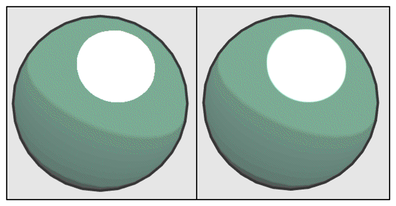
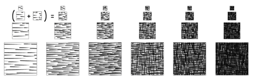

#                                   非真实渲染

​	尽管游戏渲染一般都是以**照相写实主义（photorealism）**作为主要目标，但也有许多游戏使用了**非真实感渲染（Non-Photorealistic Rendering，NPR）**的方法来渲染游戏画面。非真实感渲染的一个主要目标是，使用一些渲染方法使得画面达到和某些特殊的绘画风格相似的效果，例如卡通、水彩风格等

<br/>

<br/>

## 卡通风格的渲染

​	卡通风格是游戏中常见的一种渲染风格。使用这种风格的游戏画面通常有一些共有的特点，例如物体都被黑色的线条描边，以及分明的明暗变化等。

​	要实现卡通渲染有很多方法，其中之一就是使用**基于色调的着色技术（tone-based shading）**。Gooch等人在他们1998年的一篇论文[1]中提出并实现了基于色调的光照模型。在实现中，我们往往会使用漫反射系数对一张一维纹理进行采样，以控制漫反射的色调。我们曾使用渐变纹理实现过这样的效果。卡通风格的高光效果也和我们之前学习的光照不同。在卡通风格中，模型的高光往往是一块块分界明显的纯色区域。

​	除了光照模型不同外，卡通风格通常还需要在物体边缘部分绘制轮廓。我们曾介绍使用屏幕后处理技术对屏幕图像进行描边。接下来，我们将会介绍基于模型的描边方法，这种方法的实现更加简单，而且在很多情况下也能得到不错的效果。

<br/><br/>

### 渲染轮廓线

​	在实时渲染中，轮廓线的渲染是应用非常广泛的一种效果。近20年来，有许多绘制模型轮廓线的方法被先后提出来。在《Real Time Rendering, third edition》一书中，作者把这些方法分成了5种类型。

- 基于观察角度和表面法线的轮廓线渲染。这种方法使用视角方向和表面法线的点乘结果来得到轮廓线的信息。这种方法简单快速，可以在一个Pass中就得到渲染结果，但局限性很大，很多模型渲染出来的描边效果都不尽如人意。

- 过程式几何轮廓线渲染。这种方法的核心是使用两个Pass渲染。第一个Pass渲染背面的面片，并使用某些技术让它的轮廓可见；第二个Pass再正常渲染正面的面片。这种方法的优点在于快速有效，并且适用于绝大多数表面平滑的模型，但它的缺点是不适合类似于立方体这样平整的模型。

- 基于图像处理的轮廓线渲染。我们在之前使的边缘检测的方法就属于这个类别。这种方法的优点在于，可以适用于任何种类的模型。但它也有自身的局限所在，一些深度和法线变化很小的轮廓无法被检测出来，例如桌子上的纸张。

- 基于轮廓边检测的轮廓线渲染。上面提到的各种方法，一个最大的问题是，无法控制轮廓线的风格渲染。对于一些情况，我们希望可以渲染出独特风格的轮廓线，例如水墨风格等。为此，我们希望可以检测出精确的轮廓边，然后直接渲染它们。检测一条边是否是轮廓边的公式很简单，我们只需要检查和这条边相邻的两个三角面片是否满足以下条件： 

  <center>（n0·v>0）≠(n1·v>0)</center>

  其中，n0和n1分别表示两个相邻三角面片的法向，v是从视角到该边上任意顶点的方向。上述公式的本质在于检查两个相邻的三角面片是否一个朝正面、一个朝背面。我们可以在几何着色器（Geometry Shader）的帮助下实现上面的检测过程。当然，这种方法也有缺点，除了实现相对复杂外，它还会有动画连贯性的问题。也就是说，由于是逐帧单独提取轮廓，所以在帧与帧之间会出现跳跃性。

- 最后一个种类就是混合了上述的几种渲染方法。例如，首先找到精确的轮廓边，把模型和轮廓边渲染到纹理中，再使用图像处理的方法识别出轮廓线，并在图像空间下进行风格化渲染。

<br/>

<br/>

​	接下来，我们将会在Unity中使用过程式几何轮廓线渲染的方法来对模型进行轮廓描边。我们将使用两个Pass渲染模型：在第一个Pass中，我们会使用轮廓线颜色渲染整个背面的面片，并在**视角空间**下把模型顶点沿着法线方向向外扩张一段距离，以此来让背部轮廓线可见。**我们首先把顶点和法线变换到视角空间下，这是为了让描边可以在观察空间达到最好的效果**。代码如下：

```c#
						viewPos = viewPos + viewNormal * _Outline;
```


​	但是，如果直接使用顶点法线进行扩展，对于一些内凹的模型，就可能发生背面面片遮挡正面面片的情况。为了尽可能防止出现这样的情况，在扩张背面顶点之前，我们首先对顶点法线的z分量进行处理，使它们等于一个定值，然后把法线归一化后再对顶点进行扩张。这样的好处在于，扩展后的背面更加扁平化，从而降低了遮挡正面面片的可能性。代码如下：

```c#
						viewNormal.z = -0.5;
						viewNormal = normalize(viewNormal);
						viewPos = viewPos + viewNormal * _Outline;
```

<br/>

<br/>


### 添加高光

​	前面提到过，卡通风格中的高光往往是模型上一块块分界明显的纯色区域。为了实现这种效果，我们就不能再使用之前学习的光照模型。回顾一下，在之前实现Blinn-Phong模型的过程中，我们使用法线点乘光照方向以及视角方向和的一半，再和另一个参数进行指数操作得到高光反射系数。代码如下：

```c#
				float spec = pow(max(0, dot(normal, halfDir)), _Gloss)
```

​	**然而对于卡通渲染需要的高光反射光照模型，我们同样需要计算normal和halfDir的点乘结果，但不同的是，我们把该值和一个阈值进行比较，如果小于该阈值，则高光反射系数为0，否则返回1。**

```c#
						float spec = dot(worldNormal, worldHalfDir);
						spec = step(threshold, spec);//如果spec>threshold,返回1，反之亦然
```

​	在上面的代码中，我们使用CG的step函数来实现和阈值比较的目的。**step函数接受两个参数，第一个参数是参考值，第二个参数是待比较的数值。如果第二个参数大于等于第一个参数，则返回1，否则返回0**。

​	但是，这种粗暴的判断方法会在高光区域的边界造成锯齿，如下图左图所示。



<center>有锯齿的图片（左），处理后的（右）</center>

​	出现这种问题的原因在于，高光区域的边缘不是平滑渐变的，而是由0突变到1。要想对其进行抗锯齿处理，我们可以在边界处很小的一块区域内，进行平滑处理。代码如下：

```c#
					float spec = dot(worldNormal, worldHalfDir);
					spec = lerp(0, 1, smoothstep(-w, w, spec - threshold));
```

​	在上面的代码中，我们没有像之前一样直接使用step函数返回0或1，而是首先使用了CG的smoothstep函数。其中，w是一个很小的值，当spec - threshold小于-w时，返回0，大于w时，返回1，否则在0到1之间进行插值。这样的效果是，我们可以在[−w, w]区间内，即高光区域的边界处，得到一个从0到1平滑变化的spec值，从而实现抗锯齿的目的。**尽管我们可以把w设为一个很小的定值，但在下面的示例中，我们选择使用邻域像素之间的近似导数值，这可以通过CG的fwidth函数来得到。**

<br/>

<br/>

示例代码:

```c#
Shader "Unity Shaders Book/Chapter 14/Toon Shading" {
	Properties {
		_Color ("Color Tint", Color) = (1, 1, 1, 1)
		_MainTex ("Main Tex", 2D) = "white" {}
		_Ramp ("Ramp Texture", 2D) = "white" {}
		_Outline ("OutviewNormal.z = -0.5;
                        viewNormal = normalize(viewNormal);
                        viewPos = viewPos + viewNormal * _Outline;line", Range(0, 1)) = 0.1
		_OutlineColor ("Outline Color", Color) = (0, 0, 0, 1)
		_Specular ("Specular", Color) = (1, 1, 1, 1)
		_SpecularScale ("Specular Scale", Range(0, 0.1)) = 0.01
	}
    SubShader {
		Tags { "RenderType"="Opaque" "Queue"="Geometry"}
		
		Pass {
			NAME "OUTLINE"
			
			Cull Front
			
			CGPROGRAM
			
			#pragma vertex vert
			#pragma fragment frag
			
			#include "UnityCG.cginc"
			
			float _Outline;
			fixed4 _OutlineColor;
			
			struct a2v {
				float4 vertex : POSITION;
				float3 normal : NORMAL;
			}; 
			
			struct v2f {
			    float4 pos : SV_POSITION;
			};
			
			v2f vert (a2v v) {
				v2f o;
				
				float4 pos = mul(UNITY_MATRIX_MV, v.vertex); 
				float3 normal = mul((float3x3)UNITY_MATRIX_IT_MV, v.normal);  
				normal.z = -0.5;
				pos = pos + float4(normalize(normal), 0) * _Outline;
				o.pos = mul(UNITY_MATRIX_P, pos);
				
				return o;
			}
			
			float4 frag(v2f i) : SV_Target { 
				return float4(_OutlineColor.rgb, 1);               
			}
			
			ENDCG
		}
		
		Pass {
			Tags { "LightMode"="ForwardBase" }
			
			Cull Back
		
			CGPROGRAM
		
			#pragma vertex vert
			#pragma fragment frag
			
			#pragma multi_compile_fwdbase
		
			#include "UnityCG.cginc"
			#include "Lighting.cginc"
			#include "AutoLight.cginc"
			#include "UnityShaderVariables.cginc"
			
			fixed4 _Color;
			sampler2D _MainTex;
			float4 _MainTex_ST;
			sampler2D _Ramp;
			fixed4 _Specular;
			fixed _SpecularScale;
		
			struct a2v {
				float4 vertex : POSITION;
				float3 normal : NORMAL;
				float4 texcoord : TEXCOORD0;
				float4 tangent : TANGENT;
			}; 
		
			struct v2f {
				float4 pos : POSITION;
				float2 uv : TEXCOORD0;
				float3 worldNormal : TEXCOORD1;
				float3 worldPos : TEXCOORD2;
				SHADOW_COORDS(3)
			};
			
			v2f vert (a2v v) {
				v2f o;
				
				o.pos = mul( UNITY_MATRIX_MVP, v.vertex);
				o.uv = TRANSFORM_TEX (v.texcoord, _MainTex);
				o.worldNormal  = UnityObjectToWorldNormal(v.normal);
				o.worldPos = mul(_Object2World, v.vertex).xyz;
				
				TRANSFER_SHADOW(o);
				
				return o;
			}
			
			float4 frag(v2f i) : SV_Target { 
				fixed3 worldNormal = normalize(i.worldNormal);
				fixed3 worldLightDir = normalize(UnityWorldSpaceLightDir(i.worldPos));
				fixed3 worldViewDir = normalize(UnityWorldSpaceViewDir(i.worldPos));
				fixed3 worldHalfDir = normalize(worldLightDir + worldViewDir);
				
				fixed4 c = tex2D (_MainTex, i.uv);
				fixed3 albedo = c.rgb * _Color.rgb;
				
				fixed3 ambient = UNITY_LIGHTMODEL_AMBIENT.xyz * albedo;
				
				UNITY_LIGHT_ATTENUATION(atten, i, i.worldPos);
				
				fixed diff =  dot(worldNormal, worldLightDir);
				diff = (diff * 0.5 + 0.5) * atten;
				
				fixed3 diffuse = _LightColor0.rgb * albedo * tex2D(_Ramp, float2(diff, diff)).rgb;
				
				fixed spec = dot(worldNormal, worldHalfDir);
				fixed w = fwidth(spec) * 2.0;
				fixed3 specular = _Specular.rgb * lerp(0, 1, smoothstep(-w, w, spec + _SpecularScale - 1)) * step(0.0001, _SpecularScale);
				
				return fixed4(ambient + diffuse + specular, 1.0);
			}
		
			ENDCG
		}
	}
	FallBack "Diffuse"
}
```

第一个pass：

​	在顶点着色器中我们首先把顶点和法线变换到视角空间下，这是为了让描边可以在观察空间达到最好的效果。随后，我们设置法线的z分量，对其归一化后再将顶点沿其方向扩张，得到扩张后的顶点坐标。对法线的处理是为了尽可能避免背面扩张后的顶点挡住正面的面片。最后，我们把顶点从视角空间变换到裁剪空间。

​	片元着色器的代码非常简单，我们只需要用轮廓线颜色渲染整个背面即可。

第二个pass:

​	在顶点着色器中，我们计算了世界空间下的法线方向和顶点位置，并使用Unity提供的内置宏SHADOW_COORDS和TRANSFER_SHADOW来计算阴影所需的各个变量。

​	在片元着色器中我们计算了光照模型中需要的各个方向矢量，并对它们进行了归一化处理。然后，**我们计算了材质的反射率albedo和环境光照ambient。接着，我们使用内置的UNITYLIGHT ATTENUATION宏来计算当前世界坐标下的阴影值。随后，我们计算了半兰伯特漫反射系数，并和阴影值相乘得到最终的漫反射系数。我们使用这个漫反射系数对渐变纹理_Ramp进行采样，并将结果和材质的反射率、光照颜色相乘，作为最后的漫反射光照。我们使用fwidth对高光区域的边界进行抗锯齿处理，并将计算而得的高光反射系数和高光反射颜色相乘，得到高光反射的光照部分。值得注意的是，我们在最后还使用了step(0.000 1, _SpecularScale)，这是为了在_SpecularScale为0时，可以完全消除高光反射的光照**。最后，返回环境光照、漫反射光照和高光反射光照叠加的结果。

<br/>

<br/>

<br/>

<br/>

## 素描风格的渲染

​	另一个非常流行的非真实感渲染是素描风格的渲染。微软研究院的Praun等人在2001年的SIGGRAPH上发表了一篇非常著名的论文[4]。在这篇文章中，他们使用了提前生成的素描纹理来实现实时的素描风格渲染，这些纹理组成了一个色调艺术映射（Tonal Art Map，TAM）,如下图所示。在下图中，从左到右纹理中的笔触逐渐增多，用于模拟不同光照下的漫反射效果，从上到下则对应了每张纹理的多级渐远纹理（mipmaps）。这些多级渐远纹理的生成并不是简单的对上一层纹理进行降采样，而是需要保持笔触之间的间隔，以便更真实地模拟素描效果。

<div align=center>


