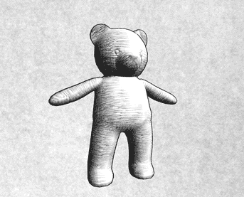

#                                   非真实渲染

​	尽管游戏渲染一般都是以**照相写实主义（photorealism）**作为主要目标，但也有许多游戏使用了**非真实感渲染（Non-Photorealistic Rendering，NPR）**的方法来渲染游戏画面。非真实感渲染的一个主要目标是，使用一些渲染方法使得画面达到和某些特殊的绘画风格相似的效果，例如卡通、水彩风格等

<br/>

<br/>

## 卡通风格的渲染

​	卡通风格是游戏中常见的一种渲染风格。使用这种风格的游戏画面通常有一些共有的特点，例如物体都被黑色的线条描边，以及分明的明暗变化等。

​	要实现卡通渲染有很多方法，其中之一就是使用**基于色调的着色技术（tone-based shading）**。Gooch等人在他们1998年的一篇论文[1]中提出并实现了基于色调的光照模型。在实现中，我们往往会使用漫反射系数对一张一维纹理进行采样，以控制漫反射的色调。我们曾使用渐变纹理实现过这样的效果。卡通风格的高光效果也和我们之前学习的光照不同。在卡通风格中，模型的高光往往是一块块分界明显的纯色区域。

​	除了光照模型不同外，卡通风格通常还需要在物体边缘部分绘制轮廓。我们曾介绍使用屏幕后处理技术对屏幕图像进行描边。接下来，我们将会介绍基于模型的描边方法，这种方法的实现更加简单，而且在很多情况下也能得到不错的效果。

<br/><br/>

### 渲染轮廓线

​	在实时渲染中，轮廓线的渲染是应用非常广泛的一种效果。近20年来，有许多绘制模型轮廓线的方法被先后提出来。在《Real Time Rendering, third edition》一书中，作者把这些方法分成了5种类型。

- 基于观察角度和表面法线的轮廓线渲染。这种方法使用视角方向和表面法线的点乘结果来得到轮廓线的信息。这种方法简单快速，可以在一个Pass中就得到渲染结果，但局限性很大，很多模型渲染出来的描边效果都不尽如人意。

- 过程式几何轮廓线渲染。这种方法的核心是使用两个Pass渲染。第一个Pass渲染背面的面片，并使用某些技术让它的轮廓可见；第二个Pass再正常渲染正面的面片。这种方法的优点在于快速有效，并且适用于绝大多数表面平滑的模型，但它的缺点是不适合类似于立方体这样平整的模型。

- 基于图像处理的轮廓线渲染。我们在之前使的边缘检测的方法就属于这个类别。这种方法的优点在于，可以适用于任何种类的模型。但它也有自身的局限所在，一些深度和法线变化很小的轮廓无法被检测出来，例如桌子上的纸张。

- 基于轮廓边检测的轮廓线渲染。上面提到的各种方法，一个最大的问题是，无法控制轮廓线的风格渲染。对于一些情况，我们希望可以渲染出独特风格的轮廓线，例如水墨风格等。为此，我们希望可以检测出精确的轮廓边，然后直接渲染它们。检测一条边是否是轮廓边的公式很简单，我们只需要检查和这条边相邻的两个三角面片是否满足以下条件： 

  <center>（n0·v>0）≠(n1·v>0)</center>

  其中，n0和n1分别表示两个相邻三角面片的法向，v是从视角到该边上任意顶点的方向。上述公式的本质在于检查两个相邻的三角面片是否一个朝正面、一个朝背面。我们可以在几何着色器（Geometry Shader）的帮助下实现上面的检测过程。当然，这种方法也有缺点，除了实现相对复杂外，它还会有动画连贯性的问题。也就是说，由于是逐帧单独提取轮廓，所以在帧与帧之间会出现跳跃性。

- 最后一个种类就是混合了上述的几种渲染方法。例如，首先找到精确的轮廓边，把模型和轮廓边渲染到纹理中，再使用图像处理的方法识别出轮廓线，并在图像空间下进行风格化渲染。

<br/>

<br/>

​	接下来，我们将会在Unity中使用过程式几何轮廓线渲染的方法来对模型进行轮廓描边。我们将使用两个Pass渲染模型：在第一个Pass中，我们会使用轮廓线颜色渲染整个背面的面片，并在**视角空间**下把模型顶点沿着法线方向向外扩张一段距离，以此来让背部轮廓线可见。**我们首先把顶点和法线变换到视角空间下，这是为了让描边可以在观察空间达到最好的效果**。代码如下：

```c#
						viewPos = viewPos + viewNormal * _Outline;
```


​	但是，如果直接使用顶点法线进行扩展，对于一些内凹的模型，就可能发生背面面片遮挡正面面片的情况。为了尽可能防止出现这样的情况，在扩张背面顶点之前，我们首先对顶点法线的z分量进行处理，使它们等于一个定值，然后把法线归一化后再对顶点进行扩张。这样的好处在于，扩展后的背面更加扁平化，从而降低了遮挡正面面片的可能性。代码如下：

```c#
						viewNormal.z = -0.5;
						viewNormal = normalize(viewNormal);
						viewPos = viewPos + viewNormal * _Outline;
```

<br/>

<br/>


### 添加高光

​	前面提到过，卡通风格中的高光往往是模型上一块块分界明显的纯色区域。为了实现这种效果，我们就不能再使用之前学习的光照模型。回顾一下，在之前实现Blinn-Phong模型的过程中，我们使用法线点乘光照方向以及视角方向和的一半，再和另一个参数进行指数操作得到高光反射系数。代码如下：

```c#
				float spec = pow(max(0, dot(normal, halfDir)), _Gloss)
```

​	**然而对于卡通渲染需要的高光反射光照模型，我们同样需要计算normal和halfDir的点乘结果，但不同的是，我们把该值和一个阈值进行比较，如果小于该阈值，则高光反射系数为0，否则返回1。**

```c#
						float spec = dot(worldNormal, worldHalfDir);
						spec = step(threshold, spec);//如果spec>threshold,返回1，反之亦然
```

​	在上面的代码中，我们使用CG的step函数来实现和阈值比较的目的。**step函数接受两个参数，第一个参数是参考值，第二个参数是待比较的数值。如果第二个参数大于等于第一个参数，则返回1，否则返回0**。

​	但是，这种粗暴的判断方法会在高光区域的边界造成锯齿，如下图左图所示。


<center>有锯齿的图片（左），处理后的（右）</center>

​	出现这种问题的原因在于，高光区域的边缘不是平滑渐变的，而是由0突变到1。要想对其进行抗锯齿处理，我们可以在边界处很小的一块区域内，进行平滑处理。代码如下：

```c#
					float spec = dot(worldNormal, worldHalfDir);
					spec = lerp(0, 1, smoothstep(-w, w, spec - threshold));
```

​	在上面的代码中，我们没有像之前一样直接使用step函数返回0或1，而是首先使用了CG的smoothstep函数。其中，w是一个很小的值，当spec - threshold小于-w时，返回0，大于w时，返回1，否则在0到1之间进行插值。这样的效果是，我们可以在[−w, w]区间内，即高光区域的边界处，得到一个从0到1平滑变化的spec值，从而实现抗锯齿的目的。**尽管我们可以把w设为一个很小的定值，但在下面的示例中，我们选择使用邻域像素之间的近似导数值，这可以通过CG的fwidth函数来得到。**

<br/>

<br/>

示例代码:

```c#
Shader "Unity Shaders Book/Chapter 14/Toon Shading" {
	Properties {
		_Color ("Color Tint", Color) = (1, 1, 1, 1)
		_MainTex ("Main Tex", 2D) = "white" {}
		_Ramp ("Ramp Texture", 2D) = "white" {}
		_Outline ("OutviewNormal.z = -0.5;
                        viewNormal = normalize(viewNormal);
                        viewPos = viewPos + viewNormal * _Outline;line", Range(0, 1)) = 0.1
		_OutlineColor ("Outline Color", Color) = (0, 0, 0, 1)
		_Specular ("Specular", Color) = (1, 1, 1, 1)
		_SpecularScale ("Specular Scale", Range(0, 0.1)) = 0.01
	}
    SubShader {
		Tags { "RenderType"="Opaque" "Queue"="Geometry"}
		
		Pass {
			NAME "OUTLINE"
			
			Cull Front
			
			CGPROGRAM
			
			#pragma vertex vert
			#pragma fragment frag
			
			#include "UnityCG.cginc"
			
			float _Outline;
			fixed4 _OutlineColor;
			
			struct a2v {
				float4 vertex : POSITION;
				float3 normal : NORMAL;
			}; 
			
			struct v2f {
			    float4 pos : SV_POSITION;
			};
			
			v2f vert (a2v v) {
				v2f o;
				
				float4 pos = mul(UNITY_MATRIX_MV, v.vertex); 
				float3 normal = mul((float3x3)UNITY_MATRIX_IT_MV, v.normal);  
				normal.z = -0.5;
				pos = pos + float4(normalize(normal), 0) * _Outline;
				o.pos = mul(UNITY_MATRIX_P, pos);
				
				return o;
			}
			
			float4 frag(v2f i) : SV_Target { 
				return float4(_OutlineColor.rgb, 1);               
			}
			
			ENDCG
		}
		
		Pass {
			Tags { "LightMode"="ForwardBase" }
			
			Cull Back
		
			CGPROGRAM
		
			#pragma vertex vert
			#pragma fragment frag
			
			#pragma multi_compile_fwdbase
		
			#include "UnityCG.cginc"
			#include "Lighting.cginc"
			#include "AutoLight.cginc"
			#include "UnityShaderVariables.cginc"
			
			fixed4 _Color;
			sampler2D _MainTex;
			float4 _MainTex_ST;
			sampler2D _Ramp;
			fixed4 _Specular;
			fixed _SpecularScale;
		
			struct a2v {
				float4 vertex : POSITION;
				float3 normal : NORMAL;
				float4 texcoord : TEXCOORD0;
				float4 tangent : TANGENT;
			}; 
		
			struct v2f {
				float4 pos : POSITION;
				float2 uv : TEXCOORD0;
				float3 worldNormal : TEXCOORD1;
				float3 worldPos : TEXCOORD2;
				SHADOW_COORDS(3)
			};
			
			v2f vert (a2v v) {
				v2f o;
				
				o.pos = mul( UNITY_MATRIX_MVP, v.vertex);
				o.uv = TRANSFORM_TEX (v.texcoord, _MainTex);
				o.worldNormal  = UnityObjectToWorldNormal(v.normal);
				o.worldPos = mul(_Object2World, v.vertex).xyz;
				
				TRANSFER_SHADOW(o);
				
				return o;
			}
			
			float4 frag(v2f i) : SV_Target { 
				fixed3 worldNormal = normalize(i.worldNormal);
				fixed3 worldLightDir = normalize(UnityWorldSpaceLightDir(i.worldPos));
				fixed3 worldViewDir = normalize(UnityWorldSpaceViewDir(i.worldPos));
				fixed3 worldHalfDir = normalize(worldLightDir + worldViewDir);
				
				fixed4 c = tex2D (_MainTex, i.uv);
				fixed3 albedo = c.rgb * _Color.rgb;
				
				fixed3 ambient = UNITY_LIGHTMODEL_AMBIENT.xyz * albedo;
				
				UNITY_LIGHT_ATTENUATION(atten, i, i.worldPos);
				
				fixed diff =  dot(worldNormal, worldLightDir);
				diff = (diff * 0.5 + 0.5) * atten;
				
				fixed3 diffuse = _LightColor0.rgb * albedo * tex2D(_Ramp, float2(diff, diff)).rgb;
				
				fixed spec = dot(worldNormal, worldHalfDir);
				fixed w = fwidth(spec) * 2.0;
				fixed3 specular = _Specular.rgb * lerp(0, 1, smoothstep(-w, w, spec + _SpecularScale - 1)) * step(0.0001, _SpecularScale);
				
				return fixed4(ambient + diffuse + specular, 1.0);
			}
		
			ENDCG
		}
	}
	FallBack "Diffuse"
}
```

第一个pass：

​	在顶点着色器中我们首先把顶点和法线变换到视角空间下，这是为了让描边可以在观察空间达到最好的效果。随后，我们设置法线的z分量，对其归一化后再将顶点沿其方向扩张，得到扩张后的顶点坐标。对法线的处理是为了尽可能避免背面扩张后的顶点挡住正面的面片。最后，我们把顶点从视角空间变换到裁剪空间。

​	片元着色器的代码非常简单，我们只需要用轮廓线颜色渲染整个背面即可。

第二个pass:

​	在顶点着色器中，我们计算了世界空间下的法线方向和顶点位置，并使用Unity提供的内置宏SHADOW_COORDS和TRANSFER_SHADOW来计算阴影所需的各个变量。

​	在片元着色器中我们计算了光照模型中需要的各个方向矢量，并对它们进行了归一化处理。然后，**我们计算了材质的反射率albedo和环境光照ambient。接着，我们使用内置的UNITYLIGHT ATTENUATION宏来计算当前世界坐标下的阴影值。随后，我们计算了半兰伯特漫反射系数，并和阴影值相乘得到最终的漫反射系数。我们使用这个漫反射系数对渐变纹理_Ramp进行采样，并将结果和材质的反射率、光照颜色相乘，作为最后的漫反射光照。我们使用fwidth对高光区域的边界进行抗锯齿处理，并将计算而得的高光反射系数和高光反射颜色相乘，得到高光反射的光照部分。值得注意的是，我们在最后还使用了step(0.000 1, _SpecularScale)，这是为了在_SpecularScale为0时，可以完全消除高光反射的光照**。最后，返回环境光照、漫反射光照和高光反射光照叠加的结果。

<br/>

<br/>

<br/>

<br/>

## 素描风格的渲染

​	另一个非常流行的非真实感渲染是素描风格的渲染。微软研究院的Praun等人在2001年的SIGGRAPH上发表了一篇非常著名的论文。在这篇文章中，他们使用了提前生成的素描纹理来实现实时的素描风格渲染，这些纹理组成了一个**色调艺术映射（Tonal Art Map，TAM）**,如下图所示。在下图中，从左到右纹理中的笔触逐渐增多，用于模拟不同光照下的漫反射效果，从上到下则对应了每张纹理的多级渐远纹理（mipmaps）。这些多级渐远纹理的生成并不是简单的对上一层纹理进行降采样，而是需要保持笔触之间的间隔，以便更真实地模拟素描效果。


​	下面我们会实现一个素描风格的渲染结果，实现方法是：我们不考虑多级渐远纹理的生成，而直接使用6张素描纹理进行渲染。**在渲染阶段，我们首先在顶点着色阶段计算逐顶点的光照，根据光照结果来决定6张纹理的混合权重，并传递给片元着色器。**然后，在片元着色器中根据这些权重来混合6张纹理的采样结果。结果如下：



<br/><br/><br/>

Shader示例代码：

```c#
Shader "Custom/TonalArtShader"{
    Properties{
        _Color("Color Tint",Color)=(1,1,1,1)
        _TileFactor("Tile Factor",Float)=8     //纹理的平铺系数，数值越大，线条越密集。
        _OutLine("OutLine",Range(0,1))=0.5
        _Hatch0("Hatch0",2D)="white"{}
        _Hatch1("Hatch1",2D)="white"{}
        _Hatch2("Hatch2",2D)="white"{}
        _Hatch3("Hatch3",2D)="white"{}
        _Hatch4("Hatch4",2D)="white"{}
        _Hatch5("Hatch5",2D)="white"{}
    }


    SubShader{

        Tags{"RenderType"="Opaque" "Queue"="Geometry"}

        Pass{
            NAME "OUTLINE"
            Cull Front
            CGPROGRAM
            
            #pragma vertex vert
            #pragma fragment frag
            fixed _OutLine;

            struct a2v{
                float4 vertex : POSITION;
                float3 normal : NORMAL;
            };
            struct v2f{
                float4 pos:SV_POSITION;
            };

            v2f vert(a2v v){
                v2f o;
                o.pos=mul(UNITY_MATRIX_MV,v.vertex);
                float3 viewNormal=mul((float3x3)UNITY_MATRIX_IT_MV,v.normal);
                viewNormal.z=-0.5;
                o.pos=o.pos+float4(normalize(viewNormal),0)*_OutLine;
                o.pos=mul(UNITY_MATRIX_P,o.pos);
                return o;
            }

            fixed4 frag(v2f i):SV_Target{
                return fixed4(0,0,0,1);
            }

            ENDCG
        }


        Pass{
            Tags{"LightMode"="ForwardBase"}

            Cull Back

            CGPROGRAM
            #pragma vertex vert
            #pragma fragment frag
            
            #include "UnityCG.cginc"
            #include "Lighting.cginc"
            #include "AutoLight.cginc"
            #include "UnityShaderVariables.cginc"

            fixed4 _Color;
            float _TileFactor;
            sampler2D _Hatch0;
            sampler2D _Hatch1;
            sampler2D _Hatch2;
            sampler2D _Hatch3;
            sampler2D _Hatch4;
            sampler2D _Hatch5;

            struct a2v{
                float4 vertex:POSITION;
                float3 normal:NORMAL;
                float2 texcoord:TEXCOORD0;
            };

            struct v2f{
                float4 pos:SV_POSITION;
                float2 uv:TEXCOORD0;
                //hatchWeights0.x到hatchWeights1.y分别对应了6张纹理的权重
                fixed3 hatchWeights0:TEXCOORD1;
                fixed3 hatchWeights1:TEXCOORD2;
                float3 worldPos:TEXCOORD3;
                SHADOW_COORD(4);
            };


            v2f vert(a2v v){
                v2f o;
                o.pos=mul(UNITY_MATRIX_MVP,v.vertex);
                o.uv=v.texcoord.xy * _TileFactor;

                fixed worldLighDir=normalize(WordSpaceLighdDir(v.vertex));
                fixed worldNormal=normalize(UnityObjectToWorldNormal(v.normal));

                fixed diff=max(0,dot(worldLighDir,worldNormal));
                o.hatchWeights0=fixed3(0,0,0);
                o.hatchWeights1=fixed3(0,0,0);
                float hatchFactor=diff * 7.0;  //将系数范围扩大到（0,7）,然后等分为7个子区间

                if(hatchFactor>6.0){
                    //光照中最亮的部分，直接显示为白色
                }else if（hatchFactor>5.0）{
                    o.hatchWeights0.x=hatchFactor - 5.0;
                }else if(hatchFactor>4.0){
                    o.hatchWeights0.x=hatchFactor - 4.0;
                    o.hatchWeights0.y= 1 -  o.hatchWeights0.x;
                }else if(hatchFactor > 3.0){
                    o.hatchWeights0.y=hatchFactor - 3.0;
                    o.hatchWeights0.z= 1 - o.hatchWeights0.y;
                }else if(hatchFactor > 2.0 ){
                    o.hatchWeights0.z= hatchFactor - 2.0;
                    o.hatchWeights1.x=1 - o.hatchWeights0.z; 
                }else if(hatchFactor > 1.0 ){
                    o.hatchWeights1.x=hatchFactor - 1.0;
                    o.hatchWeights1.y=1 - o.hatchWeights1.x;
                }else{
                    o.hatchWeights1.y=hatchFactor;
                    o.hatchWeights1.z=1-o.hatchWeights1.y;
                }

                o.worldPos=mul(_Object2World,v.vertex);

                TRANSFER_SHADOW(o);

                return o;
            }

            fixed4 frag(v2f i):SV_Target{
                fixed4 hatchTex0=tex2D(_Hatch0,i.uv) * o.hatchWeights0.x;
                fixed4 hatchTex1=tex2D(_Hatch1,i.uv) * o.hatchWeights0.y;
                fixed4 hatchTex2=tex2D(_Hatch2,i.uv) * o.hatchWeights0.z;
                fixed4 hatchTex3=tex2D(_Hatch3,i.uv) * o.hatchWeights1.x;
                fixed4 hatchTex4=tex2D(_Hatch4,i.uv) * o.hatchWeights1.y;
                fixed4 hatchTex5=tex2D(_Hatch5,i.uv) * o.hatchWeights1.z;
				//只有在为白色（即>,6）的时候，下面的等式才会发挥作用，对应了留白的区域
                fixed4 whiteColor=fixed4(1,1,1,1) * (1 - o.hatchWeights0.x - o.hatchWeights0.y - o.hatchWeights0.z - o.hatchWeights1.x - o.hatchWeights1.y - o.hatchWeights1.z );
            
                fixed4 hatchColor=hatchTex0 + hatchTex1 + hatchTex2 + hatchTex3 + hatchTex4 + hatchTex5 + whiteColor;

                UNITY_LIGHT_ATTENUATION(atten,i,i.worldPos);

                fixed3 finalColor=(_LightColor0.rgb * hatchColor.rgb * atten);
                retrun fixed4(finalColor,1);
            }
            ENDCG
        }
    }
    Fallback "Diffuses"
}
```

​	顶点着色器：我们首先对顶点进行了基本的坐标变换。然后，使用_TileFactor得到了纹理采样坐标。在计算6张纹理的混合权重之前，我们首先需要计算逐顶点光照。因此，我们使用世界空间下的光照方向和法线方向得到漫反射系数diff。之后，我们把权重值初始化为0，并把diff缩放到[0, 7]范围，得到hatchFactor。我们把[0, 7]的区间均匀划分为7个子区间，通过判断hatchFactor所处的子区间来计算对应的纹理混合权重。最后，我们计算了顶点的世界坐标，并使用TRANSFER_SHADOW宏来计算阴影纹理的采样坐标。

​	片元着色器：当得到了6六张纹理的混合权重后，我们对每张纹理进行采样并和它们对应的权重值相乘得到每张纹理的采样颜色。我们还计算了纯白在渲染中的贡献度，这是通过从1中减去所有6张纹理的权重来得到的。这是因为素描中往往有留白的部分，因此我们希望在最后的渲染中光照最亮的部分是纯白色的。最后，我们混合了各个颜色值，并和阴影值atten、模型颜色_Color相乘后返回最终的渲染结果。

<br/>

**注意：实际上，根据diff系数的区间来计算权重的时候，每次都只有两张纹理采样的颜色被应用了，其他纹理的权重都为0，即使采样了，最后的颜色也是fixed4（0,0,0,0）。**

```
注意：
o.hatchWeights0.x; 对应了第1张纹理
o.hatchWeights0.y; 对应了第2张纹理
o.hatchWeights0.z; 对应了第3张纹理
o.hatchWeights1.x; 对应了第4张纹理
o.hatchWeights2.y; 对应了第5张纹理
o.hatchWeights3.z; 对应了第6张纹理
例如：
在进行采样时，如果计算的到漫反射系数为5.3，在5 - 6区间，说明这个时候采用了第1张和第2张纹理的颜色，
并且计算了两张纹理的权重，且这两张纹理权重的和就为1.
此时：o.hatchWeights0.x=o.3
	 o.hatchWeights0.y=1- 0.3 =0.7
其他的都为0，说明采用了两张纹理的颜色值进行混合，而白色部分为0；最后将所有的颜色混合和阴影的参数相乘
即可。

```


