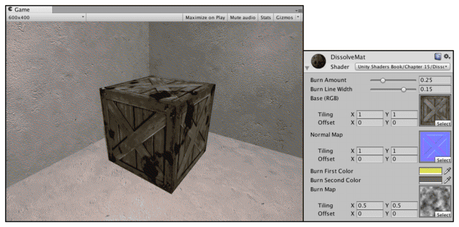
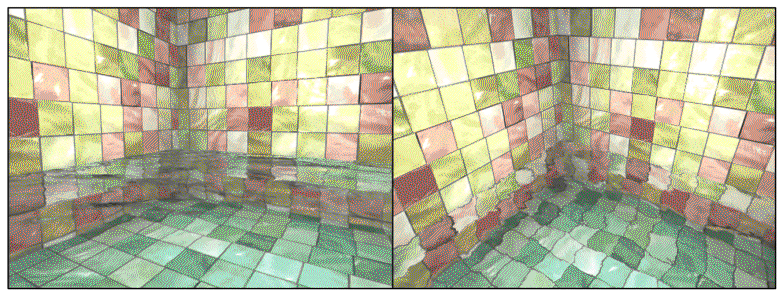

#                                    使用噪声

​	很多时候，向规则的事物里添加一些“杂乱无章”的效果往往会有意想不到的效果。而这些“杂乱无章”的效果来源就是噪声。

<br/><br/>

## 消融效果

​	**消融（dissolve）**效果常见于游戏中的角色死亡、地图烧毁等效果。在这些效果中，消融往往从不同的区域开始，并向看似随机的方向扩张，最后整个物体都将消失不见。效果如下图：



<br>

​	**实现原理**非常简单，**概括来说就是噪声纹理+透明度测试。我们使用对噪声纹理采样的结果和某个控制消融程度的阈值比较，如果小于阈值，就使用clip函数把它对应的像素裁剪掉，这些部分就对应了图中被“烧毁”的区域。而镂空区域边缘的烧焦效果则是将两种颜色混合，再用pow函数处理后，与原纹理颜色混合后的结果。**

<br/>

Shader示例代码：

```c#
Shader "Unity Shaders Book/Chapter 15/Dissolve" {
	Properties {
		_BurnAmount ("Burn Amount", Range(0.0, 1.0)) = 0.0
		_LineWidth("Burn Line Width", Range(0.0, 0.2)) = 0.1
		_MainTex ("Base (RGB)", 2D) = "white" {}
		_BumpMap ("Normal Map", 2D) = "bump" {}
		_BurnFirstColor("Burn First Color", Color) = (1, 0, 0, 1)
		_BurnSecondColor("Burn Second Color", Color) = (1, 0, 0, 1)
		_BurnMap("Burn Map", 2D) = "white"{}
	}
	SubShader {
		Tags { "RenderType"="Opaque" "Queue"="Geometry"}
		
		Pass {
			Tags { "LightMode"="ForwardBase" }

			Cull Off
			
			CGPROGRAM
			
			#include "Lighting.cginc"
			#include "AutoLight.cginc"
			
			#pragma multi_compile_fwdbase
			
			#pragma vertex vert
			#pragma fragment frag
			
			fixed _BurnAmount;
			fixed _LineWidth;
			sampler2D _MainTex;
			sampler2D _BumpMap;
			fixed4 _BurnFirstColor;
			fixed4 _BurnSecondColor;
			sampler2D _BurnMap;
			
			float4 _MainTex_ST;
			float4 _BumpMap_ST;
			float4 _BurnMap_ST;
			
			struct a2v {
				float4 vertex : POSITION;
				float3 normal : NORMAL;
				float4 tangent : TANGENT;
				float4 texcoord : TEXCOORD0;
			};
			
			struct v2f {
				float4 pos : SV_POSITION;
				float2 uvMainTex : TEXCOORD0;
				float2 uvBumpMap : TEXCOORD1;
				float2 uvBurnMap : TEXCOORD2;
				float3 lightDir : TEXCOORD3;
				float3 worldPos : TEXCOORD4;
				SHADOW_COORDS(5)
			};
			
			v2f vert(a2v v) {
				v2f o;
				o.pos = mul(UNITY_MATRIX_MVP, v.vertex);
				
				o.uvMainTex = TRANSFORM_TEX(v.texcoord, _MainTex);
				o.uvBumpMap = TRANSFORM_TEX(v.texcoord, _BumpMap);
				o.uvBurnMap = TRANSFORM_TEX(v.texcoord, _BurnMap);
				
				TANGENT_SPACE_ROTATION;
  				o.lightDir = mul(rotation, ObjSpaceLightDir(v.vertex)).xyz;
  				
  				o.worldPos = mul(_Object2World, v.vertex).xyz;
  				
  				TRANSFER_SHADOW(o);
				
				return o;
			}
			
			fixed4 frag(v2f i) : SV_Target {
				fixed3 burn = tex2D(_BurnMap, i.uvBurnMap).rgb;
				
				clip(burn.r - _BurnAmount);
				
				float3 tangentLightDir = normalize(i.lightDir);
				fixed3 tangentNormal = UnpackNormal(tex2D(_BumpMap, i.uvBumpMap));
				
				fixed3 albedo = tex2D(_MainTex, i.uvMainTex).rgb;
				
				fixed3 ambient = UNITY_LIGHTMODEL_AMBIENT.xyz * albedo;
				
				fixed3 diffuse = _LightColor0.rgb * albedo * max(0, dot(tangentNormal, tangentLightDir));

				//burn.r-_BurnAmount的值较小，就是比较靠近剔除的片元的片元，t的值比较大，
                //混合颜色的时候本来的光照颜色占有的比例就会比烧焦的颜色占有的比率要小，
                //所以烧焦的颜色比重较大，显示为烧焦颜色。
                //反之显示为本来的颜色以及光照的颜色还有阴影的颜色。
                fixed t = 1 - smoothstep(0.0, _LineWidth, burn.r - _BurnAmount);
                
				fixed3 burnColor = lerp(_BurnFirstColor, _BurnSecondColor, t);
				burnColor = pow(burnColor, 5);
				
				UNITY_LIGHT_ATTENUATION(atten, i, i.worldPos);
				fixed3 finalColor = lerp(ambient + diffuse * atten, burnColor, t * step(0.0001, _BurnAmount));
				
				return fixed4(finalColor, 1);
			}
			
			ENDCG
		}
		
		// Pass to render object as a shadow caster
		Pass {
			Tags { "LightMode" = "ShadowCaster" }
			
			CGPROGRAM
			
			#pragma vertex vert
			#pragma fragment frag
			
			#pragma multi_compile_shadowcaster
			
			#include "UnityCG.cginc"
			
			fixed _BurnAmount;
			sampler2D _BurnMap;
			float4 _BurnMap_ST;
			
			struct v2f {
				V2F_SHADOW_CASTER;
				float2 uvBurnMap : TEXCOORD1;
			};
			
			v2f vert(appdata_base v) {
				v2f o;
				
				TRANSFER_SHADOW_CASTER_NORMALOFFSET(o)
				
				o.uvBurnMap = TRANSFORM_TEX(v.texcoord, _BurnMap);
				
				return o;
			}
			
			fixed4 frag(v2f i) : SV_Target {
				fixed3 burn = tex2D(_BurnMap, i.uvBurnMap).rgb;
				
				clip(burn.r - _BurnAmount);
				
				SHADOW_CASTER_FRAGMENT(i)
			}
			ENDCG
		}
	}
	FallBack "Diffuse"
}
```

​	顶点着色器的代码很常规。我们使用宏TRANSFORM_TEX计算了三张纹理对应的纹理坐标，再把光源方向从模型空间变换到了切线空间。最后，为了得到阴影信息，计算了世界空间下的顶点位置和阴影纹理的采样坐标（使用了TRANSFER_SHADOW宏）。

​	片元着色器中，我们首先对噪声纹理进行采样，并将采样结果和用于控制消融程度的属性_ BurnAmount相减，传递给clip函数。当结果小于0时，该像素将会被剔除，从而不会显示到屏幕上。如果通过了测试，则进行正常的光照计算。我们首先根据漫反射纹理得到材质的反射率albedo，并由此计算得到环境光照，进而得到漫反射光照。然后，我们计算了烧焦颜色burnColor。我们想要在宽度为_ LineWidth的范围内模拟一个烧焦的颜色变化，第一步就使用了smoothstep函数来计算混合系数t。当t值为1时，表明该像素位于消融的边界处，当t值为0时，表明该像素为正常的模型颜色，而中间的插值则表示需要模拟一个烧焦效果。我们首先用t来混合两种火焰颜色_ BurnFirstColor和_ BurnSecondColor，为了让效果更接近烧焦的痕迹，我们还使用pow函数对结果进行处理。然后，我们再次使用t来混合正常的光照颜色（环境光+漫反射）和烧焦颜色。我们这里又使用了step函数来保证当_BurnAmount为0时，不显示任何消融效果。最后，返回混合后的颜色值finalColor。

​	与之前的实现不同，我们在本例中还定义了一个用于投射阴影的Pass。使用透明度测试的物体的阴影需要特别处理，如果仍然使用普通的阴影Pass，那么被剔除的区域仍然会向其他物体投射阴影，造成“穿帮”。为了让物体的阴影也能配合透明度测试产生正确的效果，我们需要自定义一个投射阴影的Pass。

​	在Unity中，用于投射阴影的Pass的LightMode需要被设置为ShadowCaster，同时，还需要使用#pragma multi_compile_shadowcaster指明它需要的编译指令。

<br/><br/><br/>

## 水波效果

​	

	<center>包含菲涅耳反射的水面波动效果</center>

<center>在左边中，视角方向和水面法线的夹角越大， 反射效果越强。</center>

	<center> 在右边中，视角方向和水面法线的夹角越小，折射效果越强</center>

<br/>

<br/>

​	在模拟实时水面的过程中，我们往往也会使用噪声纹理。此时，噪声纹理通常会用作一个高度图，以不断修改水面的法线方向。为了模拟水不断流动的效果，我们会使用和时间相关的变量来对噪声纹理进行采样，当得到法线信息后，再进行正常的反射+折射计算，得到最后的水面波动效果。	

​	我们已经知道如何使用反射和折射来模拟一个透明玻璃的效果。本例实现基本相同。我们使用一张立方体纹理（Cubemap）作为环境纹理，模拟反射。为了模拟折射效果，我们使用GrabPass来获取当前屏幕的渲染纹理，并使用切线空间下的法线方向对像素的屏幕坐标进行偏移，再使用该坐标对渲染纹理进行屏幕采样，从而模拟近似的折射效果。与之前的实现不同的是，水波的法线纹理是由一张噪声纹理生成而得，而且会随着时间变化不断平移，模拟波光粼粼的效果。除此之外，我们没有使用一个定值来混合反射和折射颜色，而是使用之前提到的菲涅耳系数来动态决定混合系数。我们使用如下公式来计算菲涅耳系数：

<center>fresnel=pow(1-max(0,v · n),4)</center>

​	其中，**v和n分别对应了视角方向和法线方向。它们之间的夹角越小，fresnel值越小，反射越弱，折射越强。菲涅耳系数还经常会用于边缘光照的计算中。**

Shader代码示例：

```c#
Shader "Custom/WaterShader"{
    Properties{
        _Color("Main Color",Color)=(1,0.15,0.115,1)
        _MainTex("Main Tex",2D)="white"{}
        _WaveMap("Normal Map",2D)="white"{}
        _CubeMap("Environment CubeMap",Cube)="Skybox"{}
        _WaveSpeedX("X Wave Speed",Range(-0.1,0.1))=0.0
        _WaveSpeedY("Y Wave Speed",Range(-0.1,0.1))=0.0
        _Distortion("Distortion",Rnang(0,100))=20
    }

    SubShader{
        Tags{"RenderType"="Opaque" "Queue"="Transparent"}
        GrabPass{"_RefractionTex"}

        Pass{
            Tags{"LightMode"="ForwardBase"}
            CGPROGRAM
            
            #include "UnityCG.cginc"
            #include "Lighting.cginc"
            
            #pragma multi_compile_fwdbase

            #pragma vertex vert
            #pragma fragment frag

            fixed4 _Color;
            sampler2D _MainTex;
            float4 _MainTex_ST;
            sampler2D _WaveMap;
            float4 _WaveMap_ST;
            samplerCUBE _CubeMap;
            fixed _WaveSpeedX;
            fixed _WaveSpeedY;
            float _Distortion;
            sampler2D _RefractionTex;
            float4 _RefractionTex_TexeSize; 

            struct a2v{
                float4 vertex:POSITION;
                float3 normal:NORMAL;
                float4 tangent:TANGENT;
                float4 texcoord:TEXCOORD0;
            };

            struct v2f{ 
                float4 pos:SV_POSITION;
                float4 scrPos:TEXCOORD0;
                float4 uv:TEXCOORD1;
                float4 TtoW0:TEXCOORD2;
                float4 TtoW1:TEXCOORD3;
                float4 TtoW2:TEXCOORD4;
            };

            v2f vert(a2v v){
                v2f o;
                o.pos=mul(UNITY_MATRIX_MVP,v.vertex);
                o.scrPos=ComputeGrabScreenPos(o.pos);    //直接获得抓取屏幕图像的采样坐标
                o.uv.xy=TRANSFORM_TEX(v.texcoord,_MainTex);
                o.uv.zw=TRANSFORM_TEX(V.texcoord,_WaveMap);

                float3 worldPos=mul(_Object2World,v.vertex);
                fixed3 worldNormal=UnityObjectToWorldNormal(v.normal);
                fixed3 worldTangent=UnityObjectToWorldDir(v.tangent.xyz);
                fixed3 worldBionormal=cross(worldNormal,worldTangent);
                
                o.TtoW0=float4(worldTangent.x,worldBionormal.x,worldNormal.x,worldPos.x);
                o.TtoW1=float4(worldTangent.y,worldBionormal.y,worldNormal.y,worldPos.y);
                o.TtoW2=float4(worldTangent.z,worldBionormal.z,worldNormal.z,worldPos.z);
                return o;
            }


            fixed4 frag(v2f i):SV_Target{
                float3 worldPos=float3(i.TtoW0.w,i.TtoW1.w,i.TtoW2.w);
                fixed3 worldViewDir=normalize(UnityWorldSpaceViewDir(worldPos));
                float2 speed=_Time.y * float2(_WaveSpeedX,_WaveSpeedY);
                
                //模拟两层水交叉的效果
                fixed3 bump1=UnpackNormal(tex2D(_WaveMap,i.uv.zw + speed));
                fixed3 bump2=UnpackNormal(tex2D(_WaveMap,i.uv.zw - speed));
                fixed3 bump=normalize(bump1 + bump2);
                
                float2 offest=bump.xy * _Distortion * _RefractionTex_TexeSize;
                i.scrPos.xy = offest * i.scrPos.z + i.scrPos.xy;  //乘以坐标的z分量，即深度,模拟深度越大、折射程度越大的效果。

                fixed3 refractionColor=tex2D(_RefractionTex,i.scrPos.xy);

                bump=normalize(half3(dot(i.TtoW0.xyz,bump),dot(i.TtoW1.xyz,bump).dot(i.TtoW2.xyz,bump)));

                fixed3 albedo=tex2D(_MainTex,i.uv.xy + speed) * _Color;  //对主纹理进行偏移，模拟水波的效果

                fixed3 reflectionDir=reflect(-worldViewDir,bump);
                fixed3 reflectionColor=texCUBE(_CubeMap,reflectionDir) * albedo;//这两种颜色是作为反射颜色，所以将两种颜色进行混合

                fixed fresnel=pow(1- max(dot(worldViewDir,bump)),4)

                fixed3 finalColor=reflectionColor * fresnel + refractionColor * (1 - fresnel);

                return fixed4(finalColor,1);
                
            }

            ENDCG
        }
    }
    //不投射阴影，将回调关闭
    Fallback Off

}
```

​	Color用于控制水面颜色；_ MainTex是水面波纹材质纹理，默认为白色纹理；_ WaveMap是一个由噪声纹理生成的法线纹理；_ Cubemap是用于模拟反射的立方体纹理；_ Distortion则用于控制模拟折射时图像的扭曲程度；_ WaveXSpeed和_ WaveYSpeed分别用于控制法线纹理在X和Y方向上的平移速度。

​	我们首先在SubShader的标签中将渲染队列设置成Transparent，并把后面的RenderType设置为Opaque。把Queue设置成Transparent可以确保该物体渲染时，其他所有不透明物体都已经被渲染到屏幕上了，否则就可能无法正确得到“透过水面看到的图像”。而设置RenderType则是为了在使用着色器替换（Shader Replacement）时，该物体可以在需要时被正确渲染。这通常发生在我们需要得到摄像机的深度和法线纹理时。随后，我们通过关键词GrabPass定义了一个抓取屏幕图像的Pass。在这个Pass中我们定义了一个字符串，该字符串内部的名称决定了抓取得到的屏幕图像将会被存入哪个纹理中。

​	需要注意的是，我们还定义了_ RefractionTex和_RefractionTex_TexelSize变量，这对应了在使用GrabPass时，指定的纹理名称。_RefractionTex_TexelSize可以让我们得到该纹理的纹素大小，例如一个大小为256×512的纹理，它的纹素大小为(1/256, 1/512)。我们需要在对屏幕图像的采样坐标进行偏移时使用该变量。

​	**顶点着色器：**在进行了必要的顶点坐标变换后，我们通过调用ComputeGrabScreenPos来得到对应被抓取屏幕图像的采样坐标。读者可以在UnityCG.cginc文件中找到它的声明，它的主要代码和ComputeScreenPos基本类似，最大的不同是针对平台差异造成的采样坐标问题进行了处理。接着，我们计算了_ MainTex和_BumpMap的采样坐标，并把它们分别存储在一个float4类型变量的xy和zw分量中。由于我们需要在片元着色器中把法线方向从切线空间（由法线纹理采样得到）变换到世界空间下，以便对Cubemap进行采样，因此，我们需要在这里计算该顶点对应的从切线空间到世界空间的变换矩阵，并把该矩阵的每一行分别存储在TtoW0、TtoW1和TtoW2的xyz分量中。这里面使用的数学方法就是，得到切线空间下的3个坐标轴（x、y、z轴分别对应了切线、副切线和法线的方向）在世界空间下的表示，再把它们依次按列组成一个变换矩阵即可。TtoW0等值的w分量同样被利用起来，用于存储世界空间下的顶点坐标。

​	**片元着色器：**我们首先通过TtoW0等变量的w分量得到世界坐标，并用该值得到该片元对应的视角方向。除此之外，我们还使用内置的_ Time.y变量和_WaveXSpeed、_WaveYSpeed属性计算了法线纹理的当前偏移量，并利用该值对法线纹理进行两次采样（这是为了模拟两层交叉的水面波动的效果），对两次结果相加并归一化后得到切线空间下的法线方向。然后，我们使用该值和_ Distortion属性以及_ RefractionTex_TexelSize来对屏幕图像的采样坐标进行偏移，模拟折射效果。_ Distortion值越大，偏移量越大，水面背后的物体看起来变形程度越大。在这里，我们选择使用切线空间下的法线方向来进行偏移，是因为该空间下的法线可以反映顶点局部空间下的法线方向。需要注意的是，在计算偏移后的屏幕坐标时，我们把偏移量和屏幕坐标的z分量相乘，这是为了模拟深度越大、折射程度越大的效果。如果读者不希望产生这样的效果，可以直接把偏移值叠加到屏幕坐标上。随后，我们对scrPos进行了透视除法，再使用该坐标对抓取的屏幕图像_RefractionTex进行采样，得到模拟的折射颜色。

​	之后，我们把法线方向从切线空间变换到了世界空间下（使用变换矩阵的每一行，即TtoW0、TtoW1和TtoW2，分别和法线方向点乘，构成新的法线方向），并据此得到视角方向相对于法线方向的反射方向。随后，使用反射方向对Cubemap进行采样，并把结果和主纹理颜色相乘后得到反射颜色。我们也对主纹理进行了纹理动画，以模拟水波的效果。

​	为了混合折射和反射颜色，我们随后计算了菲涅耳系数。我们使用之前的公式来计算菲涅耳系数，并据此来混合折射和反射颜色，作为最终的输出颜色。


