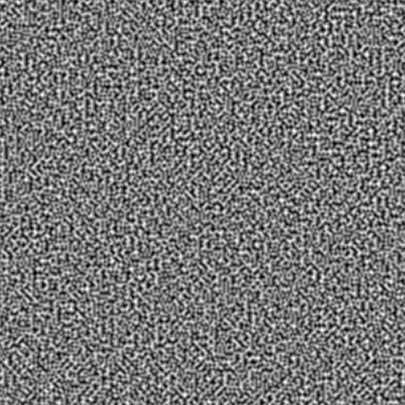
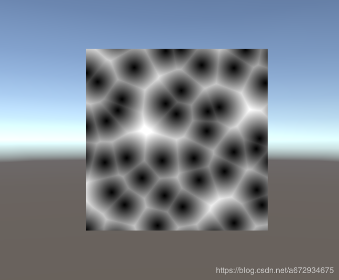

## 噪音种类



<center>柏林（perlin）噪音</center>

<br/>



<center>细胞（worley）噪音</center>

<br/>

<br/>

### unity使用perlin噪声并保存为PNG图片

```c#

using System.Collections;
using System.Collections.Generic;
using UnityEngine;
using System.IO;
 
public class perlinTest : MonoBehaviour {
    // Width and height of the texture in pixels.
    public int pixWidth;
    public int pixHeight;
 
    // The origin of the sampled area in the plane.
    public float xOrg;
    public float yOrg;
 
    // The number of cycles of the basic noise pattern that are repeated
    // over the width and height of the texture.
    public float scale = 1.0F;
 
    private Texture2D noiseTex;
    private Color[] pix;
    private Renderer rend;
 
    void Start()
    {
        rend = GetComponent<Renderer>();
 
        // Set up the texture and a Color array to hold pixels during processing.
        noiseTex = new Texture2D(pixWidth, pixHeight);
        pix = new Color[noiseTex.width * noiseTex.height];
        rend.material.mainTexture = noiseTex;
    }
 
    void CalcNoise()
    {
        // For each pixel in the texture...
        float y = 0.0F;
 
        while (y < noiseTex.height)
        {
            float x = 0.0F;
            while (x < noiseTex.width)
            {
                float xCoord = xOrg + x / noiseTex.width * scale;
                float yCoord = yOrg + y / noiseTex.height * scale;
                float sample = Mathf.PerlinNoise(xCoord, yCoord);
                pix[(int)y * noiseTex.width + (int)x] = new Color(sample, sample, sample);
                x++;
            }
            y++;
        }
 
        // Copy the pixel data to the texture and load it into the GPU.
        noiseTex.SetPixels(pix);
        noiseTex.Apply();
    }
 
    void Update()
    {
        if (Input.GetKeyDown(KeyCode.Space))
        {
            CalcNoise();
            
            SaveRenderTextureToPNG(noiseTex, GetComponent<Renderer>().material.shader,"D:\\name", "ok");
        }
    }
 
 
    public bool SaveRenderTextureToPNG(Texture2D inputTex, Shader outputShader, string contents, string pngName)
    {
        RenderTexture temp = RenderTexture.GetTemporary(inputTex.width, inputTex.height, 0, RenderTextureFormat.ARGB32);
        //Material mat = new Material(outputShader);
        Graphics.Blit(inputTex, temp);
        bool ret = SaveRenderTextureToPNG(temp, contents, pngName);
        RenderTexture.ReleaseTemporary(temp);
        return ret;
 
    }
 
    public bool SaveRenderTextureToPNG(RenderTexture rt, string contents, string pngName)
    {
        RenderTexture prev = RenderTexture.active;
        RenderTexture.active = rt;
        Texture2D png = new Texture2D(rt.width, rt.height, TextureFormat.ARGB32, false);
        png.ReadPixels(new Rect(0, 0, rt.width, rt.height), 0, 0);
        byte[] bytes = png.EncodeToPNG();
        if (!Directory.Exists(contents))
            Directory.CreateDirectory(contents);
        FileStream file = File.Open(contents + "/" + pngName + ".png", FileMode.Create);
        BinaryWriter writer = new BinaryWriter(file);
        writer.Write(bytes);
        file.Close();
        Texture2D.DestroyImmediate(png);
        png = null;
        RenderTexture.active = prev;
        Debug.Log("12345");
        return true;
    }
}
```

注意：将脚本放在一个物体上观察效果。

<br/>

<br/>

<br/>

<br/>

## 使用perlin噪音生成mesh地形

用例：

```c#
using UnityEngine;

[RequireComponent(typeof(MeshFilter))]
[RequireComponent(typeof(MeshRenderer))]
public class Test : MonoBehaviour
{
    // 柏林噪声参数
    [Range(1, 10)]
    public int octaves = 4;             // 倍频
    [Range(0.0001f, 0.9999f)]
    public float persistence = 0.4f;    // 持续度
    [Range(0.0001f, 0.9999f)]
    public float scale = 0.01f;         // 采样缩放
    public int xLength = 100;           // Mesh在X轴方向上的长度
    public int zLength = 100;           // Mesh在Z轴方向上的长度
    public float mutiplier = 50.0f;     // 高度增幅
    public byte xVertexCount = 255;     // Mesh在X轴方向上的顶点数
    public byte zVertexCount = 255;     // Mesh在Z轴方向上的顶点数

    private MeshFilter _meshFilter;
    private RectMeshGenerator _meshGenerator;

    private void OnValidate()
    {
        GenerateMesh();
    }

    // 生成Mesh
    private void GenerateMesh()
    {
        if (!_meshFilter)
        {
            _meshFilter = GetComponent<MeshFilter>();
        }
        if (_meshGenerator == null)
        {
            _meshGenerator = new RectMeshGenerator(_meshFilter.sharedMesh);
        }

        _meshGenerator.CalculateMeshData(Vector3.zero, xLength, zLength, xVertexCount, zVertexCount, GetHeight);
        _meshGenerator.UpdateMeshData();
    }

    // 利用柏林噪声计算高度
    private float GetHeight(float xSample, float zSample)
    {
        // 如果不适用柏林噪声，就直接返回0
        //return 0;

        // 使用柏林噪声算法计算高度
        float total = 0;
        float frequency = 1;
        float amplitude = 1;
        float maxValue = 0;
        for (int i = 0; i < octaves; i++)
        {
            total += Mathf.PerlinNoise(xSample * scale * frequency, zSample * scale * frequency) * amplitude * mutiplier;
            maxValue += amplitude;
            amplitude *= persistence;
            frequency *= 2;
        }

        float value = total / maxValue;
        return value;
    }
}
```

<br/>

<br/>

mesh生成代码：

```c#
using System;
using UnityEngine;

/// <summary>
/// 生成矩形Mesh。
/// </summary>
public class RectMeshGenerator
{
    private Mesh _mesh;
    private Vector3[] _vertices;
    private int[] _triangles;

    public RectMeshGenerator(Mesh mesh)
    {
        _mesh = mesh;
    }

    /// <summary>
    /// 计算矩形Mesh顶点数据。
    /// </summary>
    /// <param name="origin">Mesh起点位置（左下角）</param>
    /// <param name="xLength">X轴方向上的长度（Unity单位）</param>
    /// <param name="zLength">Z轴方向上的长度（Unity单位）</param>
    /// <param name="xVertexCount">X轴方向上的顶点数</param>
    /// <param name="zVertexCount">Z轴方向上的顶点数</param>
    /// <param name="getHeight">计算每个顶点Y轴高度的方法</param>
    public void CalculateMeshData(Vector3 origin, float xLength, float zLength, byte xVertexCount, byte zVertexCount, Func<float, float, float> getHeight = null)
    {
        if (xVertexCount < 2 || zVertexCount < 2)
        {
            throw new ArgumentOutOfRangeException("Mesh每边至少要有2个顶点");
        }

        if (getHeight == null)
        {
            getHeight = (x, z) => 0;
        }

        // 计算顶点总数和顶点索引总数
        int vertexCount = xVertexCount * zVertexCount;
        int indexCount = (xVertexCount - 1) * 6 * (zVertexCount - 1);
        _vertices = new Vector3[vertexCount];
        _triangles = new int[indexCount];

        // 计算顶点横纵间距和横纵步长
        float xSpace = xLength / (xVertexCount - 1);
        float zSpace = zLength / (zVertexCount - 1);
        Vector3 xStep = Vector3.right * xSpace;
        Vector3 zStep = Vector3.forward * zSpace;

        // 计算顶点和顶点索引
        int vertexIndex = 0;
        int triangleIndex = 0;
        for (int z = 0; z < zVertexCount; z++)
        {
            for (int x = 0; x < xVertexCount; x++)
            {
                // 计算顶点位置
                Vector3 yStep = Vector3.up * getHeight(x * xSpace, z * zSpace);
                Vector3 point = origin + xStep * x + zStep * z + yStep;
                _vertices[vertexIndex++] = point;
                //_vertices[x + z * xVertexCount] = point;

                // 计算顶点索引，跳过右、上边界的顶点
                if ((x < xVertexCount - 1) && (z < zVertexCount - 1))
                {
                    // 顺时针连接
                    _triangles[triangleIndex + 0] = x + z * xVertexCount;
                    _triangles[triangleIndex + 1] = x + z * xVertexCount + xVertexCount;
                    _triangles[triangleIndex + 2] = x + z * xVertexCount + xVertexCount + 1;
                    _triangles[triangleIndex + 3] = x + z * xVertexCount;
                    _triangles[triangleIndex + 4] = x + z * xVertexCount + xVertexCount + 1;
                    _triangles[triangleIndex + 5] = x + z * xVertexCount + 1;

                    // 每个四边形含有2个三角面，6个顶点索引
                    triangleIndex += 6;
                }
            }
        }
    }

    /// <summary>
    /// 更新Mesh数据。
    /// </summary>
    public void UpdateMeshData()
    {
        _mesh.Clear();
        _mesh.vertices = _vertices;
        _mesh.triangles = _triangles;
        _mesh.RecalculateNormals(); // 重新计算法线
        _mesh.RecalculateTangents(); // Bumpmap Shader需要重新计算切线
        //_mesh.RecalculateBounds(); // 设置`triangles`属性后会自动计算Bounds
    }
}
```


