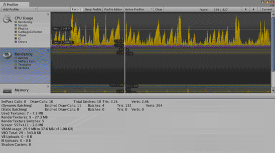
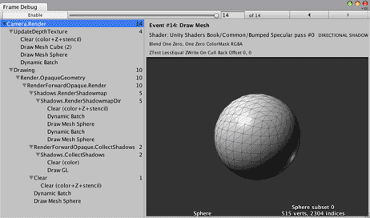
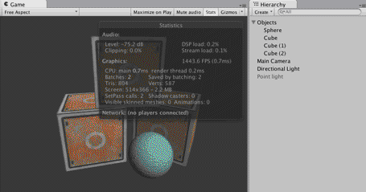
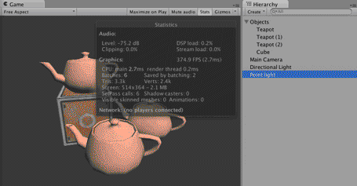

# Unity中的渲染优化技术

​	在进行程序优化的时候，人们经常会引用英国的计算机科学家Michael A. Jackson在1988年的优化准则。Jackson是想借此强调，对问题认识不清以及过度优化往往会让事情变得更加复杂，产生更多的程序错误。

​	然而，如果我们在游戏开发过程中从来都没有考虑优化，那么结果往往是惨不忍睹的。一个正确的做法是，从一开始就把优化当成是游戏设计中的一部分。正在阅读本书的读者，有可能是移动游戏的开发者。和PC相比，移动设备上的GPU有着完全不同的架构设计，它能使用的带宽、功能和其他资源都非常有限。这要求我们需要时刻把优化谨记在心，才可以避免等到项目完成时才发现游戏根本无法在移动设备上流畅运行的结果。

​	接下来我们将会阐述一些Unity中常见的优化技术。这些优化技术都是和渲染相关的，例如，使用批处理、LOD（Level of Detail）技术等。在本章最后的扩展阅读部分，我们给出一些非常有价值的参考资料，在那里读者可以学习到更多真实项目中的优化技术。

​	在开始学习之前，我们希望读者能够理解，游戏优化不仅是程序员的工作，更需要美工人员在游戏的美术上进行一定的权衡，例如，避免使用全屏的屏幕特效，避免使用计算复杂的shader，减少透明混合造成的overdraw等。也就是说，这是由程序员和美工人员等各个部分人员共同参与的工作。

<br/>

<br/>

## 移动平台的特点

​	和PC平台相比，移动平台上的GPU架构有很大的不同。由于处理资源等条件的限制，移动设备上的GPU架构专注于尽可能使用更小的带宽和功能，也由此带来了许多和PC平台完全不同的现象。

​	例如，为了尽可能移除那些隐藏的表面，减少overdraw（即一个像素被绘制多次），PowerVR芯片（通常用于iOS设备和某些Android设备）使用了**基于瓦片的延迟渲染（Tiled-based Deferred Rendering，TBDR）**架构，把所有的渲染图像装入一个个瓦片（tile）中，再由硬件找到可见的片元，而只有这些可见片元才会执行片元着色器。另一些基于瓦片的GPU架构，如Adreno（高通的芯片）和Mali（ARM的芯片）则会使用Early-Z或相似的技术进行一个低精度的的深度检测，来剔除那些不需要渲染的片元。还有一些GPU，如Tegra（英伟达的芯片），则使用了传统的架构设计，因此在这些设备上，overdraw更可能造成性能的瓶颈。

​	由于这些芯片架构造成的不同，一些游戏往往需要针对不同的芯片发布不同的版本，以便对每个芯片进行更有针对性的优化。尤其是在Android平台上，不同设备使用的硬件，如图形芯片、屏幕分辨率等，大相径庭，这对图形优化提出了更高的挑战。相比与Android平台，iOS平台的硬件条件则相对统一。读者可以在Unity手册的iOS硬件指南。

<br/>

<br/>

<br/>

## 影响性能的因素

​	首先，在学习如何优化之前，我们得了解影响游戏性能的因素有哪些，才能对症下药。**对于一个游戏来说，它主要需要使用两种计算资源：CPU和GPU。它们会互相合作，来让我们的游戏可以在预期的帧率和分辨率下工作。其中，CPU主要负责保证帧率，GPU主要负责分辨率相关的一些处理。**

​	据此，我们可以把造成游戏性能瓶颈的主要原因分成以下几个方面。

1、CPU

- 过多的drawCall
- 复杂的脚本和物理模拟

2、GPU

- 顶点处理
  - 过多的顶点
  - 过多的逐顶点计算
- 片元处理
  - 过多的片元（既可能是由于分辨率造成的，也可能是由于overdraw造成的）。
  - 过多的逐片元计算

3、带宽

- 使用了尺寸很大且未压缩的纹理。
- 分辨率过高的帧缓存。

<br/>

​	对于CPU来说，限制它的主要是每一帧中draw call的数目。简单来说，就是CPU在每次通知GPU进行渲染之前，都需要提前准备好顶点数据（如位置、法线、颜色、纹理坐标等），然后调用一系列API把它们放到GPU可以访问到的指定位置，最后，调用一个绘制命令，来告诉GPU，“嘿，我把东西都准备好了，你赶紧出来干活（渲染）吧！”。而调用绘制命令的时候，就会产生一个draw call。过多的draw call会造成CPU的性能瓶颈，这是因为每次调用draw call时，CPU往往都需要改变很多渲染状态的设置，而这些操作是非常耗时的。如果一帧中需要的draw call数目过多的话，就会导致CPU把大部分时间都花费在提交draw call的工作上面了。当然，其他原因也可能造成CPU瓶颈，例如物理、布料模拟、蒙皮、粒子模拟等，这些都是计算量很大的操作。

​	而对于GPU来说，它负责整个渲染流水线。它从处理CPU传递过来的模型数据开始，进行顶点着色器、片元着色器等一系列工作，最后输出屏幕上的每个像素。因此，GPU的性能瓶颈和需要处理的顶点数目、屏幕分辨率、显存等因素有关。而相关的优化策略可以从减少处理的数据规模（包括顶点数目和片元数目）、减少运算复杂度等方面入手。

​	基于以上内容，介绍的优化技术有：

1、CPU优化

- 使用批处理技术减少draw call数目。

2、GPU优化

- 减少需要处理的顶点数目。
  - 优化几何体
  - 使用模型的LOD（Level of Detail）技术
  - 使用遮挡剔除（Occlusion Culling）技术
- 减少需要处理的片元数目
  - 控制绘制顺序
  - 警惕透明物体
  - 减少实时光照
- 减少计算复杂度
  - 使用Shader的LOD（Level of Detail）技术
  - 代码方面的优化

3、节省内存带宽

- 减少纹理大小。
- 利用分辨率缩放。

<br/>

- 

<br/>

<br/>

<br/>

## Unity中的渲染分析工具

​	Unity内置了一些工具，来帮助我们方便地查看和渲染相关的各个统计数据。这些数据可以帮助我们分析游戏渲染性能，从而更有针对性地进行优化。在Unity中，这些工具包括了**渲染统计窗口（Rendering Statistics Window）、性能分析器（Profiler），以及帧调试器（Frame Debugger）**。需要注意的是，在不同的目标平台上，这些工具中显示的数据也会发生变化。

<br/>

### 渲染统计窗口

​	Unity提供了一个全新的窗口，即渲染统计窗口（Rendering Statistics Window）来显示当前游戏的各个渲染统计变量，我们可以通过在Game视图右上方的菜单中单击Stats按钮来打开它，如下图所示。从下图中可以看出，渲染统计窗口主要包含了3个方面的信息：**音频（Audio）、图像（Graphics）和网络（Network）**。我们这里只关注第二个方面，即图像相关的渲染统计结果。


渲染统计窗口中显示了很多重要的渲染数据，例如FPS、批处理数目、顶点和三角网格的数目等。如下表 ：

|        信息名称        |                             描述                             |
| :--------------------: | :----------------------------------------------------------: |
|    每帧的时间和FPS     | 在Graphic的右侧显示，给出了处理和渲染一帧所需的时间，以及FPS数目 |
|        Batches         |                  一帧中需要进行的批处理数目                  |
|   Saved by batching    | 合并的批处理数目，这个数字表明了批处理为我们节省了多少draw call |
|      Tris和Verts       |                 需要绘制的三角面片和顶点数目                 |
|         Screen         |               屏幕的大小，以及它占用的内存大小               |
|        SetPass         | 渲染使用的Pass的数目，每个Pass都需要Unity的runtime来绑定一个新的Shader<br>这可能造成CPU的瓶颈 |
| Visible Skinned Meshes |                     渲染的蒙皮网格的数目                     |
|       Animations       |                        播放的动画数目                        |

​	Unity 5的渲染统计窗口相较于之前版本中的有了一些变化，**最明显的区别之一就是去掉了draw call数目的显示，而添加了批处理数目的显示。Batches和Saved by batching更容易让开发者理解批处理的优化结果。当然，如果我们想要查看draw call的数目等其他更加详细的数据，可以通过Unity编辑器的性能分析器来查看**。

<br/>

<br/>

### 性能分析器的渲染区域

​	我们可以通过单击Window -> Profiler来打开Unity的性能分析器（Profiler）。性能分析器中的渲染区域（Rendering Area）提供了更多关于渲染的统计信息，下图给出了对渲染窗口中场景的渲染分析结果。



<center>使用Unity的性能分析器中的渲染区域来查看更多关于渲染的统计信息</center>

​	性能分析器显示了绝大部分在渲染统计窗口中提供的信息，例如，**绿线显示了批处理数目、蓝线显示了Pass数目等，同时还给出了许多其他非常有用的信息，例如，draw call数目、动态批处理/静态批处理的数目、渲染纹理的数目和内存占用等。**

​	结合渲染统计窗口和性能分析器，我们可以查看与渲染相关的绝大多数重要的数据。一个值得注意的现象是，**性能分析器给出的draw call数目和批处理数目、Pass数目并不相等，并且看起来好像要大于我们估算的数目，这是因为Unity在背后需要进行很多工作，例如，初始化各个缓存、为阴影更新深度纹理和阴影映射纹理等，因此需要花费比“预期”更多的draw call。**一个好消息是，Unity 5引入了一个新的工具来帮助我们查看每一个draw call的工作，这个工具就是帧调试器。

<br/>

<br/>

### 再谈帧调试器

​	我们已经在之前的章节中多次看到帧调试器（Frame Debugger）的应用，我们可以通过Window -> Frame Debugger来打开它。在这个窗口中，我们可以清楚地看到每一个draw call的工作和结果，如下图所示。



​	帧调试器的调试面板上显示了渲染这一帧所需要的所有的渲染事件，在本例中，事件数目为14，而其中包含了10个draw call事件（其他渲染事件多为清空缓存等）。通过单击面板上的每个事件，我们可以在Game视图查看该事件的绘制结果，同时渲染统计面板上的数据也会显示成截止到当前事件为止的各个渲染统计数据。以本例为例（场景如图渲染统计窗口中所示），要渲染一帧共需要花费10个draw call，其中4个draw call用于更新深度纹理（对应UpdateDepthTexture），4个draw call用于渲染平行光的阴影映射纹理，1个draw call用于绘制动态批处理后的3个立方体模型，1个draw call用于绘制球体。

​	在Unity的渲染统计窗口、分析器和帧调试器这3个利器的帮助下，我们可以获得很多有用的优化信息。但是，很多诸如渲染时间这样的数据是基于当前的开发平台得到的，而非真机上的结果。事实上，Unity正在和硬件生产商合作，来首先让使用英伟达图睿（Tegra）的设备可以出现在Unity的性能分析器中。我们有理由相信，在后续的Unity版本中，直接在Unity中对移动设备进行性能分析不再是梦想。然而，在这个梦想实现之前，我们仍然需要一些外部的性能分析工具的帮助。

<br/>

<br/>

### 其他性能分析工具

​	**对于移动平台上的游戏来说**，我们更希望得到在真机上运行游戏时的性能数据。这时，Unity目前提供的各个工具可能就不再能满足我们的需求了。

​	**对于Android平台来说,高通的Adreno分析工具可以对不同的测试机进行详细的性能分析。英伟达提供了NVPerfHUD工具来帮助我们得到几乎所有需要的性能分析数据，例如，每个draw call的GPU时间，每个shader花费的cycle数目等。**

​	**对于iOS平台来说**，Unity内置的分析器可以得到整个场景花费的GPU时间。PowerVRAM的PVRUniSCo shader分析器也可以给出一个大致的性能评估。Xcode中的OpenGL ES Driver Instruments可以给出一些宏观上的性能信息，例如，设备利用率、渲染器利用率等。但相对于Android平台，对iOS的性能分析更加困难（工具较少）。而且PowerVR芯片采用了基于瓦片的延迟渲染器，因此，想要得到每个draw call花费的GPU时间是几乎不可能的。这时，一些宏观上的统计数据可能更有参考价值。

一些其他的性能分析工具可以在Unity的官方手册（http://docs.unity3d.com/Manual/ MobileProfiling.html）中找到。当找到了性能瓶颈后，我们就可以针对这些方面进行特定的优化。

<br/><br/>

<br/>

## 减少draw call数目

​	读者最常看到的优化技术大概就是**批处理（batching）了**。批处理的实现原理就是为了减少每一帧需要的draw call数目。为了把一个对象渲染到屏幕上，CPU需要检查哪些光源影响了该物体，绑定shader并设置它的参数，再把渲染命令发送给GPU。当场景中包含了大量对象时，这些操作就会非常耗时。一个极端的例子是，如果我们需要渲染一千个三角形，把它们按一千个单独的网格进行渲染所花费的时间要远远大于渲染一个包含了一千个三角形的网格。在这两种情况下，GPU的性能消耗其实并没有多大的区别，但CPU的draw call数目就会成为性能瓶颈。因此，批处理的思想很简单，就是在每次调用draw call时尽可能多地处理多个物体。

​	**那么，什么样的物体可以一起处理呢？答案就是使用同一个材质的物体。这是因为，对于使用同一个材质的物体，它们之间的不同仅仅在于顶点数据的差别。我们可以把这些顶点数据合并在一起，再一起发送给GPU，就可以完成一次批处理。**

​	Unity中支持两种批处理方式：一种是动态批处理，另一种是静态批处理。对于动态批处理来说，优点是一切处理都是Unity自动完成的，不需要我们自己做任何操作，而且物体是可以移动的，但缺点是，限制很多，可能一不小心就会破坏了这种机制，导致Unity无法动态批处理一些使用了相同材质的物体。而对于静态批处理来说，它的优点是自由度很高，限制很少；但缺点是可能会占用更多的内存，而且经过静态批处理后的所有物体都不可以再移动了（即便在脚本中尝试改变物体的位置也是无效的）。

<br/>

<br/>

### 动态批处理

​	如果场景中有一些模型共享了同一个材质并满足一些条件，Unity就可以自动把它们进行批处理，从而只需要花费一个draw call就可以渲染所有的模型。动态批处理的基本原理是，每一帧把可以进行批处理的模型网格进行合并，再把合并后模型数据传递给GPU，然后使用同一个材质对其渲染。除了实现方便，动态批处理的另一个好处是，经过批处理的物体仍然可以移动，这是由于在处理每帧时Unity都会重新合并一次网格。

​	虽然Unity的动态批处理不需要我们进行任何额外工作，但只有满足条件的模型和材质才可以被动态批处理。需要注意的是，随着Unity版本的变化，这些条件也有一些改变。在本节中，我们给出一些主要的条件限制。

- 能够进行动态批处理的网格的顶点属性规模要小于900。例如，如果shader中需要使用顶点位置、法线和纹理坐标这3个顶点属性，那么要想让模型能够被动态批处理，它的顶点数目不能超过300。需要注意的是，这个数字在未来有可能会发生变化，因此不要依赖这个数据。
- 一般来说，所有对象都需要使用同一个缩放尺度（可以是(1, 1, 1)、(1, 2, 3)、(1.5, 1.4, 1.3)等，但必须都一样）。一个例外情况是，如果所有的物体都使用了不同的非统一缩放，那么它们也是可以被动态批处理的。但在Unity 5中，这种对模型缩放的限制已经不存在了。
- 使用光照纹理（lightmap）的物体需要小心处理。这些物体需要额外的渲染参数，例如，在光照纹理上的索引、偏移量和缩放信息等。因此，为了让这些物体可以被动态批处理，我们需要保证它们指向光照纹理中的同一个位置。
- 多Pass的shader会中断批处理。在前向渲染中，我们有时需要使用额外的Pass来为模型添加更多的光照效果，但这样一来模型就不会被动态批处理了。

<br/>

**示例：**我们给出了这样一个场景。场景中包含了3个立方体，它们使用同一个材质，同时还包含了一个使用其他材质的球体。场景中还包含了一个平行光，但我们关闭了它的阴影效果，以避免阴影计算对批处理数目的影响。这样一个场景的渲染统计数据如下图所示。



<center>动态批处理</center>

​	从上图中可以看出，要渲染这样一个包含了4个物体的场景共需要两个批处理。其中，一个批处理用于绘制经过动态批处理合并后的3个立方体网格，另一个批处理用于绘制球体。我们可以从Save by batching看出批处理帮我们节省了两个draw call。

<br/>

​	现在，我们再向场景中添加一个点光源，并调整它的位置使它可以照亮场景中的4个物体。由于场景中的物体都使用了多个Pass的shader，因此，点光源会对它们产生光照影响。下图给出了添加点光源后的渲染统计数据。


<center>多光源对动态批处理的影响结果</center>

​	从上图中可以看出，渲染一帧所需的批处理数目增大到了8，而Save by batching的数目也变成了0。这是因为，使用了多个Pass的shader在需要应用多个光照的情况下，破坏了动态批处理的机制，导致Unity不能对这些物体进行动态批处理。而由于平行光和点光源需要对4个物体分别产生影响，因此，需要2×4个批处理操作。需要注意的是，只有物体在点光源的影响范围内，Unity才会调用额外的Pass来处理它。因此，如果场景中点光源距离物体很远，那么它们仍然会被动态批处理的。

​	动态批处理的限制条件比较多，例如很多时候，我们的模型数据往往会超过900的顶点属性限制。这种时候依赖动态批处理来减少draw call显然已经不能够满足我们的需求了。这时，我们可以使用Unity的静态批处理技术。

<br/>

### 静态批处理

​	Unity提供了另一种批处理方式，即静态批处理。相比于动态批处理来说，静态批处理适用于任何大小的几何模型。它的实现原理是，只在运行开始阶段，把需要进行静态批处理的模型合并到一个新的网格结构中，这意味着这些模型不可以在运行时刻被移动。但由于它只需要进行一次合并操作，因此，比动态批处理更加高效。**静态批处理的另一个缺点在于，它往往需要占用更多的内存来存储合并后的几何结构**。这是因为，如果在静态批处理前一些物体共享了相同的网格，那么在内存中每一个物体都会对应一个该网格的复制品，即一个网格会变成多个网格再发送给GPU。如果这类使用同一网格的对象很多，那么这就会成为一个性能瓶颈了。例如，如果在一个使用了1 000个相同树模型的森林中使用静态批处理，那么，就会多使用1 000倍的内存，这会造成严重的内存影响。这种时候，解决方法要么忍受这种牺牲内存换取性能的方法，要么不要使用静态批处理，而使用动态批处理技术（但要小心控制模型的顶点属性数目），或者自己编写批处理的方法。

​	**示例：**我们给出了一个测试静态批处理的场景。场景中包含了3个Teapot模型，它们使用同一个材质，同时还包含了一个使用不同材质的立方体。场景中还包含了一个平行光，但我们关闭了它的阴影效果，以避免阴影计算对批处理数目的影响。在运行前，这样一个场景的渲染统计数据如图16.6所示。

	

<center>图16.6  静态批处理前的渲染统计数据</center>

​	从图16.6中可以看出，尽管3个Teapot模型使用了相同的材质，但它们仍然没有被动态批处理。这是因为，Teapot模型包含的顶点数目是393，而它们使用的shader中需要使用4个顶点属性（顶点位置、法线方向、切线方向和纹理坐标），超过了动态批处理中限定的900限制。此时，要想减少draw call就需要使用静态批处理。

​	静态批处理的实现非常简单，只需要把物体面板上的Static复选框勾选上即可（实际上我们只需要勾选Batching Static即可），如图16.7所示。


<center>图16.7　把物体标志为Static</center>

​	这时，我们再观察渲染统计窗口中的批处理数目，还是没有变化。但是不要急，运行程序后，变化就出现了，如图16.8所示。


​	从性能分析器（Profile）中可以看出，现在的批处理数目变成了2，而Save by batching数目也显示为2。此时，如果我们在运行时查看每个模型使用的网格，会发现它们都变成了一个名为Combined Mesh (roo: scene)的东西，如图16.9所示。这个网格是Unity合并了所有被标识为“Static”的物体的结果，在我们的例子里，就是3个Teapot和一个立方体。读者可能会有一个疑问，这4个对象明明不是都使用了一个材质，为什么可以合并成一个呢？如果你仔细观看图16.9的结果，会发现在图16.9的右下方标明了“4 submeshes”，也就是说，这个合并后的网格其实包含了4个子网格，即场景中的4个对象。对于合并后的网格，Unity会判断其中使用同一个材质的子网格，然后对它们进行批处理。


<center>图16.9　静态批处理中Unity会合并所有被标识为“Static”的物体</center>

​	在内部实现上，Unity首先把这些静态物体变换到世界空间下，然后为它们构建一个更大的顶点和索引缓存。对于使用了同一材质的物体，Unity只需要调用一个draw call就可以绘制全部物体。而对于使用了不同材质的物体，静态批处理同样可以提升渲染性能。尽管这些物体仍然需要调用多个draw call，但静态批处理可以减少这些draw call之间的状态切换，而这些切换往往是费时的操作。从合并后的网格结构中我们还可以发现，尽管3个Teapot对象使用了同一个网格，但合并后却变成了3个独立网格。而且，我们可以从Unity的分析器中观察到在应用静态批处理前后VBO total的变化，从图16.10所示中可以看出，VBO（Vertex Buffer Object，顶点缓冲对象）的数目变大了。这正是因为静态批处理会占用更多内存的缘故，正如本节一开头所讲，静态批处理需要占用更多的内存来存储合并后的几何结构，如果一些物体共享了相同的网格，那么在内存中每一个物体都会对应一个该网格的复制品。


图16.10　静态批处理会占用更多的内存。左边：静态批处理前的渲染统计数据，右边：静态批处理后的渲染统计数据

<br/>

<br/>

​	如果场景中包含了除了平行光以外的其他光源，并且在shader中定义了额外的Pass来处理它们，这些额外的Pass部分是不会被批处理的。图16.11显示了在场景中添加了一个会影响4个物体的点光源之后，渲染统计窗口的数据变化。



<center>图16.11　处理其他逐像素光的Pass不会被静态批处理</center>

​	但是，处理平行光的Base Pass部分仍然会被静态批处理，因此，我们仍然可以节省两个draw call。	

<br/>

<br/>

### 共享材质

​	从之前的内容可以看出，无论是动态批处理还是静态批处理，都要求模型之间需要共享同一个材质。但不同的模型之间总会需要有不同的渲染属性，例如，使用不同的纹理、颜色等。这时，我们需要一些策略来尽可能地合并材质。

​	如果两个材质之间只有使用的纹理不同，我们可以把这些纹理合并到一张更大的纹理中，这张更大的纹理被称为是一张图集（atlas）。一旦使用了同一张纹理，我们就可以使用同一个材质，再使用不同的采样坐标对纹理采样即可。

​	但有时，除了纹理不同外，不同的物体在材质上还有一些微小的参数变化，例如，颜色不同、某些浮点属性不同。但是，不管是动态批处理还是静态批处理，它们的前提都是要使用同一个材质。是同一个，而不是使用了同一种Shader的材质，也就是说它们指向的材质必须是同一个实体。这意味着，只要我们调整了参数，就会影响到所有使用这个材质的对象。那么想要微小的调整怎么办呢？一种常用的方法就是使用网格的顶点数据（最常见的就是顶点颜色数据）来存储这些参数。

​	前面说过，经过批处理后的物体会被处理成更大的VBO发送给GPU，VBO中的数据可以作为输入传递给顶点着色器，因此，我们可以巧妙地对VBO中的数据进行控制，从而达到不同效果的目的。一个例子是，森林场景中所有的树使用了同一种材质，我们希望它们可以通过批处理来减少draw call，但不同树的颜色可能不同。这时，我们可以利用网格的顶点的颜色数据来调整。

​	需要注意的是，如果我们需要在脚本中访问共享材质，应该使用Renderer.sharedMaterial来保证修改的是和其他物体共享的材质，但这意味着修改会应用到所有使用该材质的物体上。另一个类似的API是Renderer.material ，如果使用Renderer.material 来修改材质，Unity会创建一个该材质的复制品，从而破坏批处理在该物体上的应用，这可能并不是我们希望看到的。

<br/>

### 批处理的注意事项

在选择使用动态批处理还是静态批处理时，我们有一些小小的建议。

- 尽可能选择静态批处理，但得时刻小心对内存的消耗，并且记住经过静态批处理的物体不可以再被移动。
- 如果无法进行静态批处理，而要使用动态批处理的话，那么请小心上面提到的各种条件限制。例如，尽可能让这样的物体少并且尽可能让这些物体包含少量的顶点属性和顶点数目。
- 对于游戏中的小道具，例如可以捡拾的金币等，可以使用动态批处理。
- 对于包含动画的这类物体，我们无法全部使用静态批处理，但其中如果有不动的部分，可以把这部分标识成“Static”。

​	除了上述提示外，在使用批处理时还有一些需要注意的地方。由于批处理需要把多个模型变换到世界空间下再合并它们，因此，如果shader中存在一些基于模型空间下的坐标的运算，那么往往会得到错误的结果。一个解决方法是，在shader中使用DisableBatching标签来强制使用该Shader的材质不会被批处理。另一个注意事项是，使用半透明材质的物体通常需要使用严格的从后往前的绘制顺序来保证透明混合的正确性。对于这些物体，Unity会首先保证它们的绘制顺序，再尝试对它们进行批处理。这意味着，当绘制顺序无法满足时，批处理无法在这些物体上被成功应用。

​	尽管在Unity 5.2中，只实现了对一些渲染部分的批处理。而诸如渲染摄像机的深度纹理等部分，还没有实现批处理。但我们相信，在后续的Unity版本中，批处理会应用到越来越多的渲染部分中。

<br/><br/><br/>

## 减少需要处理的顶点数目

​	尽管draw call是一个重要的性能指标，但顶点数目同样有可能成为GPU的性能瓶颈。在本节中，我们将给出3个常用的顶点优化策略。

### 优化几何体

​	3D游戏制作通常都是由模型制作开始的。而在建模时，有一条规则我们需要记住：尽可能减少模型中三角面片的数目，一些对于模型没有影响、或是肉眼非常难察觉到区别的顶点都要尽可能去掉。为了尽可能减少模型中的顶点数目，美工人员往往需要优化网格结构。在很多三维建模软件中，都有相应的优化选项，可以自动优化网格结构。

​	在Unity的渲染统计窗口中，我们可以查看到渲染当前帧需要的三角面片数目和顶点数目。需要注意的是，Unity中显示的数目往往要多于建模软件里显示的顶点数，通常Unity中显示的数目要大很多。谁才是对的呢？其实，这是因为在不同的角度上计算的，都有各自的道理，但我们真正应该关心的是Unity里显示的数目。

​	我们在这里简单解释一下造成这种不同的原因。三维软件更多地是站在我们人类的角度理解顶点的，即组成几何体的每一个点就是一个单独的点。而Unity是站在GPU的角度上去计算顶点数的。在GPU看来，有时需要把一个顶点拆分成两个或更多的顶点。这种将顶点一分为多的原因主要有两个：一个是为了分离纹理坐标（uv splits），另一个是为了产生平滑的边界（smoothing splits）。它们的本质，其实都是因为对于GPU来说，顶点的每一个属性和顶点之间必须是一对一的关系。而分离纹理坐标，是因为建模时一个顶点的纹理坐标有多个。例如，对于一个立方体，它的6个面之间虽然使用了一些相同的顶点，但在不同面上，同一个顶点的纹理坐标可能并不相同。对于GPU来说，这是不可理解的，因此，它必须把这个顶点拆分成多个具有不同纹理坐标的顶点。而平滑边界也是类似的，不同的是，此时一个顶点可能会对应多个法线信息或切线信息。这通常是因为我们要决定一个边是一条硬边（hard edge）还是一条平滑边（smooth edge）。

​	对于GPU来说，它本质上只关心有多少个顶点。因此，尽可能减少顶点的数目其实才是我们真正需要关心的事情。因此，最后一条几何体优化建议就是：移除不必要的硬边以及纹理衔接，避免边界平滑和纹理分离。

<br/>

### 模型的LOD技术

​	另一个减少顶点数目的方法是使用LOD（Level of Detail）技术。这种技术的原理是，当一个物体离摄像机很远时，模型上的很多细节是无法被察觉到的。因此，LOD允许当对象逐渐远离摄像机时，减少模型上的面片数量，从而提高性能。

​	**在Unity中，我们可以使用LOD Group组件来为一个物体构建一个LOD。我们需要为同一个对象准备多个包含不同细节程度的模型，然后把它们赋给LOD Group组件中的不同等级，Unity就会自动判断当前位置上需要使用哪个等级的模型。**

<br/>

### 遮挡剔除技术

​	我们最后要介绍的顶点优化策略就是遮挡剔除（Occlusion culling）技术。遮挡剔除可以用来消除那些在其他物件后面看不到的物件，这意味着资源不会浪费在计算那些看不到的顶点上，进而提升性能。

​	我们需要把遮挡剔除和摄像机的视锥体剔除（Frustum Culling）区分开来。视锥体剔除只会剔除掉那些不在摄像机的视野范围内的对象，但不会判断视野中是否有物体被其他物体挡住。而遮挡剔除会使用一个虚拟的摄像机来遍历场景，从而构建一个潜在可见的对象集合的层级结构。在运行时刻，每个摄像机将会使用这个数据来识别哪些物体是可见的，而哪些被其他物体挡住不可见。使用遮挡剔除技术，不仅可以减少处理的顶点数目，还可以减少overdraw，提高游戏性能。

​	要在Unity中使用遮挡剔除技术，我们需要进行一系列额外的处理工作。具体步骤可以参见Unity手册的相关内容（http://docs.unity3d.com/Manual/OcclusionCulling.html），本书不再赘述。

​	模型的LOD技术和遮挡剔除技术可以同时减少CPU和GPU的负荷。CPU可以提交更少的draw call，而GPU需要处理的顶点和片元数目也减少了。

<br/><br/><br/>

## 减少需要处理的片元数目

​	另一个造成GPU瓶颈的是需要处理过多的片元。这部分优化的重点在于减少overdraw。简单来说，**overdraw指的就是同一个像素被绘制了多次。**

​	**Unity还提供了查看overdraw的视图，我们可以在Scene视图左上方的下拉菜单中选中Overdraw即可**。实际上，这里的视图只是提供了查看物体相互遮挡的层数，并不是真正的最终屏幕绘制的overdraw。也就是说，可以理解为它显示的是，如果没有使用任何深度测试和其他优化策略时的overdraw。这种视图是通过把所有对象都渲染成一个透明的轮廓，通过查看透明颜色的累计程度，来判断物体之间的遮挡。当然，我们可以使用一些措施来防止这种最坏情况的出现。

### 控制绘制顺序

​	为了最大限度地避免overdraw，一个重要的优化策略就是控制绘制顺序。由于深度测试的存在，如果我们可以保证物体都是从前往后绘制的，那么就可以很大程度上减少overdraw。这是因为，在后面绘制的物体由于无法通过深度测试，因此，就不会再进行后面的渲染处理。

​	在Unity中，那些渲染队列数目小于2 500（如“Background”“Geometry”和“AlphaTest”）的对象都被认为是不透明（opaque）的物体，这些物体总体上是从前往后绘制的，而使用其他的队列（如“Transparent”“Overlay”等）的物体，则是从后往前绘制的。这意味着，我们可以尽可能地把物体的队列设置为不透明物体的渲染队列，而尽量避免使用半透明队列。

​	而且，我们还可以充分利用Unity的渲染队列来控制绘制顺序。例如，在第一人称射击游戏中，对于游戏中的主要人物角色来说，他们使用的shader往往比较复杂，但是，由于他们通常会挡住屏幕的很大一部分区域，因此我们可以先绘制它们（使用更小的渲染队列）。而对于一些敌方角色，它们通常会出现在各种掩体后面，因此，我们可以在所有常规的不透明物体后面渲染它们（使用更大的渲染队列）。而对于天空盒子来说，它几乎覆盖了所有的像素，而且我们知道它永远会出现在所有物体的后面，因此，它的队列可以设置为“Geometry+1”。这样，就可以保证不会因为它而造成overdraw。

​	这些排序的思想往往可以节省掉很多渲染时间

### 时刻警惕透明物体

​	对于半透明对象来说，由于它们没有开启深度写入，因此，如果要得到正确的渲染效果，就必须从后往前渲染。这意味着，半透明物体几乎一定会造成overdraw。如果我们不注意这一点，在一些机器上可能会造成严重的性能下降。例如，对于GUI对象来说，它们大多被设置成了半透明，如果屏幕中GUI占据的比例太多，而主摄像机又没有进行调整而是投影整个屏幕，那么GUI就会造成大量overdraw。

​	因此，如果场景中包含了大面积的半透明对象，或者有很多层相互覆盖的半透明对象（即便它们每个的面积可能都不大），或者是透明的粒子效果，在移动设备上也会造成大量的overdraw。这是应该尽量避免的。

​	对于上述GUI的这种情况，**我们可以尽量减少窗口中GUI所占的面积**。如果实在无能为力，我们可以把GUI的绘制和三维场景的绘制交给不同的摄像机，而其中负责三维场景的摄像机的视角范围尽量不要和GUI的相互重叠。当然，这样会对游戏的美观度产生一定影响，因此，我们可以在代码中对机器的性能进行判断，例如，首先关闭一些耗费性能的功能，如果发现这个机器表现非常良好，再尝试开启一些特效功能。

​	在移动平台上，透明度测试也会影响游戏性能。虽然透明度测试没有关闭深度写入，但由于它的实现使用了discard或clip操作，而这些操作会导致一些硬件的优化策略失效。例如，我们之前讲过PowerVR使用的基于瓦片的延迟渲染技术，为了减少overdraw它会在调用片元着色器前就判断哪些瓦片被真正渲染的。但是，由于透明度测试在片元着色器中使用了discard函数改变了片元是否会被渲染的结果，因此，GPU就无法使用上述的优化策略了。也就是说，只有在执行了所有的片元着色器后，GPU才知道哪些片元会被真正渲染到屏幕上，这样，原先那些可以减少overdraw的优化就都无效了。这种时候，使用透明度混合的性能往往比使用透明度测试更好。

### 减少实时光照和阴影

​	实时光照对于移动平台是一种非常昂贵的操作。如果场景中包含了过多的点光源，并且使用了多个Pass的Shader，那么很有可能会造成性能下降。例如，一个场景里如果包含了3个逐像素的点光源，而且使用了逐像素的Shader，那么很有可能将draw call数目（CPU的瓶颈）提高3倍，同时也会增加overdraw（GPU的瓶颈）。这是因为，对于逐像素的光源来说，被这些光源照亮的物体需要被再渲染一次。更糟糕的是，无论是静态批处理还是动态批处理，对于这种额外的处理逐像素光源的Pass都无法进行批处理，也就是说，它们会中断批处理。

​	当然，游戏场景还是需要光照才能得到出色的画面效果。我们看到很多成功的移动平台的游戏，它们的画面效果看起来好像包含了很多光源，但其实这都是骗人的。这些游戏往往使用了烘焙技术，把光照提前烘焙到一张光照纹理（lightmap）中，然后在运行时刻只需要根据纹理采样得到光照结果即可。另一个模拟光源的方法是使用God Ray。场景中很多小型光源的效果都是靠这种方法模拟的。它们一般并不是真的光源，很多情况是通过透明纹理模拟得到的。更多信息可以参见本章的扩展阅读部分。在移动平台上，一个物体使用的逐像素光源数目应该小于1（不包括平行光）。如果一定要使用更多的实时光，可以选择用逐顶点光照来代替。

​	在游戏《ShadowGun》中，游戏角色看起来使用了非常复杂高级的光照计算，但这实际上是优化后的结果。开发者们把复杂的光照计算存储到一张查找纹理（lookup texture，也被称为查找表，lookup table，LUT）中。然后在运行时刻，我们只需要使用光源方向、视角方向、法线方向等参数，对LUT采样得到光照结果即可。使用这样的查找纹理，不仅可以让我们使用更出色的光照模型，例如，更加复杂的BRDF模型，还可以利用查找纹理的大小来进一步优化性能，例如，主要角色可以使用更大分辨率的LUT，而一些NPC就使用较小的LUT。《ShadowGun》的开发者开发了一个LUT烘焙工具，来帮助美工人员快速调整光照模型，并把结果存储到LUT中。

​	实时阴影同样是一个非常消耗性能的效果。不仅是CPU需要提交更多的draw call，GPU也需要进行更多的处理。因此，我们应该尽量减少实时阴影，例如，使用烘焙把静态物体的阴影信息存储到光照纹理中，而只对场景中的动态物体使用适当的实时阴影。

<br/><br/><br/>

## 节省带宽

​	大量使用未经压缩的纹理以及使用过大的分辨率都会造成由于带宽而引发的性能瓶颈。

### 减少纹理大小

​	之前提到过，使用纹理图集可以帮助我们减少draw call的数目，而这些纹理的大小同样是一个需要考虑的问题。需要注意的是，所有纹理的长宽比最好是正方形，而且长宽值最好是2的整数幂。这是因为有很多优化策略只有在这种时候才可以发挥最大效用。在Unity 5中，即便我们导入的纹理长宽值并不是2的整数幂，Unity也会自动把长宽转换到离它最近的2的整数幂值。但我们仍然应该在制作美术资源时就把这条规则谨记在心，防止由于放缩而造成不好的影响。

​	除此之外，我们还应该尽可能使用多级渐远纹理技术（mipmapping）和纹理压缩。在Unity中，我们可以通过纹理导入面板来查看纹理的各个导入属性。通过把纹理类型设置为Advanced，就可以自定义许多选项，例如，是否生成多级渐远纹理（mipmaps），如图16.12所示。当勾选了Generate Mip Maps选项后，Unity就会为同一张纹理创建出很多不同大小的小纹理，构成一个纹理金字塔。而在游戏运行中就可以根据距离物体的远近，来动态选择使用哪一个纹理。这是因为，在距离物体很远的时候，就算我们使用了非常精细的纹理，但肉眼也是分辨不出来的。这种时候，我们完全可以使用更小、更模糊的纹理来代替，这可以让GPU使用分辨率更小的纹理，大量节省访问的像素数目。在某些设备上，关闭多级渐远纹理往往会造成严重的性能问题。因此，除非我们确定该纹理不会发生缩放，例如GUI和2D游戏中使用的纹理等，都应该为纹理生成相应的多级渐远纹理。

​	纹理压缩同样可以节省带宽。但对于像Android这样的平台，有很多不同架构的GPU，纹理压缩就变得有点复杂，因为不同的GPU架构有它自己的纹理压缩格式，例如，PowerVRAM的PVRTC格式、Tegra的DXT格式、Adreno的ATC格式。所幸的是，Unity可以根据不同的设备选择不同的压缩格式，而我们只需要把纹理压缩格式设置为自动压缩即可。但是，GUI类型的纹理同样是个例外，一些时候由于对画质的要求，我们不希望对这些纹理进行压缩。

### 利用分辨率缩放

​	过高的屏幕分辨率也是造成性能下降的原因之一，尤其是对于很多低端手机，除了分辨率高其他硬件条件并不尽如人意，而这恰恰是游戏性能的两个瓶颈：过大的屏幕分辨率和糟糕的GPU。因此，我们可能需要对于特定机器进行分辨率的放缩。当然，这样可能会造成游戏效果的下降，但性能和画面之间永远是个需要权衡的话题。

​	在Unity中设置屏幕分辨率可以直接调用Screen.SetResolution。实际使用中可能会遇到一些情况，雨松MOMO有一篇文章（http://www.xuanyusong.com/archives/3205）详细讲解了如何使用这种技术，读者可参考。

<br/>

<br/>

<br/>

## 减少计算复杂度

​	计算复杂度同样会影响游戏的渲染性能。在本节中，我们会介绍两个方面的技术来减少计算复杂度。

### Shader的LOD技术（着色器细节差别）

​	和模型的LOD技术类似，Shader的LOD技术可以控制使用的Shader等级。它的原理是，只有Shader的LOD值小于某个设定的值，这个Shader才会被使用，而使用了那些超过设定值的Shader的物体将不会被渲染。

​	我们通常会在SubShader中使用类似下面的语句来指明该shader的LOD值：

```
SubShader {
    Tags { "RenderType"="Opaque" }
    LOD 200
```

​	我们也可以在Unity Shader的导入面板上看到该Shader使用的LOD值。在默认情况下，允许的LOD等级是无限大的。这意味着，任何被当前显卡支持的Shader都可以被使用。但是，在某些情况下我们可能需要去掉一些使用了复杂计算的Shader渲染。这时，我们可以使用Shader.maximumLOD或Shader.globalMaximumLOD来设置允许的最大LOD值。

​	Unity内置的Shader使用了不同的LOD值，例如，Diffuse的LOD为200，而Bumped Specular的LOD为400。

### shader的LOD技术（着色器细节差别——官网）

​	仅当使用的着色器或子着色器的细节级别 (LOD) 值低于指定数字时，着色器 LOD 才有效。

​	默认情况下，允许的 LOD 级别无限大，因此可以使用用户硬件支持的所有着色器。但在某些情况下，即使硬件可以支持更高的着色器细节级别，您也可能希望降低细节级别。例如，一些廉价的显卡可能支持所有功能，但使用起来会导致响应过慢。因此，您可能不希望在这些显卡上使用视差法线贴图。

​	可为各个着色器分别设置着色器 LOD（使用 [Shader.maximumLOD](../ScriptReference/Shader-maximumLOD.html)），也可为所有着色器进行全局设置（使用 [Shader.globalMaximumLOD](../ScriptReference/Shader-globalMaximumLOD.html)）。

​	在自定义着色器中，使用 **LOD** 命令可设置任何子着色器的 LOD 值。

Unity 中的内置着色器按以下方式设置 LOD：

- 顶点光照 (VertexLit) 类型着色器 = 100
- 贴花、反光顶点光照 = 150
- 漫射 = 200
- 漫射细节、反光凹凸无光照、反光凹凸顶点光照 = 250
- 凹凸、镜面反射 = 300
- 凹凸镜面反射 = 400
- 视差 = 500
- 视差镜面反射 = 600

<br/>

### 代码方面的优化

​	在实现游戏效果时，我们可以选择在哪里进行某些特定的运算。通常来讲，游戏需要计算的对象、顶点和像素的数目排序是对象数 < 顶点数 < 像素数。因此，我们应该尽可能地把计算放在每个对象或逐顶点上。例如，在第13章实现高斯模糊和边缘检测时，我们把采样坐标的计算放在了顶点着色器中，这样的做法远好于把它们放在片元着色器中。

​	而在具体的代码编写上，不同的硬件甚至需要不同的处理。因此，一些普遍的规则在某些硬件上可能并不成立。更不幸的是，通常Shader代码的优化并不那么直观，尤其是一些平台上缺少相关的分析器，例如iOS平台。尽管如此，在本节我们还是会给出一些被认为是普遍成立的优化策略，但读者如果发现在某些设备上性能反而有所下降的话，这并不奇怪。

​	首先第一点是，尽可能使用低精度的浮点值进行运算。最高精度的float/highp适用于存储诸如顶点坐标等变量，但它的计算速度是最慢的，我们应该尽量避免在片元着色器中使用这种精度进行计算。而half/mediump适用于一些标量、纹理坐标等变量，它的计算速度大约是float的两倍。而fixed/lowp适用于绝大多数颜色变量和归一化后的方向矢量，在进行一些对精度要求不高的计算时，我们应该尽量使用这种精度的变量。它的计算速度大约是float的4倍，但要避免对这些低精度变量进行频繁的swizzle操作（如color.xwxw）。还需要注意的是，我们应当尽量避免在不同精度之间的转换，这有可能会造成一定的性能下降。

​	对于绝大多数GPU来说，在使用插值寄存器把数据从顶点着色器传递给下一个阶段时，我们应该使用尽可能少的插值变量。例如，如果需要对两个纹理坐标进行插值，我们通常会把它们打包在同一个float4类型的变量中，两个纹理坐标分别对应了xy分量和zw分量。然而，对于PowerVR平台来说，这种插值变量是非常廉价的，直接把不同的纹理坐标存储在不同的插值变量中，有时反而性能更好。尤其是，如果在PowerVR上使用类似tex2D(_MainTex, uv.zw)这样的语句来进行纹理采样，GPU就无法进行一些纹理的预读取，因为它会认为这些纹理采样是需要依赖其他数据的。因此，如果我们特别关心游戏在PowerVR上的性能，就不应该把两个纹理坐标打包在同一个四维变量中。

​	尽可能不要使用全屏的屏幕后处理效果。如果美术风格实在是需要使用类似Bloom、热扰动这样的屏幕特效，我们应该尽量使用fixed/lowp进行低精度运算（纹理坐标除外，可以使用half/mediump）。那些高精度的运算可以使用查找表（LUT）或者转移到顶点着色器中进行处理。除此之外，尽量把多个特效合并到一个Shader中。例如，我们可以把颜色校正和添加噪声等屏幕特效在Bloom特效的最后一个Pass中进行合成。还有一个方法就是使用16.8.3节中介绍的缩放思想，来选择性地开启特效。

​	还有一些读者经常会听到的代码优化规则。

- 尽可能不要使用分支语句和循环语句。
- 尽可能避免使用类似sin、tan、pow、log等较为复杂的数学运算。我们可以使用查找表来作为替代。
- 尽可能不要使用discard操作，因为这会影响硬件的某些优化。

<br/>

### 根据硬件条件进行缩放

​	诸如iOS和Android这样的移动平台，不同设备之间的性能千差万别。我们很容易可以找到一台手机的渲染性能是另一台手机的10倍。那么，如何确保游戏可以同时流畅地运行在不同性能的移动设备上呢？一个非常简单且实用的方式是使用所谓的放缩（scaling）思想。我们首先保证游戏最基本的配置可以在所有的平台上运行良好，而对于一些具有更高表现能力的设备，我们可以开启一些更“养眼”的效果，比如使用更高的分辨率，开启屏幕后处理特效，开启粒子效果等。