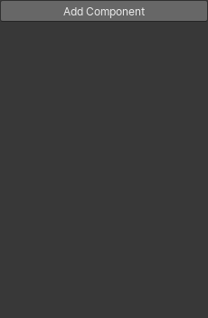
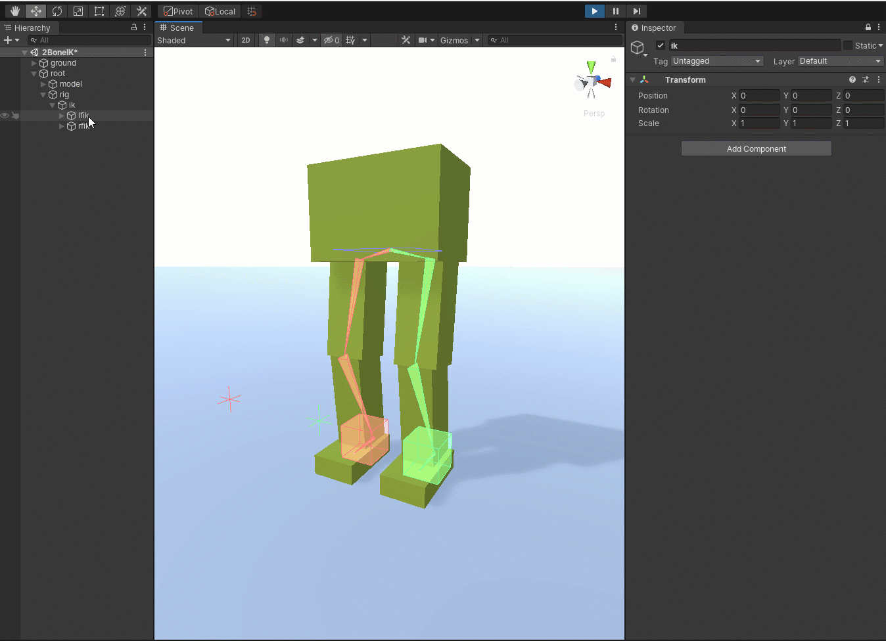
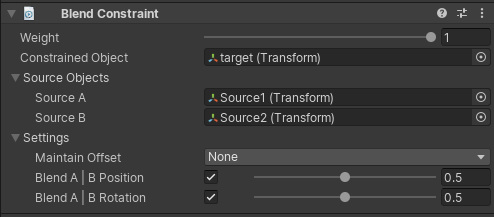

# Animation Rigging

### 定义一个Animation Rig

一个Rig是一个游戏对象的层次结构，至少使用这四个组件：

- Animator Component
- Rig Builder Component
- Rig Component
- Constraints

其中，Rig Builder必须加在Animatior所在的gameobject上，并且可以使用Bone Render来将骨骼给渲染出来。Rig加在Animator所在的gameobject的子级中，并且添加Rig Component。然后在Rig Builder中添加此Rig，便可以开始定义约束。

层级关系如图。

   

### Rig Builder Component

​	Rig Builder组件与Animator组件共存，并创建一个可播放的图形，该图形附加到现有的Animator状态机中。Rig Builder组件需要添加到拥有Animator组件的GameObject中。Rig Builder需要影响与Animator相同的层次结构。

​	使用Rig layers，Rig Builder Component允许使用多个Rig，并且可以在任何时候开启或者关闭。

构。

  

### Rig Component

​	Rig是给定Rig的所有Rig约束的主要入口点。该组件被分配给Rig Layer字段下的Rig Builder组件。每个控制Rig约束层次结构应该只有一个Rig组件。对于多个Rig，多个控制Rig层次可以分配到不同的Rig Layer，并独立启用/禁用。Rig组件的主要目的是收集在其本地层次结构下定义的所有约束组件，并生成IAnimationJobs的有序列表(求值顺序)，然后在Animator求值之后应用该列表。作业评估的顺序是由组件顺序和Rig层次结构的构造方式定义的，因为约束是使用GetComponentsInChildren收集的，它遵循深度优先遍历。

​	换句话说，游戏对象下的分组约束允许用户通过修改层次结构来管理这些约束的评估顺序。

​	控制平台（rig）层次结构应该包含所有必要的平台元素，如效应器（Effector）、约束（constraints）和约束定义所需的其他对象/元素。控制Rig层次结构的根应该与骨架根在同一级别，都在持有Animatior的游戏对象之下。换句话说，它不应该位于骨架层次结构中，而应该位于它旁边。

  

### Rig Transform

​	当你的rig层次结构中的一个特定的GameObject部分对操作很重要，但是没有被任何rig约束引用时，你会想要添加RigTransform组件，它可以在Animation Setup /Setup中找到。如下面的视频所示**，为了使用其父变换(IK)操作2BoneIK示例的左脚和右脚IK目标(lfik和rfik)，需要添加此组件以获得预期的行为**。

   

### Bidirectional Motion Transfer（双向运动转移）

​	双向运动传输是一种创作工作流，它允许您将现有的运动传输到激活的约束，并反过来将运动从激活的约束传输回原始运动源，同时保持运动的视觉保真度。

​	**大白话就是：可以将动画转为可运行时控制的动画（约束），也可以在调整完之后将约束重新烘焙到动画中。**

​	这个工作流利用动画窗口来选择所需的剪辑，并在场景视图中预览受约束的结果。

​	“Transfer motion to skeleton（将运动传递到骨架）”和“Transfer motion to constraint（将运动传递到约束）”都可以作为约束组件的选项。您应该使用Rig Component来传输整个Rig的运动，或者使用RigBuilder组件来传输整个层次结构的运动。

​	并不是所有的约束都能将运动传递给约束。基于物理的约束，如Damped Transform（阻尼变换）不能从现有的运动中推断出来。

​	可以转移其他约束，但有限制。例如，扭曲链约束约束旋转。它覆盖了位置和中间链的旋转。传输运动的结果不能准确地表示源动画。

​	以下约束条件支持有限制的“传递运动到约束”:

|          Constraint          |             限制             |
| :--------------------------: | :--------------------------: |
|    Two Bone IK Constraint    |           没有限制           |
|     Multi-Aim Constraint     |  滚轴运动不能保证是相同的。  |
|   Multi-Parent Constraint    |           没有限制           |
|  Multi-Position Constraint   | 禁用约束轴可能会改变最终结果 |
| Multi-Referential Constraint |           没有限制           |
|  Multi-Rotation Constraint   | 禁用约束轴可能会改变最终结果 |
|    Twist Chain Constraint    |      中间的链转换被覆盖      |

    

# Animatoion Rigging Menu

Animation Rigging菜单包含许多有用的工具，以帮助装配工作流程。

### Align

​	使用Align将游戏对象的变换、位置或旋转对齐到另一个游戏对象。这是特别有用的时候，调整效应器到骨骼，或道具到效应器。使用对齐，选择你想要对齐的游戏对象，然后选择你想要对齐的转换的游戏对象。在动画操纵菜单中，选择适当的对齐选项。

|      Tool       |     Description      |
| :-------------: | :------------------: |
| Align Transform | 更新物体的物质和旋转 |
| Align Rotation  |    更行物体的旋转    |
| Align Position  |    更新物体的位置    |

**注意：在对齐的时候，是先选中的物体对齐到后选中的物体的位置，例如先选择手骨骼，然后选择目标物体，那么手的骨骼就会对齐到目标物体。**

 

### Restore Bind Pose

​	使用Restore Bind Pose选项来恢复最初导入的蒙皮网格渲染器绑定姿势。这对于恢复原始角色的蒙皮网格非常有用。这个选项将只恢复骨骼的姿势，用于剥皮。恢复绑定姿势选项可能不会像预期的那样工作，因为网格只是被蒙皮来扭曲骨骼。

 

### Rig Setup

​	使用Rig Setup选项在选定对象上设置动画操纵所需的组件。

​	要使用Rig Setup，选择一个带有Animator组件的GameObject层次结构，在上面创建约束。然后，选择Rig Setup选项。这将在选定的游戏对象上创建一个RigBuilder组件，以及一个名为“Rig 1”的子游戏对象，该子游戏对象带有一个将被添加到RigBuilder层的Rig组件。

​	**注意:Rig设置也可以在Animator组件选项中找到。**

 

### Bone Renderer Setup

​	使用BoneRenderer设置选项来创建一个BoneRenderer组件，其中的骨骼是从选定的GameObject层次结构中的children SkinnedMeshRenderer组件中提取的。要使用骨骼渲染设置，选择根游戏对象并选择骨骼渲染设置。

​	**注意:骨骼渲染设置也可以在Animator组件选项中找到。**

    

# Constraint Components

​	Animation Rigging中包括了多种预定义的约束，您可以使用它们来定义您的Animation Rigs，其中的约束是基于c# Animation Jobs API的。

 

### Blend Constraint

​	**一个Blend Constraint约束允许被约束的物体混合游戏物体源A的位置和游戏物体源B的位置，以及混合游戏物体源A的旋转和游戏物体源B的旋转。**

| Properties           | Description                                                  |
| :------------------- | :----------------------------------------------------------- |
| Weight               | 此约束的权重，如果设置为0，那么这个约束将不会影响约束物体。然后设置为1的时候，将会应用全部的影响。 |
| Constrained Object   | The GameObject affected by the Source GameObjects            |
| Source A             | 影响被约束对象的位置和旋转的源游戏对象A。                    |
| Source B             | 影响被约束对象的位置和旋转的源游戏对象B。                    |
| Maintain Offset      | 当没有设置为NONE时，被约束的游戏对象的偏移量（位置或者旋转或者两者）都会保持不变。 |
| Blend A - B Position | 如果启用，那么被约束的物体将会得到源物体A和源物体B的位置混合后的位置。 |
| Blend A - B Rotation | 如果启用，那么被约束的物体将会得到源物体A和源物体B的位置混合后的旋转。 |

  

### Chain IK Constraint

​	Chain IK Constraint(链式IK约束)允许反向控制游戏对象的层次结构，以提供类似链式行为的操作。通过定义根和端游戏对象，链式IK约束将能够找到并约束其中包含的所有游戏对象。

​	这个约束实现了FABRIK求解器(向前和向后达到逆运动学)。

| Properties             | Description                                                  |
| :--------------------- | :----------------------------------------------------------- |
| Weight                 | 此约束的权重，如果设置为0，那么这个约束将不会影响约束物体。然后设置为1的时候，将会应用全部的影响。 |
| Root                   | 链层次机构的根游戏对象                                       |
| Tip                    | 链层次机构的端点游戏对象                                     |
| Target                 | 影响被约束物体（链约束游戏对象）层次结构的游戏对象。         |
| Maintain Target Offset | 当没有设置为NONE的时候，在Tip和Target中的偏移量（包括位置，旋转或者两者）将保持不变 |
| Chain Rotation Weight  | 整个链的转动权重。权重为1会使链完全达到它的目标位置，而小于1的值将当前FK在链中旋转。 |
| Tip Rotation Weight    | 应用到链的末端游戏对象的旋转权重。如果设置为1，提示将其旋转到指定的目标，否则将与当前值混合。 |
| Max Iterations         | 如果不满足公差，则执行最大求解迭代。                         |
| Tolerance              | target和Tip游戏对象之间的距离公差。当被respected的时候，解算器将停止运行，即使它没有达到最大迭代。 |

  

