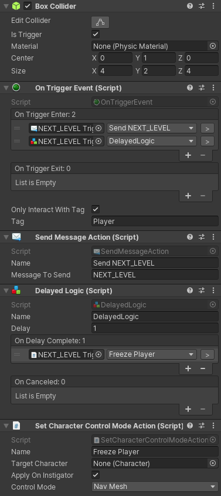
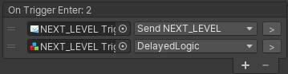
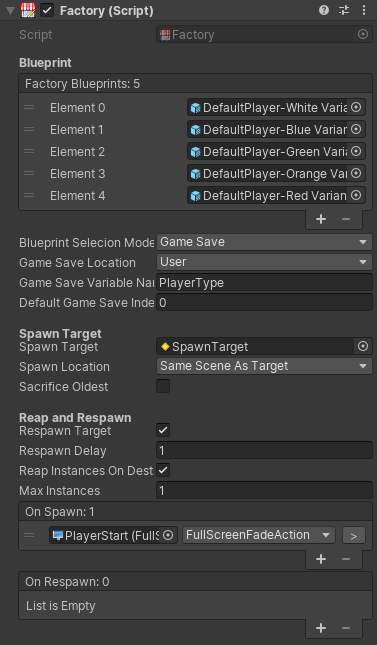

# <center>Gameplay Ingredients</center>

## Welcome to Gameplay Ingredients	

​	Gameplay Ingredients是针对unity的一套运行时和编辑器工具，一系列的脚本让你轻松的创建游戏或者构建游戏原型。

<br/>

#### Runtime Tools

**Events、Logic and Action**:根据逻辑和事件执行操作的原子组件。

**Callables: Gameplay Ingredients**：框架原理的编程核心。

**Managers**:处理低级游戏逻辑的单例。

**Rigs**:动画、绑定和连接对象在一起的组件。

**State Machines**:执行简单状态行为的抽象。

**Factories**:基于蓝图创建对象并且管理其生命周期的组件。

**Timers**:跟踪时间的基于时间的组件。

**Global Variables**:一个可以读、写和获得逻辑的值的黑板。

**interactive**:角色互动系统。

**Gameplay Ingredients Settings**:项目的配置资产。

<br/>

#### Editor Tools

**Welcome Screen**:为您的项目提供提示以及初始化设置的窗口。

**Play From Here**：从当前场景视图位置播放。

**Advanced Hierarchy View**:在 Hierarchy Window显示更多的信息。

**Link Game View**:在你的关卡中导航视图预先录制的点。

**Scence Setups**:在编辑器中一次性打开多个场景。

**New Scence From Template**:根据一个已经存在的Scence场景创建新的Scence场景。

**Find and Replace**：查找游戏物体并且使用预制件代替查找的游戏物体的一个工具。

**Callable Tree Explorer**:记录你所有的Events、Logic、Actions。

**Folders**:文件夹的层次结构。

**Discover**:使用浏览器导航并且记录项目。

**Other Tools**:其他的一些工具。

<br/>

#### Requirements

- Uinty 2019.4/2019.3/2019.2/2019.1/2018.3
- PackageManager UI

<br/>

### How to install

1. #### Manual Version

   - 克隆仓库都任何你喜欢的地方
   - 在你的项目中，打开Window/Package Manager窗口，使用 + 按钮选择 Add Package from disk... 选项
   - 定位到你的仓库的文件夹，并且选择package.json文件
   - 这样，仓库就会被添加到你的项目中

2. #### OpenUPM

   - 该包在openUPM注册表中可用，建议通过openupm_cli来安装openUPM

   - ```shell
     openupm add net.peeweek.gameplay-ingredients
     ```

   - 在unity关闭的情况下，通过文本编辑器编辑Packages/manifest.json

   - 在denpendencies下添加

     ```
     "net.peeweek.gameplay-ingredients": "https://github.com/peeweek/net.peeweek.gameplay-ingredients.git#2018.3.0",
     ```

   - 你可以通过查看项目窗口来检查包是否被导入，在Packages/Hierarchy结构下，应该有一个Gameplay Ingredients层次结构

<br/>

<br/>

### Events,Logic  and Actions

Events,Logic and Action是连接彼此执行关卡脚本逻辑的脚本。这些脚本使用Callable列表来执行调用的链接。

- Events：由游戏事件触发并且执行calls。
- Logic：由calls触发，并且会根据条件和逻辑触发其他的calls。
- Actions：由calls触发，并且将触发游戏改变。



<br/>

<br/>

## Callables

​	callables是一种可视化脚本的抽象，它定义了Gameplay Ingredients的运行时核心。callables是可以被调用来执行特定任务的脚本。在Gameplay Ingredients中主要使用的有两种：Logic 和 Actions。为了使用gameplay Events来调用Logic和Actions，但是Events本身是不可以直接调用的，所以使用Callables来启动调用链。

​	在Gameplay Ingredients中有更多的脚本使用了Callables：State Machine，Factories，Counters，Timer，interactive，一些Rigs和一些Manager。

<br/>

### Instigators(煽动者，教唆者)

​	可以通过传递一个Instigators参数（包含在可执行脚本的一个源对象）来调用Callables，并且可以被调用链中的任何Callables处理。

​	例如：一个OnTriggerEnter Event，可以调用一个DelayLogic，然后可以调用一个定义为：摧毁调用源物体  的DestroyObjectAction。在这种情况下，OnTriggerEnter首先将Instigators设置为进入触发器的对象（例如：player），然后它将被传递给DelayLogic，然后传递给DestroyObjectAction来摧毁对象。最后这一个Action将会使用它的Instigators参数，即进入触发器的玩家游戏对象，并且能够摧毁玩家游戏对象。

<br/>

### Difference with UnityEvents

​	unityEvents可以调用很多的C# API 所以显的很方便，而Callable只能够调用Callables。然而所有的需要自动传播调用者（Instigators）、调用重新排序和调试处理的需求使得使用Callables更加合适。不管怎样，提供的UnityEventAction能够在任何时候执行UnityEvent调用。然而目前的调用者任然不能作为参数传递给这些UnityEvent调用。

<br/>

### Editing Callable Lists

Events，Logic and Actions（还有其他的例如：States，Manager，Factories....）可以从其他的Callable组件调用脚本。通过编辑其在Inspector视图中的列表：通过一个可以将Callable按照时间顺序添加的可重排序列表。



- 点击+按钮添加新的实体，然后将要添加的游戏对象或组件拖到对象字段上。
- 你也可以使用弹出式下拉菜单选择目标游戏对象上的任何Callable组件。

<br/>

### Previewing the hierarchy of calls(预览调用的层次结构)

​	你可以在编辑器中通过Callable Tree Explorer窗口来预览调用的层次结构。这个窗口允许你或的正在调用的内容的概述。

​	你也可以在Gameplay Ingredients Settings asset中打开Verbos Call Logging。

<br/>

### Calling Callables (C#)

​	因为在unity中调用update message object会影响性能，所以大多数Callable系统被设计为在非更新时间运行。为了执行运行时更新调用，最好使用Rigs(仍在开发中)。

​	在设置中仍然有一个选项来启用一些更新调用。使用风险自负!

<br/>

### Writing Callables

​	您可以编写自己的调用，我使它们派生自ICallable接口，或派生自**GameplayIngredients.Actions.ActionBase**或**GameplayIngredients.Logic.LogicBase**。如果您希望与events-logic-Actions保持一致的话，可以使用LogicBase。

ICallable接口非常简单:

```c#
using System.Collections;
using System.Collections.Generic;
using UnityEngine;

namespace GameplayIngredients
{
    public interface ICallable
    {
        void Execute(GameObject instigator = null);
    }

}
```

​	实现Callables允许你在Callable lists中引用它，并且能够在Callable Tree Explorer中查看。

<br/>

<br/>

## Managers

​	Managers是游戏范围内的使用程序脚本，意味着只存在一次，比如单例。这些都是在游戏启动的时候自动生成的，并且放在**DontDestroyOnLoad**的场景中。

​	在Gameplay Ingredient中的许多组件依靠他们的Managers来执行一般的任务，例如：加载关卡，变黑， 访问游戏存档....

<br/>

### Built-in Managers(内置的Managers)

Gameplay Ingredients中自带如下的Managers：

- **FullScreenFadeManager**：Manages Fading screen From/To Black管理屏幕从/渐变到黑色。
- **GameManager**：管理游戏关卡加载（Loading game level）、主菜单（Main Menu）、和游戏进度（Game Progression）。
- **GameSaveManager**：管理存储数据到硬盘中。
- **LevelStreamingManager**：管理加载场景和显示加载UI。（loading scenes and display Loading UI）
- **ScreenshotManager**：管理屏幕截图。
- **UIEventManager**：关注UI管理。
- **VirtualCamerManager**：为你的游戏管理一个摄像机。

<br/>

### Manager Creation Logic（Manager创建逻辑）

​	游戏会在	OnEnable() 的第一帧之后，Start() 的第一帧之前执行 **[RuntimeInitializeOnLoad]** ，运行时代码会尝试加载所有的Managers （除了在Gameplay Ingredients Settings Asset中排除在Manager list外的）。为了生成一个实例，运行时会尝试以下面的优先级（第一次找到）来加载 **Resource** 文件夹中的预制件。

- 预制件的name匹配定义在Manager C#类中的  **[ManagerDefaultPrefab]** 属性的名称。  
- 预制件的name匹配  以**Default_**为前的缀定义在Manager C#类中的  **[ManagerDefaultPrefab]** 属性的名称。  
- 如果定义了 **[ManagerDefaultPrefab]**  但是没有找到匹配的预制件，创建将会失败。
- 如果没有设置  **[ManagerDefaultPrefab]**  ，系统将会自动创建一个带有Manager脚本的默认实例。

<br/>

​	Managers不应该在他们的OnEnable()方法期间相互引用，因为加载他们的代码实在 **[RuntimeInitializeOnLoad]**  中执行的，建议在Start()方法期间相互引用。

<br/>

### Exclude Managers

​	如果你不需要一些Manager被创建，你可以在Gameplay Ingredients Settings Asset 中排除。请注意一些Manager可能会依赖其他的Manager，如果排除之后可能会出现不正确的行为。

<br/>

### Accessing Managers (C#)(访问Managers)

可以通过以下的API来访问Managers：

- **bool Manager.Has< MyManager > ()**：返回是否存在以给定类型的Manager.(此例子中为MyManager)
- **MyManager Manager.Get< MyManager >()** ：返回一个给定类型的Manager实例(此例中为MyManager)。可以总是使用Has< T >方法检查是否有之后再通过get()方法获取。

<br/>

### Writing a Manager (C#)

​	如果你需要创建你自己的Managers，你可以通过创建一个类并继承**GameplayIngredients.Manager**。Manager不实现任何抽象函数，因此编写切来相当简单。

​	如果你想你的Manager依赖于一个预制的配置，你可以实现  **[ManagerDefaultPrefab("MyManager")]**  属性，如果你的Manager被绑定到其他游戏对象上，例如：UI、AudioSource的话，这将会十分有用。	

​	下面是一个简单的Manager示例，它为画布中的UI文本绘制帧速率。因为它依赖于UI。文本，它将需要一个预制件来完成。

```c#
using UnityEngine.UI;
using GameplayIngredients;

[ManagerDefaultPrefab("DrawFrameTimeManager")]
public class DrawFrameTimeManager : Manager
{
    public Text text;

    void Update()
    {
        if(text != null)
        {
            text.text = Time.deltaTime.ToString();
        }
    }
}
```

</br>

</br>

## Messager

​	Messager是一个游戏范围内支持广播消息的静态类。脚本可以注册为特定消息的监听器，并且在其他游戏对象广播消息的时候接受它。

​	在Gameplay Ingredient中有内置的Events、Actions和Timeline Track和Messager一起工作。

<br/>

### Receiving Messages with OnMessageEvent

​	OnMessageEvent 是一个可以在消息被发送的时候执行Callables的Event。它的组件或者游戏对象被激活的时候它的行为将会被激活。

<br/>

### Broadcasting Messages with SendEventAction

​	您可以使用SendEventAction通过messager广播消息。

<br/>

### C# API

How to Register/Unregister a listener:

```c#
// Register a message
GameplayIngredients.Messager.RegisterMessage("My_Message", MyMessageHandler);

// Unregister a message
GameplayIngredients.Messager.RemoveMessage("My_Message", MyMessageHandler);


void MyMessageHandler()
{
    // Do Something.
}

```

How to Send Events:

```c#
GameplayIngredients.Messager.Send("My_Message");
```

<br/>

<br/>

## Rigs

​	Gameplay Ingredients内置有一系列的rigs来帮助你定义你的游戏物体的行为。

<br/>

<br/>

## State Machines

​	Gameplay Ingredients实现了一种简单的方法来声明State Machines并且使用Actions来控制

<br/>

### State Machine Component

​	State Machine Component定义了一个State Machine和此state machine的状态。每一个state machine都是以给定的状态开始并且其状态可以随着时间的改变而改变。你可以使用**SetStateAction**来改变state machine的状态到另一个状态。

<br/>

### States

​	States定义了State Machine的一个状态，一个States由持有**State**行为的游戏物体定义的。

​	State Behaviour是由**OnStateEnter** 和 **OnStateExit** 的Callable list组成的。当进入一个状态时，会调用OnSateEnter，退出一个状态时候调用OnStateExit。

<br/>

### Life Cycle Example

​	State Machines 基于当前激活的state来启用其state对象，并且在激活后执行State Enter调用，在禁用前执行State Exit调用。

​	下面以一个状态机为例，它定义了状态a和状态b，并且将状态a设置为默认状态。

​	**At Startup**

- State A becomes Enable
- State A->OnStateEnter is Called	

<br/>

**A SetStateAction** changes the state to **State B**	

- State A > **OnStateExit** is called

- State A becomes Disabled
- State B becomes Enabled
- State B > **OnStateEnter** is called

<br/>

<br/>

<br/>

## Factories

​	Factories 是一个MonoBehavior，它可以从Prefab或者其他游戏对象蓝图来实例化新的游戏对象。Factories处理生成（spawn）（随机，顺序或者从Game Save中生成实例）并且处理实例的数量，而且还支持自动重生。



<br/>

### Options

| Name                      | Description                                                  |
| ------------------------- | ------------------------------------------------------------ |
| Factory Blueprints        | 作为Spawn（生成）参考的预制件或场景游戏物体的一个集合        |
| Blueprint Selection Mode  | Enum : 为Spawn选择蓝图所使用的方法，可能的值有Random、Sequential、Shuffle 或者 Game Save |
| Game Save Location        | 如果Selection Mode指定为Game Save，此项为选择从中读取值的Game Save的位置（System 或者 User） |
| Game Save Variable Name   | 如果Selection Mode指定为Game Save，此项定义从中读取值的Game Save变量 |
| Default Game Save Index   | 如果Selection Mode指定为Game Save，Location为User，此项指定要从中读取的User Save的索引 |
| Spawn Target              | 定义用于生成新实例的目标的Transform                          |
| Spawn Target Location     | 定义生成新对象的场景和父对象，可能的取值有：**Same Scene as Target**, **Child of Target**, 或者 **DontDestroyOnLoad**（持久运行时场景） |
| Sacrifice Oldest          | 如果启用此选项，Factories将会销毁最旧的实例以重新生成新的实例。以这种方式销毁最旧的实例不会触发其ReSpawn的调用 |
| Respawn Target            | 控制是否需要自动重新生成已销毁的实例                         |
| Respawn Delay             | 如果启动了Respawn Target，控制重新生成实例前的延迟           |
| Reap Instances on Destroy | 控制在Factories销毁时是否需要销毁实例                        |
| Max Instances             | 定义管理实例的实例池的容量                                   |
| On Spawn                  | 生成实例时要调用的Callables列表，Instigators（调用者）是新实例对象 |
| On Respawn                | 重新生成实例时要调用的Callables列表，Instigator（调用者）是工厂对象 |

<br/>

<br/>

<br/>


