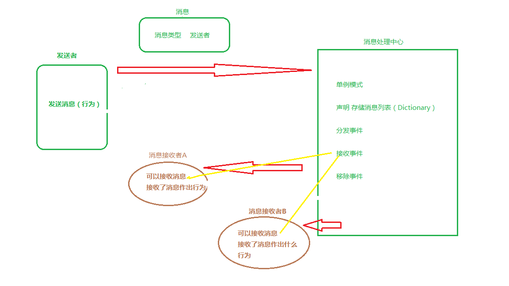

## 消息发送机制，也可以叫做观察者设计模式

​	通俗点说就是一个物体发送消息，另外一个或者几个物体可以同时接收到这一消息并作出各自不同的行为（反馈、处理）。

​	1、我们需要的是消息（实例），发送者。消息+发送者=我们需要的信息，就能够处理任何消息。

​	2、怎么把这个消息发送出去（消息处理中心）。

​	3、发送者发送（分发）消息的行为。

​	4、接收消息。

​	换种说法：发布-订阅者模式。举例就是，你跟邮局定了报纸，邮局就会在指定时间把报纸发下来给你。中间如果你不需要报纸了，那么你就可以取消这个订阅，邮局就不会发送给你了。

​	图解：

​	

<br/>

<br/><br/>

## 具体消息

```c#
public class Notification
    {
        /// <summary>
        /// 发送者
        /// </summary>
        public GameObject sender;
 
        /// <summary>
        /// 消息内容
        /// </summary>
        public EventArgs param;
 
        /// <summary>
        /// 构造函数 （初始化）
        /// </summary>
        ///<param name="sender">通知发送者
        ///<param name="param">通知内容
        public Notification(GameObject sender, EventArgs param)
        {
            this.sender = sender;
            this.param = param;
        }
    
        public Notification()
        {
 
        }
 
        /// <summary>
        /// 构造函数
        /// </summary>
        ///<param name="param">
        public Notification(EventArgs param)
        {
            this.sender = null;
            this.param = param;
        }
}
	/// <summary>
    /// 传递的消息，这个是消息类中的具体消息种类 类
    /// </summary>
    public class EventArgsTest : EventArgs
    {
        public int id;
        public string name;
    }
```

​	Notification是一个稍微抽象一点的消息类，要传递一个消息（类），前面说到了，肯定是需要知道具体发送者和具体消息类的。而具体消息类，就是后面的EventArgsTest，这个是继承于System.EventArgs，该类是自定义类，看到后面，可能会理解为什么这样继承。

<br/><br/>

## 声明一个消息委托

```c#
public delegate void NotificationDelegate(Notification notific);
```

​	声明一个委托传递上面所说的消息类的委托，这边通俗一点来讲就是：声明一个可以传递Notification 参数的方法。

<br/><br/><br/>

## 消息处理中心

```c#
public class NotificationCenter
    {
        private static NotificationCenter instance = null;
        public static NotificationCenter Get()
        {
            if (instance == null)
            {
                instance = new NotificationCenter();
                return instance;
            }
            return instance;
        }

        private Dictionary<uint, NotificationDelegate> eventListeners
            = new Dictionary<uint, NotificationDelegate>();
        public void AddEventListener(uint eventKey, NotificationDelegate listener)
        {
            if (!HasEventListener(eventKey))
            {
                NotificationDelegate del = null; //定义方法
                eventListeners[eventKey] = del;// 给委托变量赋值
            }
            eventListeners[eventKey] += listener; //注册接收者的监听
        }
        public void RemoveEventListener(uint eventKey,NotificationDelegate listener)
        {
            if (!HasEventListener(eventKey))
                return;
            eventListeners[eventKey] -= listener;
            if (eventListeners[eventKey] == null)
            {
                RemoveEventListener(eventKey);
            }
        }
        public void RemoveEventListener(uint eventKey)
        {
            eventListeners.Remove(eventKey);
        }

        /// <summary>
        /// 分发事件，不需要知道发送者的情况
        /// </summary>
        /// <param name="eventKey"></param>
        /// <param name="notific"></param>
        public void PostDispatchEvent(uint eventKey, Notification notific)
        {
            if (!HasEventListener(eventKey))
                return;
           // eventListeners[eventKey].Invoke(notific);
            eventListeners[eventKey](notific);
        }

        /// <summary>
        /// 分发事件，需要知道发送者，具体消息的情况
        /// </summary>
        ///<param name="eventKey">事件Key
        ///<param name="sender">发送者
        ///<param name="param">通知内容
        public void PostDispatchEvent(uint eventKey, GameObject sender, EventArgs param)
        {
            if (!HasEventListener(eventKey))
                return;
            eventListeners[eventKey](new Notification(sender, param));
        }
        public void PostDispatchEvent(uint eventKey)
        {
            if (!HasEventListener(eventKey))
                return;
            eventListeners[eventKey](new Notification());
        }

        /// <summary>
        /// 分发事件，不需要知道任何，只需要知道发送过来消息了
        /// </summary>
        ///<param name="eventKey">事件Key
        ///<param name="param">通知内容
        public void PostDispatchEvent(uint eventKey, EventArgs param)
        {
            if (!HasEventListener(eventKey))
                return;
            eventListeners[eventKey](new Notification(param));
        }

        /// <summary>
        /// 是否存在指定事件的监听器
        /// </summary>
        public bool HasEventListener(uint eventKey)
        {
            return eventListeners.ContainsKey(eventKey);
        }
    }
```

该消息机制的核心,难点也就是在这里了。

首先，既然是消息处理中心，肯定是需要一个存放传递消息（上面那个声明的委托）的容器，于是声明一个

```c#
   private Dictionary<uint, OnNotification> eventListeners
            = new Dictionary<uint, OnNotification>();
```

增加，移除 传递消息（上面那个声明的委托），不就是以下代码，需要注意的是

```c#
  eventListeners[eventKey] -= listener;//取消接收者的监听     
  eventListeners.Remove(eventKey);//移除存放在在eventListeners为eventKey的传递消息（上面那个委托）
```

```c#
if (!HasEventListener(eventKey))
     {
         eventListeners[eventKey] = listener; //注册接收者的监听
     }
     else
     {
       eventListeners[eventKey] += listener; //注册接收者的监听，这个用法，是委托的一种机制，不理解的自己去百度看看委托咋回事。
     }
```

这样，如何存储消息做完了。

<br/><br/><br/>

## 发送者发送（分发）消息的行为

```c#
	/// <summary>
    /// 消息类型，枚举列出，调用时需要强转为uint
    /// </summary>
    public enum ENotificationMsgType // 消息发送的枚举值，应该转为uint型
    {
        ENull = 0, //Test       ELoadResProgress = 1,
    }
```

​	以上代码，写枚举，纯是为了提高代码可读性及可维护性，C#中多写枚举，少写那种莫名其妙的 int变量。

```c#
EventArgsTest args = new EventArgsTest();
        args.id = 3;
        args.name = "我是Test发送的 name 消息哦";
        NotificationCenter.Get().PostDispatchEvent((uint)ENotificationMsgType.ENull, args);
     //   NotificationCenter.Get().PostDispatchEvent((uint)ENotificationMsgType.ENull); //我就是通知，不发送具体啥消息，也是可以的哦
```

这边需要理解的是 PostDispatchEvent，这个方法，这边我 写了三重重载，因为发送消息分三种情况，如注释那样

{

​	只需要通知发送，不需要知道发送的具体消息类型，也不需要发送者。

​	只需要发送具体消息类型，不需要发送者。

​	需要发送具体消息类型，需要发送者。

}

<br/>

<br/>

<br/>

## 接收消息

```c#
void Awake() { 
	NotificationCenter.Get().AddEventListener((uint)ENotificationMsgType.ENull, UpdateTest); 
} 

void OnDestroy() {  NotificationCenter.Get().RemoveEventListener((uint)ENotificationMsgType.ENull, UpdateTest); 
} 

void UpdateTest(Notification e) { 
	EventArgsTest args = e.param as EventArgsTest; if (args != null) { string strName = args.name; int strId = args.id; } }
```

​	可能你会奇怪，注册事件和移除事件为什么这样写。这是一种标准写法。

​	 写初始（Start），结束（OnDestroy），使得每个消息拥有一个自己的生命周期。


