## Post-processing

​	后处理应用全屏过滤器和效果到相机的图像缓冲区在图像出现在屏幕上之前，它可以极大地改善应用程序的视觉效果，而只需要很少的设置时间。您可以使用后期处理效果来模拟物理相机和胶片属性。

## Post-processing and render pipelines

后处理效果的使用取决于你使用的渲染管线，不同的渲染管线，使用后处理的方法也是不同的。

- Built-in RenderPipeline（内置渲染管线）
  - 首先得安装Post-processing Version 2 package，然后在摄像机上添加Post-process Layer组件具体参考[戳这里](https://docs.unity3d.com/Packages/com.unity.postprocessing@2.3/manual/Quick-start.html)。

- Universal RenderPipeline（URP渲染管线），使用Volumes系统使用后处理效果。
- High Definition Render Pipeline（HDRP高清渲染管线），使用Volumes系统使用后处理效果。

## Ambient Occlusion（环境光遮蔽）

#### 1、Ambient Occlusion（环境光遮蔽）简介

环境光遮蔽后处理效果使得 相互接近的折痕、孔洞、交叉点和表面变暗。

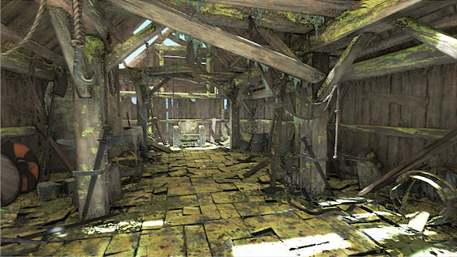

​	前一张图片是没有使用环境光遮蔽后处理效果的，而后一张相反，可以看出后一张图片中的在墙角、孔洞、柱子底部等地方明显变得更暗。

#### 2、Ambient Occlusion（环境光遮蔽）使用

Ambient Occlusion环境光后处理效果一共有两种模式

- Scalable Ambient Obscurance
- Multi-scale Volumetric Occlusion

##### 	Scalable Ambient Obscurance	

​	**这个模式是在不支持 compute shader的平台上使用的**，这个是在旧平台上工作的Ambient Obscurance（环境光遮蔽）的一个标准实现，如果你需要以支持计算的平台为目标，那么可以使用 **Multi-scale Volumetric Occlusion** 模式。

​	这种模式可能会消耗大量资源，尤其是在非常靠近摄像机的情况下。为了提高性能，可以使用一个小半径设置，对距离源像素很近且位于剪切空间的像素进行采样。这使得缓存更有效。使用更大的半径设置会生成距离源像素更远的样本，并且不会从缓存中获益，这会降低效果。**建议使用较小的半径范围**。

​	由于相机的视角，靠近前平面的物体比远平面的物体使用更大的半径，因此计算靠近相机的物体的环境光遮蔽通过速度比远平面的物体要慢，远平面的物体在屏幕上只占几个像素。

​	取消质量设置或者降低质量设置也会提高性能

​	**Scalable Ambient Obscurance**不应该在移动平台或控制台上使用，因为**Multi-scale Volumetric Occlusion**模式更快，为这些平台提供更好的图形。

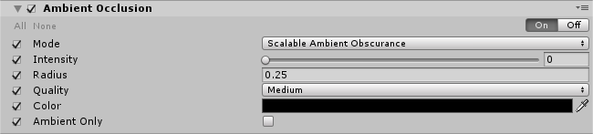

- Intensity : 调节Ambient Occlusion后处理效果产生的暗部的深浅

- Readius : 设置采样点的半径，控制暗区范围。
- Quality : 定义影响质量和性能的采样点的数量。
- Color : 设置环境光遮蔽的颜色。
- Ambient Only : 仅环境光启用此复选框，使环境光遮蔽效果仅影响环境光。此选项仅可用于延迟呈现路径和HDR呈现。

##### Multi-scale Volumetric Occlusion

**这个模式运行在支持Compute shader的设备上**，这个模式针对控制台和桌面平台进行了优化，拥有着比Scalable Ambient Obscurance更好的图形显示以及更快的运行速度。

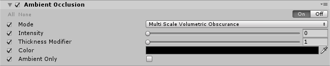

- Thickness Modifier : 修改（occluders）咬合器的厚度。这增加了暗区，但会在物体周围引入暗晕。

其他参数和上面一致。

## Anti-aliasing（图形抗锯齿效果）

​	Anti-aliasing（图形抗锯齿）后处理效果会让图形拥有一个平滑的外观，抗锯齿算法是基于图像的，在不支持传统的多采样时非常有用，比如在Unity 5.5或更早版本中， [deferred rendering](https://docs.unity3d.com/Manual/RenderTech-DeferredShading.html) shading path（延迟渲染着色路径）或正向渲染路径中的HDR。编辑器的 [Quality settings](https://docs.unity3d.com/Manual/class-QualitySettings.html) （质量设置）窗口是这些选项的主页。

​	抗锯齿效果给图形一个平滑的外观。混叠是线条出现锯齿状或具有“楼梯”外观的一种效果(如下面的左图所示)。如果图形输出设备没有足够高的分辨率来显示直线，就会出现这种情况。

​	使用抗混叠减少这些锯齿线的突出，通过周围的中间色调的颜色。尽管这减少了线条的锯齿状外观，但也使它们更加模糊。

​	它们是在后期处理层组件中为每个相机设置的。

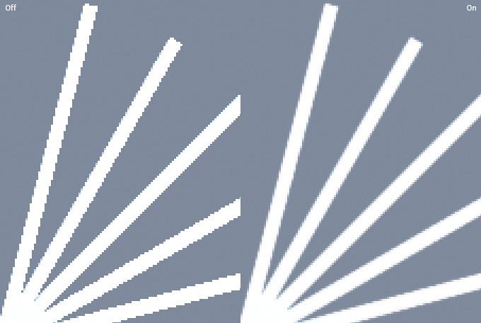

​	Anti-aliasing（图形抗锯齿）在后处理堆栈中可用的算法有：	

- **Fast Approximate Anti-aliasing (FXAA) **:  一个给不支持运动矢量的移动平台和其他平台的快速算法
- **Subpixel Morphological Anti-aliasing (SMAA)** : 一个高质量但速度较慢的算法，适用于不支持运动矢量的移动平台和其他平台。
- **Temporal Anti-aliasing (TAA) **: 一种需要运动矢量的先进技术。适用于桌面和控制台平台

##### Fast Approximate Anti-aliasing (FXAA)

​	FXAA是最有效的技术，推荐用于不支持运动矢量的移动平台和其他平台.

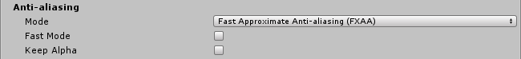

- Fast Mode : 启用此复选框以获得质量较低但速度更快的FXAA变体。推荐用于移动平台。
- Keep Alpha : 如果需要保持alpha通道不受后处理影响，请启用此复选框。如果被禁用，Unity将使用alpha通道来存储用于加速和提高视觉质量的内部数据。

##### Subpixel Morphological Anti-aliasing (SMAA) 

​	SMAA具有比FXAA更高质量的抗锯齿效果，但它的速度也更慢。取决于你的游戏的艺术风格，它在避免了一些技术缺点之后可以像Temporal Anti-aliasing (TAA）一样工作。**不支持AR/VR。**

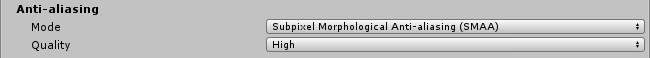

- ​	Quality ：设置整体质量的抗混叠过滤器。

  降低质量设置会使效果运行得更快。不要在移动平台上使用SMAA。

  

##### Temporal Anti-aliasing (TAA) 

​	TAA是一种先进的抗锯齿技术，它在历史缓冲区中不断积累帧，以便更有效地平滑边缘。它在平滑运动中的边缘方面要比FXAA好得多，但它需要运动矢量，而且比FXAA更昂贵。它是桌面和控制台平台的理想选择。**不支持GLES2品台**。

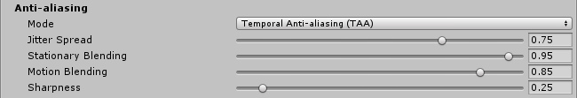

​	

- Jitter Spread ：设置散布抖动样本的直径(以texel为单位)。值越小，输出越清晰，但别名越多。更大的值会产生更稳定但更模糊的输出。
- Stationary Blending：设置固定碎片的混合系数。此设置控制历史样本混合到最终颜色中的百分比，以使活动最小。
- Motion Blending：设置移动碎片的混合系数。此设置控制历史样本混合到最终颜色中的比例，用于具有显著主动运动的碎片。
- Sharpness：设置锐度，以减轻TAA可能导致的高频区域细节的轻微丢失。

## Auto Exposure（自动曝光效果）

​	Auto Exposure（自动曝光效果）根据图像包含的亮度级别范围动态调整图像的曝光。

​	在Unity中，这种效果会在每一帧生成一个直方图，并对其进行过滤，以找到平均亮度值。只有支持compute shader 的品台才支持。这种效果模拟人眼根据实际亮度调整感知亮度，这个效果何在屏幕偏暗或者偏亮的时候自动调整画面曝光度，这个效果中的曝光度以EV单位。

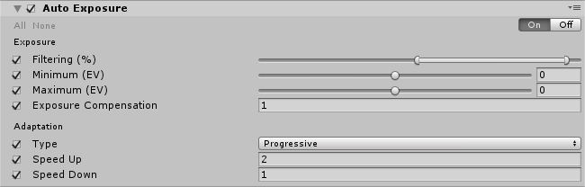

​	

- Filtering：设置直方图的上下百分比，找到一个稳定的平均亮度。超出此范围的值将被丢弃，并且不会影响平均亮度。从当前画面的亮度直方图中选取一个范围，当前画面应该使用的曝光度是从这个范围的平均亮度计算出来的。一般来说要避免计算画面中的极亮或者极暗的部分，才能得到正确的曝光度。

- Minimum：设置最小平均亮度。

- Maximun：设置最大平均亮度

  两个都是曝光度范围，由上面计算得到的曝光度必须在这个范围内（默认是0所以画面不会有任何变化），比如某个场景中都是暗部，平均亮度太低，曝光度就会很高，得到的就是过亮的场景了。相反，不设置上限，场景都是较亮的部分，曝光就会太低。

- EXposure Compensation：设置中灰色值来补偿场景的全局曝光。曝光补偿，总的亮度调节。

- Type：选择适配类型。**Progressive**模式下，可以通过调整Speed up、down参数来分别确定曝光度的增减速度，会有一种过度效果。**Fixed**模式下则会直接应用计算得到的曝光度，在明暗突变的情况下，Progressive就像人的眼睛一样产生逐渐适应的效果，而Fixed则是直接突变。

- Speed up：设置从黑暗环境到光明环境的适应速度。

- Speed down：设置从光到暗环境的适应速度。

**Hint:需要Compute shader、Shader model 5的支持**

## Bloom(泛光效果)

​	Bloom产生的条纹光从图像中明亮区域的边缘延伸出来，造成了一个非常明亮的光压倒相机的错觉。

​	您还可以使用镜头污垢应用一个全屏幕层的污渍或灰尘，以衍射布卢姆效应。配合HDR表现非常亮的光。

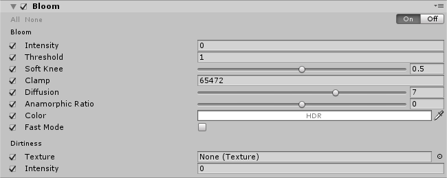

- Intensity：泛光效果的亮度，越高颜色越亮。

- Threshold：阀值（伽马空间下），低于这个亮度的像素将会被过滤掉。一般设置为1，表示只有亮度超过了1才会有泛光效果。对于LDR显示，降低到这个值一下也会有泛光效果。

- Soft Knee：阀值附近的渐变效果。

- Clamp：限制最亮亮度值，同样是在伽马空间下。

- Diffusion：类似于Radius效果，但是这个值代表的其实是控制计算的迭代次数（当然迭代次数越少，效率越高），建议设置为整数，并且不要为这个值设置动画。用作动画的效果并不是想象中的渐变效果。

- Anamorphic Ratio：控制泛光衍生的方向，垂直方向[-1,0]，水平方向[0,1]。取值越靠近-1，纵向泛光越多，水平泛光越少。取值越靠近1，水平泛光越多，垂直泛光越少。但是这个值越偏离0，效率越低，会产生一定性能消耗。

- Color：泛光的颜色

- Fast Mode：启用此复选框可以通过降低Bloom效果质量来提高性能。移动或者低端平台建议打开，可获得显著的性能提升。

  

  Dirtiness中的属性：

- Texture：污点贴图，选择一个不干净的纹理来添加污渍或灰尘到镜头，作为一个全屏覆盖图层。这个贴图越小，运行时的反应和混合速度就会越快。后处理栈自带了几张贴图，也可以根据自己的需要制作。

- Intensity：设置镜头的脏度，越高，越明显。

**Hint**：**对于正确暴露的HDR场景，Threshold应该设置为~1，这样只有值大于1的像素才会泄漏到周围的对象中。在LDR中工作时删除此值，否则效果将不可见**。**需要Shader model 3的支持**

## Chromatic Aberration（色差效果）

​	Chromatic Aberration后处理效果模拟的是真实世界的相机在镜头无法将所有颜色汇聚到同一点时所产生的效果。由此产生的效果产生了颜色的”条纹“，沿着边界将图像的暗部和亮部分开。**实质上是一种RGB偏移得到的效果。**

​	Chromatic Aberration的常见用途包括艺术效果，如相机的冲击，或陶醉的效果。unity提供了对红色/蓝色和绿色/紫色边缘的支持，你可以通过输入纹理来定义边缘的颜色。

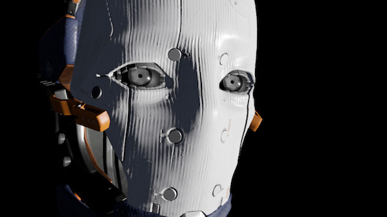

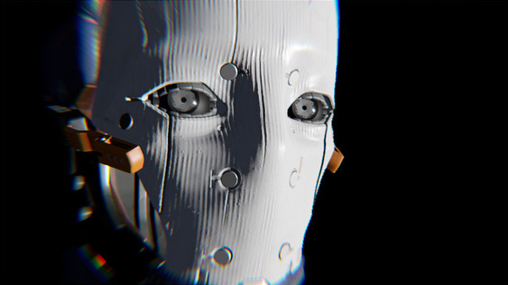

#### Chromatic Aberration的使用

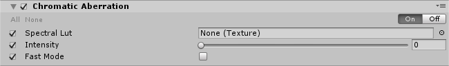

- Spectral Lut：选择用于自定义边缘颜色的纹理。当留空时unity将会使用默认纹理。
- Intensity：设置色差效果的强度。
- Fast Mode：使用更快的色差变差效果来提高性能。

**Hint：你可以在任何图像编辑软件中创建自定义光谱纹理。虽然光谱纹理的分辨率大小不受限制，但像th 3x1这样的小尺寸纹理效果最好。****

​	**您可以通过手动设置输入纹理的过滤器模式为Point(没有过滤器)来实现更粗糙的效果。**

​	**色差效应的表现取决于光强值。如果强度值设置得很高，渲染就会变慢，因为它需要更多的样本来渲染平滑的色差。**

​	**建议在可能的情况下启用快速模式，因为它要快得多，但不像常规模式那样流畅。**

​	**需要Shader Model 3的支持**

## Color Grading（颜色分级）

​	Color Grading后处理效果改变或纠正了最终图像的颜色和亮度的统一产生。指的是对最终的游戏界面进行颜色和亮度的改变或矫正，你可以理解为增加滤镜。

​	Color Grading分级效果有三种模式：

- **Low Definition Range (LDR)**：适用于低端平台。分级应用于最终呈现的帧，该帧被固定在一个[0,1]范围内，并存储在一个标准LUT中。
- **High Definition Range (HDR)**：支持HDR呈现的平台的理想选择。所有颜色操作都应用在HDR中，并存储到3D日志编码的LUT中，以确保足够的范围覆盖和精度(Alexa LogC El1000)。
- **External**：用于在外部软件中创建的自定义3D LUTs。

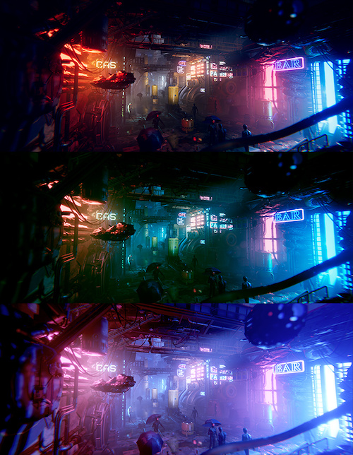

#### User look-up texture (LUT)

​	用户LUT是一种简单的颜色分级方法，屏幕上的像素被来自您提供的LUT的新值所取代。这是一种不如颜色分级效果先进的方法，所以使用它作为不支持移动高级颜色分级纹理格式的平台的后备

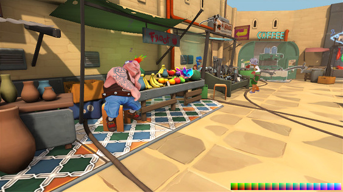

​																								使用之前

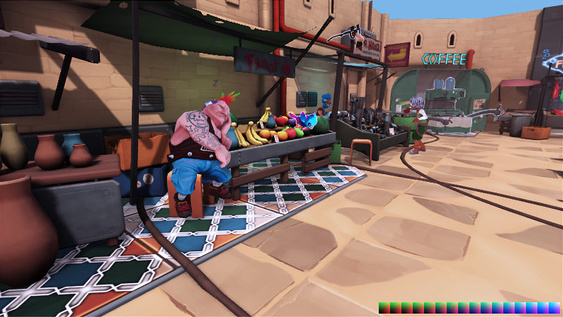

​																						使用之后

#### 需求：

​	shader model 3

#### 全局设置：

​	这些设置只适用于LDR 和External。

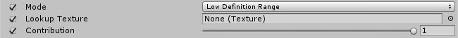

- Lookup Texture：**LDR**：选择自定义查找纹理(条形格式，如256x16)应用于其他颜色评级操作符之前。如果没有提供，将在内部生成一个中性的。**External**:一个自定义的3D日志编码的纹理。

- Contribution：LDR:设置Lookup Texture对颜色分级的影响。

  **注意**:支持多个LDR查找纹理之间的卷混合，但只有当它们的大小相同时才能正确工作。出于这个原因，建议在整个项目中坚持使用单个LUT大小(256x16或1024x32)。

#### Tonemapping（色调映射）

​	Tonemapping将图像的HDR值重新映射到适合在屏幕上显示的范围。当使用HDR相机时，一定要使用色调贴图，否则高于1的颜色强度值将被固定在1，改变场景的亮度平衡。

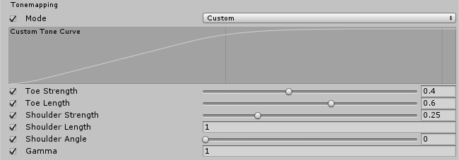

- Mode：只有在**High Definition Range**模式下可用，从下拉菜单中选择Tonemapping模式。
  - None：没有Tonemapping应用。
  - Neutral：应用范围重新映射，对色彩、色调和饱和度的影响最小。
  - ACES：用来一种近似参考ACES的色彩映射以制造出一种电影效果。这种效果比Neutral效果对色彩色调和饱和度的影响更强烈。当此Tonemapper（调色器）启用时，所有的分级操作都在ACES颜色空间中执行，以获得最佳的精度和结果。
  - Custom：全参数Tonemapper（调音器）。这是唯一一个有自己设置的Tonemapper（调音器)。
- Toe Strength：为toe和曲线中段之间的过渡设置一个值。值0表示没有toe，值1表示过渡非常困难。
- Toe Length：设置toe动态范围的大小。小的值，toe会很短，并迅速过渡到线性部分。较大的值有较长的toe。
- Shoulder Strength：为曲线的中间部分和肩部之间的过渡设置值。值0表示没有肩膀，值1表示过渡非常困难。
- Shoulder Length：设置要向曲线的动态范围添加多少个f -stop (EV)的值。
- Shoulder Angle：设置要添加到肩部的overshot的值
- Gamma：将伽马函数应用于曲线的值。

#### White Balance（白平衡）

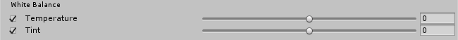

- Temperture：将white balance设置为自定义色温
- Tint：设置white balance来补偿绿色或洋红色。

#### Tone

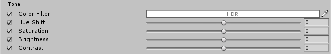

- Post-exposure(后曝光)：只有在HDR模式下可用。设置场景的整体曝光值以EV为单位。这是在HDR效应之后和Tonemapping之前应用的，所以它不会影响之前在链条中的效应。
- Color Filter：为渲染的色调选择一种颜色。
- Hue Shift：调整所有颜色的色调。
- Saturation：调整所有颜色的强度。
- Brightness：仅用于LDR，调整图像的亮度。
- Contrast：调整色调值的总体范围。

#### Channel Mixer

​	使用Channel Mixer修改每个输入颜色通道对输出通道整体混合的影响。例如，增加绿色通道对红色通道整体混合的影响，将调整图像中包含绿色(包括中性/单色)的所有区域，使其色调变得更红。

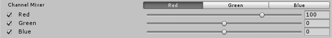

- Channel：选择要修改的输出通道。
- Red：调整红色通道在整体组合中的影响。
- Green：调整绿色通道在整体组合中的影响。
- Blue：调整蓝色通道在整体组合中的影响。

#### Trackballs（轨迹球）

​	使用Trackballs进行三种颜色分级。调整Trackballs的点的位置，在给定的色调范围内将图像的色调转换为该颜色。不同的Trackballs用于影响图像中的不同范围。调整Trackballs下的滑块，以抵消该范围内的颜色亮度。

**注意:您可以右键单击Trackballs，将其重置为其默认值。要更改轨迹球的灵敏度，请转到Edit -> Preferences -> PostProcessing。**

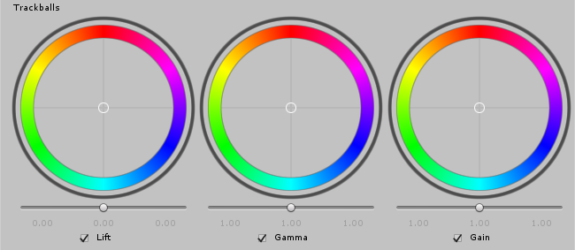

- Lift：调整暗色调(或阴影)。
- Gamma：调整中色调。
- Gain：调整高光。

#### Grading Curves

​	Grading Curves 是一种先进的方法来调整特定范围的色调，饱和度或亮度在您的图像。调整八个可用图形上的曲线，以替换特定的色调、饱和度等。

##### 1.YRGB Curves

​	YRGB曲线只能在LDR模式下使用。这些曲线，也称为主曲线、红、绿、蓝，会影响所选输入通道在整个图像上的强度。图形的X轴表示输入强度，Y轴表示所选通道的输出强度。使用这些曲线来调整属性的外观，如对比度和亮度。

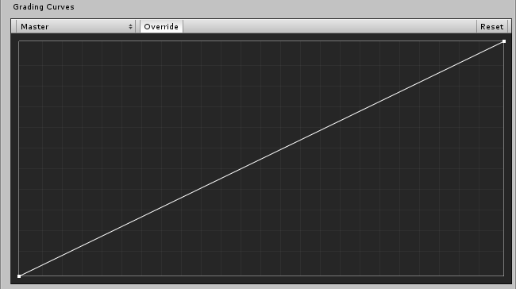

##### 2.Hue vs Hue

使用Hue vs Hue在特定范围内变换色调。此曲线根据输出色相(Y轴)移动输入色相(X轴)。使用此设置可微调特定范围的色调或执行颜色替换。

##### 3.Hue vs Sat

​	使用Hue vs . Sat调整色调在特定范围内的饱和度。此曲线根据输入色相(X轴)调整饱和度(Y轴)。使用这种设置来降低特别明亮的区域或创建艺术效果。

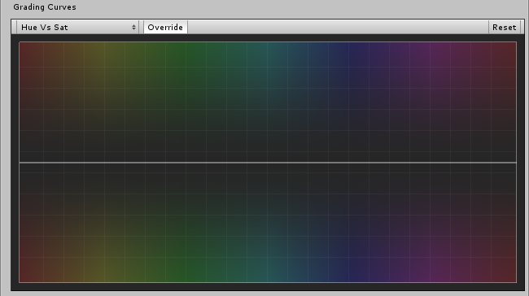

##### 4.Sat vs Sat

​	用Sat vs Sat来调整饱和度一定区域的饱和度。该曲线根据输入饱和度(X轴)调整饱和度(Y轴)。使用此设置从Tone部分的设置来微调饱和度调整。

##### 5.Lum vs Sat

​	使用Lum vs Sat调整特定亮度区域的饱和度。该曲线根据输入亮度(X轴)调整饱和度(Y轴)。使用这个设置来降低黑暗区域的饱和度，提供一个有趣的视觉对比。

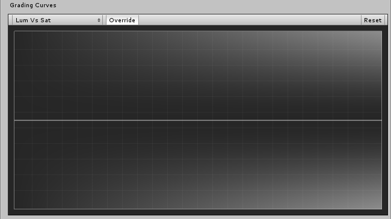

## Deferred Fog(雾气效果)

​	根据物体与相机的距离，雾气效果会在物体上叠加一种颜色。这模拟了户外环境中的雾或薄雾，通常也可以用来隐藏被裁切掉的对象，相机的远剪辑平面可以缩短距离，以提高性能。

​	雾效果根据相机的深度纹理创建屏幕空间的雾。雾的设置是在照明窗口的场景选项卡(Window>Rendering>Lighting Settings）

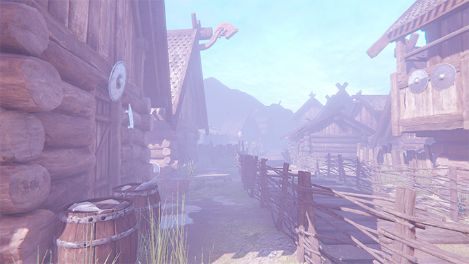

**Hint：只有当相机设置为使用Deferred rendering path(延迟渲染路径)时，这种效果才会出现在你的Post-process Layer(后处理效果层）中。默认情况下，它是启用的，并添加了来自光照面板的Fog支持(否则，它只会与前向渲染路径—— Forward rendering path 一起工作)。**

**需要Depth texture、Shader Model3的支持。**

- Enabled：启用此复选框以启用Deferred Fog
- Exclude Skybox：启用此复选框以排除Skybox中的雾

## Depth of Field（景深）

​	Depth of Field（景深）是一种后处理效果，它模拟了相机镜头的聚焦特性。真实世界的相机只能在特定的距离上对物体进行清晰的聚焦;离相机较近或较远的物体会出现轻微的失焦。模糊给了一个关于物体距离的视觉提示，并产生了令人愉悦的视觉效果，在摄影行业被称为Bokeh。

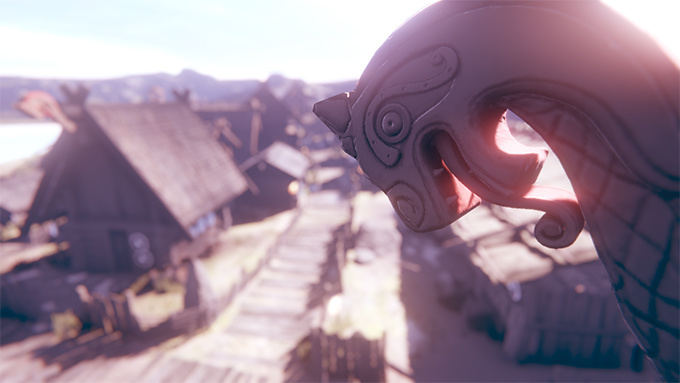

**Hint：景深的速度与Max Blur Size (最大模糊尺寸)有关。如果您正在为桌面计算机和主机(取决于游戏的后期处理预算)进行开发，则只使用高于Medium的值。在为移动平台开发时使用最低的价值。需要Depth texture、Shader Model3.5的支持。**

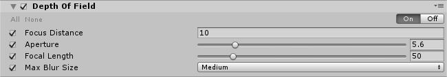

- Focus Distance：设置焦点的距离
- Aperture：设置光圈的比例(称为f-stop或f-number)。值越小，景深越浅。
- Focal Length：设置镜头和胶片之间的距离。值越大，景深越浅。
- Max Blur Size : 从下拉菜单中选择bokeh过滤器的卷积核大小。此设置确定bokeh的最大半径。它还会影响性能(内核越大，需要的GPU时间就越长)。即确定最大模糊尺寸的大小，越大，性能越差。

## Grain（颗粒效果）

​	颗粒效应模拟了真实相机在拍摄小颗粒时产生的效果，这种胶片给图像一种粗糙的、未经处理的效果。

​	在Unity中可用的颗粒效应是基于一个相干的梯度噪声。这种效果的常见用法用于模拟电影胶片薄膜的明显缺陷;在恐怖主题游戏中很常见。

​	**Hint：禁用颜色将使纹理效果运行得更快。需要Shader Model 3**

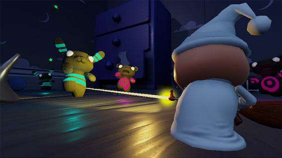

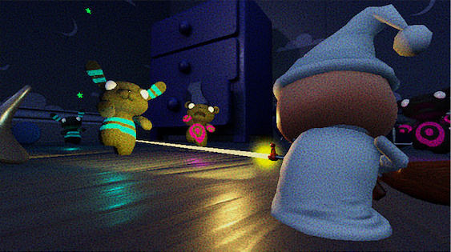

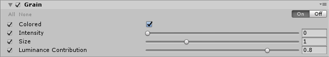

- Colored：勾选此复选框使用彩色纹理。
- Intensity：设置颗粒强度的值。数值越高，可见颗粒越多。
- Size：设置颗粒大小的值。
- Luminance Contribution：设置控制噪声响应曲线的数值。此值基于场景亮度。较低的数值意味着黑暗区域的噪音较小。

## Lens Distortion（镜头扭曲效果）

​	Lens Distortion通过扭曲或不扭曲最终渲染的图片来模拟真实世界中摄像机镜头的形状。

**Hint：不支持AR/VR，需要Shader Model 3**

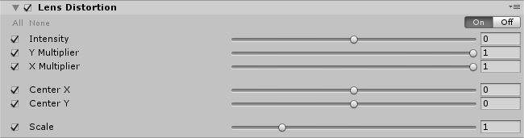

- Intensity：设置总扭曲的值。
- Y Multiplier：Y轴的强度放大器。0为关闭扭曲
- X Multiplier：X轴的强度放大器。0为关闭扭曲
- Center X：扭曲中心点(X轴)。
- Center Y：扭曲中心点(Y轴)。
- Scale：全局屏幕缩放

## Motion Blur（运动模糊）

​	当游戏物体的移动速度超过相机曝光时间时，运动模糊效果会使图像变得模糊。快速移动的游戏物体或长时间的曝光会产生这种效果。如赛车游戏使用**Motion Blur**来实现加速效果。

**Hint：使用较低的样本计数将提高性能，不支持AR/VR，需要支持Motion vectors、Depth texture、Shader Model 3才能使用**

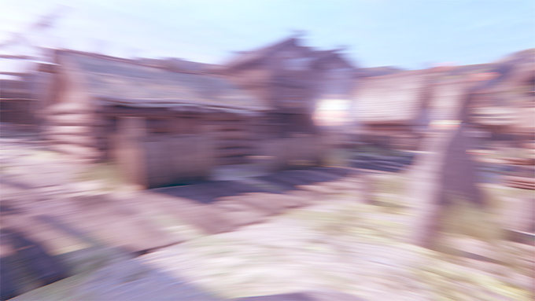

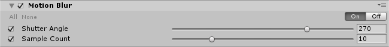

- Shutter Angle：设置旋转快门的角度。更大的值提供更长的曝光时间和更强的模糊效果。
- Sample Count：设置采样点数量的值。这会影响质量和性能。

## Screen Space Reflection（屏幕空间反射）

​	Screen Space Reflection效果创造了微妙的反射，模拟潮湿的地板表面或水坑。这种技术产生的反射质量比使用反射探头或平面反射低，而平面反射可以产生完美的平滑反射。屏幕空间反射是限制镜面光泄漏的理想效果。

​	Screen Space Reflection效果调整为性能高于质量，使其非常适合在当前版本的控制台和桌面计算机上运行的项目。它不适合移动开发。因为它依赖于Normals G-Buffer，所以只能在[deferred rendering path](https://docs.unity3d.com/Manual/RenderTech-DeferredShading.html)延迟呈现路径中使用。

​	屏幕空间反射比其他方法(如Cubemaps或Reflection Probes（反射探针）)创建更详细的反射，因为使用Cubemaps进行反射的游戏对象不能进行自我反射，Reflection Probes（反射探针）反射的精度受到限制。

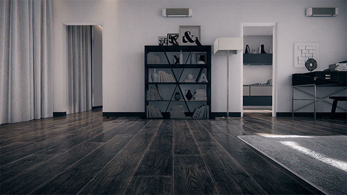

**Hint：只使用自定义的预设美容镜头。如果你是为主机开发，尽量使用Medium，除非你有足够的GPU时间。在较低的分辨率下，您可以提高质量预设和获得类似的时间与更高的视觉质量。不支持AR/VR，需要Compute shader、Motion vectors、Deferred rendering path、Shader Model 5.0的支持才能使用。**

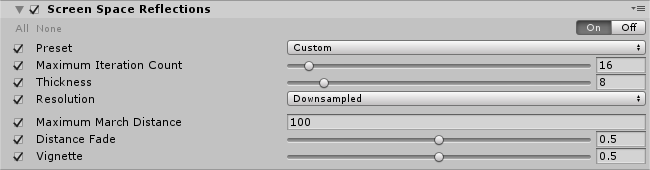

- Preset：从下拉菜单中选择质量预设。使用Custom微调质量。
- Maximum Iteration Count：在raymarching pass中设置最大步数。更高的数值意味着更多的反射。此属性只有在Preset为Custom模式的时候才可用。
- Thickness：设置射线厚度的值。值越低，资源越密集，但检测的细节越小。此属性只有在Preset为Custom模式的时候才可用。
- Resolution：选择内部缓冲区的大小。选择Downsample以最大化性能。Supersample速度较慢，但可以生成更高质量的结果。此属性只有在Preset为Custom模式的时候才可用。
- Maximum March Distance：设置穿越场景的最大距离，在此之后将停止绘制反射。
- Distance Fade：淡出近平面的反射。这对于隐藏公共组件的反射效果非常有用。
- Vignette：淡出靠近屏幕边缘的反射。

## Vignette（渐晕）

​	Vignett使图像的边缘变暗，使图像的中心变亮。在真实的摄影中，这种效果是由厚的或堆叠的滤光片、副镜头和不合适的镜头罩造成的。使用这种效果来产生艺术效果，例如将焦点吸引到图像的中心。

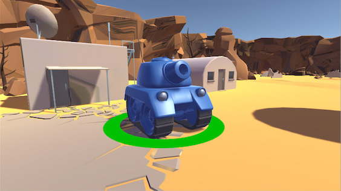

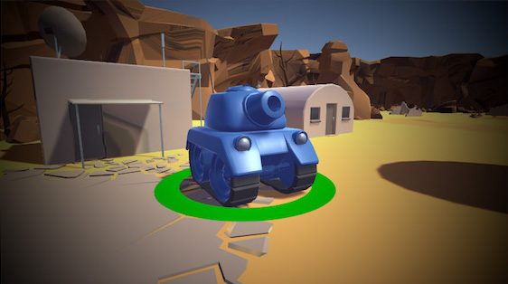

**Hint:需要支持Shader Model 3才能使用**

Vignette效果支持两种模式：

- Classic
- Masked

#### Classic 

经典模式提供渐晕参数控制：位置，形状和强度。这是最常用的使用效果的方法。

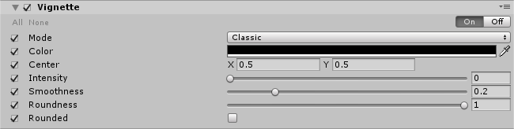

- Color：设置Vignette的颜色。
- Center：渐晕中心点的位置，默认为屏幕中心
- Intensity：渐晕的强度
- Smoothness：渐晕边框的平滑度。
- Roundness：较低的值将使渐晕的轮廓变得更加平方。
- Rounded：渐晕应该是完全圆形的还是依赖于当前的宽高比?，默认依赖宽高比

#### Masked

蒙版模式是在屏幕上覆盖(相乘)一个自定义纹理蒙版，以创建一个渐晕效果。此模式可用于实现不太常见或不规则的渐晕效果。

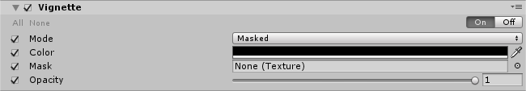

- Color：渐晕颜色。alpha通道代表透明度
- Mask：一种用作渐晕的黑白蒙版
- Opacity：蒙版的不透明程度

