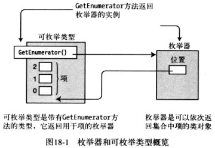
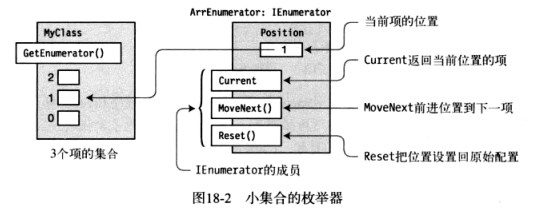
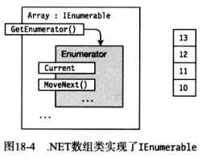
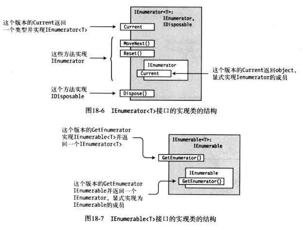
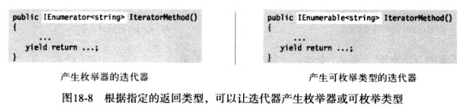
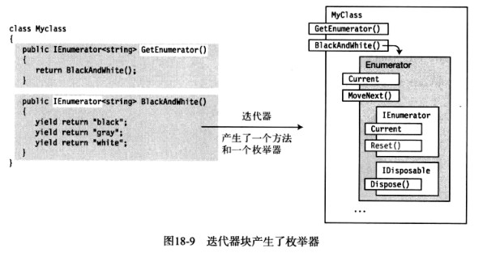
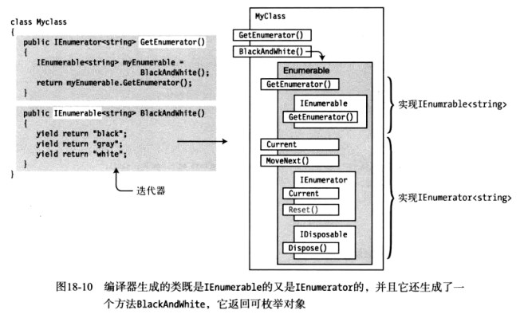
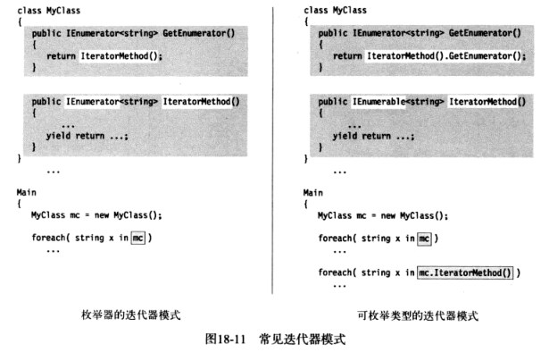
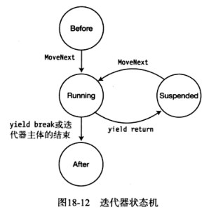

#### foreach
在数组中，foreach语句为我们依次取出数组中的每个元素。为什么数组可以这么做？因为数组可以按需提供一个叫做枚举器（enumerator）的对象。枚举器可以依次返回请求的数组中的元素。枚举器“知道”项的次序并且跟踪它在序列中的位置，然后返回请求的当前项。对于由枚举器的类型，必须有一个方法来获取它。获取对象枚举器的方法是调用对象的GetEnumerator方法。实现GetEnumerator（）方法的类型叫做*可枚举类型*（enumerable type或enumerable）。数组是可枚举类型。



foreach结构设计用来和可枚举类型一起使用。只要给它的遍历对象是可枚举类型，它就会执行如下行为：
- 调用GetEnumerator获取对象枚举器
- 从枚举器中请求每一项并且把它作为迭代变量（iteration variable），**代码可以读取该变量但不能改变**

#### IEnumerator接口

```c#
namespace
{
    //支持在非泛型集合上进行简单的迭代
	[ComVisible (true), Guid ("496B0ABF-CDEE-11D3-88E8-00902754C43A")]
	public interface IEnumerator
	{
		//
		// Properties
		//集合中的当前元素
		object Current
		{
			get;
		}
		//
		// Methods
		//移动到集合中的下一个元素
		bool MoveNext ();
		void Reset ();
	}
}

```

实现了IEnumerator接口的枚举器包含3个函数成员：Current、MoveNext、Reset。

- Current是返回序列中当前位置项的属性
  - 它是只读属性
  - 它返回object类型的引用，所以可以返回任何类型
- MoveNext是把枚举器为知前进到集合中下一项的方法。它返回布尔值，指示新的位置是有效位置还是已超过序列尾部
  - 如果新位置有效，返回true
  - 如果新位置无效，返回false
  - 枚举器的原始位置在序列第一项之前，依次MoveNext必须在第一次使用Current前调用
- Reset是把位置重置为原始状态的方法




​	枚举器与序列中的当前项保持联系的方式完全取决于实现。可以通过对象引用、索引值或其他方式来实现。对于内置的一维数组来说，就是用项的索引。


有了集合的枚举器，我们就可以使用MoveNext和Current成员来模仿foreach循环遍历集合中的项。

例如：

```c#
static void Main()
    {
        int[] MyArray={10,11,12,13};
        IEnumerator ie=MyArray.GetEnumerator();
        while(ie.MoveNext())
        {
            int i=(int)ie.Current;
            Console.WriteLine("{0}",i);
        }
    }
```





#### IEnumerable接口

可枚举类是指实现了IEnumerable接口的类。IEnumerable接口只有一个成员–GetEnumerator方法，它返回对象的枚举器（IEnumerator对象）。

```c#
namespace
{
	[ComVisible (true), Guid ("496B0ABE-CDEE-11d3-88E8-00902754C43A")]
	public interface IEnumerable
	{
		//
		// Methods
		//
		[DispId (-4)]
		IEnumerator GetEnumerator ();
	}
}
```


#### 使用IEnumerable和IEnumerator的示例

下面是个可枚举类的完整示例，类名Spectrum，枚举器类为ColorEnumerator。

```c#
using System;
using System.Collections;
class ColorEnumerator:IEnumerator
{
    string[] _colors;
    int _position=-1;
    public ColorEnumerator(string[] theColors)
    {
        _colors=new string[theColors.Length];
        for(int i=0;i<theColors.Length;i++)
        {
            _colors[i]=theColors[i];
        }
    }
    public object Current
    {
        get
        {
            if(_position==-1||_position>=_colors.Length)
            {
                throw new InvalidOperationException();
            }
            return _colors[_position];
        }
    }
    public bool MoveNext()
    {
        if(_position<_colors.Length-1)
        {
            _position++;
            return true;
        }
        else
        {
            return false;
        }
    }
    public void Reset()
    {
        _position=-1;
    }
}
class Spectrum:IEnumerable
{
    string[] Colors={"violet","blue","cyan","green","yellow","orange","red"};
    public IEnumerator GetEnumerator()
    {
        return new ColorEnumerator(Colors);
    }
}
class Program
{
    static void Main()
    {
        var spectrum=new Spectrum();
        foreach(string color in spectrum)
        {
            Console.WriteLine(color);
        }
    }
}
```


#### 泛型枚举接口

​		目前我们描述的枚举接口都是非泛型版本。实际上，在大多数情况下你应该使用泛型版本IEnumerable<T>和IEnumerator<T>。它们叫做泛型是因为使用了C#泛型（参见第17章），其使用方法和非泛型形式差不多。
两者间的本质差别如下：

- 对于非泛型接口形式：

  - IEnumerable接口的GetEnumerator方法返回实现IEnumerator枚举器类的实例
  - 实现IEnumerator的类实现了Current属性，它返回object的引用，然后我们必须把它转化为实际类型的对象

- 对于泛型接口形式：

  - IEnumerable<T>接口的GetEnumerator方法返回实现IEnumator<T>的枚举器类的实例

  - 实现IEnumerator<T>的类实现了Current属性，它返回实际类型的对象，而不是object基类的引用

    

    需要重点**注意**的是，我们目前所看到的非泛型接口的实现不是类型安全的。它们返回object类型的引用，然后必须转化为实际类型。

  ​		而*泛型接口*的枚举器是类型安全的，它返回实际类型的引用。如果要创建自己的可枚举类，应该实现这些泛型接口。非泛型版本可用于C#2.0以前没有泛型的遗留代码。
  尽管泛型版本和非泛型版本一样简单易用，但其结构略显复杂。




#### 迭代器

​	可枚举类和枚举器在.NET集合类中被广泛使用，所以熟悉它们如何工作很重要。不过，虽然我们已经知道如何创建自己的可枚举类和枚举器了，但我们还是很高兴听到，C#从2.0版本开始提供了更简单的创建枚举器和可枚举类型的方式。
​	实际上，编译器将为我们创建它们。这种结构叫做*迭代器*（iterator）。我们可以把手动编码的可枚举类型和枚举器替换为由迭代器生成的可枚举类型和枚举器。

在解释细节前，我们先看两个示例。下面的方法实现了一饿产生和返回枚举器的迭代器。

- 迭代器返回一个泛型枚举器，该枚举器返回3个string类型的项
- yield return语句声明这是枚举中的下一项

```c#
public IEnumerator<string> BlackAndWhite()
{
    yield return "black";
    yield return "gray";
    yield return "white";
}
```

下面的方法声明了另一个版本，并输出相同的值：

```c#
public IEnumerator<string> BlackAndWhite()
{
    string[] theColors={"black","gray","white"};
    for(int i=0;i<theColors.Length;i++)
    {
        yield return theColors[i];
    }
}
```


#### 迭代器块

​	迭代器块是有一个或多个yield语句的代码块。下面3种类型的代码块中的任意一种都可以是迭代器块：

- 方法主体
- 访问器主体
- 运算符主体

​     迭代器块与其他代码块不同。其他块包含的语句被当做命令式。即先执行代码块中的第一个语句，然后执行后面的语句，最后控制离开块。
另一方面，迭代器块不是需要在同一时间执行的一串命令式命令，而是描述了希望编译器为我们创建的枚举器类的行为。迭代器块中的代码描述了如何枚举元素。
迭代器块由两个特殊语句：

- yield return语句指定了序列中返回的下一项
- yield break语句指定在序列中没有的其他项

编译器得到有关枚举项的描述后，使用它来构建包含所有需要的方法和属性实现的枚举器类。结果类被嵌套包含在迭代器声明的类中。
如下图所示，根据迭代器块的返回类型，你可以让迭代器产生枚举器或可枚举类型。




#### 使用迭代器来创建枚举器

下面的是使用迭代器来创建枚举器的例子：

```c#
class MyClass
{
    public IEnumerator<string> GetEnumerator()
    {
        return BlackAndWhite();    //返回枚举器
    }
    
    //此迭代器方法会自动创建一个枚举器(IEnumerator)用于foreach进行枚举
    public IEnumerator<string> BlackAndWhite()//迭代器
    {
        yield return "black";
        yield return "gray";
        yield return "white";
    }
}
class Program
{
    static void Main()
    {
        var mc=new MyClass();
        foreach(string shade in mc)
        {
            Console.WriteLine(shade);
        }
    }
}
```


下图演示了MyClass的代码及产生的对象。注意编译器为我们自动做了多少工作。

- 图左的迭代器代码演示了它的返回类型是IEnumerator
- 图右演示了它有一个嵌套类实现了IEnumerator<T>




#### 使用迭代器来创建可枚举类型

之前示例创建的类包含两部分：产生返回枚举器方法的迭代器以及返回枚举器的GetEnumerator方法。
本节例子中，我们用迭代器来创建可枚举类型，而不是枚举器。与之前的示例相比，本例有以下不同：

- 本例中，BlackAndWhite迭代器方法返回`IEnumerable`而不是`IEnumerator`。因此MyClass首先调用BlackAndWhite方法获取它的可枚举类型对象，然后调用对象的GetEnumerator方法来获取结果，从而实现GetEnumerator方法
- 在Main的foreach语句中，我们可以使用类的实例，也可以调用BlackAndWhite方法，因为它返回的是可枚举类型

```c#
class MyClass
{
    public IEnumerator<string> GetEnumerator()
    {
        IEnumerable<string> myEnumerable=BlackAndWhite();
        return myEnumerable.GetEnumerator();
    }
    
    //这个迭代器方法会自动创建一个可枚举类（IEnumerable）和枚举器（IEnumerator）
    public IEnumerable<string> BlackAndWhite()//迭代器
    {
        yield return "black";
        yield return "gray";
        yield return "white";
    }
}
class Program
{
    static void Main()
    {
        var mc=new MyClass();
        foreach(string shade in mc)
        {
            Console.Write(shade);
        }
        foreach(string shade in mc.BlackAndWhite)
        {
            Console.Write(shade);
        }
    }
}

```

下图演示了在代码的可枚举迭代器产生泛型可枚举类型。



### 常见迭代器模式

------

前面两节展示了，我们可以创建迭代器来返回可枚举类型或枚举器。下图总结了如何使用普通迭代器模式。

- 当我们实现返回枚举器的迭代器时，必须通过实现GetEnumerator来让类可枚举，如图左
- 如果我们在类中实现迭代器返回可枚举类型，我们可以让类实现GetEnumerator来让类本身可被枚举，或不实现GetEnumerator，让类不可枚举
  - 若实现GetEnumerator，让它调用迭代器方法以获取自动生成的实现IEnumerable的类实例。然后从IEnumerable对象返回由GetEnumerator创建的枚举器，如图右
  - 若通过不实现GetEnumerator使类本身不可枚举，仍然可以使用由迭代器返回的可枚举类，只需要直接调用迭代器方法，如果右第二个foreach语句




### 产生多个可枚举类型

------

下例中，Spectrum类有两个可枚举类型的迭代器。注意尽管它有两个方法返回可枚举类型，但类本身不是可枚举类型，因为它没有实现GetEnumerator

```c#
using System;
using System.Collections.Generic;
class Spectrum
{
    string[] colors={"violet","blue","cyan","green","yellow","orange","red"};
    public IEnumerable<string> UVtoIR()
    {
        for(int i=0;i<colors.Length;i++)
        {
            yield return colors[i];
        }
    }
    public IEnumerable<string> IRtoUV()
    {
        for(int i=colors.Length-1;i>=0;i--)
        {
            yield return colors[i];
        }
    }
}
class Program
{
    static void Main()
    {
        var spectrum=new Spectrum();
        foreach(string color in spectrum.UVtoIR())
        {
            Console.Write(color);
        }
        Console.WriteLine();
        foreach(string color in spectrum.IRtoUV())
        {
            Console.Write(color);
        }
        Console.WriteLine();
    }
}
```


### 将迭代器作为属性

------

本例演示两个内容：第一，使用迭代器来产生具有两个枚举器的类；第二，演示迭代器如何实现属性

```c#
using System;
using System.Collections.Generic;
class Spectrum
{
    bool _listFromUVtoIR;
    string[] colors={"violet","blue","cyan","green","yellow","orange","red"};
    public Spectrum(bool listFromUVtoIR)
    {
        _listFromUVtoIR=listFromUVtoIR;
    }
    public IEnumerator<string> GetEnumerator()
    {
        return _listFromUVtoIR?UVtoIR:IRtoUV;
    }
    public IEnumera<string> UVtoIR
    {
        get
        {
            for(int i=0;i<colors.Length;i++)
            {
                yield return colors[i];
            }
        }
    }
    public IEnumerable<string> IRtoUV
    {
        get
        {
            for(int i=colors.Length-1;i>=0;i--)
            {
                yield return colors[i];
            }
        }
    }
}
class Program
{
    static void Main()
    {
        var startUV=new Spectrum(true);
        var startIR=new Spectrum(false);
        foreach(string color in startUV)
        {
            Console.Write(color);
        }
        Console.WriteLine();
        foreach(string color in startIR)
        {
            Console.Write(color);
        }
        Console.WriteLine();
    }
}
```


### 迭代器实质

------

如下是需要了解的有关迭代器的其他重要事项。

- 迭代器需要System.Collections.Generic命名空间
- 在编译器生成的枚举器中，Reset方法没有实现。而它是接口需要的方法，因此调用时总是抛出System.NetSupportedException异常。

在后台，由编译器生成的枚举器类是包含4个状态的状态机。

- Before 首次调用MoveNext的初始状态
- Running 调用MoveNext后进入这个状态。在这个状态中，枚举器检测并设置下一项的位置。在遇到yield return、yield break或在迭代器体结束时，退出状态
- Suspended 状态机等待下次调用MoveNext的状态
- After 没有更多项可以枚举

如果状态机在Before或Suspended状态时调用MoveNext方法，就转到了Running状态。在Running状态中，它检测集合的下一项并设置位置。
如果有更多项，状态机会转入Suspended状态，如果没有更多项，它转入并保持在After状态。


#参考文献：
[C#图解教程](https://www.cnblogs.com/moonache/p/7687551.html )

[C#图解教程：枚举器和迭代器](https://www.cnblogs.com/moonache/p/6548043.html)

[参考网址](https://blog.csdn.net/byondocean/article/details/6871881 )
