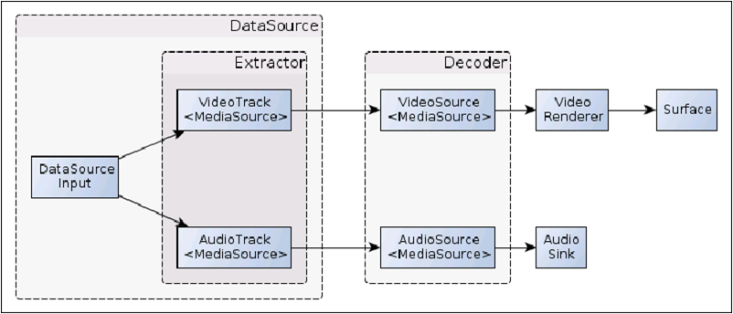

### Nuplayer简介

​	android2.3的时候引入流媒体框架，而流媒体框架的核心是Nuplayer。在之前的版本中一般认为Local Playback就用Stagefrightplayer+Awesomeplayer，流媒体用Nuplayer。android 4.0之后HttpLive和RTSP协议开始使用Nuplayer播放器。android 5.0（L版本）之后本地播放也开始使用Nuplayer播放器。android 7.0（N版本）则完全去掉了Awesomeplayer。

​	通俗点说，Nuplayer是AOSP中提供的多媒体播放框架，能够支持本地文件、HTTP（HLS）、和RTSP等协议的播放，通常支持H.264、H.265/HEVC、AAC编码格式、支持MP4、MPEG-TS封装。

​	在实现上NuPlayer和Awesomeplayer不同，NuPlayer基于StagefrightPlayer的基础类构建，利用了更底层的ALooper/AHandler机制来异步地处理请求，ALooper列队消息请求，AHandler中去处理，所以有更少的Mutex/Lock在NuPlayer中。Awesomeplayer中利用了omxcodec而NuPlayer中利用了Acodec。

### Nuplayer框架

下图是Nuplayer的整体框架图：

Nuplayer框架各部分功能如下：

​	1、Nuplayer::Source  ：解析模块（parser，功能类似于FFmpeg的avformat）。其接口与MediaExtractor和MediaSource组合的接口差不多，同时提供了用于快速定位的SeekTo接口。

​	2、NuPlayer::Decoder：解码模块（decoder，功能类似FFmpeg的avcodec），封装了用于AVC、AAC解码的接口，通过ACodec实现解码（包含OMX硬解码和软解码）。

​	3、NuPlayer::Render：渲染模块（render，功能类似声卡驱动和显卡驱动），主要用于音视频渲染和同步，与NativeWindow有关。

### 多媒体文件是如何通过Nuplayer播放

​	在AOSP中，通常将一个多媒体文件或者URL称为DataSource。通常多媒体文件中包含至少一个音频流、视频流或者字幕流，NuPlayer将这三种统称为Track，细分下也有AudioTrack、VideoTrack、SubtitleTrack。将一个多媒体文件解析之后就可以通过解码器还原为原始数据，然后渲染了。具体流程参考下图：

DataSource有两个概念：

- 上图中的DataSourceInput（DataSource）指的是单纯的原始数据（容器格式，没有经过demuxer—解析器 处理）。
- 在后文中setDataSource中DataSource指的是从数据输入到demux输出的一个过程（即图中最外层的DataSource）。

VideoTrack与AudioTrack指的是Extractor（即demux）的两个通道，从这里输出的分别就是单纯的解复用后的Video和Audio流。再经过Decoder后输出的就是音、视频的输出了：

- VideoRenderer + Surface即视频的输出；	
- AudioSink即音频的输出；

## 源码分析

[Nuplayer类源码分析](/android-Nuplayer-code)

[NuplayerDriver类源码分析](/android-NuplayerDriver-code)

